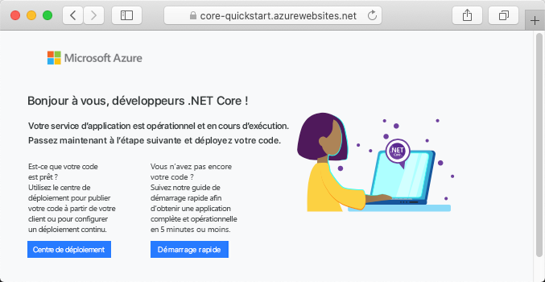

# <a name="create-an-aspnet-core-app-in-app-service-on-linux"></a>Créer une application ASP.NET Core dans App Service sur Linux

> [!NOTE]
> Cet article explique comment déployer une application sur App Service sous Linux. Pour déployer sur App Service sur _Windows_, consultez [Créer une application ASP.NET Core dans Azure](../app-service-web-get-started-dotnet.md).
>

[App Service sur Linux](app-service-linux-intro.md) fournit un service d’hébergement web hautement scalable appliquant des mises à jour correctives automatiques à l’aide du système d’exploitation Linux. Ce guide de démarrage rapide vous montre comment créer une application [.NET Core](https://docs.microsoft.com/aspnet/core/) sur App Service sur Linux. Vous créez l’application à l’aide d’[Azure CLI](https://docs.microsoft.com/cli/azure/get-started-with-azure-cli), puis vous utilisez Git pour déployer le code .NET Core sur l’application.


Vous pouvez suivre les étapes de ce article en utilisant un ordinateur Mac, Windows ou Linux.

[!INCLUDE [quickstarts-free-trial-note](../../../includes/quickstarts-free-trial-note.md)]

## <a name="prerequisites"></a>Prérequis

Pour suivre ce guide de démarrage rapide :

* <a href="https://git-scm.com/" target="_blank">Installez Git</a>
* <a href="https://dotnet.microsoft.com/download/dotnet-core/3.1" target="_blank">Installer la dernière version du SDK .NET Core 3.1</a>

## <a name="create-the-app-locally"></a>Créer l’application en local

Dans une fenêtre de terminal sur votre machine, créez un répertoire nommé `hellodotnetcore` et remplacez le répertoire actuel par ce dernier.

```bash
mkdir hellodotnetcore
cd hellodotnetcore
```

Créez une application .NET Core.

```bash
dotnet new web
```

## <a name="run-the-app-locally"></a>Exécutez l’application localement.

Exécutez l’application localement pour voir à quoi elle devrait ressembler lorsque vous la déploierez sur Azure. 

Restaurez les packages NuGet et exécutez l’application.

```bash
dotnet run
```

Ouvrez un navigateur web et accédez à l’application à l’adresse `http://localhost:5000`.

Vous voyez apparaître sur la page le message **Hello World** de l’exemple d’application.


Dans la fenêtre de terminal, appuyez sur **Ctrl + C** pour quitter le serveur web. Initialisez un dépôt Git pour le projet .NET Core.

```bash
git init
git add .
git commit -m "first commit"
```

[!INCLUDE [cloud-shell-try-it.md](../../../includes/cloud-shell-try-it.md)]

[!INCLUDE [Configure deployment user](../../../includes/configure-deployment-user.md)]

[!INCLUDE [Create resource group](../../../includes/app-service-web-create-resource-group-linux.md)]

[!INCLUDE [Create app service plan](../../../includes/app-service-web-create-app-service-plan-linux.md)]

## <a name="create-a-web-app"></a>Créer une application web

[!INCLUDE [Create web app](../../../includes/app-service-web-create-web-app-dotnetcore-linux-no-h.md)]

Accédez à l’application que vous venez de créer. Remplacez _&lt;app-name>_ par le nom de votre application.

```bash
https://<app-name>.azurewebsites.net
```

Voici à quoi doit ressembler votre nouvelle application :



[!INCLUDE [Push to Azure](../../../includes/app-service-web-git-push-to-azure.md)] 

<pre>
Enumerating objects: 5, done.
Counting objects: 100% (5/5), done.
Compressing objects: 100% (3/3), done.
Writing objects: 100% (3/3), 285 bytes | 95.00 KiB/s, done.
Total 3 (delta 2), reused 0 (delta 0), pack-reused 0
remote: Deploy Async
remote: Updating branch 'master'.
remote: Updating submodules.
remote: Preparing deployment for commit id 'd6b54472f7'.
remote: Repository path is /home/site/repository
remote: Running oryx build...
remote: Build orchestrated by Microsoft Oryx, https://github.com/Microsoft/Oryx
remote: You can report issues at https://github.com/Microsoft/Oryx/issues
remote:
remote: Oryx Version      : 0.2.20200114.13, Commit: 204922f30f8e8d41f5241b8c218425ef89106d1d, ReleaseTagName: 20200114.13
remote: Build Operation ID: |imoMY2y77/s=.40ca2a87_
remote: Repository Commit : d6b54472f7e8e9fd885ffafaa64522e74cf370e1
.
.
.
remote: Deployment successful.
remote: Deployment Logs : 'https://&lt;app-name&gt;.scm.azurewebsites.net/newui/jsonviewer?view_url=/api/deployments/d6b54472f7e8e9fd885ffafaa64522e74cf370e1/log'
To https://&lt;app-name&gt;.scm.azurewebsites.net:443/&lt;app-name&gt;.git
   d87e6ca..d6b5447  master -> master
</pre>

## <a name="browse-to-the-app"></a>Accéder à l’application

Accédez à l’application déployée à l’aide de votre navigateur web.

```bash
http://<app_name>.azurewebsites.net
```

L’exemple de code .NET Core s’exécute dans App Service sur Linux avec une image intégrée.


**Félicitations !** Vous avez déployé votre première application .NET Core sur App Service sur Linux.

## <a name="update-and-redeploy-the-code"></a>Mettre à jour et redéployer le code

Dans le répertoire local, ouvrez le fichier _Startup.cs_. Apportez une petite modification au texte de l’appel de méthode `context.Response.WriteAsync` :

```csharp
await context.Response.WriteAsync("Hello Azure!");
```

Validez vos modifications dans Git, puis envoyez les modifications de code à Azure.

```bash
git commit -am "updated output"
git push azure master
```

Une fois le déploiement terminé, revenez à la fenêtre du navigateur ouverte à l’étape **Accéder à l’application**, puis cliquez sur Actualiser.


## <a name="manage-your-new-azure-app"></a>Gérer votre nouvelle application Azure

Accédez au <a href="https://portal.azure.com" target="_blank">portail Azure</a> pour gérer l’application que vous avez créée.

Dans le menu de gauche, cliquez sur **App Services**, puis sur le nom de votre application Azure.


La page Vue d’ensemble de votre application s’affiche. Ici, vous pouvez également des tâches de gestion de base (parcourir, arrêter, démarrer, redémarrer et supprimer des éléments, par exemple). 


Le menu de gauche fournit différentes pages vous permettant de configurer votre application. 

[!INCLUDE [cli-samples-clean-up](../../../includes/cli-samples-clean-up.md)]

## <a name="next-steps"></a>Étapes suivantes

> [!div class="nextstepaction"]
> [Tutoriel : application ASP.NET Core avec SQL Database](tutorial-dotnetcore-sqldb-app.md)

> [!div class="nextstepaction"]
> [Configurer une application ASP.NET Core](configure-language-dotnetcore.md)
