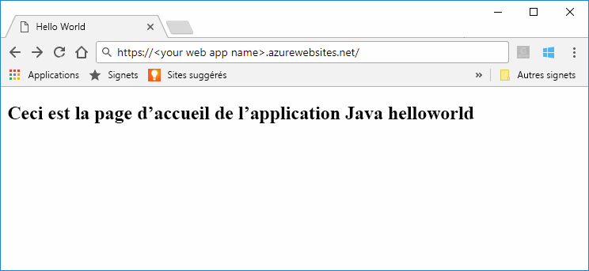
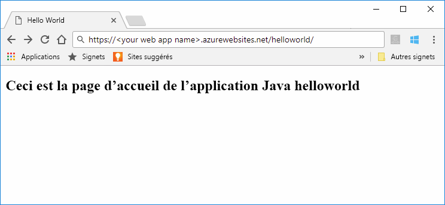

# <a name="quickstart-create-a-java-web-app-in-app-service-on-linux"></a>Démarrage rapide : créer une application web Java dans App Service sur Linux

[App Service sur Linux](app-service-linux-intro.md) fournit un service d’hébergement web hautement scalable appliquant des mises à jour correctives automatiques à l’aide du système d’exploitation Linux. Ce guide de démarrage rapide montre comment utiliser l’interface [Azure CLI](https://docs.microsoft.com/cli/azure/get-started-with-azure-cli) avec le [plug-in Maven pour les applications web Azure (préversion)](https://github.com/Microsoft/azure-maven-plugins/tree/develop/azure-webapp-maven-plugin) afin de déployer le fichier WAR (archive web) d’une application web Java.



[!INCLUDE [quickstarts-free-trial-note](../../../includes/quickstarts-free-trial-note.md)]

[!INCLUDE [cloud-shell-try-it.md](../../../includes/cloud-shell-try-it.md)]

## <a name="create-a-java-app"></a>Créer une application Java

Exécutez la commande Maven suivante dans l’invite Cloud Shell pour créer une application web nommée `helloworld` :

```bash
mvn archetype:generate -DgroupId=example.demo -DartifactId=helloworld -DarchetypeArtifactId=maven-archetype-webapp
```

## <a name="configure-the-maven-plugin"></a>Configurer le plug-in Maven

Pour un déploiement à partir de Maven, utilisez l’éditeur de code dans Cloud Shell pour ouvrir le fichier de projet `pom.xml` dans le répertoire `helloworld`. 

```bash
code pom.xml
```

Ajoutez ensuite la définition de plug-in suivante dans l’élément `<build>` du fichier `pom.xml`.

```xml
<plugins>
    <!--*************************************************-->
    <!-- Deploy to Tomcat in App Service Linux           -->
    <!--*************************************************-->
      
    <plugin>
        <groupId>com.microsoft.azure</groupId>
        <artifactId>azure-webapp-maven-plugin</artifactId>
        <version>1.4.0</version>
        <configuration>
   
            <!-- Web App information -->
            <resourceGroup>${RESOURCEGROUP_NAME}</resourceGroup>
            <appName>${WEBAPP_NAME}</appName>
            <region>${REGION}</region>
   
            <!-- Java Runtime Stack for Web App on Linux-->
            <linuxRuntime>tomcat 8.5-jre8</linuxRuntime>
   
        </configuration>
    </plugin>
</plugins>
```    


> [!NOTE] 
> Dans cet article, nous travaillons uniquement avec des applications Java empaquetées dans des fichiers WAR. Le plug-in prend également en charge les applications web JAR. Utilisez l’autre définition de plug-in suivante pour ces applications. Cette configuration déploie un fichier JAR généré par Maven à l’emplacement `${project.build.directory}/${project.build.finalName}.jar` sur votre système de fichiers local.
>
>```xml
><plugin>
>            <groupId>com.microsoft.azure</groupId>
>            <artifactId>azure-webapp-maven-plugin</artifactId>
>            <version>1.4.0</version>
>            <configuration>
>                <deploymentType>jar</deploymentType>
>
>           <!-- Web App information -->
>            <resourceGroup>${RESOURCEGROUP_NAME}</resourceGroup>
>            <appName>${WEBAPP_NAME}</appName>
>            <region>${REGION}</region>  
>
>                <!-- Java Runtime Stack for Web App on Linux-->
>                <linuxRuntime>jre8</linuxRuntime>
>            </configuration>
>         </plugin>
>```    


Mettez à jour les espaces réservés suivants dans la configuration du plug-in :

| Placeholder | Description |
| ----------- | ----------- |
| `RESOURCEGROUP_NAME` | Nom du nouveau groupe de ressources dans lequel créer votre application web. En plaçant toutes les ressources d’une application dans un groupe, vous pouvez les gérer ensemble. Par exemple, si vous supprimez le groupe de ressources, vous supprimez également toutes les ressources associées à l’application. Mettez à jour cette valeur avec un nouveau nom de groupe de ressources unique, par exemple, *TestResources*. Vous utiliserez ce nom de groupe de ressources pour nettoyer toutes les ressources Azure dans une section ultérieure. |
| `WEBAPP_NAME` | Le nom d’application fera partie du nom d’hôte pour l’application web lors du déploiement vers Azure (WEBAPP_NAME.azurewebsites.net). Mettez à jour cette valeur avec un nom unique pour la nouvelle application web Azure, qui va héberger votre application Java, par exemple *contoso*. |
| `REGION` | Une région Azure où l’application web est hébergée, par exemple `westus2`. Vous pouvez obtenir une liste de régions à partir du Cloud Shell ou de l’interface CLI à l’aide de la commande `az account list-locations`. |

## <a name="deploy-the-app"></a>Déployer l’application

Déployez votre application Java sur Azure à l’aide de la commande suivante :

```bash
mvn package azure-webapp:deploy
```

Une fois le déploiement terminé, accédez à l’application déployée à l’aide de l’URL suivante dans votre navigateur web. Par exemple : `http://<webapp>.azurewebsites.net/helloworld`. 



**Félicitations !** Vous avez déployé votre première application Java sur App Service sur Linux.


[!INCLUDE [cli-samples-clean-up](../../../includes/cli-samples-clean-up.md)]


## <a name="next-steps"></a>Étapes suivantes

Dans ce guide de démarrage rapide, vous avez utilisé Maven pour créer une application web Java, configuré le [plug-in Maven pour Azure Web Apps (préversion)](https://github.com/Microsoft/azure-maven-plugins/tree/develop/azure-webapp-maven-plugin), puis déployé une application web Java empaquetée dans une archive web sur App Service sur Linux. Pour en savoir plus sur l’utilisation de Java avec Azure, suivez le lien ci-dessous.

> [!div class="nextstepaction"]
> [Azure pour les développeurs Java](https://docs.microsoft.com/java/azure/)

