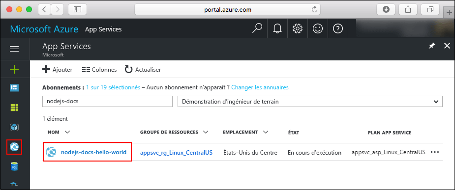
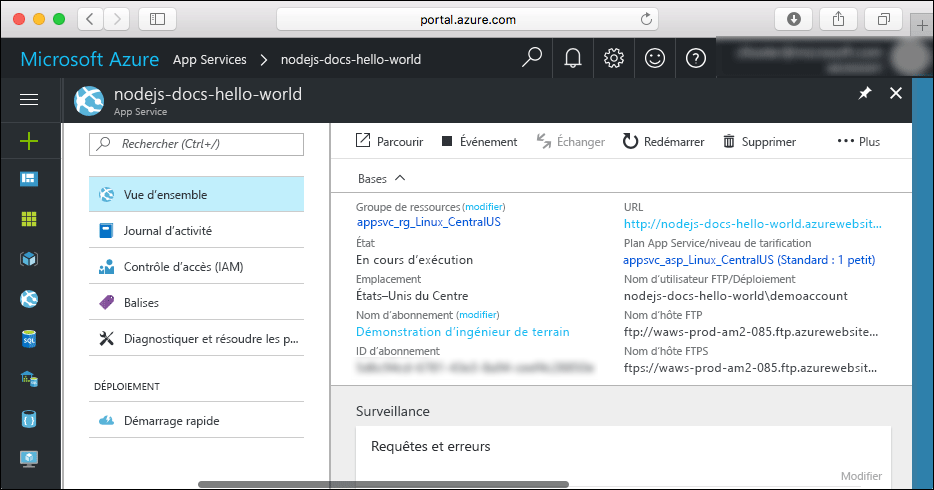

# <a name="create-a-nodejs-app-in-azure-app-service-on-linux"></a>Créer une application Node.js dans Azure App Service sur Linux

> [!NOTE]
> Cet article explique comment déployer une application sur App Service sous Linux. Pour déployer sur App Service sur _Windows_, consultez [Créer une application Node.js dans Azure](../app-service-web-get-started-nodejs.md).
>

[App Service sur Linux](app-service-linux-intro.md) fournit un service d’hébergement web hautement scalable appliquant des mises à jour correctives automatiques à l’aide du système d’exploitation Linux. Ce démarrage rapide montre comment déployer une application Node.js sur App Service sur Linux à l’aide de [Cloud Shell](https://docs.microsoft.com/azure/cloud-shell/overview).

Vous allez effectuer ce démarrage rapide dans Cloud Shell, mais vous pouvez également exécuter ces commandes localement avec [Azure CLI](/cli/azure/install-azure-cli).


[!INCLUDE [quickstarts-free-trial-note](../../../includes/quickstarts-free-trial-note.md)]

[!INCLUDE [cloud-shell-try-it.md](../../../includes/cloud-shell-try-it.md)]

## <a name="download-the-sample"></a>Télécharger l’exemple

Dans Cloud Shell, créez un répertoire de démarrage rapide, puis utilisez-le.

```bash
mkdir quickstart

cd quickstart
```

Exécutez ensuite la commande suivante pour cloner le référentiel de l’exemple d’application sur votre répertoire de démarrage rapide.

```bash
git clone https://github.com/Azure-Samples/nodejs-docs-hello-world
```

Pendant son exécution, des informations semblables à ce qui suit s’affichent :

```bash
Cloning into 'nodejs-docs-hello-world'...
remote: Counting objects: 40, done.
remote: Total 40 (delta 0), reused 0 (delta 0), pack-reused 40
Unpacking objects: 100% (40/40), done.
Checking connectivity... done.
```

> [!NOTE]
> L’exemple de fichier index.js définit le port d’écoute sur process.env.PORT. Cette variable d’environnement est affectée par App Service.
>

## <a name="create-a-web-app"></a>Créer une application web

Passez au répertoire qui contient l’exemple de code et exécutez la commande `az webapp up`.

Dans l’exemple suivant, remplacez <nom de l’application> par un nom d’application unique.

```bash
cd nodejs-docs-hello-world

az webapp up -n <app_name>
```

L’exécution de cette commande peut prendre quelques minutes. Pendant son exécution, des informations semblables à ce qui suit s’affichent :

```json
Creating Resource group 'appsvc_rg_Linux_CentralUS' ...
Resource group creation complete
Creating App service plan 'appsvc_asp_Linux_CentralUS' ...
App service plan creation complete
Creating app '<app_name>' ....
Webapp creation complete
Updating app settings to enable build after deployment
Creating zip with contents of dir /home/username/quickstart/nodejs-docs-hello-world ...
Preparing to deploy and build contents to app.
Fetching changes.

Generating deployment script.
Generating deployment script.
Generating deployment script.
Running deployment command...
Running deployment command...
Running deployment command...
Deployment successful.
All done.
{
  "app_url": "https://<app_name>.azurewebsites.net",
  "location": "Central US",
  "name": "<app_name>",
  "os": "Linux",
  "resourcegroup": "appsvc_rg_Linux_CentralUS ",
  "serverfarm": "appsvc_asp_Linux_CentralUS",
  "sku": "STANDARD",
  "src_path": "/home/username/quickstart/nodejs-docs-hello-world ",
  "version_detected": "6.9",
  "version_to_create": "node|6.9"
}
```

La commande `az webapp up` exécute les actions suivantes :

- Créer un groupe de ressources par défaut

- Créer un plan App Service par défaut

- Créer une application avec le nom spécifié

- [Déployez les fichiers zip](https://docs.microsoft.com/azure/app-service/deploy-zip) à partir du répertoire de travail actif sur l’application web.

## <a name="browse-to-the-app"></a>Accéder à l’application

Accédez à l’application déployée à l’aide de votre navigateur web. Remplacez <app_name> par le nom de votre application.

```bash
http://<app_name>.azurewebsites.net
```

L’exemple de code Node.js s’exécute dans App Service sur Linux avec une image intégrée.


**Félicitations !** Vous avez déployé votre première application Node.js sur App Service sur Linux.

## <a name="update-and-redeploy-the-code"></a>Mettre à jour et redéployer le code

Dans Cloud Shell, tapez `nano index.js` pour ouvrir l’éditeur de texte nano.


 Apportez une petite modification au texte de l’appel pour `response.end` :

```nodejs
response.end("Hello Azure!");
```

Enregistrez vos modifications et quittez nano. Utilisez la commande `^O` pour enregistrer et `^X` pour quitter.

Vous allez maintenant redéployer l’application. Remplacez `<app_name>` par votre application.

```bash
az webapp up -n <app_name>
```

Une fois le déploiement terminé, revenez à la fenêtre du navigateur que vous avez ouverte à l’étape **Accéder à l’application**, puis actualisez la page.


## <a name="manage-your-new-azure-app"></a>Gérer votre nouvelle application Azure

Accédez au <a href="https://portal.azure.com" target="_blank">portail Azure</a> pour gérer l’application que vous avez créée.

Dans le menu de gauche, cliquez sur **App Services**, puis sur le nom de votre application Azure.



La page Vue d’ensemble de votre application s’affiche. Elle vous permet d’exécuter des tâches de gestion de base, telles que parcourir, arrêter, démarrer, redémarrer et supprimer.



Le menu de gauche fournit différentes pages vous permettant de configurer votre application.

## <a name="clean-up-resources"></a>Supprimer des ressources

Au cours des étapes précédentes, vous avez créé des ressources Azure au sein d’un groupe de ressources. Si vous ne pensez pas avoir besoin de ces ressources à l’avenir, supprimez le groupe de ressources dans Cloud Shell. Si vous avez modifié la région, mettez à jour le nom du groupe de ressources `appsvc_rg_Linux_CentralUS` pour utiliser le groupe de ressources spécifique à votre application.

```azurecli-interactive
az group delete --name appsvc_rg_Linux_CentralUS
```

L’exécution de cette commande peut prendre une minute.

## <a name="next-steps"></a>Étapes suivantes

> [!div class="nextstepaction"]
> [Node.js avec MongoDB](tutorial-nodejs-mongodb-app.md)
