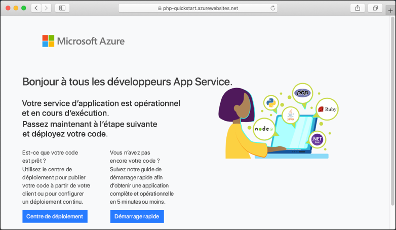

# <a name="create-a-php-app-in-app-service-on-linux"></a>Créer une application PHP dans App Service sur Linux

> [!NOTE]
> Cet article explique comment déployer une application sur App Service sous Linux. Pour déployer sur App Service sur _Windows_, consultez [Créer une application PHP dans Azure](../app-service-web-get-started-php.md).
>

[App Service sur Linux](app-service-linux-intro.md) fournit un service d’hébergement web hautement scalable appliquant des mises à jour correctives automatiques à l’aide du système d’exploitation Linux. Ce didacticiel de démarrage rapide montre comment déployer une application PHP sur Azure App Service sur Linux à l’aide de [Cloud Shell](https://docs.microsoft.com/azure/cloud-shell/overview).


Vous pouvez suivre les étapes de ce article en utilisant un ordinateur Mac, Windows ou Linux.

[!INCLUDE [quickstarts-free-trial-note](../../../includes/quickstarts-free-trial-note.md)]

## <a name="prerequisites"></a>Prérequis

Pour suivre ce guide de démarrage rapide :

* <a href="https://git-scm.com/" target="_blank">Installez Git</a>
* <a href="https://php.net" target="_blank">Installez PHP</a>

## <a name="download-the-sample"></a>Télécharger l’exemple

Dans une fenêtre de terminal, exécutez les commandes suivantes pour cloner l’exemple d’application sur votre machine locale, puis accédez au répertoire contenant l’exemple de code.

```bash
git clone https://github.com/Azure-Samples/php-docs-hello-world
cd php-docs-hello-world
```

## <a name="run-the-app-locally"></a>Exécutez l’application localement.

Exécutez l’application localement pour voir à quoi elle devrait ressembler lorsque vous la déploierez sur Azure. Ouvrez une fenêtre de terminal et utilisez la commande `php` pour lancer le serveur web PHP intégré.

```bash
php -S localhost:8080
```

Ouvrez un navigateur web et accédez à l’application exemple à l’adresse `http://localhost:8080`.

Vous voyez apparaître sur la page le message **Hello World !** de l’exemple d’application.


Dans la fenêtre de terminal, appuyez sur **Ctrl + C** pour quitter le serveur web.

[!INCLUDE [cloud-shell-try-it.md](../../../includes/cloud-shell-try-it.md)]

[!INCLUDE [Configure deployment user](../../../includes/configure-deployment-user.md)]

[!INCLUDE [Create resource group](../../../includes/app-service-web-create-resource-group-linux.md)]

[!INCLUDE [Create app service plan](../../../includes/app-service-web-create-app-service-plan-linux.md)]

## <a name="create-a-web-app"></a>Créer une application web

[!INCLUDE [Create web app](../../../includes/app-service-web-create-web-app-php-linux-no-h.md)] 

Accédez au site pour voir votre nouvelle application avec une image intégrée. Remplacez _&lt;app name>_ par le nom de votre application.

```bash
http://<app_name>.azurewebsites.net
```

Voici à quoi doit ressembler votre nouvelle application :



[!INCLUDE [Push to Azure](../../../includes/app-service-web-git-push-to-azure.md)] 

```bash
Counting objects: 2, done.
Delta compression using up to 4 threads.
Compressing objects: 100% (2/2), done.
Writing objects: 100% (2/2), 352 bytes | 0 bytes/s, done.
Total 2 (delta 1), reused 0 (delta 0)
remote: Updating branch 'master'.
remote: Updating submodules.
remote: Preparing deployment for commit id '25f18051e9'.
remote: Generating deployment script.
remote: Running deployment command...
remote: Handling Basic Web Site deployment.
remote: Kudu sync from: '/home/site/repository' to: '/home/site/wwwroot'
remote: Copying file: '.gitignore'
remote: Copying file: 'LICENSE'
remote: Copying file: 'README.md'
remote: Copying file: 'index.php'
remote: Ignoring: .git
remote: Finished successfully.
remote: Running post deployment command(s)...
remote: Deployment successful.
To https://<app_name>.scm.azurewebsites.net/<app_name>.git
   cc39b1e..25f1805  master -> master
```

## <a name="browse-to-the-app"></a>Accéder à l’application

Accédez à l’application déployée à l’aide de votre navigateur web.

```bash
http://<app_name>.azurewebsites.net
```

L’exemple de code PHP s’exécute dans App Service sur Linux avec une image intégrée.


**Félicitations !** Vous avez déployé votre première application en PHP sur App Service sur Linux.

## <a name="update-locally-and-redeploy-the-code"></a>Mettre à jour localement et redéployer le code

Dans le répertoire local, ouvrez le fichier `index.php` dans l’application PHP et modifiez une petite partie du texte contenu dans la chaîne en regard de l’élément `echo` :

```php
echo "Hello Azure!";
```

Validez vos modifications dans Git, puis envoyez les modifications de code à Azure.

```bash
git commit -am "updated output"
git push azure master
```

Une fois le déploiement terminé, revenez à la fenêtre du navigateur que vous avez ouverte à l’étape **Accéder à l’application**, puis actualisez la page.


## <a name="manage-your-new-azure-app"></a>Gérer votre nouvelle application Azure

Accédez au <a href="https://portal.azure.com" target="_blank">portail Azure</a> pour gérer l’application que vous avez créée.

Dans le menu de gauche, cliquez sur **App Services**, puis sur le nom de votre application Azure.


La page Vue d’ensemble de votre application s’affiche. Ici, vous pouvez également des tâches de gestion de base (parcourir, arrêter, démarrer, redémarrer et supprimer des éléments, par exemple).


Le menu de gauche fournit différentes pages vous permettant de configurer votre application. 

[!INCLUDE [cli-samples-clean-up](../../../includes/cli-samples-clean-up.md)]

## <a name="next-steps"></a>Étapes suivantes

> [!div class="nextstepaction"]
> [Tutoriel : Application PHP avec MySQL](tutorial-php-mysql-app.md)

> [!div class="nextstepaction"]
> [Configurer une application PHP](configure-language-php.md)
