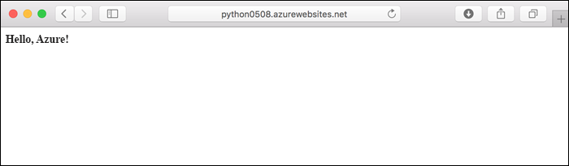
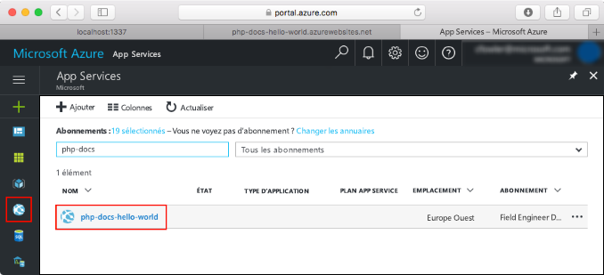
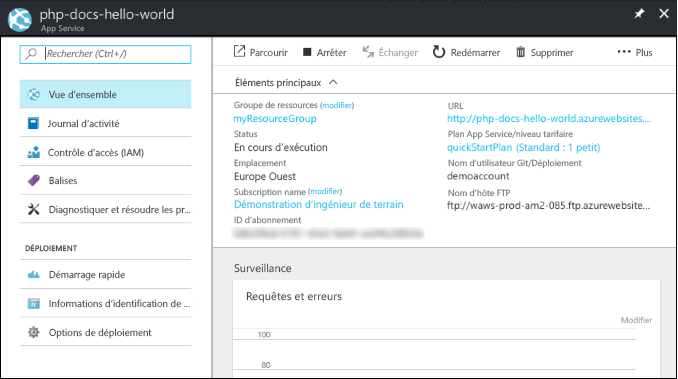

# <a name="create-a-python-app-in-azure-app-service-on-linux"></a>Créer une application Python dans Azure App Service sur Linux

Dans ce guide de démarrage rapide, vous allez déployer une application Python simple dans [App Service sur Linux](app-service-linux-intro.md), qui fournit un service d’hébergement web hautement scalable et autocorrectif. Vous allez utiliser l’interface de ligne de commande Azure ([Azure CLI](/cli/azure/install-azure-cli)) via Azure Cloud Shell, qui est interactif et basé sur le navigateur. Ainsi, vous pourrez suivre les étapes pour un ordinateur Mac, Linux ou Windows.


[!INCLUDE [quickstarts-free-trial-note](../../../includes/quickstarts-free-trial-note.md)]

[!INCLUDE [cloud-shell-try-it.md](../../../includes/cloud-shell-try-it.md)]

## <a name="download-the-sample"></a>Télécharger l’exemple

Dans Cloud Shell, créez un répertoire de démarrage rapide, puis utilisez-le.

```bash
mkdir quickstart

cd $HOME/quickstart
```

Exécutez ensuite la commande suivante pour cloner le référentiel de l’exemple d’application sur votre répertoire de démarrage rapide.

```bash
git clone https://github.com/Azure-Samples/python-docs-hello-world
```

Pendant son exécution, des informations semblables à ce qui suit s’affichent :

```bash
Cloning into 'python-docs-hello-world'...
remote: Enumerating objects: 43, done.
remote: Total 43 (delta 0), reused 0 (delta 0), pack-reused 43
Unpacking objects: 100% (43/43), done.
Checking connectivity... done.
```

## <a name="create-a-web-app"></a>Créer une application web

Passez au répertoire qui contient l’exemple de code et exécutez la commande `az webapp up`.

Dans l’exemple suivant, remplacez *\<app_name>* par un nom d’application unique (les caractères autorisés sont `a-z`, `0-9` et `-`).

```bash
cd python-docs-hello-world

az webapp up -n <app_name>
```

L’exécution de cette commande peut prendre quelques minutes. Pendant son exécution, des informations semblables à ce qui suit s’affichent :

```json
The behavior of this command has been altered by the following extension: webapp
Creating Resource group 'appsvc_rg_Linux_CentralUS' ...
Resource group creation complete
Creating App service plan 'appsvc_asp_Linux_CentralUS' ...
App service plan creation complete
Creating app '<app_name>' ....
Webapp creation complete
Creating zip with contents of dir /home/username/quickstart/python-docs-hello-world ...
Preparing to deploy contents to app.
All done.
{
  "app_url": "https:/<app_name>.azurewebsites.net",
  "location": "Central US",
  "name": "<app_name>",
  "os": "Linux",
  "resourcegroup": "appsvc_rg_Linux_CentralUS ",
  "serverfarm": "appsvc_asp_Linux_CentralUS",
  "sku": "BASIC",
  "src_path": "/home/username/quickstart/python-docs-hello-world ",
  "version_detected": "-",
  "version_to_create": "python|3.7"
}
```

La commande `az webapp up` exécute les actions suivantes :

- Créer un groupe de ressources par défaut

- Créer un plan App Service par défaut

- Créer une application avec le nom spécifié

- [Déployez les fichiers zip](https://docs.microsoft.com/azure/app-service/deploy-zip) à partir du répertoire de travail actif sur l’application web.

## <a name="browse-to-the-app"></a>Accéder à l’application

Accédez à l’application déployée à l’aide de votre navigateur web.

```bash
http://<app_name>.azurewebsites.net
```

L’exemple de code Python s’exécute dans App Service sur Linux avec une image intégrée.


**Félicitations !** Vous venez de déployer votre première application Python sur App Service sur Linux.

## <a name="update-and-redeploy-the-code"></a>Mettre à jour et redéployer le code

Dans Cloud Shell, tapez `code application.py` pour ouvrir l’éditeur Cloud Shell.


 Apportez une petite modification au texte de l’appel pour `return` :

```python
return "Hello Azure!"
```

Enregistrez vos modifications et quittez l’éditeur. Utilisez la commande `^S` pour enregistrer et `^Q` pour quitter.

Vous allez maintenant redéployer l’application. Remplacez `<app_name>` par votre application.

```bash
az webapp up -n <app_name>
```

Une fois le déploiement terminé, revenez à la fenêtre du navigateur que vous avez ouverte à l’étape **Accéder à l’application**, puis actualisez la page.



## <a name="manage-your-new-azure-app"></a>Gérer votre nouvelle application Azure

Accédez au <a href="https://portal.azure.com" target="_blank">portail Azure</a> pour gérer l’application que vous avez créée.

Dans le menu de gauche, cliquez sur **App Services**, puis sur le nom de votre application Azure.



La page Vue d’ensemble de votre application s’affiche. Ici, vous pouvez également des tâches de gestion de base (parcourir, arrêter, démarrer, redémarrer et supprimer des éléments, par exemple).



Le menu de gauche fournit différentes pages vous permettant de configurer votre application. 

[!INCLUDE [cli-samples-clean-up](../../../includes/cli-samples-clean-up.md)]

## <a name="next-steps"></a>Étapes suivantes

> [!div class="nextstepaction"]
> [Tutoriel : Application Python avec PostgreSQL](tutorial-python-postgresql-app.md)

> [!div class="nextstepaction"]
> [Configurer une application Python](how-to-configure-python.md)

> [!div class="nextstepaction"]
> [Tutoriel : Déployer à partir du référentiel de conteneurs privé](tutorial-custom-docker-image.md)
