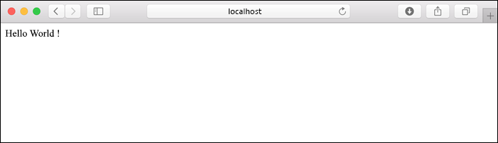

# <a name="quickstart-create-a-python-app-in-azure-app-service-on-linux"></a>Démarrage rapide : Créer une application Python dans Azure App Service sur Linux

Dans ce démarrage rapide, vous déployez une application web Python dans [App Service sur Linux](app-service-linux-intro.md), le service d’hébergement web hautement scalable et autocorrectif d’Azure. Vous utilisez l’[interface de ligne de commande (CLI) Azure](/cli/azure/install-azure-cli) locale sur un ordinateur Mac, Linux ou Windows. L’application web que vous configurez utilise un niveau App Service gratuit. Vous n’êtes donc pas facturé quand vous suivez la procédure décrite dans cet article.

Si vous préférez déployer des applications via un IDE, consultez [Déployer des applications Python sur App Service à partir de Visual Studio Code](/azure/python/tutorial-deploy-app-service-on-linux-01).

## <a name="prerequisites"></a>Prérequis

- Abonnement Azure : [créez-en un gratuitement](https://azure.microsoft.com/free/?ref=microsoft.com&utm_source=microsoft.com&utm_medium=docs&utm_campaign=visualstudio)
- <a href="https://www.python.org/downloads/" target="_blank">Python 3.7</a> (Python 3.6 est également pris en charge)
- <a href="https://git-scm.com/downloads" target="_blank">Git</a>
- <a href="https://docs.microsoft.com/cli/azure/install-azure-cli" target="_blank">Azure CLI</a> 2.0.80 ou version ultérieure. Exécutez `az --version` pour vérifier votre version.

## <a name="download-the-sample"></a>Télécharger l’exemple

Dans une fenêtre de terminal, exécutez la commande ci-après pour cloner l’exemple d’application sur votre ordinateur local. 

```terminal
git clone https://github.com/Azure-Samples/python-docs-hello-world
```

Ensuite, accédez à ce dossier :

```terminal
cd python-docs-hello-world
```

Le dépôt contient un fichier *application.py*, qui indique à App Service que le code contient une application Flask. Pour plus d’informations, consultez [Processus de démarrage et personnalisations du conteneur](how-to-configure-python.md).

## <a name="run-the-sample"></a>Exécution de l'exemple

Dans une fenêtre de terminal, utilisez les commandes ci-dessous (qui diffèrent en fonction du système d’exploitation) pour installer les dépendances requises et lancer le serveur de développement intégré. 

# <a name="bash"></a>[Bash](#tab/bash)

```bash
python3 -m venv venv
source venv/bin/activate
pip install -r requirements.txt
export FLASK_APP=application.py
flask run
```

# <a name="powershell"></a>[PowerShell](#tab/powershell)

```powershell
py -3 -m venv env
env\scripts\activate
pip install -r requirements.txt
Set-Item Env:FLASK_APP ".\application.py"
flask run
```

# <a name="cmd"></a>[Cmd](#tab/cmd)

```cmd
py -3 -m venv env
env\scripts\activate
pip install -r requirements.txt
SET FLASK_APP=application.py
flask run
```

---

Ouvrez un navigateur web et accédez à l’exemple d’application à l’adresse `http://localhost:5000/`. L’application affiche le message **Hello World !** .



Dans la fenêtre de terminal, appuyez sur **Ctrl**+**C** pour quitter le serveur web.

## <a name="sign-in-to-azure"></a>Connexion à Azure

Azure CLI fournit de nombreuses commandes pratiques que vous pouvez utiliser à partir d’un terminal local pour provisionner et gérer des ressources Azure à partir de la ligne de commande. Vous pouvez utiliser des commandes pour effectuer les mêmes tâches que dans le Portail Azure dans un navigateur. Vous pouvez également utiliser des commandes CLI dans des scripts pour automatiser les processus de gestion.

Pour exécuter des commandes Azure dans Azure CLI, vous devez d’abord vous connecter à l’aide de la commande `az login`. Cette commande ouvre un navigateur pour recueillir vos informations d’identification.

```azurecli
az login
```

## <a name="deploy-the-sample"></a>Déployer l'exemple

La commande [`az webapp up`](/cli/azure/webapp#az-webapp-up) crée l’application web sur App Service et déploie votre code.

Dans le dossier *python-docs-hello-world* contenant l’exemple de code, exécutez la commande `az webapp up` suivante. Remplacez `<app-name>` par un nom d’application global unique (les *caractères valides sont `a-z`, `0-9` et `-`* ).


```azurecli
az webapp up --sku F1 -n <app-name>
```
> [!CAUTION]
> Si vous utilisez **Azure CLI version 2.5.0**, il existe une régression dans `az webapp up` où certains scénarios échouent si le paramètre `-l <location-name>` n’est pas inclus. Ce problème est [suivi ici](https://github.com/Azure/azure-cli/issues/13257).  
> 
>Vous pouvez vérifier la version d’Azure CLI que vous utilisez avec la commande `az --version`.
>

L’argument `--sku F1` crée l’application web sur le niveau tarifaire Gratuit. Vous pouvez omettre cet argument pour utiliser un niveau Premium à la place, ce qui entraîne un coût horaire.

Si vous le souhaitez, vous pouvez inclure l’argument `-l <location-name>`, dans lequel `<location_name>` est une région Azure, telle que **centralus**, **eastasia**, **westeurope**, **koreasouth**, **brazilsouth**, **centralindia**, etc. Vous pouvez récupérer une liste de régions autorisées pour votre compte Azure en exécutant la commande [`az account list-locations`](/cli/azure/appservice?view=azure-cli-latest.md#az-appservice-list-locations).

La commande `az webapp up` peut prendre plusieurs minutes. Pendant son exécution, des informations semblables à ce qui suit s’affichent, sachant que `<app-name>` sera le nom que vous avez précédemment fourni :

<pre>
Creating Resource group 'appsvc_rg_Linux_centralus' ...
Resource group creation complete
Creating App service plan 'appsvc_asp_Linux_centralus' ...
App service plan creation complete
Creating app '&lt;app-name&gt;' ....
Configuring default logging for the app, if not already enabled
Creating zip with contents of dir D:\Examples\python-docs-hello-world ...
Getting scm site credentials for zip deployment
Starting zip deployment. This operation can take a while to complete ...
Deployment endpoint responded with status code 202
You can launch the app at http://&lt;app-name&gt;.azurewebsites.net
{
  "URL": "http://&lt;app-name&gt;.net",
  "appserviceplan": "appsvc_asp_Linux_centralus",
  "location": "eastus",
  "name": "&lt;app-name&gt;",
  "os": "Linux",
  "resourcegroup": "appsvc_rg_Linux_centralus",
  "runtime_version": "python|3.7",
  "runtime_version_detected": "-",
  "sku": "FREE",
  "src_path": "D:\\Examples\\python-docs-hello-world"
}
</pre>

[!INCLUDE [AZ Webapp Up Note](../../../includes/app-service-web-az-webapp-up-note.md)]

## <a name="browse-to-the-app"></a>Accéder à l’application

Accédez à l’application déployée à l’aide de votre navigateur web à l’URL `http://<app-name>.azurewebsites.net`.

L’exemple de code Python exécute un conteneur Linux dans App Service avec une image intégrée.


**Félicitations !** Vous venez de déployer votre application Python sur App Service sur Linux.

## <a name="redeploy-updates"></a>Redéployer les mises à jour

Dans l’éditeur de code de votre choix, ouvrez *application.py* et mettez à jour la fonction `hello` comme suit. Cette modification ajoute une instruction `print` pour générer la sortie de journalisation que vous allez utiliser à la section suivante. 

```python
def hello():
    print("Handling request to home page.")
    return "Hello Azure!"
```

Enregistrez vos modifications et quittez l’éditeur. 

Redéployez l’application en utilisant de nouveau la commande `az webapp up` :

```azurecli
az webapp up
```

Cette commande utilise des valeurs qui sont mises en cache dans le fichier *.azure/config*, notamment le nom de l’application, le groupe de ressources et le plan App Service.

Une fois le déploiement terminé, revenez à la fenêtre du navigateur ouverte pour `http://<app-name>.azurewebsites.net` et actualisez la page, qui doit afficher le message modifié :


> [!TIP]
> Visual Studio Code fournit des extensions puissantes pour Python et Azure App Service, qui simplifient le processus de déploiement d’applications web Python sur App Service. Pour plus d’informations, consultez [Déployer des applications Python sur App Service à partir de Visual Studio Code](/azure/python/tutorial-deploy-app-service-on-linux-01).

## <a name="stream-logs"></a>Diffuser les journaux d’activité en continu

Vous pouvez accéder aux journaux de la console générés à l’intérieur de l’application et au conteneur dans lequel elle s’exécute. Les journaux incluent toute sortie générée à l’aide d’instructions `print`.

Pour envoyer les journaux en streaming, exécutez la commande suivante :

```azurecli
az webapp log tail
```

Actualisez l’application dans le navigateur pour générer des journaux de console, qui doivent inclure des lignes similaires au texte suivant. Si vous ne voyez pas la sortie immédiatement, réessayez dans 30 secondes.

<pre>
2020-04-03T22:54:04.236405938Z Handling request to home page.
2020-04-03T22:54:04.236497641Z 172.16.0.1 - - [03/Apr/2020:22:54:04 +0000] "GET / HTTP/1.1" 200 12 "-" "Mozilla/5.0 (Windows NT 10.0; Win64; x64) AppleWebKit/537.36 (KHTML, like Gecko) Chrome/81.0.4044.83 Safari/537.36 Edg/81.0.416.41"
</pre>

Vous pouvez également inspecter les fichiers journaux à partir du navigateur sur `https://<app-name>.scm.azurewebsites.net/api/logs/docker`.

Pour arrêter le streaming des journaux à tout moment, appuyez sur `Ctrl`+`C`.

## <a name="manage-the-azure-app"></a>Gérer l’application Azure

Accédez au <a href="https://portal.azure.com" target="_blank">portail Azure</a> pour gérer l’application que vous avez créée. Recherchez et sélectionnez **App Services**.


Sélectionnez le nom de votre application Azure.


La page Vue d’ensemble de votre application s’affiche. Ici, vous pouvez également des tâches de gestion de base (parcourir, arrêter, démarrer, redémarrer et supprimer des éléments, par exemple).


Le menu App Service fournit différentes pages vous permettant de configurer votre application.

## <a name="clean-up-resources"></a>Nettoyer les ressources

Au cours des étapes précédentes, vous avez créé des ressources Azure au sein d’un groupe de ressources. Le groupe de ressources a un nom tel que « appsvc_rg_Linux_CentralUS » en fonction de votre emplacement. Si vous utilisez une référence SKU App Service autre que le niveau F1 gratuit, ces ressources entraînent des coûts récurrents (consultez [Tarifs App Service](https://azure.microsoft.com/pricing/details/app-service/linux/)).

Si vous n’envisagez pas d’avoir besoin de ces ressources à l’avenir, supprimez le groupe de ressources en exécutant la commande suivante, en remplaçant `<resource-group-name>` par le groupe de ressources affiché dans la sortie de la commande `az webapp up`, par exemple « appsvc_rg_Linux_centralus ». L’exécution de cette commande peut prendre une minute.

```azurecli
az group delete -n <resource-group-name>
```

## <a name="next-steps"></a>Étapes suivantes

> [!div class="nextstepaction"]
> [Tutoriel : Application web Python (Django) avec PostgreSQL](tutorial-python-postgresql-app.md)

> [!div class="nextstepaction"]
> [Ajouter une connexion utilisateur à une application web Python](../../active-directory/develop/quickstart-v2-python-webapp.md)

> [!div class="nextstepaction"]
> [Configurer une application Python](how-to-configure-python.md)

> [!div class="nextstepaction"]
> [Tutoriel : Exécuter une application Python dans un conteneur personnalisé](tutorial-custom-docker-image.md)
