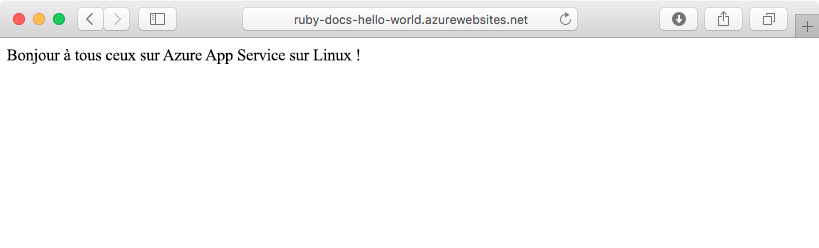
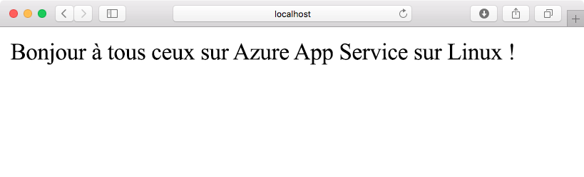
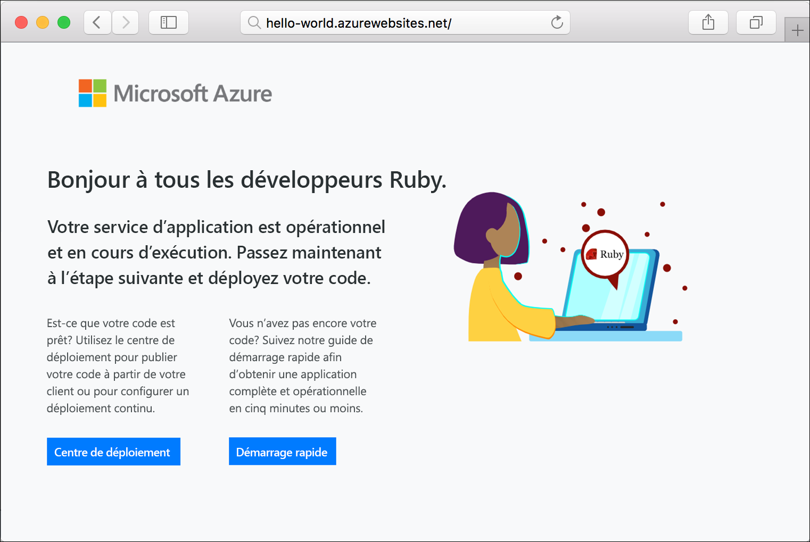

# <a name="create-a-ruby-on-rails-app-in-app-service-on-linux"></a>Créer une application Ruby on Rails dans App Service sur Linux

[App Service sur Linux](app-service-linux-intro.md) fournit un service d’hébergement web hautement scalable appliquant des mises à jour correctives automatiques à l’aide du système d’exploitation Linux. Ce didacticiel de démarrage rapide montre comment déployer une application Ruby on Rails sur Azure App Service sur Linux à l’aide de [Cloud Shell](https://docs.microsoft.com/azure/cloud-shell/overview).

> [!NOTE]
> La pile de développement Ruby ne prend en charge que Ruby on Rails pour l’instant. Si vous souhaitez utiliser une autre plateforme telle que Sinatra, ou si vous souhaitez utiliser une [version non prise en charge de Ruby](app-service-linux-intro.md), vous devez [l’exécuter dans un conteneur personnalisé](quickstart-docker-go.md).



[!INCLUDE [quickstarts-free-trial-note](../../../includes/quickstarts-free-trial-note.md)]

## <a name="prerequisites"></a>Prérequis

* <a href="https://www.ruby-lang.org/en/documentation/installation/#rubyinstaller" target="_blank">Installez Ruby 2.6 ou version supérieure</a>
* <a href="https://git-scm.com/" target="_blank">Installez Git</a>

## <a name="download-the-sample"></a>Télécharger l’exemple

Dans une fenêtre de terminal, exécutez la commande ci-après pour cloner le référentiel de l’exemple d’application sur votre ordinateur local :

```bash
git clone https://github.com/Azure-Samples/ruby-docs-hello-world
```

## <a name="run-the-application-locally"></a>Exécuter l’application localement

Exécutez l’application localement pour voir à quoi elle devrait ressembler lorsque vous la déploierez sur Azure. Ouvrez une fenêtre de terminal, accédez au répertoire `hello-world` et utilisez la commande `rails server` pour démarrer le serveur.

La première étape consiste à installer les gems nécessaires. L’exemple contenant un `Gemfile`, il vous suffit d’exécuter la commande suivante :

```bash
bundle install
```

Une fois les gems installés, nous utilisons bundler pour démarrer l’application :

```bash
bundle exec rails server
```

À l’aide de votre navigateur web, accédez à `http://localhost:3000` pour tester l’application en local.



[!INCLUDE [Try Cloud Shell](../../../includes/cloud-shell-try-it.md)]

[!INCLUDE [Configure deployment user](../../../includes/configure-deployment-user.md)]

[!INCLUDE [Create resource group](../../../includes/app-service-web-create-resource-group-linux.md)]

[!INCLUDE [Create app service plan](../../../includes/app-service-web-create-app-service-plan-linux.md)]

## <a name="create-a-web-app"></a>Créer une application web

[!INCLUDE [Create web app](../../../includes/app-service-web-create-web-app-ruby-linux-no-h.md)] 

Accédez à l’application pour voir votre nouvelle application web avec une image intégrée. Remplacez _&lt;nom de l’application>_ par le nom de votre application web.

```bash
http://<app_name>.azurewebsites.net
```

Voici à quoi doit ressembler votre nouvelle application web :



## <a name="deploy-your-application"></a>Déployer votre application

Exécutez les commandes suivantes pour déployer l’application locale sur votre application web Azure :

```bash
git remote add azure <Git deployment URL from above>
git push azure master
```

Vérifiez que les opérations de déploiement à distance réussissent. Les commandes produisent une sortie semblable au texte suivant :

```bash
remote: Using turbolinks 5.2.0
remote: Using uglifier 4.1.20
remote: Using web-console 3.7.0
remote: Bundle complete! 18 Gemfile dependencies, 78 gems now installed.
remote: Bundled gems are installed into `/tmp/bundle`
remote: Zipping up bundle contents
remote: .......
remote: ~/site/repository
remote: Finished successfully.
remote: Running post deployment command(s)...
remote: Deployment successful.
remote: App container will begin restart within 10 seconds.
To https://<app-name>.scm.azurewebsites.net/<app-name>.git
   a6e73a2..ae34be9  master -> master
```

Une fois le déploiement terminé, attendez environ 10 secondes que l’application web redémarre, puis accédez-y pour vérifiez les résultats.

```bash
http://<app-name>.azurewebsites.net
```


> [!NOTE]
> Pendant le redémarrage de l’application, vous pouvez observer le code d’état HTTP `Error 503 Server unavailable` dans le navigateur ou la page par défaut `Hey, Ruby developers!`. Le redémarrage complet de l’application peut prendre quelques minutes.
>

[!INCLUDE [Clean-up section](../../../includes/cli-script-clean-up.md)]

## <a name="next-steps"></a>Étapes suivantes

> [!div class="nextstepaction"]
> [Tutoriel : Ruby on Rails avec Postgres](tutorial-ruby-postgres-app.md)

> [!div class="nextstepaction"]
> [Configurer une application Ruby](configure-language-ruby.md)
