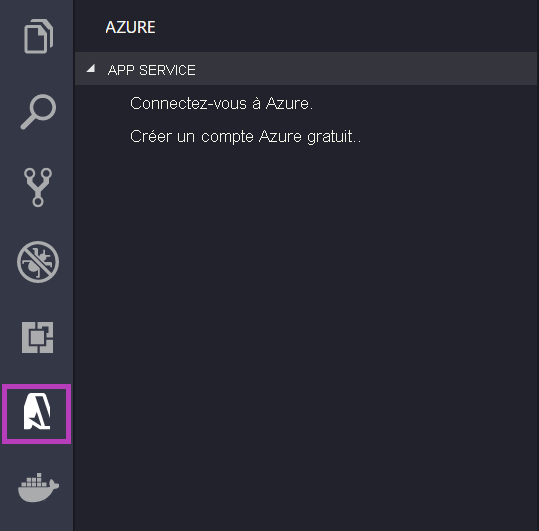
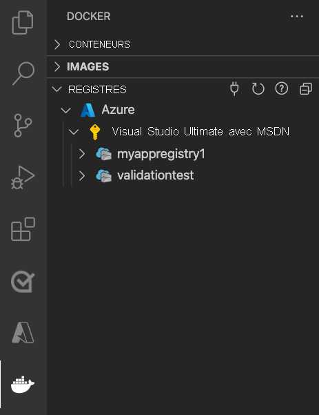

# <a name="run-a-custom-container-in-azure"></a>Exécuter un conteneur personnalisé dans Azure

::: zone pivot="container-windows"
[Azure App Service](overview.md) fournit des piles d’applications prédéfinies sur Windows, par exemple ASP.NET ou Node.js, exécuté sur IIS. L’environnement de conteneur Windows préconfiguré (préversion) verrouille le système d’exploitation et empêche l’accès administrateur, les installations logicielles, les changements du Global Assembly Cache, etc. Pour plus d’informations, consultez [Fonctionnalités de système d’exploitation sur Azure App Service](operating-system-functionality.md). Si votre application nécessite un accès plus important que celui permis par l’environnement préconfiguré, vous pouvez déployer un conteneur Windows personnalisé à la place.

Ce guide de démarrage rapide montre comment déployer une application ASP.NET, dans une image Windows, sur [Docker Hub](https://hub.docker.com/) à partir de Visual Studio. Vous exécutez l’application dans un conteneur personnalisé au sein d’Azure App Service.

> [!NOTE]
> App Service sur des conteneurs Windows est en préversion.
>

## <a name="prerequisites"></a>Prérequis

Pour suivre ce tutoriel :

- <a href="https://hub.docker.com/" target="_blank">Créez un compte Docker Hub</a>
- <a href="https://docs.docker.com/docker-for-windows/install/" target="_blank">Installez Docker pour Windows</a>.
- <a href="/virtualization/windowscontainers/quick-start/quick-start-windows-10" target="_blank">Basculez Docker pour exécuter des conteneurs Windows</a>.
- <a href="https://www.visualstudio.com/downloads/" target="_blank">Installez Visual Studio 2019</a> avec les charges de travail **Développement web et ASP.NET** et **Développement Azure**. Si vous avez déjà installé Visual Studio 2019 :

    - Installez les dernières mises à jour dans Visual Studio en sélectionnant **Aide** > **Rechercher les mises à jour**.
    - Ajoutez les charges de travail dans Visual Studio en sélectionnant **Outils** > **Obtenir des outils et des fonctionnalités**.

## <a name="create-an-aspnet-web-app"></a>Créez une application web ASP.NET

Créez une application web ASP.NET en effectuant les étapes suivantes :

1. Ouvrez Visual Studio, puis sélectionnez **Créer un projet**.

1. Dans **Créer un projet**, recherchez et choisissez une **application web ASP.NET (.NET Framework)** pour C#, puis sélectionnez **Suivant**.

1. Dans **Configurer votre nouveau projet**, nommez l’application _myfirstazurewebapp_, puis sélectionnez **Créer**.

   

1. Vous pouvez déployer n’importe quel type d’application web ASP.NET dans Azure. Pour ce guide de démarrage rapide, choisissez le modèle **MVC**.

1. Sélectionnez **Prise en charge de Docker**, puis vérifiez que l’option d’authentification a la valeur **Aucune authentification**. Sélectionnez **Create** (Créer).

   

1. Si le fichier _Dockerfile_ ne s’ouvre pas automatiquement, ouvrez-le dans **l’Explorateur de solutions**.

1. Vous avez besoin d’une [image parent prise en charge](configure-custom-container.md#supported-parent-images). Changez l’image parente en remplaçant la ligne `FROM` par le code suivant et enregistrez le fichier :

   ```dockerfile
   FROM mcr.microsoft.com/dotnet/framework/aspnet:4.7.2-windowsservercore-ltsc2019
   ```

1. Dans le menu Visual Studio, sélectionnez **Déboguer** > **Démarrer sans débogage** pour exécuter l’application web localement.

   

## <a name="publish-to-docker-hub"></a>Publier sur Docker Hub

1. Dans l’**Explorateur de solutions**, cliquez avec le bouton droit sur le projet **myfirstazurewebapp**, puis sélectionnez **Publier**.

1. Choisissez **App Service**, puis sélectionnez **Publier**.

1. Dans **Choisir une cible de publication**, sélectionnez **Container Registry**, **Docker Hub**, puis cliquez sur **Publier**.

   

1. Indiquez vos informations d’identification de compte Docker Hub, puis sélectionnez **Enregistrer**.

   Attendez la fin du déploiement. La page **Publier** affiche désormais le nom du dépôt à utiliser plus tard.

   

1. Copiez ce nom de dépôt pour une utilisation ultérieure.

## <a name="create-a-windows-container-app"></a>Créer une application de conteneur Windows

1. Connectez-vous au [portail Azure]( https://portal.azure.com).

1. Sélectionnez **Créer une ressource** dans le coin supérieur gauche du Portail Azure.

1. Dans la zone de recherche située au-dessus de la liste des ressources de la Place de marché Azure, recherchez **Web App pour conteneurs**, puis sélectionnez **Créer**.

1. Dans **Application web - Créer**, choisissez votre abonnement et un **groupe de ressources**. Vous pouvez créer un groupe de ressources, le cas échéant.

1. Indiquez un nom d’application, par exemple *win-container-demo*, puis choisissez **Windows** pour **Système d’exploitation**. Sélectionnez **Suivant : Docker** pour continuer.

   

1. Pour **Source d’image**, choisissez **Docker Hub** et pour **Image et étiquette**, entrez le nom de dépôt que vous avez copié dans [Publier sur Docker Hub](#publish-to-docker-hub).

   

    Si vous avez une image personnalisée ailleurs pour votre application web, comme dans [Azure Container Registry](../container-registry/index.yml) ou dans un autre référentiel privé, vous pouvez le configurer ici.

1. Sélectionnez **Vérifier et créer**, **Créer**, puis attendez qu’Azure crée les ressources nécessaires.

## <a name="browse-to-the-container-app"></a>Accédez à l’application de conteneur

Lorsque l’opération Azure est terminée, une zone de notification s’affiche.


1. Cliquez sur **Accéder à la ressource**.

1. Dans la vue d’ensemble de cette ressource, suivez le lien situé à côté de **URL**.

Une nouvelle page de navigateur s’ouvre à la page suivante :


Attendez quelques minutes et réessayez, jusqu'à accéder à la page d’accueil ASP.NET par défaut :


**Félicitations !** Vous exécutez votre premier conteneur Windows personnalisé dans Azure App Service.

## <a name="see-container-start-up-logs"></a>Consulter les journaux d’activité de démarrage du conteneur

Le chargement du conteneur Windows peut prendre un certain temps. Pour voir la progression, accédez à l’URL suivante en remplaçant *\<app_name>* par le nom de votre application.
```
https://<app_name>.scm.azurewebsites.net/api/logstream
```

Les journaux d’activité en continu ressemblent à ceci :

```
2018-07-27T12:03:11  Welcome, you are now connected to log-streaming service.
27/07/2018 12:04:10.978 INFO - Site: win-container-demo - Start container succeeded. Container: facbf6cb214de86e58557a6d073396f640bbe2fdec88f8368695c8d1331fc94b
27/07/2018 12:04:16.767 INFO - Site: win-container-demo - Container start complete
27/07/2018 12:05:05.017 INFO - Site: win-container-demo - Container start complete
27/07/2018 12:05:05.020 INFO - Site: win-container-demo - Container started successfully
```

## <a name="update-locally-and-redeploy"></a>Mise à jour locale et redéploiement

1. Dans Visual Studio, dans l’**Explorateur de solutions**, ouvrez **Vues** > **Accueil** > **Index.cshtml**.

1. Recherchez la balise HTML `<div class="jumbotron">` vers le début, puis remplacez la totalité de l’élément par le code suivant :

   ```html
   <div class="jumbotron">
       <h1>ASP.NET in Azure!</h1>
       <p class="lead">This is a simple app that we've built that demonstrates how to deploy a .NET app to Azure App Service.</p>
   </div>
   ```

1. Pour effectuer un redéploiement sur Azure, cliquez avec le bouton droit sur le projet **myfirstazurewebapp** dans l’**Explorateur de solutions**, puis choisissez **Publier**.

1. Dans la page de publication, sélectionnez **Publier** et attendez la fin de la publication.

1. Pour indiquer à App Service qu’il faut tirer la nouvelle image de Docker Hub, redémarrez l’application. De retour dans la page d’application du portail, cliquez sur **Redémarrer** > **Oui**.

   

[Accédez de nouveau à l’application de conteneur](#browse-to-the-container-app). Quand vous actualisez la page web, l’application doit d’abord revenir à la page « Démarrage », puis afficher quelques minutes après la page web mise à jour.


## <a name="next-steps"></a>Étapes suivantes

> [!div class="nextstepaction"]
> [Migrer vers un conteneur Windows dans Azure](tutorial-custom-container.md)

Ou consultez les autres ressources :

> [!div class="nextstepaction"]
> [Configurer un conteneur personnalisé](configure-custom-container.md)

::: zone-end  

::: zone pivot="container-linux"
App Service sur Linux fournit des piles d’applications prédéfinies sur Linux avec la prise en charge de langages comme .NET, PHP, Node.js, etc. Vous pouvez également utiliser une image Docker personnalisée pour exécuter votre application web sur une pile d’applications qui n’est pas encore définie dans Azure. Ce guide de démarrage rapide vous montre comment déployer une image à partir d’un [ACR (Azure Container Registry)](../container-registry/index.yml) vers App Service.

## <a name="prerequisites"></a>Prérequis

* un [compte Azure](https://azure.microsoft.com/free/?utm_source=campaign&utm_campaign=vscode-tutorial-docker-extension&mktingSource=vscode-tutorial-docker-extension) ;
* [Docker](https://www.docker.com/community-edition)
* [Visual Studio Code](https://code.visualstudio.com/)
* L’[extension Azure App Service pour VS Code](https://marketplace.visualstudio.com/items?itemName=ms-azuretools.vscode-azureappservice). Vous pouvez utiliser cette extension pour créer, gérer et déployer des applications web Linux sur la plateforme PaaS (Platform as a Service) Azure.
* L’[extension Docker pour VS Code](https://marketplace.visualstudio.com/items?itemName=ms-azuretools.vscode-docker). Vous pouvez utiliser cette extension pour simplifier la gestion des images et commandes Docker locales, ainsi que pour déployer des images d’application générées sur Azure.

## <a name="create-an-image"></a>Créer une image

Pour suivre ce guide de démarrage rapide, vous avez besoin d’une image d’application web appropriée stockée dans un registre [Azure Container Registry](../container-registry/index.yml). Suivez les instructions données dans [Démarrage rapide : Créer un registre de conteneurs privé à l’aide du portail Azure](../container-registry/container-registry-get-started-portal.md), mais utilisez l’image `mcr.microsoft.com/azuredocs/go` au lieu de l’image `hello-world`. Pour référence, [l’exemple de fichier Dockerfile se trouve dans le dépôt Exemples Azure](https://github.com/Azure-Samples/go-docs-hello-world).

> [!IMPORTANT]
> Veillez à définir l’option **Utilisateur administrateur ** sur **Activer** quand vous créez le registre de conteneurs. Vous pouvez également la définir à partir de la section **Clés d’accès** de votre page de registre dans le portail Azure. Ce paramètre est nécessaire pour l’accès à App Service.

## <a name="sign-in"></a>Se connecter

Ensuite, lancez VS Code et connectez-vous à votre compte Azure à l’aide de l’extension App Service. Pour ce faire, sélectionnez le logo Azure dans la barre d’activités, accédez à l’explorateur **APP SERVICE**, sélectionnez **Connectez-vous à Azure **, puis suivez les instructions affichées.



## <a name="check-prerequisites"></a>Vérifier les conditions préalables

Vous pouvez maintenant vérifier que tous les prérequis ont été correctement installés et configurés.

Dans VS Code, vous devez voir votre adresse e-mail Azure dans la barre d’état et votre abonnement dans l’explorateur**APP SERVICE**.

Vérifiez ensuite que Docker est installé et en cours d’exécution. La commande suivante affiche la version de Docker s’il est en cours d’exécution.

```bash
docker --version
```

Enfin, vérifiez que votre registre Azure Container Registry est connecté. Pour ce faire, sélectionnez le logo Docker dans la barre d’activités, puis accédez à **REGISTRES**.



## <a name="deploy-the-image-to-azure-app-service"></a>Déployer l’image dans Azure App Service

Maintenant que tout est configuré, vous pouvez déployer votre image dans [Azure App Service](https://azure.microsoft.com/services/app-service/) directement à partir de l’explorateur de l’extension Docker.

Recherchez l’image sous le nœud **Registres** dans l’explorateur**DOCKER**, puis développez-la pour afficher ses balises. Cliquez avec le bouton droit sur une balise, puis sélectionnez **Déployer l’image dans Azure App Service**.

À partir de là, suivez les invites pour choisir un abonnement, un nom d’application global unique, un groupe de ressources et un plan App Service. Choisissez **B1 De base** comme niveau tarifaire et une région.

Une fois le déploiement effectué, votre application est disponible à l’adresse `http://<app name>.azurewebsites.net`.

Un **groupe de ressources** est une collection nommée de toutes les ressources de votre application dans Azure. Par exemple, un groupe de ressources peut contenir une référence à un site web, une base de données et une fonction Azure.

Un **plan App Service** définit les ressources physiques qui seront utilisées pour héberger votre site web. Ce guide de démarrage rapide utilise un plan d’hébergement **De base** sur l’infrastructure **Linux**, ce qui signifie que le site sera hébergé sur une machine Linux avec d’autres sites web. Si vous commencez avec le plan **De base**, vous pouvez utiliser le portail Azure pour effectuer un scale-up afin que votre site soit le seul à s’exécuter sur un ordinateur.

## <a name="browse-the-website"></a>Parcourir le site Web

Le panneau **Sortie** s’ouvre pendant le déploiement pour indiquer l’état de l’opération. Une fois l’opération terminée, recherchez l’application que vous avez créée dans l’explorateur **APP SERVICE**, cliquez dessus avec le bouton droit, puis sélectionnez **Parcourir le site Web** pour ouvrir le site dans votre navigateur.

> [!div class="nextstepaction"]
> [J’ai rencontré un problème](https://www.research.net/r/PWZWZ52?tutorial=quickstart-docker&step=deploy-app)

## <a name="next-steps"></a>Étapes suivantes

Félicitations, vous avez terminé ce démarrage rapide !

Consultez ensuite les autres extensions Azure.

* [Cosmos DB](https://marketplace.visualstudio.com/items?itemName=ms-azuretools.vscode-cosmosdb)
* [Azure Functions](https://marketplace.visualstudio.com/items?itemName=ms-azuretools.vscode-azurefunctions)
* [Outils Azure CLI](https://marketplace.visualstudio.com/items?itemName=ms-vscode.azurecli)
* [Outils Azure Resource Manager](https://marketplace.visualstudio.com/items?itemName=msazurermtools.azurerm-vscode-tools)

Vous pouvez également les obtenir tous en installant le pack d’extension [Azure Tools](https://marketplace.visualstudio.com/items?itemName=ms-vscode.vscode-node-azure-pack).

Consultez les autres ressources :

> [!div class="nextstepaction"]
> [Configurer un conteneur personnalisé](configure-custom-container.md)

::: zone-end