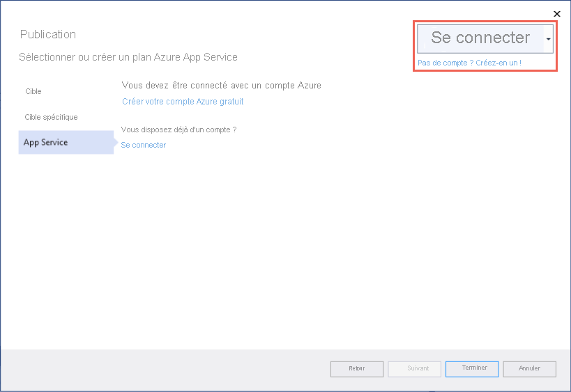
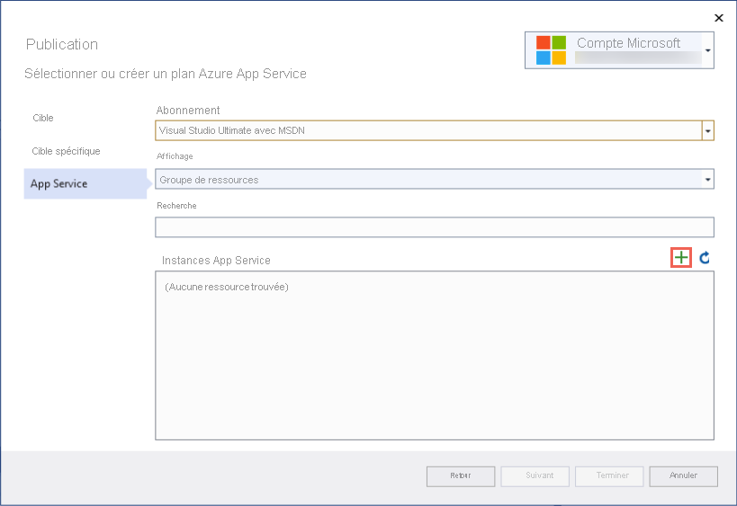
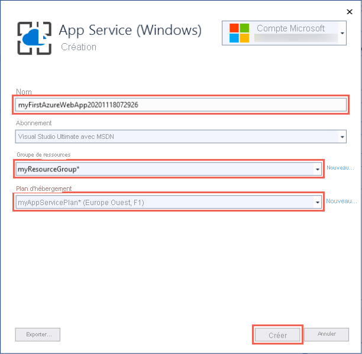

# <a name="create-an-aspnet-framework-web-app-in-azure"></a>Créer une application web ASP.NET Framework dans Azure

[Azure App Service](overview.md) offre un service d’hébergement web hautement évolutif appliquant des mises à jour correctives automatiques.

Ce guide de démarrage rapide montre comment déployer votre première application web ASP.NET sur Azure App Service. Une fois que vous avez terminé, vous disposez d’un plan App Service. Vous disposez également d’une application App Service et d’une application web déployée.

[!INCLUDE [quickstarts-free-trial-note](../../includes/quickstarts-free-trial-note.md)]

## <a name="prerequisites"></a>Prérequis

Pour effectuer ce tutoriel, installez <a href="https://www.visualstudio.com/downloads/" target="_blank">Visual Studio 2019</a> avec la charge de travail **Développement web et ASP.NET**.

Si vous avez déjà installé Visual Studio 2019 :

- Installez les dernières mises à jour dans Visual Studio en sélectionnant **Aide** > **Rechercher les mises à jour**.
- Ajoutez la charge de travail en sélectionnant **Outils** > **Obtenir des outils et des fonctionnalités**.

## <a name="create-an-aspnet-web-app"></a>Créer une application web ASP.NET <a name="create-and-publish-the-web-app"></a>

Créez une application web ASP.NET en effectuant les étapes suivantes :

1. Ouvrez Visual Studio, puis sélectionnez **Créer un projet**.

2. Dans **Créer un projet**, recherchez et choisissez **Application web ASP.NET (.NET Framework)** , puis sélectionnez **Suivant**.

3. Dans **Configurer votre nouveau projet**, nommez l’application _myFirstAzureWebApp_, puis sélectionnez **Create (Créer)** .

   

4. Vous pouvez déployer n’importe quel type d’application web ASP.NET dans Azure. Pour ce guide de démarrage rapide, choisissez le modèle **MVC**.

5. Vérifiez que l’option d’authentification a la valeur **Aucune authentification**. Sélectionnez **Create** (Créer).

   

6. Dans le menu Visual Studio, sélectionnez **Déboguer** > **Démarrer sans débogage** pour exécuter l’application web localement.

   

## <a name="publish-your-web-app"></a>Publier votre application web <a name="launch-the-publish-wizard"></a>

1. Dans l’**Explorateur de solutions**, cliquez avec le bouton droit sur le projet **myFirstAzureWebApp**, puis sélectionnez **Publier**.

1. Dans **Publier**, sélectionnez **Azure** et cliquez sur **Suivant**.

1. Sélectionnez **Azure App Service (Windows)** et cliquez sur **Suivant**.

   <!--  -->

1. Vos options varient si vous êtes déjà connecté à Azure et si vous avez un compte Visual Studio lié à un compte Azure. Sélectionnez **Ajouter un compte** ou **Connexion** pour vous connecter à votre abonnement Azure. Si vous êtes déjà connecté, sélectionnez le compte souhaité.

   

   [!INCLUDE [resource group intro text](../../includes/resource-group.md)]

1. À droite de **Instances d’App Service**, cliquez sur **+** .

   

1. Pour **Groupe de ressources**, sélectionnez **Nouveau**.

1. Dans **Nouveau nom du groupe de ressources**, entrez *myResourceGroup*, puis sélectionnez **OK**.

   [!INCLUDE [app-service-plan](../../includes/app-service-plan.md)]

1. Pour **Plan d’hébergement**, sélectionnez **Nouveau**.

1. Dans la boîte de dialogue **Plan d’hébergement**, entrez les valeurs du tableau suivant, puis sélectionnez **OK**.

   | Paramètre | Valeur suggérée | Description |
   |-|-|-|
   | Plan d’hébergement| myAppServicePlan | Nom du plan App Service. |
   | Emplacement | Europe Ouest | Centre de données dans lequel l’application web est hébergée. |
   | Taille | Gratuit | Le [niveau tarifaire](https://azure.microsoft.com/pricing/details/app-service/?ref=microsoft.com&utm_source=microsoft.com&utm_medium=docs&utm_campaign=visualstudio) détermine les fonctionnalités d’hébergement. |

   

1. Dans **Nom**, entrez un nom d’application unique qui inclut uniquement les caractères valides `a-z`, `A-Z`, `0-9` et `-`. Vous pouvez accepter le nom unique généré automatiquement. L’URL de l’application web est `http://<app-name>.azurewebsites.net`, où `<app-name>` est le nom de votre application.

2. Sélectionnez **Créer** pour créer les ressources Azure.

   

    Une fois l’Assistant terminé, les ressources Azure sont créées pour vous et vous êtes prêt à publier.

3. Sélectionnez **Terminer** pour fermer l’Assistant.

3. Dans la page **Publier**, cliquez sur **Publier**. Visual Studio génère, empaquète et publie l’application sur Azure, puis la démarre dans le navigateur par défaut.

    

Le nom d’application spécifié dans la page **Créer un App Service** est utilisé en tant que préfixe d’URL au format `http://<app-name>.azurewebsites.net`.

**Félicitations !** Votre application web ASP.NET s’exécute en temps réel dans Azure App Service.

## <a name="update-the-app-and-redeploy"></a>Mise à jour de l’application et redéploiement

1. Dans l’**Explorateur de solutions**, sous votre projet, ouvrez **Vues** > **Accueil** > **Index.cshtml**.

1. Recherchez la balise HTML `<div class="jumbotron">` vers le début, puis remplacez la totalité de l’élément par le code suivant :

   ```html
   <div class="jumbotron">
       <h1>ASP.NET in Azure!</h1>
       <p class="lead">This is a simple app that we've built that demonstrates how to deploy a .NET app to Azure App Service.</p>
   </div>
   ```

1. Pour effectuer un redéploiement dans Azure, cliquez avec le bouton droit sur le projet **myFirstAzureWebApp** dans **l’Explorateur de solutions**, puis sélectionnez **Publier**. Sélectionnez ensuite **Publier**.

    Une fois la publication terminée, Visual Studio lance un navigateur en accédant à l’URL de l’application web.

    

## <a name="manage-the-azure-app"></a>Gérer l’application Azure

1. Pour gérer l’application web, accédez au [Portail Azure](https://portal.azure.com), puis recherchez et sélectionnez **App Services**.

   

2. Dans la page **App Services**, sélectionnez le nom de votre application web.

   

   Vous voyez apparaître la page Vue d’ensemble de votre application web. Ici, vous pouvez effectuer des tâches de gestion de base, par exemple parcourir, arrêter, démarrer, redémarrer et supprimer.

   

   Le menu de gauche fournit différentes pages vous permettant de configurer votre application.

[!INCLUDE [Clean-up section](../../includes/clean-up-section-portal.md)]

## <a name="next-steps"></a>Étapes suivantes

> [!div class="nextstepaction"]
> [ASP.NET avec SQL Database](app-service-web-tutorial-dotnet-sqldatabase.md)

> [!div class="nextstepaction"]
> [Configurer une application ASP.NET](configure-language-dotnet-framework.md)
