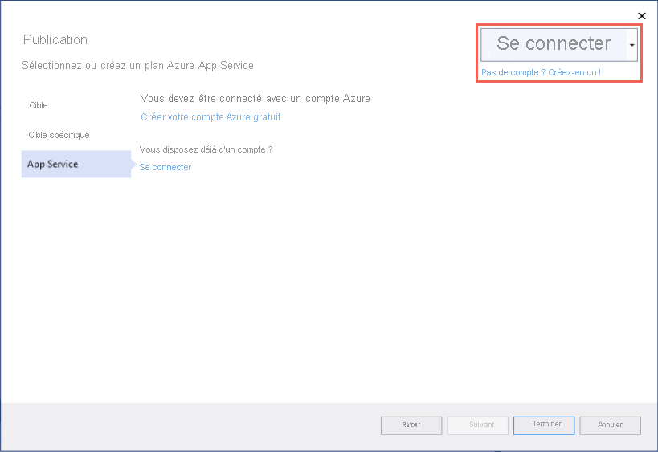

# <a name="quickstart-create-an-aspnet-core-web-app-in-azure"></a>Démarrage rapide : Créer une application web ASP.NET Core dans Azure

::: zone pivot="platform-windows"  

Dans ce guide de démarrage rapide, vous allez apprendre à créer et déployer votre première application web ASP.NET Core sur [Azure App Service](overview.md). App Service prend en charge les applications .NET 5.0.

Quand vous aurez terminé, vous disposerez d’un groupe de ressources Azure constitué d’un plan d’hébergement App Service et d’un service d’application avec une application web déployée.

## <a name="prerequisites"></a>Prérequis

- Compte Azure avec un abonnement actif. [Créez un compte gratuitement](https://azure.microsoft.com/free/dotnet/).
- Installer <a href="https://www.visualstudio.com/downloads/" target="_blank">Visual Studio 2019</a> avec la charge de travail **Développement ASP.NET et web**.

  Si vous avez déjà installé Visual Studio 2019 :

  - Installez les dernières mises à jour dans Visual Studio en sélectionnant **Aide** > **Rechercher les mises à jour**. Les dernières mises à jour contiennent le kit SDK .NET 5.0.
  - Ajoutez la charge de travail en sélectionnant **Outils** > **Obtenir des outils et des fonctionnalités**.


## <a name="create-an-aspnet-core-web-app"></a>Créez une application web ASP.NET Core

Créez une application web ASP.NET Core dans Visual Studio en suivant ces étapes :

# <a name="net-core-31"></a>[.NET Core 3.1](#tab/netcore31)

1. Ouvrez Visual Studio et sélectionnez **Créer un projet**.

1. Dans **Créer un projet**, sélectionnez **Application web ASP.NET Core** et vérifiez que **C#** est listé dans les langages de ce choix, puis sélectionnez **Suivant**.

1. Dans **Configurer votre nouveau projet**, nommez votre projet d’application web *myFirstAzureWebApp*, puis sélectionnez **Créer**.

   

1. Vous pouvez déployer n’importe quel type d’application web ASP.NET Core dans Azure, mais pour ce guide de démarrage rapide, choisissez le modèle **Application web**. Vérifiez que l’option **Authentification** est définie sur **Aucune authentification**, et qu’aucune autre option n’est sélectionnée. Sélectionnez ensuite **Create** (Créer).

    
   
1. Dans le menu Visual Studio, sélectionnez **Déboguer** > **Démarrer sans débogage** pour exécuter votre application web localement.

   

# <a name="net-50"></a>[.NET 5.0](#tab/net50)

1. Ouvrez Visual Studio et sélectionnez **Créer un projet**.

1. Dans **Créer un projet**, sélectionnez **Application web ASP.NET Core** et vérifiez que **C#** est listé dans les langages de ce choix, puis sélectionnez **Suivant**.

1. Dans **Configurer votre nouveau projet**, nommez votre projet d’application web *myFirstAzureWebApp*, puis sélectionnez **Créer**.

   

1. Pour une application .NET 5.0, sélectionnez **ASP.NET Core 5.0** dans la liste déroulante.

1. Vous pouvez déployer n’importe quel type d’application web ASP.NET Core dans Azure, mais pour ce guide de démarrage rapide, choisissez le modèle **Application web ASP.NET Core**. Vérifiez que l’option **Authentification** est définie sur **Aucune authentification**, et qu’aucune autre option n’est sélectionnée. Sélectionnez ensuite **Create** (Créer).

    
   
1. Dans le menu Visual Studio, sélectionnez **Déboguer** > **Démarrer sans débogage** pour exécuter votre application web localement.

   

---

## <a name="publish-your-web-app"></a>Publier votre application web

Pour publier votre application web, vous devez d’abord créer et configurer un nouveau service d’application sur lequel publier votre application. 

Lors de la configuration du service d’application, vous allez créer :

- un nouveau [groupe de ressources](../azure-resource-manager/management/overview.md#terminology) pour contenir toutes les ressources Azure du service ;
- un nouveau [plan d’hébergement](./overview-hosting-plans.md) qui spécifie l’emplacement, la taille et les fonctionnalités de la batterie de serveurs web qui héberge votre application.

Pour créer votre service d’application et publier votre application web, suivez ces étapes :

1. Dans l’**Explorateur de solutions**, cliquez avec le bouton droit sur le projet **myFirstAzureWebApp**, puis sélectionnez **Publier**. 

1. Dans **Publier**, sélectionnez **Azure** et cliquez sur **Suivant**.

1. Vos options varient si vous êtes déjà connecté à Azure et si vous avez un compte Visual Studio lié à un compte Azure. Sélectionnez **Ajouter un compte** ou **Connexion** pour vous connecter à votre abonnement Azure. Si vous êtes déjà connecté, sélectionnez le compte souhaité.

   

1. À droite de **Instances d’App Service**, cliquez sur **+** .

   

1. Pour **Abonnement**, acceptez l’abonnement qui est listé ou sélectionnez-en un nouveau dans la liste déroulante.

1. Pour **Groupe de ressources**, sélectionnez **Nouveau**. Dans **Nouveau nom du groupe de ressources**, entrez *myResourceGroup*, puis sélectionnez **OK**. 

1. Pour **Plan d’hébergement**, sélectionnez **Nouveau**. 

1. Dans la boîte de dialogue **Plan d’hébergement : Créer nouveau**, entrez les valeurs spécifiées dans le tableau suivant :

   | Paramètre  | Valeur suggérée | Description |
   | -------- | --------------- | ----------- |
   | **Plan d’hébergement**  | *myFirstAzureWebAppPlan* | Nom du plan App Service. |
   | **Lieu**      | *Europe Ouest* | Centre de données dans lequel l’application web est hébergée. |
   | **Taille**          | *Gratuit* | Le [niveau tarifaire](https://azure.microsoft.com/pricing/details/app-service/?ref=microsoft.com&utm_source=microsoft.com&utm_medium=docs&utm_campaign=visualstudio) détermine les fonctionnalités d’hébergement. |
   
   

1. Dans **Nom**, entrez un nom d’application unique qui inclut uniquement les caractères valides `a-z`, `A-Z`, `0-9` et `-`. Vous pouvez accepter le nom unique généré automatiquement. L’URL de l’application web est `http://<app-name>.azurewebsites.net`, où `<app-name>` est le nom de votre application.

2. Sélectionnez **Créer** pour créer les ressources Azure.

   

   Une fois l’Assistant terminé, les ressources Azure sont créées pour vous et vous êtes prêt à publier.

3. Sélectionnez **Terminer** pour fermer l’Assistant.

1. Dans la page **Publier**, cliquez sur **Publier**. Visual Studio génère, empaquète et publie l’application sur Azure, puis la démarre dans le navigateur par défaut.

   

**Félicitations !** Votre application web ASP.NET Core s’exécute en temps réel dans Azure App Service.

## <a name="update-the-app-and-redeploy"></a>Mise à jour de l’application et redéploiement

Pour mettre à jour et redéployer votre application web, suivez ces étapes :

1. Dans l’**Explorateur de solutions**, sous votre projet, ouvrez **Pages** > **Index.cshtml**.

1. Remplacez l’intégralité de la balise `<div>` par le code suivant :

   ```html
   <div class="jumbotron">
       <h1>ASP.NET in Azure!</h1>
       <p class="lead">This is a simple app that we've built that demonstrates how to deploy a .NET app to Azure App Service.</p>
   </div>
   ```

1. Pour effectuer un redéploiement dans Azure, cliquez avec le bouton droit sur le projet **myFirstAzureWebApp** dans **l’Explorateur de solutions**, puis sélectionnez **Publier**.

1. Dans la page récapitulative intitulée **Publier**, sélectionnez **Publier**.

   <!--  -->

    Une fois la publication terminée, Visual Studio lance un navigateur en accédant à l’URL de l’application web.

    

## <a name="manage-the-azure-app"></a>Gérer l’application Azure

Pour gérer votre application web, accédez au [Portail Azure](https://portal.azure.com), puis recherchez et sélectionnez **App Services**.


Dans la page **App Services**, sélectionnez le nom de votre application web.

:::image type="content" source="./media/quickstart-dotnetcore/select-app-service.png" alt-text="Capture d’écran de la page App Services avec un exemple d’application web sélectionnée.":::

La page **Vue d’ensemble** de votre application web contient des options de gestion de base, telles que parcourir, arrêter, démarrer, redémarrer et supprimer. Le menu de gauche fournit d’autres pages vous permettant de configurer votre application.


[!INCLUDE [Clean-up section](../../includes/clean-up-section-portal.md)]

## <a name="next-steps"></a>Étapes suivantes

Dans ce guide de démarrage rapide, vous avez utilisé Visual Studio pour créer et déployer une application web ASP.NET Core dans Azure App Service.

Passez à l’article suivant pour savoir comment créer une application .NET Core et la connecter à une base de données SQL :

> [!div class="nextstepaction"]
> [Build a .NET Core and SQL Database web app in Azure App Service](tutorial-dotnetcore-sqldb-app.md) (Créer une application web .NET Core et SQL Database dans Azure App Service)

> [!div class="nextstepaction"]
> [Configurer une application ASP.NET Core](configure-language-dotnetcore.md)

::: zone-end  

::: zone pivot="platform-linux"
[App Service sur Linux](overview.md#app-service-on-linux) fournit un service d’hébergement web hautement scalable appliquant des mises à jour correctives automatiques à l’aide du système d’exploitation Linux. Ce guide de démarrage rapide montre comment créer une application [.NET Core](/aspnet/core/) et la déployer sur un App Service hébergé sur Linux à l’aide d’[Azure CLI](/cli/azure/get-started-with-azure-cli).


Vous pouvez suivre les étapes de ce article en utilisant un ordinateur Mac, Windows ou Linux.

[!INCLUDE [quickstarts-free-trial-note](../../includes/quickstarts-free-trial-note.md)]

## <a name="set-up-your-initial-environment"></a>Configurer votre environnement initial

# <a name="net-core-31"></a>[.NET Core 3.1](#tab/netcore31)

Pour suivre ce guide de démarrage rapide :

* <a href="https://dotnet.microsoft.com/download/dotnet-core/3.1" target="_blank">Installez la dernière version du kit SDK .NET Core 3.1</a>.
* <a href="/cli/azure/install-azure-cli" target="_blank">Installez la dernière version d’Azure CLI</a>.

# <a name="net-50"></a>[.NET 5.0](#tab/net50)

Pour suivre ce guide de démarrage rapide :

* <a href="https://dotnet.microsoft.com/download/dotnet/5.0" target="_blank">Installez la dernière version du kit SDK .NET 5.0</a>.
* <a href="/cli/azure/install-azure-cli" target="_blank">Installez la dernière version d’Azure CLI</a>.

---

[Vous rencontrez des problèmes ? Faites-le nous savoir.](https://aka.ms/DotNetAppServiceLinuxQuickStart)

## <a name="create-the-app-locally"></a>Créer l’application en local

Dans une fenêtre de terminal sur votre machine, créez un répertoire nommé `hellodotnetcore` et remplacez le répertoire actuel par ce dernier.

```bash
mkdir hellodotnetcore
cd hellodotnetcore
```

Créez une application .NET Core.

```bash
dotnet new web
```

## <a name="run-the-app-locally"></a>Exécutez l’application localement.

Exécutez l’application localement pour voir à quoi elle devrait ressembler lorsque vous la déploierez sur Azure. 

```bash
dotnet run
```

Ouvrez un navigateur web et accédez à l’application à l’adresse `http://localhost:5000`.

Vous voyez apparaître sur la page le message **Hello World** de l’exemple d’application.


[Vous rencontrez des problèmes ? Faites-le nous savoir.](https://aka.ms/DotNetAppServiceLinuxQuickStart)

## <a name="sign-into-azure"></a>Se connecter à Azure
Dans votre fenêtre de terminal, connectez-vous à Azure avec la commande suivante :

```azurecli
az login
```

## <a name="deploy-the-app"></a>Déployer l’application

Déployez le code dans votre dossier local (*hellodotnetcore*) à l’aide de la commande `az webapp up` :

```azurecli
az webapp up --sku F1 --name <app-name>
```

- Si la commande `az` n’est pas reconnue, vérifiez qu’Azure CLI est installé, comme décrit dans [Configurer votre environnement initial](#set-up-your-initial-environment).
- Remplacez `<app-name>` par un nom unique sur l’ensemble d’Azure (*les caractères valides sont `a-z`, `0-9` et `-`* ). Un bon modèle consiste à utiliser une combinaison du nom de votre société et d’un identificateur d’application.
- L’argument `--sku F1` crée l’application web sur le niveau tarifaire Gratuit. Omettez cet argument pour utiliser un niveau Premium plus rapide, ce qui entraîne un coût horaire.
- Vous pouvez éventuellement inclure l’argument `--location <location-name>` où `<location-name>` est une région Azure disponible. Vous pouvez récupérer une liste de régions autorisées pour votre compte Azure en exécutant la commande [`az account list-locations`](/cli/azure/appservice#az-appservice-list-locations).

La commande peut prendre quelques minutes. Lors de son exécution, elle fournit des messages sur la création du groupe de ressources, le plan App Service et l’application d’hébergement, la configuration de la journalisation, puis le déploiement ZIP. Elle affiche ensuite le message « Vous pouvez lancer l’application sur http://&lt;app-name&gt;.azurewebsites.net », qui est l’URL de l’application sur Azure.

# <a name="net-core-31"></a>[.NET Core 3.1](#tab/netcore31)


# <a name="net-50"></a>[.NET 5.0](#tab/net50)

<!-- Deploy the code in your local folder (*hellodotnetcore*) using the `az webapp up` command:

```azurecli
az webapp up --sku B1 --name <app-name> --os-type linux
```

- If the `az` command isn't recognized, be sure you have the Azure CLI installed as described in [Set up your initial environment](#set-up-your-initial-environment).
- Replace `<app-name>` with a name that's unique across all of Azure (*valid characters are `a-z`, `0-9`, and `-`*). A good pattern is to use a combination of your company name and an app identifier.
- The `--sku B1` argument creates the web app in the Basic pricing tier, which incurs an hourly cost. Omit this argument to use a faster premium tier, which costs more.
- You can optionally include the argument `--location <location-name>` where `<location-name>` is an available Azure region. You can retrieve a list of allowable regions for your Azure account by running the [`az account list-locations`](/cli/azure/appservice#az-appservice-list-locations) command.

The command may take a few minutes to complete. While running, it provides messages about creating the resource group, the App Service plan and hosting app, configuring logging, then performing ZIP deployment. It then gives the message, "You can launch the app at http://&lt;app-name&gt;.azurewebsites.net", which is the app's URL on Azure. -->


---

[Vous rencontrez des problèmes ? Faites-le nous savoir.](https://aka.ms/DotNetAppServiceLinuxQuickStart)

[!include [az webapp up command note](../../includes/app-service-web-az-webapp-up-note.md)]

## <a name="browse-to-the-app"></a>Accéder à l’application

Accédez à l’application déployée à l’aide de votre navigateur web.

```bash
http://<app_name>.azurewebsites.net
```

L’exemple de code .NET Core s’exécute dans App Service sur Linux avec une image intégrée.


**Félicitations !** Vous avez déployé votre première application .NET Core sur App Service sur Linux.

[Vous rencontrez des problèmes ? Faites-le nous savoir.](https://aka.ms/DotNetAppServiceLinuxQuickStart)

## <a name="update-and-redeploy-the-code"></a>Mettre à jour et redéployer le code

Dans le répertoire local, ouvrez le fichier _Startup.cs_. Apportez une petite modification au texte de l’appel de méthode `context.Response.WriteAsync` :

```csharp
await context.Response.WriteAsync("Hello Azure!");
```

Enregistrez vos modifications, puis redéployez l’application en réexécutant la commande `az webapp up` :

```azurecli
az webapp up --os-type linux
```

Cette commande utilise des valeurs qui sont mises en cache localement dans le fichier *.azure/config*, notamment le nom de l’application, le groupe de ressources et le plan App Service.

Une fois le déploiement terminé, revenez à la fenêtre du navigateur ouverte à l’étape **Accéder à l’application**, puis cliquez sur Actualiser.


[Vous rencontrez des problèmes ? Faites-le nous savoir.](https://aka.ms/DotNetAppServiceLinuxQuickStart)

## <a name="manage-your-new-azure-app"></a>Gérer votre nouvelle application Azure

Accédez au <a href="https://portal.azure.com" target="_blank">portail Azure</a> pour gérer l’application que vous avez créée.

Dans le menu de gauche, cliquez sur **App Services**, puis sur le nom de votre application Azure.

:::image type="content" source="./media/quickstart-dotnetcore/portal-app-service-list-up.png" alt-text="Capture d’écran de la page App Services montrant un exemple d’application Azure sélectionnée.":::

La page Vue d’ensemble de votre application s’affiche. Ici, vous pouvez également des tâches de gestion de base (parcourir, arrêter, démarrer, redémarrer et supprimer des éléments, par exemple). 


Le menu de gauche fournit différentes pages vous permettant de configurer votre application. 

[!INCLUDE [cli-samples-clean-up](../../includes/cli-samples-clean-up.md)]

[Vous rencontrez des problèmes ? Faites-le nous savoir.](https://aka.ms/DotNetAppServiceLinuxQuickStart)

## <a name="next-steps"></a>Étapes suivantes

> [!div class="nextstepaction"]
> [Tutoriel : application ASP.NET Core avec SQL Database](tutorial-dotnetcore-sqldb-app.md)

> [!div class="nextstepaction"]
> [Configurer une application ASP.NET Core](configure-language-dotnetcore.md)

::: zone-end
