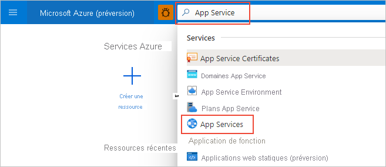

# Démarrage rapide : Créer une application Python en utilisant Azure App Service sur Linux (portail Azure)

Dans ce démarrage rapide, vous déployez une application web Python dans [App Service sur Linux](overview.md#app-service-on-linux), le service d’hébergement web hautement scalable et autocorrectif d’Azure. Vous utilisez le portail Azure pour déployer un exemple avec les frameworks Flask ou Django. L'application web que vous configurez utilise un niveau App Service de base peu coûteux dans le cadre de votre abonnement Azure.

## Configurer les comptes

- Si vous n'avez pas encore de compte Azure associé à un abonnement actif, [créez un compte gratuitement](https://azure.microsoft.com/free/?ref=microsoft.com&utm_source=microsoft.com&utm_medium=docs&utm_campaign=visualstudio).

- Si vous n'avez pas de compte GitHub, rendez-vous sur [github.com](https://github.com) pour en créer un. 

## Dupliquer (fork) l'exemple de référentiel GitHub

1. Ouvrez [github.com](https://github.com) et connectez-vous.

1. Accédez à l'un des exemples de référentiels suivants :
    - [Flask Hello World](https://github.com/Azure-Samples/python-docs-hello-world)
    - [Django Hello World](https://github.com/Azure-Samples/python-docs-hello-django)

1. En haut à droite de la page GitHub, sélectionnez **Dupliquer (fork)** pour effectuer une copie du référentiel sur votre compte GitHub :

    

    Azure exige que vous ayez accès à l'organisation GitHub qui contient le référentiel. En dupliquant (fork) l'exemple sur votre propre compte GitHub, vous disposez automatiquement des accès nécessaires et pouvez également apporter des modifications au code.

## Approvisionner l'application web App Service

Une application web App Service correspond au serveur web sur lequel vous déployez votre code.

1. Ouvrez le portail Azure à l'adresse [https://portal.azure.com](https://portal.azure.com) et, si nécessaire, connectez-vous.

1. Sur la barre de recherche située en haut du portail Azure, entrez « App Service », puis sélectionnez **App Services**.

    

1. Sur la page **App Services**, sélectionnez «  **+ Ajouter** :

    

1. Sur la page **Créer une application web**, procédez comme suit :
    
    | Champ | Action |
    | --- | --- |
    | Abonnement | Sélectionnez l’abonnement Azure à utiliser. |
    | Groupe de ressources | Sélectionnez **Créer** dans la liste déroulante. Dans la fenêtre contextuelle, entrez « AppService-PythonQuickstart » et sélectionnez **OK**. |
    | Nom | Entrez un nom unique pour l'ensemble d'Azure. Généralement, il s'agit d'une combinaison de votre nom personnel ou de celui de votre entreprise, par exemple *contoso-testapp-123*. |
    | Publish | Sélectionnez **Code**. |
    | Pile d’exécution | Sélectionnez **Python 3.8**. |
    | Système d’exploitation | Sélectionnez **Linux** (Python n'est pris en charge que sur Linux). |
    | Région | Sélectionnez une région proche de chez vous. |
    | Plan Linux | Sélectionnez un plan App Service existant ou créez-en un à l'aide de l'option **Créer**. Nous vous recommandons d'utiliser le plan **De base B1**. |

    

1. En bas de la page, sélectionnez **Examiner et créer**, passez en revue les détails, puis sélectionnez **Créer**.

1. Une fois l'approvisionnement terminé, sélectionnez **Accéder à la ressource** pour accéder à la page de la nouvelle instance d'App Service. À ce stade, votre application web ne contient qu'une page par défaut. L'étape suivante consiste donc à déployer un exemple de code.

Vous rencontrez des problèmes ? [Faites-le nous savoir](https://aka.ms/FlaskPortalQuickstartHelp).

## Déployer l'exemple de code

1. Sur le portail Azure, accédez à la page de l'application web et sélectionnez **Centre de déploiement** :
    
    

1. Sur la page **Centre de déploiement**, sélectionnez l'onglet **Paramètres**, s'il n'est pas déjà ouvert :

    

1. Sous **Source**, sélectionnez **GitHub**, puis dans le formulaire **GitHub** qui s'affiche, procédez comme suit :

    | Champ | Action |
    | --- | --- |
    | Connecté comme | Si vous n'êtes pas encore connecté à GitHub, connectez-vous ou, si nécessaire, sélectionnez **Changer de compte*. |
    | Organisation | Sélectionnez votre organisation GitHub, si nécessaire. |
    | Référentiel | Sélectionnez le nom de l'exemple de référentiel que vous avez dupliqué (fork) précédemment, à savoir **python-docs-hello-world** (Flask) ou **python-docs-hello-django** (Django). |
    | Branche | Sélectionnez **principal**. |

    

1. En haut de la page, sélectionnez **Enregistrer** pour appliquer les paramètres :

    

1. Sélectionnez l'onglet **Journaux** pour consulter l'état du déploiement. Quelques minutes sont nécessaires pour créer et déployer l'exemple, et des journaux supplémentaires apparaissent au cours du processus. Au terme de l'opération, les journaux doivent indiquer l'état **Opération réussie (active)**  :

    

Vous rencontrez des problèmes ? [Faites-le nous savoir](https://aka.ms/FlaskPortalQuickstartHelp).

## Accéder à l’application

1. Au terme du déploiement, sélectionnez **Vue d'ensemble** dans le menu de gauche pour revenir à la page principale de l'application web.

1. Sélectionnez l'**URL** qui contient l'adresse de l'application web :

    

1. Vérifiez que la sortie de l'application est « Hello, World ! » :

    

Vous rencontrez des problèmes ? Consultez d’abord le [Guide de résolution des problèmes](configure-language-python.md#troubleshooting) ; autrement, [faites-le nous savoir](https://aka.ms/FlaskPortalQuickstartHelp).

## Apporter une modification et redéployer

Étant donné que vous avez connecté App Service à votre référentiel, les modifications que vous validez dans votre référentiel source sont automatiquement déployées dans l'application web.

1. Vous pouvez apporter des modifications directement dans votre référentiel dupliqué (fork) sur GitHub, ou vous pouvez cloner le référentiel localement, y apporter des modifications et les valider, puis envoyer (push) ces modifications à GitHub. Les deux méthodes entraînent une modification du référentiel connecté à App Service.

1. **Dans votre référentiel dupliqué (fork)** , changez le message de l'application en remplaçant « Hello, World ! » par « Hello, Azure ! » comme suit :
    - Flask (exemple python-docs-hello-world) : modifiez la chaîne de texte à la ligne 6 du fichier *application.py*.
    - Django (exemple python-docs-hello-django) : modifiez la chaîne de texte à la ligne 5 du fichier *views.py* dans le dossier *hello*.

1. Validez la modification apportée au référentiel.

    Si vous utilisez un clone local, envoyez (push) également ces modifications à GitHub.

1. Sur le portail Azure de l'application web, revenez au **Centre de déploiement**, sélectionnez l'onglet **Journaux** et notez la nouvelle activité de déploiement qui doit être en cours.

1. Au terme du déploiement, revenez à la page **Vue d'ensemble** de l'application web, ouvrez à nouveau l'URL de l'application web et observez les modifications apportées à l'application :

    

Vous rencontrez des problèmes ? Consultez d’abord le [Guide de résolution des problèmes](configure-language-python.md#troubleshooting) ; autrement, [faites-le nous savoir](https://aka.ms/FlaskCLIQuickstartHelp).

## Nettoyer les ressources

Au cours des étapes précédentes, vous avez créé des ressources Azure dans un groupe de ressources nommé « AppService-PythonQuickstart », qui apparaît sur la page *Vue d'ensemble** de l'application web. Le maintien de l’application en cours d’exécution occasionne des frais récurrents (consultez les [tarifs d’App Service](https://azure.microsoft.com/pricing/details/app-service/linux/)).

Si vous ne pensez pas avoir besoin de ces ressources à l'avenir, sélectionnez le nom du groupe de ressources sur la page **Vue d'ensemble** de l'application web pour accéder à la vue d'ensemble des groupes de ressources. Puis sélectionnez **Supprimer le groupe de ressources** et suivez les invites.

Vous rencontrez des problèmes ? [Faites-le nous savoir](https://aka.ms/FlaskCLIQuickstartHelp).

## Étapes suivantes

> [!div class="nextstepaction"]
> [Tutoriel : Application web Python (Django) avec PostgreSQL](/azure/developer/python/tutorial-python-postgresql-app-portal)

> [!div class="nextstepaction"]
> [Configurer une application Python](configure-language-python.md)

> [!div class="nextstepaction"]
> [Ajouter une connexion utilisateur à une application web Python](../active-directory/develop/quickstart-v2-python-webapp.md)

> [!div class="nextstepaction"]
> [Tutoriel : Exécuter une application Python dans un conteneur personnalisé](tutorial-custom-container.md)
