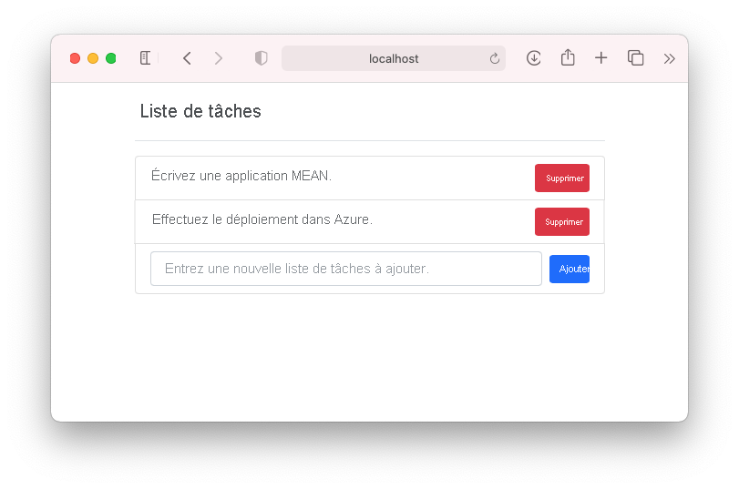
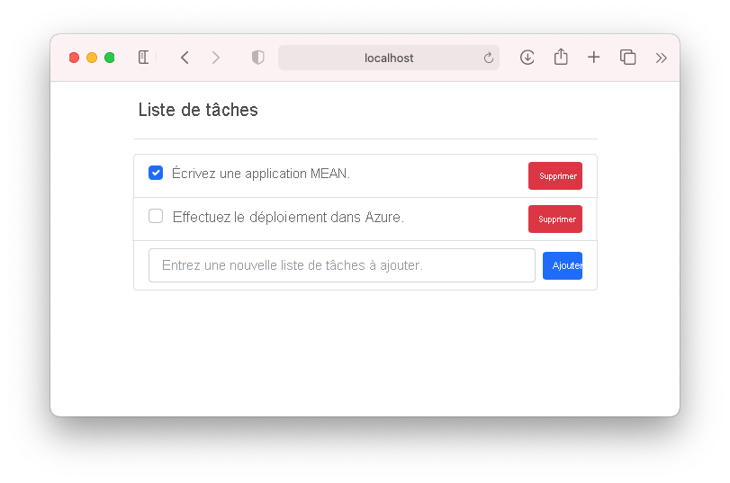
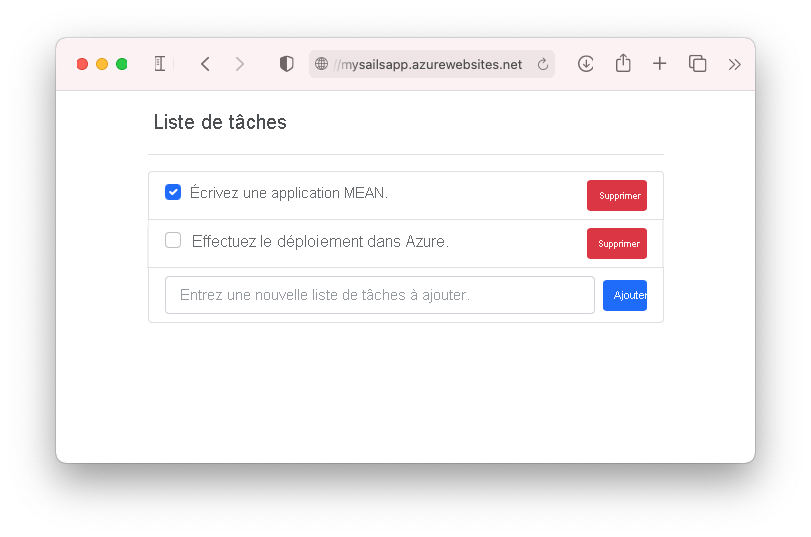

# <a name="tutorial-build-a-nodejs-and-mongodb-app-in-azure"></a>Tutoriel : Créer une application Node.js et MongoDB dans Azure

::: zone pivot="platform-windows"  

[Azure App Service](overview.md) offre un service d’hébergement web hautement évolutif appliquant des mises à jour correctives automatiques. Ce tutoriel montre comment créer une application Node.js dans App Service sur Windows, et la connecter à une base de données MongoDB. Lorsque vous aurez terminé, vous disposerez d’une application MEAN (MongoDB, Express, AngularJS et Node.js) exécutée sous [Azure App Service](overview.md). L’exemple d’application utilise une combinaison de [Sails.js](https://sailsjs.com/) et [Angular 12](https://angular.io/).

::: zone-end

::: zone pivot="platform-linux"


[Azure App Service](overview.md) fournit un service d’hébergement web hautement évolutif et appliquant des mises à jour correctives automatiques en utilisant le système d’exploitation Linux. Ce tutoriel montre comment créer une application Node.js dans App Service sur Linux, la connecter localement à une base de données MongoDB, puis la déployer dans une base de données dans l’API de Azure Cosmos DB pour MongoDB. Quand vous aurez terminé, vous disposerez d’une application MEAN (MongoDB, Express, AngularJS et Node.js) exécutée dans App Service sur Linux. L’exemple d’application utilise une combinaison de [Sails.js](https://sailsjs.com/) et [Angular 12](https://angular.io/).

::: zone-end


Ce que vous allez apprendre :

> [!div class="checklist"]
> * Créer une base de données MongoDB dans Azure
> * Connecter une application Node.js à MongoDB
> * Déploiement de l’application dans Azure
> * Mise à jour du modèle de données et redéploiement de l’application
> * Diffusion des journaux de diagnostic à partir d’Azure
> * Gérer l’application dans le portail Azure

[!INCLUDE [quickstarts-free-trial-note](../../includes/quickstarts-free-trial-note.md)]

## <a name="prerequisites"></a>Prérequis

Pour suivre ce tutoriel :

- [Installez Git](https://git-scm.com/)
- [Installer Node.js et NPM](https://nodejs.org/)
[!INCLUDE [azure-cli-prepare-your-environment-no-header.md](../../includes/azure-cli-prepare-your-environment-no-header.md)] 

## <a name="create-local-nodejs-app"></a>Créer une application Node.js locale

Cette étape consiste à configurer le projet Node.js local.

### <a name="clone-the-sample-application"></a>Clonage de l’exemple d’application

Dans la fenêtre de terminal, `cd` vers un répertoire de travail.  

Exécutez la commande suivante pour cloner l’exemple de référentiel : 

```bash
git clone https://github.com/Azure-Samples/mean-todoapp.git
```

> [!NOTE]
> Pour plus d’informations sur la création de l’exemple d’application, consultez [https://github.com/Azure-Samples/mean-todoapp](https://github.com/Azure-Samples/mean-todoapp).

### <a name="run-the-application"></a>Exécution de l'application

Exécutez la commande suivante pour installer les packages requis et démarrer l’application.

```bash
cd mean-todoapp
npm install
node app.js --alter
```

Lorsque l’application est entièrement chargée, vous obtenez un message similaire à celui-ci :

<pre>
debug: -------------------------------------------------------
debug: :: Fri Jul 09 2021 13:10:34 GMT+0200 (Central European Summer Time)

debug: Environment : development
debug: Port        : 1337
debug: -------------------------------------------------------
</pre>

Dans un navigateur, accédez à `http://localhost:1337`. Ajoutez quelques travaux à faire.

L’exemple d’application MEAN stocke les données utilisateur dans la base de données. Par défaut, une base de données de développement sur disque est utilisée. Si vous pouvez créer et voir des éléments de travail à faire, votre application lit et écrit les données.



Pour arrêter Node.js à tout moment, appuyez sur `Ctrl+C` dans le terminal. 

## <a name="create-production-mongodb"></a>Créer une base de données MongoDB de production

Dans cette étape, vous allez créer une base de données MongoDB dans Azure. Lorsque votre application est déployée sur Azure, elle utilise cette base de données cloud.

Pour MongoDB, ce didacticiel utilise [Azure Cosmos DB](/azure/cosmos-db/). Cosmos DB prend en charge les connexions client MongoDB.

### <a name="create-a-resource-group"></a>Créer un groupe de ressources

[!INCLUDE [Create resource group](../../includes/app-service-web-create-resource-group-no-h.md)] 

### <a name="create-a-cosmos-db-account"></a>Création d’un compte Cosmos DB

> [!NOTE]
> La création de bases de données Azure Cosmos DB dans votre propre abonnement Azure au cours de ce didacticiel peut entraîner un coût. Pour utiliser un compte Azure Cosmos DB gratuit pendant sept jours, vous pouvez utiliser l’expérience [Essayez gratuitement Azure Cosmos DB](https://azure.microsoft.com/try/cosmosdb/). Cliquez simplement sur le bouton **Créer** dans la vignette MongoDB pour créer une base de données MongoDB gratuite sur Azure. Une fois la base de données créée, accédez à la **Chaîne de connexion** dans le portail et récupérez votre chaîne de connexion Azure Cosmos DB que vous utiliserez plus loin dans le didacticiel.
>

Dans Cloud Shell, créez un compte Cosmos DB à l’aide de la commande [`az cosmosdb create`](/cli/azure/cosmosdb#az_cosmosdb_create).

Dans la commande suivante, remplacez l’espace réservé *\<cosmosdb-name>* par un nom unique Cosmos DB. Ce nom est utilisé en tant que point de terminaison Cosmos DB, `https://<cosmosdb-name>.documents.azure.com/`. Pour cette raison, le nom doit être unique sur l’ensemble des comptes Cosmos DB dans Azure. Le nom ne peut contenir que des minuscules, des chiffres, le tiret -) et doit compter entre 3 et 50 caractères.

```azurecli-interactive
az cosmosdb create --name <cosmosdb-name> --resource-group myResourceGroup --kind MongoDB
```

Le paramètre *--kind MongoDB* prend en charge les connexions clientes MongoDB.

Une fois le compte Cosmos DB créé, Azure CLI affiche des informations similaires à celles de l’exemple suivant :

<pre>
{
  "apiProperties": {
    "serverVersion": "3.6"
  },
  "backupPolicy": {
    "periodicModeProperties": {
      "backupIntervalInMinutes": 240,
      "backupRetentionIntervalInHours": 8,
      "backupStorageRedundancy": "Geo"
    },
    "type": "Periodic"
  },
  "capabilities": [
    {
      "name": "EnableMongo"
    }
  ],
  "connectorOffer": null,
  "consistencyPolicy": {
    "defaultConsistencyLevel": "Session",
    "maxIntervalInSeconds": 5,
    "maxStalenessPrefix": 100
  },
  "cors": [],
  "databaseAccountOfferType": "Standard",
  "defaultIdentity": "FirstPartyIdentity",
  "disableKeyBasedMetadataWriteAccess": false,
  "documentEndpoint": "https://&lt;cosmosdb-name&gt;.documents.azure.com:443/",
  ...
  &lt; Output truncated for readability &gt;
}
</pre>

## <a name="connect-app-to-production-mongodb"></a>Connecter l’application à la production MongoDB

Pendant cette étape, vous connectez votre exemple d’application à la base de données Cosmos DB que vous venez de créer, en utilisant une chaîne de connexion MongoDB. 

### <a name="retrieve-the-database-key"></a>Récupérer la clé de la base de données

Pour se connecter à la base de données Cosmos DB, vous avez besoin de la clé de la base de données. Dans Cloud Shell, utilisez la commande [`az cosmosdb keys list`](/cli/azure/cosmosdb#az_cosmosdb_keys_list) pour récupérer la clé primaire.

```azurecli-interactive
az cosmosdb keys list --name <cosmosdb-name> --resource-group myResourceGroup
```

L’interface de ligne de commande Azure montre des informations semblables à ce qui suit :

<pre>
{
  "primaryMasterKey": "RS4CmUwzGRASJPMoc0kiEvdnKmxyRILC9BWisAYh3Hq4zBYKr0XQiSE4pqx3UchBeO4QRCzUt1i7w0rOkitoJw==",
  "primaryReadonlyMasterKey": "HvitsjIYz8TwRmIuPEUAALRwqgKOzJUjW22wPL2U8zoMVhGvregBkBk9LdMTxqBgDETSq7obbwZtdeFY7hElTg==",
  "secondaryMasterKey": "Lu9aeZTiXU4PjuuyGBbvS1N9IRG3oegIrIh95U6VOstf9bJiiIpw3IfwSUgQWSEYM3VeEyrhHJ4rn3Ci0vuFqA==",
  "secondaryReadonlyMasterKey": "LpsCicpVZqHRy7qbMgrzbRKjbYCwCKPQRl0QpgReAOxMcggTvxJFA94fTi0oQ7xtxpftTJcXkjTirQ0pT7QFrQ=="
}
</pre>

Copiez la valeur de `primaryMasterKey`. Vous aurez besoin de ces informations dans l’étape suivante.

<a name="devconfig"></a>
### <a name="configure-the-connection-string-in-your-sample-application"></a>Configurer la chaîne de connexion dans votre exemple d’application

Dans votre référentiel local, dans _config/datastores.js_, remplacez le contenu existant par le code suivant et enregistrez vos modifications.

```javascript
module.exports.datastores = {
  default: {
    adapter: 'sails-mongo',
    url: process.env.MONGODB_URI,
    ssl: true,
  },
};
```

L’option `ssl: true` est requise, car [Cosmos DB nécessite TLS/SSL](../cosmos-db/connect-mongodb-account.md#connection-string-requirements). `url` a la valeur d’une variable d’environnement, que vous allez définir ensuite. 

Dans le terminal, définissez la variable d’environnement `MONGODB_URI`. Veillez à remplacer les deux espaces réservés \<cosmosdb-name> par le nom de votre base de données Cosmos DB, et l’espace réservé \<cosmosdb-key> par la clé que vous avez copiée à l’étape précédente.

```bash
export MONGODB_URI=mongodb://<cosmosdb-name>:<cosmosdb-key>@<cosmosdb-name>.documents.azure.com:10250/todoapp
```

> [!NOTE]
> Cette chaîne de connexion suit le format défini dans la [documentation Sails.js](https://sailsjs.com/documentation/reference/configuration/sails-config-datastores#?the-connection-url).

### <a name="test-the-application-with-mongodb"></a>Tester l’application en activant MongoDB

Dans une fenêtre de terminal local, réexécutez `node app.js --alter`.

```bash
node app.js --alter
```

Accédez à nouveau à `http://localhost:1337`. Si vous pouvez créer et voir des éléments de travail à faire, votre application lit et écrit les données à l’aide de la base de données Cosmos DB dans Azure. 

Dans le terminal, arrêtez Node.js en tapant `Ctrl+C`. 

## <a name="deploy-app-to-azure"></a>Déployer des applications dans Azure

Dans cette étape, vous allez déployer dans Azure App Service votre application Node.js connectée à MongoDB.

### <a name="configure-a-deployment-user"></a>Configuration d’un utilisateur de déploiement

[!INCLUDE [Configure deployment user](../../includes/configure-deployment-user-no-h.md)]

### <a name="create-an-app-service-plan"></a>Créer un plan App Service

::: zone pivot="platform-windows"  

Dans Cloud Shell, créez un plan App Service avec la commande [`az appservice plan create`](/cli/azure/appservice/plan).

L’exemple suivant crée un plan App Service nommé `myAppServicePlan` dans le niveau tarifaire **B1** :

```azurecli-interactive
az appservice plan create --name myAppServicePlan --resource-group myResourceGroup --sku B1
```

Lorsque le plan App Service est créé, l’interface Azure CLI affiche des informations similaires à l’exemple suivant :

<pre>
{ 
  "freeOfferExpirationTime": null,
  "geoRegion": "UK West",
  "hostingEnvironmentProfile": null,
  "hyperV": false,
  "id": "/subscriptions/0000-0000/resourceGroups/myResourceGroup/providers/Microsoft.Web/serverfarms/myAppServicePlan",
  "isSpot": false,
  "isXenon": false,
  "kind": "app",
  "location": "ukwest",
  "maximumElasticWorkerCount": 1,
  "maximumNumberOfWorkers": 0,
  &lt; JSON data removed for brevity. &gt;
} 
</pre>

::: zone-end

::: zone pivot="platform-linux"

Dans Cloud Shell, créez un plan App Service avec la commande [`az appservice plan create`](/cli/azure/appservice/plan).

<!-- [!INCLUDE [app-service-plan](app-service-plan.md)] -->

L’exemple suivant crée un plan App Service nommé `myAppServicePlan` dans le niveau tarifaire **B1** :

```azurecli-interactive
az appservice plan create --name myAppServicePlan --resource-group myResourceGroup --sku B1 --is-linux
```

Lorsque le plan App Service est créé, l’interface Azure CLI affiche des informations similaires à l’exemple suivant :

<pre>
{ 
  "freeOfferExpirationTime": null,
  "geoRegion": "West Europe",
  "hostingEnvironmentProfile": null,
  "id": "/subscriptions/0000-0000/resourceGroups/myResourceGroup/providers/Microsoft.Web/serverfarms/myAppServicePlan",
  "kind": "linux",
  "location": "West Europe",
  "maximumNumberOfWorkers": 1,
  "name": "myAppServicePlan",
  &lt; JSON data removed for brevity. &gt;
  "targetWorkerSizeId": 0,
  "type": "Microsoft.Web/serverfarms",
  "workerTierName": null
} 
</pre>

::: zone-end

<a name="create"></a>
### <a name="create-a-web-app"></a>Créer une application web

::: zone pivot="platform-windows"  

[!INCLUDE [Create web app](../../includes/app-service-web-create-web-app-nodejs-no-h.md)] 

::: zone-end

::: zone pivot="platform-linux"

[!INCLUDE [Create web app](../../includes/app-service-web-create-web-app-nodejs-linux-no-h.md)] 

::: zone-end

### <a name="configure-an-environment-variable"></a>Configurer une variable d’environnement

N’oubliez pas que l’exemple d’application est déjà configuré pour utiliser la variable d’environnement `MONGODB_URI` dans `config/datastores.js`. Dans App Service, vous injectez cette variable à l’aide d’un [paramètre d’application](configure-common.md#configure-app-settings). 

Pour définir les paramètres de l’application, utilisez la commande [`az webapp config appsettings set`](/cli/azure/webapp/config/appsettings#az_webapp_config_appsettings_set) dans Cloud Shell. 

L’exemple suivant configure un paramètre d’application `MONGODB_URI` dans votre application Azure. Remplacez les valeurs des espaces réservés *\<app-name>* , *\<cosmosdb-name>* et *\<cosmosdb-key>* .

```azurecli-interactive
az webapp config appsettings set --name <app-name> --resource-group myResourceGroup --settings MONGODB_URI='mongodb://<cosmosdb-name>:<cosmosdb-key>@<cosmosdb-name>.documents.azure.com:10250/todoapp' DEPLOYMENT_BRANCH='main'
```

> [!NOTE]
> `DEPLOYMENT_BRANCH` est un paramètre d’application spécial qui indique au moteur de déploiement la branche Git dans laquelle vous effectuez le déploiement dans App Service.

### <a name="push-to-azure-from-git"></a>Effectuer une transmission de type push vers Azure à partir de Git

[!INCLUDE [app-service-plan-no-h](../../includes/app-service-web-git-push-to-azure-no-h.md)]

::: zone pivot="platform-windows"

<pre>
Enumerating objects: 5, done.
Counting objects: 100% (5/5), done.
Delta compression using up to 8 threads
Compressing objects: 100% (3/3), done.
Writing objects: 100% (3/3), 318 bytes | 318.00 KiB/s, done.
Total 3 (delta 2), reused 0 (delta 0), pack-reused 0
remote: Updating branch 'main'.
remote: Updating submodules.
remote: Preparing deployment for commit id '4eb0ca7190'.
remote: Generating deployment script.
remote: Running deployment command...
remote: Handling node.js deployment.
remote: Creating app_offline.htm
remote: KuduSync.NET from: 'D:\home\site\repository' to: 'D:\home\site\wwwroot'
remote: Copying file: 'package.json'
remote: Deleting app_offline.htm
remote: Looking for app.js/server.js under site root.
remote: Using start-up script app.js
remote: Generated web.config.
.
.
.
remote: Deployment successful.
To https://&lt;app-name&gt;.scm.azurewebsites.net/&lt;app-name&gt;.git
 * [new branch]      main -> main
</pre>

> [!TIP]
> Lors du déploiement Git, le moteur de déploiement exécute `npm install --production` dans le cadre de son automatisation de la génération.
>
> - Comme défini dans `package.json`, le script `postinstall` est récupéré par `npm install` et exécute `ng build` pour générer les fichiers de production pour Angular et les déployer dans le dossier [assets](https://sailsjs.com/documentation/concepts/assets).
> - `scripts` dans `package.json` peut utiliser les outils installés dans `node_modules/.bin`. Étant donné que `npm install` a aussi installé `node_modules/.bin/ng`, vous pouvez l’utiliser pour déployer vos fichiers de client Angular. Ce comportement de npm est exactement le même dans Azure App Service.
> Les packages sous `devDependencies` dans `package.json` ne sont pas installés. Les packages dont vous avez besoin dans l’environnement de production doivent être déplacés sous `dependencies`.
>
> Si votre application doit ignorer l’automatisation par défaut et exécuter une automatisation personnalisée, consultez [Exécuter Grunt/Bower/Gulp](configure-language-nodejs.md#run-gruntbowergulp).

::: zone-end

::: zone pivot="platform-linux"

<pre>
Enumerating objects: 5, done.
Counting objects: 100% (5/5), done.
Delta compression using up to 8 threads
Compressing objects: 100% (3/3), done.
Writing objects: 100% (3/3), 347 bytes | 347.00 KiB/s, done.
Total 3 (delta 2), reused 0 (delta 0), pack-reused 0
remote: Deploy Async
remote: Updating branch 'main'.
remote: Updating submodules.
remote: Preparing deployment for commit id 'f776be774a'.
remote: Repository path is /home/site/repository
remote: Running oryx build...
remote: Operation performed by Microsoft Oryx, https://github.com/Microsoft/Oryx
remote: You can report issues at https://github.com/Microsoft/Oryx/issues
remote: 
remote: Oryx Version: 0.2.20210420.1, Commit: 85c6e9278aae3980b86cb1d520aaad532c814ed7, ReleaseTagName: 20210420.1
remote: 
remote: Build Operation ID: |qwejn9R4StI=.5e8a3529_
remote: Repository Commit : f776be774a3ea8abc48e5ee2b5132c037a636f73
.
.
.
remote: Deployment successful.
remote: Deployment Logs : 'https://&lt;app-name&gt;.scm.azurewebsites.net/newui/jsonviewer?view_url=/api/deployments/a6fcf811136739f145e0de3be82ff195bca7a68b/log'
To https://&lt;app-name&gt;.scm.azurewebsites.net/&lt;app-name&gt;.git
   4f7e3ac..a6fcf81  main -> main
</pre>

> [!TIP]
> Lors du déploiement Git, le moteur de déploiement exécute `npm install` dans le cadre de son automatisation de la génération.
>
> - Comme défini dans `package.json`, le script `postinstall` est récupéré par `npm install` et exécute `ng build` pour générer les fichiers de production pour Angular et les déployer dans le dossier [assets](https://sailsjs.com/documentation/concepts/assets).
> - `scripts` dans `package.json` peut utiliser les outils installés dans `node_modules/.bin`. Étant donné que `npm install` a aussi installé `node_modules/.bin/ng`, vous pouvez l’utiliser pour déployer vos fichiers de client Angular. Ce comportement de npm est exactement le même dans Azure App Service.
> Lorsque l’automatisation de la génération est terminée, l’intégralité du dépôt est copiée dans le dossier `/home/site/wwwroot` où votre application est hébergée.
>
> Si votre application doit ignorer l’automatisation par défaut et exécuter une automatisation personnalisée, consultez [Exécuter Grunt/Bower/Gulp](configure-language-nodejs.md#run-gruntbowergulp).

::: zone-end

### <a name="browse-to-the-azure-app"></a>Accéder à l’application Azure 

Accédez à l’application déployée à l’aide de votre navigateur web. 

```bash 
https://<app-name>.azurewebsites.net 
``` 

Si vous pouvez créer et voir des éléments de travail à faire dans le navigateur, votre exemple d’application dans Azure dispose d’une connectivité à la base de données MongoDB (Cosmos DB). 


**Félicitations !** Vous exécutez une application Node.js orientée données dans Azure App Service.

## <a name="update-data-model-and-redeploy"></a>Mettre à jour le modèle de données et redéployer

Dans cette étape, vous allez changer le modèle de données `Todo` et publier vos modifications dans Azure.

### <a name="update-the-server-side-model"></a>Mettre à jour le modèle côté serveur

Dans Sails.js, la modification du modèle côté serveur et du code d’API est aussi simple que la modification du modèle de données, car [Sails.js définit déjà les itinéraires courants](https://sailsjs.com/documentation/concepts/blueprints/blueprint-routes#?restful-routes) pour un modèle par défaut. 

Dans votre référentiel local, ouvrez _api/models/Todo.js_ et ajoutez un attribut `done`. Lorsque vous aurez terminé, votre code de schéma doit ressembler à ceci :

```javascript
module.exports = {

  attributes: {
    value: {type: 'string'},
    done: {type: 'boolean', defaultsTo: false}
  },

};
```

### <a name="update-the-client-code"></a>Mettre à jour le code client

Vous devez modifier trois fichiers : le modèle client, le modèle HTML et le fichier composant. 

Ouvrez _client/src/app/todo.ts_ et ajoutez une propriété `done`. Lorsque vous avez terminé, votre manifest ressemble à ceci :

```typescript
export class Todo {
    id!: String;
    value!: String;
    done!: Boolean;
}
```

Ouvrez _client/src/app/app.component.html_. Juste au-dessus de l’unique élément `<span>`, ajoutez le code suivant pour ajouter une case à cocher au début de chaque élément de travail à faire :

```html
<input class="form-check-input me-2" type="checkbox" [checked]="todo.done" (click)="toggleDone(todo.id, i)" [disabled]="isProcessing">
```

Ouvrez _client/src/app/app.component.ts_. Juste au-dessus de la dernière accolade fermante (`}`), insérez la méthode suivante. Elle est appelée par le modèle de code ci-dessus lorsque l’utilisateur clique sur la case à cocher et met à jour les données côté serveur.

```typescript
toggleDone(id:any, i:any) {
  console.log("Toggled checkbox for " + id);
  this.isProcessing = true;
  this.Todos[i].done = !this.Todos[i].done;
  this.restService.updateTodo(id, this.Todos[i])
  .subscribe((res) => {
      console.log('Data updated successfully!');
      this.isProcessing = false;
    }, (err) => {
      console.log(err);
      this.Todos[i].done = !this.Todos[i].done;
  });
}
```

### <a name="test-your-changes-locally"></a>Tester vos modifications en local

Dans la fenêtre de terminal local, compilez le code client Angular mis à jour avec le script de génération défini dans `package.json`.

```bash
npm run build
```

Testez à nouveau vos modifications avec `node app.js --alter`. Étant donné que vous avez modifié votre modèle côté serveur, l’indicateur `--alter` permet à `Sails.js` de modifier la structure de données dans votre base de données Cosmos DB.

```bash
node app.js --alter
```

Accédez à `http://localhost:1337`. Vous devriez maintenant voir une case à cocher devant un élément de travail à faire. Lorsque vous activez ou désactivez une case à cocher, la base de données Cosmos DB dans Azure est mise à jour pour indiquer que l’élément de travail à faire est terminé.



Dans le terminal, arrêtez Node.js en tapant `Ctrl+C`. 

### <a name="publish-changes-to-azure"></a>Publier les modifications dans Azure

Dans la fenêtre du terminal local, validez vos modifications dans Git, puis envoyez les modifications de code à Azure.

```bash
git commit -am "added done field"
git push azure main
```

Une fois le `git push` terminé, accédez à votre application Azure et testez la nouvelle fonctionnalité.



Si vous avez ajouté des articles précédemment, vous pouvez toujours les visualiser. Les données existantes dans votre Cosmos DB ne sont pas perdues. De plus, les mises à jour que vous appliquez au schéma de données n’affectent pas vos données existantes.

## <a name="stream-diagnostic-logs"></a>Diffuser les journaux de diagnostic 

::: zone pivot="platform-windows"  

Pendant l’exécution de votre application Node.js dans Azure App Service, vous pouvez acheminer les journaux d’activité de la console vers votre terminal. De cette façon, vous pouvez obtenir les mêmes messages de diagnostic pour vous aider à déboguer les erreurs d’application.

Pour démarrer la diffusion de journaux, utilisez la commande [`az webapp log tail`](/cli/azure/webapp/log#az_webapp_log_tail) dans Cloud Shell.

```azurecli-interactive
az webapp log tail --name <app-name> --resource-group myResourceGroup
``` 

Une fois que la diffusion a démarré, actualisez votre application Azure dans le navigateur pour générer un trafic web. Vous voyez maintenant les journaux d’activité de la console acheminés vers votre terminal.

Pour arrêter la diffusion de journaux à tout moment, tapez `Ctrl+C`. 

::: zone-end

::: zone pivot="platform-linux"

[!INCLUDE [Access diagnostic logs](../../includes/app-service-web-logs-access-no-h.md)]

::: zone-end

## <a name="manage-your-azure-app"></a>Gérer votre application Azure

Accédez au [Portail Azure](https://portal.azure.com) pour voir l’application que vous avez créée.

Dans le menu de gauche, cliquez sur **App Services**, puis sur le nom de votre application Azure.


Par défaut, le portail affiche la page **Vue d’ensemble** de votre application. Cette page propose un aperçu de votre application. Ici, vous pouvez également effectuer des tâches de gestion de base (parcourir, arrêter, démarrer, redémarrer et supprimer des éléments, par exemple). Les onglets sur le côté gauche de la page affichent les différentes pages de configuration que vous pouvez ouvrir.


[!INCLUDE [cli-samples-clean-up](../../includes/cli-samples-clean-up.md)]

<a name="next"></a>
## <a name="next-steps"></a>Étapes suivantes

Vous avez appris à effectuer les opérations suivantes :

> [!div class="checklist"]
> * Créer une base de données MongoDB dans Azure
> * Connecter une application Node.js à MongoDB
> * Déploiement de l’application dans Azure
> * Mise à jour du modèle de données et redéploiement de l’application
> * Diffuser des journaux d’activité à partir d’Azure vers votre terminal
> * Gérer l’application dans le portail Azure

Passez au didacticiel suivant pour découvrir comment mapper un nom DNS personnalisé à l’application.

> [!div class="nextstepaction"] 
> [Mapper un nom DNS personnalisé existant à Azure App Service](app-service-web-tutorial-custom-domain.md)

Ou consultez les autres ressources :

> [!div class="nextstepaction"]
> [Configurer une application Node.js](configure-language-nodejs.md)
