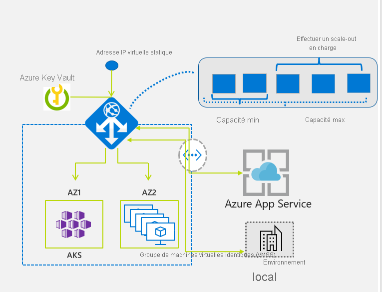

# Application Gateway v2 avec mise à l’échelle automatique et redondance interzone 

Application Gateway et le pare-feu d'applications web (WAF) sont également disponibles sous une référence SKU Standard_v2 et WAF_v2. La référence SKU v2 offre des performances améliorées et prend en charge de nouvelles fonctionnalités critiques telles que la mise à l’échelle automatique, la redondance de zone et la prise en charge d'adresses IP virtuelles statiques. Les fonctionnalités existantes sous la référence SKU Standard et WAF continuent à être prises en charge dans la nouvelle référence SKU v2, à quelques exceptions près que vous trouverez dans la section relative aux [comparaisons](#differences-with-v1-sku).

La nouvelle référence SKU v2 inclut les améliorations suivantes :

- **Mise à l’échelle automatique** : les déploiements d’Application Gateway ou du WAF sous la référence SKU de la mise à l’échelle automatique peuvent augmenter ou diminuer en fonction de l’évolution des modèles de charge du trafic. La mise à l’échelle automatique vous évite aussi d’avoir à choisir une taille de déploiement ou un nombre d’instances au moment du provisionnement. Cette référence SKU offre une véritable élasticité. Dans la référence SKU Standard_v2 et WAF_v2, Application Gateway peut fonctionner à la fois en mode de capacité fixe (mise à l’échelle automatique désactivée) et de mise à l’échelle automatique. Le mode de capacité fixe est utile pour les scénarios avec des charges de travail cohérentes et prévisibles. Le mode de mise à l’échelle automatique est utile dans les applications qui connaissent un trafic variable.
- **Redondance de zone** : un déploiement d’Application Gateway ou de WAF peut désormais couvrir plusieurs zones de disponibilité, ce qui évite d’avoir à approvisionner plusieurs instances d’Application Gateway dans chaque zone à l’aide d’une instance Traffic Manager. Vous pouvez choisir une ou plusieurs zones où les instances d’Application Gateway sont déployées, ce qui renforce la résilience en cas d’échec de la zone. Le pool principal pour les applications peut être distribué de la même façon entre les différentes zones de disponibilité.

  La redondance de zone est uniquement disponible dans les régions où les zones Azure sont disponibles. Dans les autres régions, toutes les autres fonctionnalités sont prises en charge. Pour plus d’informations, consultez [Que sont les zones de disponibilité dans Azure ?](../availability-zones/az-overview.md#services-support-by-region).
- **Adresse IP virtuelle statique** : la référence SKU Application Gateway v2 prend exclusivement en charge le type d’adresse IP virtuelle statique. Ainsi, l’adresse IP virtuelle associée à Application Gateway ne change pas pendant toute la durée de vie du déploiement, même après un redémarrage.  Il n'existe pas d'adresse IP virtuelle statique dans v1, et vous devez donc utiliser l’URL Application Gateway plutôt que l’adresse IP pour router le nom de domaine vers App Services via Application Gateway.
- **Réécriture d’en-tête** : Application Gateway vous permet d'ajouter, de supprimer ou de mettre à jour les en-têtes de requête et de réponse HTTP avec la référence SKU v2. Pour plus d’informations, consultez [Réécrire des en-têtes HTTP avec Application Gateway](rewrite-http-headers.md).
- **Intégration dans Key Vault** : Application Gateway v2 prend en charge l'intégration dans Key Vault des certificats de serveur associés à des écouteurs HTTPS. Pour plus d'informations, consultez [Arrêt de SSL avec des certificats Key Vault](key-vault-certs.md).
- **Contrôleur d'entrée Azure Kubernetes Service** : Le contrôleur d’entrée Application Gateway v2 permet l'utilisation d'Azure Application Gateway en tant qu'entrée pour un service Azure Kubernetes Service (AKS) appelé Cluster AKS. Pour plus d'informations, consultez [Présentation des contrôleurs d'entrée Application Gateway](ingress-controller-overview.md).
- **Amélioration des performances** : la référence SKU v2 offre jusqu’à 5 fois plus de déchargement SSL que la référence SKU Standard/WAF.
- **Déploiement et mise à jour plus rapides** La référence SKU v2 permet un déploiement et une mise à jour plus rapides que la référence SKU Standard/WAF. Elle inclut également des modifications de configuration WAF.

## Régions prises en charge

La référence SKU Standard_v2 et WAF_v2 est disponible dans les régions suivantes : USA Centre Nord, USA Centre Sud, USA Ouest, USA Ouest 2, USA Est, USA Est 2, USA Centre, Europe Nord, Europe Ouest, Asie Sud-Est, France Centre, Royaume-Uni Ouest, Japon Est, Japon Ouest, Australie Est, Australie Sud-Est, Brésil Sud, Canada Centre, Canada Est, Asie Est, Corée Centre, Corée Sud, Royaume-Uni Sud, Inde Centre, Inde Ouest, Inde Sud.

## Tarifs

Avec la référence SKU v2, le modèle de tarification est basé sur la consommation et n’est plus lié au nombre ou à la taille des instances. La tarification de la référence SKU v2 inclut deux composants :

- **Prix fixe** : correspond au prix horaire (ou heure entamée) pour approvisionner une passerelle Standard_v2 ou WAF_v2. Notez que l’option 0 instance minimale supplémentaire garantit quand même une haute disponibilité du service, ce qui est toujours inclus avec le prix fixe.
- **Prix des unités de capacité** : correspond à un coût basé sur la consommation qui est facturé en plus du coût fixe. Les frais liés aux unités de capacité sont également calculés à l’heure ou partiellement à l’heure. Les unités de capacité incluent 3 dimensions : l’unité Compute, les connexions persistantes et le débit. L’unité Compute est une mesure de la capacité consommée du processeur. Les facteurs affectant l’unité Compute sont les connexions TLS/s, les calculs de réécriture d’URL et le traitement des règles WAF. Une connexion permanente est une mesure de connexions TCP établies vers la passerelle d’application à un intervalle de facturation donné. Le débit correspond à la moyenne des mégabits/s traités par le système à un intervalle de facturation donné.  La facturation est effectuée à un niveau d’unité de capacité pour tout ce qui se trouve au-dessus du nombre d’instances réservées.

Chaque unité de capacité est composée au maximum de ce qui suit : 1 unité Compute, 2 500 connexions permanentes ou 2,22 Mbits/s de débit.

Aide relative aux unités de calcul :

- **Standard_v2** - Chaque unité Compute permet environ 50 connexions par seconde avec un certificat TLS de clé RSA de 2048 bits.
- **WAF_v2** - Chaque unité Compute peut prendre en charge environ 10 requêtes simultanées par seconde pour une combinaison de trafic de 70-30 % avec 70 % des demandes inférieures à 2 Ko GET/POST et restant plus élevées. Actuellement, le niveau de performance WAF n’est pas affecté par la taille de la réponse.

> [!NOTE]
> Chaque instance peut prendre en charge environ 10 unités de capacité.
> Le nombre de requêtes qu'une unité Compute peut gérer dépend de différents critères parmi lesquels, la taille de clé du certificat TLS, l'algorithme d’échange de clés, les réécritures d’en-têtes et la taille de la requête entrante WAF, le cas échéant. Nous vous recommandons de procéder à des tests d’application pour déterminer le taux de requêtes par unité Compute. L'unité de capacité et l'unité Compute sont disponibles sous forme de métrique avant le début de la facturation.

Le tableau suivant montre des exemples de prix proposés à des fins d'illustration uniquement.

**Tarification - USA Est** :

|              Nom de la référence SKU                             | Prix fixe ($/h)  | Prix unitaire de la capacité ($/CU-h)   |
| ------------------------------------------------- | ------------------- | ------------------------------- |
| Standard_v2                                       |    0.20             | 0,0080                          |
| WAF_v2                                            |    0,36             | 0,0144                          |

Pour plus d’informations concernant la tarification, consultez la [page de tarification](https://azure.microsoft.com/pricing/details/application-gateway/). 

**Exemple 1**

Une passerelle Application Gateway Standard_v2 est approvisionnée sans mise à l’échelle automatique en mode de mise à l'échelle manuel, avec capacité fixe de cinq instances.

Prix fixe = 744 (heures) * 0,20 $ = 148,8 $  
Unités de capacité = 744 (heures) * 10 unités de capacité par instance * 5 instances * 0,008 $ par heure d’unité de capacité = 297,6 $

Prix total = 148,8 $ + 297,6 $ = 446,4 $

**Exemple 2**

Une passerelle Application Gateway Standard_v2 est provisionnée pour un mois, avec un nombre minimal d’instances égal à zéro, et reçoit 25 nouvelles connexions SSL/s, avec une moyenne de transfert de données de 8,88 Mbits/s. En supposant que les connexions présentent une durée limitée, votre prix serait le suivant :

Prix fixe = 744 (heures) * 0,20 $ = 148,8 $

Prix d'unité de capacité = 744  (heures) * Max (25/50 unités Compute pour les connexions/s, 8,88/2,22 unités de capacité pour le débit) * 0,008 $ = 744 * 4 * 0,008 = 23,81 $

Prix total = 148,8  + 23,81 $ = 172,61 $

Comme vous pouvez le voir, vous êtes uniquement facturé pour quatre unités de capacité, et non pour l’ensemble de l’instance. 

> [!NOTE]
> La fonction Max renvoie la plus grande valeur dans une paire de valeurs.

**Exemple 3**

Une passerelle Application Gateway standard_v2 est provisionnée pour un mois, avec un nombre minimal d’instances égal à cinq. En supposant qu’il n’y a pas de trafic et que les connexions présentent une durée limitée, votre prix serait le suivant :

Prix fixe = 744 (heures) * 0,20 $ = 148,8 $

Prix d’unité de capacité = 744 (heures) * Max (0/50 unités Compute pour les connexions/s, 0/2,22 unités de capacité pour le débit) * 0,008 $ = 744 * 50 * 0,008 = 297,60 $

Prix total = 148,80 $ + 297,60 $ = 446,4 $

Dans ce cas, vous êtes facturé pour l’intégralité des cinq instances, même s’il n’y a pas de trafic.

**Exemple 4**

Une passerelle Application Gateway Standard_v2 est provisionnée pour un mois, avec un nombre minimal d’instances égal à cinq, mais cette fois, il y a une moyenne de transfert de données de 125 Mbits/s et 25 connexions SSL par seconde. En supposant qu’il n’y a pas de trafic et que les connexions présentent une durée limitée, votre prix serait le suivant :

Prix fixe = 744 (heures) * 0,20 $ = 148,8 $

Prix d’unité de capacité = 744  (heures) * Max (25/50 unités Compute pour les connexions/s, 125/2,22 unités de capacité pour le débit) * 0,008 $ = 744 * 57 * 0,008 = 339,26 $

Prix total = 148,80 $ + 339,26 $ = 488,06 $

Dans ce cas, vous êtes facturé pour les cinq instances complètes, plus sept unités de capacité (7/10 d’une instance).  

**Exemple 5**

Une passerelle Application Gateway WAF_v2 est approvisionnée pour un mois. Durant ce laps de temps, elle reçoit 25 nouvelles connexions SSL/s, avec une moyenne de transfert de données de 8,88 Mbits/s et effectue 80 requêtes par seconde. En supposant que les connexions présentent une durée limitée et que le calcul d'unités Compute pour l'application prenne en charge 10 RPS par unité Compute, votre prix serait le suivant :

Prix fixe = 744 (heures) * 0,36 $ = 267,84 $

Prix d'unité de capacité = 744 (heures) * Max (25/50 unités Compute pour les connections/s, 80/10 WAF RPS), 8.88/2.22 les unités de capacité pour le débit * 0,0144 $ = 744 * 8 * 0,0144 = 85,71 $

Prix total = 267,84 $ + 85,71 $ = 353,55 $

> [!NOTE]
> La fonction Max renvoie la plus grande valeur dans une paire de valeurs.

## Mise à l’échelle d'Application Gateway et de WAF v2

Application Gateway et WAF peuvent être configurés pour être mis à l'échelle dans deux modes :

- **Mise à l’échelle automatique** - Lorsque la mise à l’échelle automatique est activée, les références SKU Application Gateway et WAF v2 sont mis à l'échelle (augmentation ou réduction) en fonction des besoins de trafic de l'application. Ce mode offre une meilleure élasticité à votre application et vous évite de devoir estimer la taille d'Application Gateway ou le nombre d'instances. En outre, ce mode vous évite de devoir exécuter des passerelles à la capacité maximale approvisionnée pour une charge de trafic maximale anticipée. Vous devez spécifier un nombre minimal d’instances et éventuellement un nombre maximal d'instances. Moyennant une capacité minimale, Application Gateway et WAF v2 ne descendent pas en dessous du nombre minimal d'instances spécifié, même en l’absence de trafic. Chaque instance compte pour 10 unités de capacité réservées supplémentaires. Zéro signifie aucune capacité réservée, avec une mise à l’échelle purement automatique par nature. Notez que l’option zéro instance minimale supplémentaire garantit quand même une haute disponibilité du service, ce qui est toujours inclus avec le prix fixe. Vous pouvez également spécifier un nombre maximal d’instances pour vous assurer qu'Application Gateway n'effectue pas de mise à l'échelle au-delà du nombre d'instances spécifié. Vous continuez d'être facturé pour la quantité de trafic traité par Application Gateway. Le nombre d’instances peut varier de 0 à 125. Si elle n'est pas spécifiée, la valeur par défaut correspondant au nombre maximal d'instances est de 20.
- **Manuel** - Vous pouvez aussi choisir le mode Manuel, sans mise à l’échelle automatique de la passerelle. Dans ce mode, un trafic supérieur à ce que Application Gateway ou WAF peut gérer est susceptible d'entraîner une perte de trafic. En mode Manuel, vous êtes tenu de spécifier un nombre d'instances. Le nombre d’instances peut varier de 1 à 125.

## Comparaison des fonctionnalités des références SKU v1 et v2

Le tableau suivant répertorie les fonctionnalités disponibles avec chaque référence SKU.

|                                                   | Référence SKU v1   | Référence SKU v2   |
| ------------------------------------------------- | -------- | -------- |
| Mise à l’échelle automatique                                       |          | &#x2713; |
| Redondance de zone                                   |          | &#x2713; |
| Adresse IP virtuelle statique                                        |          | &#x2713; |
| Contrôleur d’entrée Azure Kubernetes Service (AKS) |          | &#x2713; |
| Intégration du coffre de clés Azure                       |          | &#x2713; |
| Réécrire les en-têtes HTTP(S)                           |          | &#x2713; |
| Routage basé sur des URL                                 | &#x2713; | &#x2713; |
| Hébergement de plusieurs sites                             | &#x2713; | &#x2713; |
| Redirection du trafic                               | &#x2713; | &#x2713; |
| Pare-feu d’applications web (WAF)                    | &#x2713; | &#x2713; |
| Règles personnalisées WAF                                  |          | &#x2713; |
| Terminaison SSL (Secure Sockets Layer)            | &#x2713; | &#x2713; |
| Chiffrement SSL de bout en bout                         | &#x2713; | &#x2713; |
| Affinité de session                                  | &#x2713; | &#x2713; |
| Pages d’erreur personnalisées                                | &#x2713; | &#x2713; |
| Prise en charge de WebSocket                                 | &#x2713; | &#x2713; |
| Assistance HTTP/2                                    | &#x2713; | &#x2713; |
| Vidage des connexions                               | &#x2713; | &#x2713; |

> [!NOTE]
> La référence SKU v2 avec mise à l’échelle automatique prend désormais en charge les [sondes d’intégrité par défaut](application-gateway-probe-overview.md#default-health-probe) afin de superviser automatiquement l’intégrité de toutes les ressources dans son pool principal et de mettre en évidence les membres principaux considérés comme non sains. La sonde d’intégrité par défaut est automatiquement configurée pour les serveurs principaux ne disposant d'aucune configuration de sonde personnalisée. Pour plus d’informations, consultez [Sondes d’intégrité dans Application Gateway](application-gateway-probe-overview.md).

## Différences par rapport à la référence SKU v1

|Différence|Détails|
|--|--|
|Certificat d’authentification|Non pris en charge. Pour plus d’informations, consultez [Présentation du chiffrement SSL de bout en bout sur la passerelle Application Gateway](ssl-overview.md#end-to-end-ssl-with-the-v2-sku).|
|Combinaison de Standard_v2 et Standard Application Gateway sur le même sous-réseau|Non pris en charge|
|Itinéraire défini par l’utilisateur sur le sous-réseau d’Application Gateway|Pris en charge (scénarios spécifiques). En préversion.  Pour plus d’informations sur les scénarios pris en charge, voir [Présentation de la configuration d’Application Gateway](configuration-overview.md#user-defined-routes-supported-on-the-application-gateway-subnet).|
|Groupe de sécurité réseau pour plage de ports entrants| - 65 200 à 65 535 pour référence (SKU) Standard_v2 - 65 503 à 65 534 pour référence (SKU) Standard Pour plus d’informations, visitez le [FAQ](application-gateway-faq.md#are-network-security-groups-supported-on-the-application-gateway-subnet).|
|Journaux d’activité de performances dans les diagnostics Azure|Non pris en charge. Les métriques Azure doivent être utilisées.|
|Facturation|Facturation planifiée pour le 1er juillet 2019.|
|Mode FIPS|Ils ne sont pas pris en charge.|
|Mode ILB uniquement|Non pris en charge actuellement. Les modes public et ILB sont pris en charge ensemble.|
|Intégration de Network Watcher|Non pris en charge.|
|Intégration Azure Security Center|Pas encore disponible.

## Effectuer la migration de la version 1 à la version 2

Un script Azure PowerShell est disponible dans la galerie PowerShell pour vous aider à migrer de v1 Application Gateway/WAF vers la référence SKU de mise à l'échelle automatique v2. Ce script vous permet de copier la configuration à partir de votre passerelle v1. La migration de trafic relève toujours de votre responsabilité. Pour plus d’informations, consultez [Migrer Azure Application Gateway de la version v1 vers la version v2](migrate-v1-v2.md).

## Étapes suivantes

- [Démarrage rapide : diriger le trafic web avec Azure Application Gateway - Portail Azure](quick-create-portal.md)
- [Créer une passerelle d’application redondante dans une zone, avec mise à l’échelle automatique et avec une adresse IP virtuelle réservée à l’aide d’Azure PowerShell](tutorial-autoscale-ps.md)
- Découvrez [Application Gateway](overview.md).
- Découvrez le [Pare-feu Azure](../firewall/overview.md).
