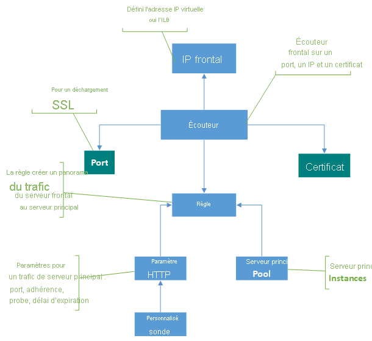

# Composants de passerelle d’application

 Une passerelle d’application représente le seul point de contact des clients. Elle répartit le trafic d’application entrant sur plusieurs pools de back-ends, notamment des machines virtuelles Azure, des groupes de machines virtuelles identiques, Azure App Service ainsi que des serveurs locaux/externes. Pour distribuer le trafic, une passerelle d’application utilise plusieurs composants décrits dans cet article.

## Adresses IP front-end

Une adresse IP front-end est l’adresse IP associée à une passerelle d’application. Vous pouvez configurer une passerelle d’application pour qu’elle ait une adresse IP publique, une adresse IP privée ou les deux. Une passerelle d’application prend en charge une adresse IP publique ou privée. Votre réseau virtuel et votre adresse IP publique doivent se trouver au même emplacement que votre passerelle d’application. Une fois créée, une adresse IP front-end est associée à un écouteur.

### Adresse IP publique statique ou dynamique

La référence (SKU) Azure Application Gateway V2 peut être configurée pour prendre en charge à la fois les adresses IP internes statiques et publiques statiques, ou uniquement les adresses IP publiques statiques. Elle ne peut pas être configurée pour prendre en charge uniquement les adresses IP internes statiques.

La référence SKU V1 peut être configurée pour prendre en charge une adresse IP interne statique ou dynamique et une adresse IP publique dynamique. L’adresse IP dynamique d’Application Gateway ne change pas sur une passerelle en cours d’exécution. Elle peut être modifiée uniquement lorsque vous arrêtez ou démarrez la passerelle. Elle ne change pas lors des défaillances du système, des mises à jour, des changements d’hôte Azure, etc. 

Le nom DNS associé à une passerelle d’application ne change pas au cours du cycle de vie de la passerelle. Vous devez donc utiliser un alias CNAME et le faire pointer vers l’adresse DNS de la passerelle d’application.

## Écouteurs

Un écouteur est une entité logique qui vérifie les requêtes de connexion entrantes. Un écouteur accepte une requête si le protocole, le port, le nom d’hôte et l’adresse IP associés à la requête correspondent à ceux associés à la configuration de l’écouteur.

Avant d’utiliser une passerelle d’application, vous devez ajouter au moins un écouteur. Vous pouvez connecter plusieurs écouteurs à une passerelle d’application, et les utiliser pour le même protocole.

Une fois qu’un écouteur a détecté les requêtes entrantes des clients, la passerelle d’application les route vers les membres du pool de back-ends configuré dans la règle.

Les écouteurs prennent en charge les ports et les protocoles suivants.

### Ports

Un port est le point d’écoute de la requête du client. Vous pouvez configurer des ports dans la plage comprise entre 1 et 65 502 pour la référence SKU v1, et dans la plage comprise entre 1 et 65 199 pour la référence SKU v2.

### Protocoles

Application Gateway prend en charge quatre protocoles : HTTP, HTTPS, HTTP/2 et WebSocket :
>[!NOTE]
>La prise en charge du protocole HTTP/2 est disponible pour les clients se connectant aux écouteurs Application Gateway uniquement. La communication avec les pools de serveurs back-end s’effectue toujours sur HTTP/1.1. Par défaut, la prise en charge du protocole HTTP/2 est désactivée. Vous pouvez choisir de l’activer.

- Spécifiez les protocoles HTTP ou HTTPS dans la configuration de l’écouteur.
- La prise en charge des [protocoles WebSockets et HTTP/2](features.md#websocket-and-http2-traffic) est effectuée de manière native. La [prise en charge de WebSocket](application-gateway-websocket.md) est activée par défaut. Il n’existe aucun paramètre configurable par l’utilisateur permettant d’activer ou de désactiver de manière sélective la prise en charge de WebSocket. Utilisez WebSockets avec les écouteurs HTTP et HTTPS.

Utilisez un écouteur HTTPS pour l’arrêt TLS. Un écouteur HTTPS déplace les tâches de chiffrement et de déchiffrement vers votre passerelle d’application pour que vos serveurs web ne soient pas saturés par la surcharge.

### Pages d’erreur personnalisées

Application Gateway vous permet de créer des pages d’erreur personnalisées qui s’affichent à la place des pages d’erreur par défaut. Vous pouvez utiliser votre marque et votre mise en page personnelle à l’aide d’une page d’erreur personnalisée. Application Gateway affiche une page d’erreur personnalisée quand une requête ne peut pas atteindre le back-end.

Pour plus d’informations, consultez [Pages d’erreur personnalisées pour votre passerelle d’application](custom-error.md).

### Types d’écouteur

Il existe deux types d’écouteur :

- **De base**. Ce type d’écouteur écoute un seul site de domaine, où il a un seul mappage DNS à l’adresse IP de la passerelle d’application. Cette configuration d’écouteur est obligatoire quand vous hébergez un seul site derrière une passerelle d’application.

- **Multisite**. Cette configuration d’écouteur est requise lorsque vous souhaitez configurer le routage en fonction d’un nom d’hôte ou de domaine pour plusieurs applications web sur la même passerelle d’application. Vous pouvez ainsi configurer une topologie plus efficace pour vos déploiements en ajoutant plus de 100 sites web à une même passerelle d’application. Chaque site web peut être dirigé vers son propre pool principal. Par exemple, trois domaines (contoso.com, fabrikam.com et adatum.com) pointent vers l’adresse IP de la passerelle d’application. Vous créez trois [écouteurs multisites](multiple-site-overview.md) et configurez les paramètres de port et de protocole de chaque écouteur. 

    Vous pouvez également définir des noms d’hôtes avec caractères génériques dans un écouteur multisite et jusqu’à cinq noms d’hôtes par écouteur. Pour plus d’informations, consultez [Noms d’hôtes avec caractères génériques dans l’écouteur (préversion)](multiple-site-overview.md#wildcard-host-names-in-listener-preview).

    Pour plus d’informations sur la configuration d’un écouteur multisite, consultez [Hébergement de plusieurs sites dans Application Gateway à l’aide du portail Azure](create-multiple-sites-portal.md).

Après avoir créé un écouteur, vous devez l’associer à une règle de routage de requête. Cette règle détermine la manière dont la requête reçue sur l’écouteur doit être routée vers le back-end. La règle d’acheminement des requêtes contient également le pool principal vers lequel les acheminer et le paramètre HTTP dans lequel le port principal, le protocole, etc. sont mentionnés.

## Règles de routage des requêtes

Une règle de routage de requête est un composant clé pour une passerelle d’application, car elle détermine le mode de routage du trafic sur l’écouteur. La règle lie l’écouteur, le pool de back-ends et les paramètres HTTP back-end.

Quand un écouteur accepte une requête, la règle de routage de requête transfère la requête au back-end ou la redirige ailleurs. Si la requête est transférée au back-end, la règle de routage de requête définit le pool de back-ends à cibler. La règle de routage de requête détermine également si les en-têtes de la requête doivent être réécrits. Vous pouvez attacher un écouteur à une règle.

Il existe deux types de règle de routage des requêtes :

- **De base**. Toutes les requêtes de l’écouteur associé (par exemple blog.contoso.com/*) sont transférées au pool de back-ends associé à l’aide du paramètre HTTP associé.

- **Basé sur le chemin**. Ce type de règle de routage vous permet de router les requêtes de l’écouteur associé vers un pool de back-ends spécifique, en fonction de l’URL de la requête. Si le chemin de l’URL d’une requête correspond au modèle de chemin d’une règle basée sur le chemin, la règle route cette requête. Elle applique le modèle de chemin uniquement au chemin de l’URL. Elle ne l’applique pas à ses paramètres de requête. Si le chemin de l’URL d’une requête d’écouteur ne correspond à aucune des règles basées sur le chemin, elle route la requête vers le pool de back-ends et les paramètres HTTP par défaut.

Pour plus d’informations, consultez [Routage basé sur des URL](url-route-overview.md).

### Prise en charge de la redirection

La règle de routage de requête vous permet également de rediriger le trafic vers la passerelle d’application. Il s’agit d’un mécanisme de redirection générique. Vous pouvez ainsi effectuer une redirection depuis et vers n’importe quel port défini à l’aide de règles.

Vous pouvez choisir si la cible de redirection doit être un autre écouteur (ce qui permet d’activer la redirection automatique de HTTP vers HTTPS) ou un site externe. Vous pouvez également choisir si la redirection doit être temporaire ou permanente, ou si le chemin de l’URI et la chaîne de requête doivent être ajoutés à l’URL redirigée.

Pour plus d’informations, consultez [Rediriger le trafic vers votre passerelle d’application](redirect-overview.md).

### Réécrire les en-têtes et les URL HTTP

En utilisant des règles de réécriture, vous pouvez ajouter, supprimer ou mettre à jour les en-têtes de requête et de réponse HTTP(S) ainsi que les paramètres du chemin URL et de la chaîne de requête lorsque les paquets de requête et de réponse se déplacent entre le client et des pools principaux via la passerelle d’application.

Vous pouvez régler les en-têtes et les paramètres d’URL sur des valeurs statiques ou d’autres en-têtes et variables de serveur. Cela facilite les cas d’usage importants, tels que l’extraction d’adresses IP des clients, la suppression d’informations sensibles relatives au back-end, le renforcement de la sécurité, etc.

Pour plus d’informations, consultez [Réécrire les en-têtes et URL HTTP sur votre passerelle d’application](rewrite-http-headers-url.md).

## Paramètres HTTP

Une passerelle d’application route le trafic vers les back-ends (spécifiés dans la règle de routage de requête incluant les paramètres HTTP) à l’aide du numéro de port, du protocole et d’autres paramètres détaillés dans ce composant.

Le port et le protocole utilisés dans les paramètres HTTP permettent de déterminer si le trafic entre la passerelle d’application et les back-ends est chiffré (chiffrement TLS de bout en bout) ou non chiffré.

Ce composant est également utilisé pour :

- Déterminer si une session utilisateur doit être conservée sur le même serveur à l’aide de l’[affinité de session basée sur les cookies](features.md#session-affinity)

- Supprimer de manière appropriée les membres du pool de back-ends à l’aide du [drainage de connexion](features.md#connection-draining)

- Associer un probe personnalisé pour superviser l’intégrité du back-end, définir le délai d’expiration de la requête, remplacer le nom d’hôte et le chemin dans la requête, et permettre de spécifier en un clic les paramètres du back-end App Service

## Pools de back-ends

Un pool de back-ends route la requête vers les back-ends, qui traitent la requête. Les pools de back-ends peuvent contenir les éléments suivants :

- Cartes réseau
- Groupes identiques de machines virtuelles
- Adresses IP publiques
- Adresses IP internes
- FQDN
- Back-ends multilocataires (par exemple App Service)

Les membres du pool de back-ends Application Gateway ne sont pas liés à un groupe à haute disponibilité. Une passerelle d’application peut communiquer avec des instances extérieures au réseau virtuel dans lequel elle se trouve. Ainsi, les membres des pools de back-ends peuvent se trouver sur des clusters, des centres de données ou en dehors d’Azure, à condition qu’il existe une connectivité IP.

Si vous employez des adresses IP internes en tant que membres de pool de back-ends, vous devez utiliser le [Peering de réseaux virtuels](../virtual-network/virtual-network-peering-overview.md) ou une [passerelle VPN](../vpn-gateway/vpn-gateway-about-vpngateways.md). Le peering de réseaux virtuels est pris en charge et sert à l’équilibrage de charge du trafic des autres réseaux virtuels.

Une passerelle d’application peut également communiquer avec des serveurs locaux quand ils sont connectés par Azure ExpressRoute ou des tunnels VPN, si le trafic est autorisé.

Vous pouvez créer différents pools de back-ends pour différents types de requête. Par exemple, créez un pool de back-ends pour les requêtes générales, puis un autre pool de back-ends pour les requêtes adressées aux microservices de votre application.

## Sondes d’intégrité

Par défaut, une passerelle d’application supervise l’intégrité de toutes les ressources de son pool de back-ends et supprime automatiquement les ressources non saines. Elle supervise ensuite les instances non saines et les rajoute au pool de back-ends sain, une fois qu’elles sont disponibles et qu’elles répondent aux sondes d’intégrité.

En plus d’utiliser la surveillance par sonde d’intégrité par défaut, vous pouvez aussi personnaliser la sonde d’intégrité pour répondre aux exigences de votre application. Les sondes personnalisées permettent un contrôle plus précis de la supervision de l’intégrité. En utilisant des sondes personnalisées, vous pouvez personnaliser le nom d’hôte, le chemin d’URL, l’intervalle d’analyse (probe), le nombre de réponses en échec autorisé avant que l’instance du pool de back-ends soit marquée comme non saine, les codes d’état et la correspondance du corps de la réponse, etc. Nous vous recommandons de configurer des sondes personnalisées pour superviser l’intégrité de chaque pool de back-ends.

Pour plus d’informations, consultez [Superviser l’intégrité de votre passerelle d’application](../application-gateway/application-gateway-probe-overview.md).

## Étapes suivantes

Créer une passerelle Application Gateway :

* [Dans le portail Azure](quick-create-portal.md)
* [Avec Azure PowerShell](quick-create-powershell.md)
* [Avec Azure CLI](quick-create-cli.md)
