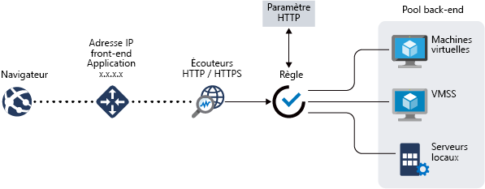

# Fonctionnalités Azure Application Gateway

[Azure Application Gateway](overview.md) est un équilibreur de charge du trafic web qui vous permet de gérer le trafic vers vos applications web.

Application Gateway propose les fonctionnalités suivantes :

- [Terminaison Secure Sockets Layer (SSL/TLS)](#secure-sockets-layer-ssltls-termination)
- [Mise à l’échelle automatique](#autoscaling)
- [Redondance de zone](#zone-redundancy)
- [Adresse IP virtuelle statique](#static-vip)
- [Pare-feu d’applications web](#web-application-firewall)
- [Contrôleur d’entrée pour AKS](#ingress-controller-for-aks)
- [Routage basé sur des URL](#url-based-routing)
- [Hébergement de plusieurs sites](#multiple-site-hosting)
- [Redirection](#redirection)
- [Affinité de session](#session-affinity)
- [Trafic Websocket et HTTP/2](#websocket-and-http2-traffic)
- [Drainage des connexion](#connection-draining)
- [Pages d’erreur personnalisées](#custom-error-pages)
- [Réécrire les en-têtes et les URL HTTP](#rewrite-http-headers-and-url)
- [Dimensionnement](#sizing)

## Terminaison Secure Sockets Layer (SSL/TLS)

Application Gateway prend en charge l’arrêt SSL/TLS au niveau de la passerelle, après lequel le trafic transite généralement de façon non chiffrée vers les serveurs backend. Grâce à cette fonctionnalité, les serveurs web ne sont plus chargés des opérations coûteuses de chiffrement et de déchiffrement. Cependant, une communication non chiffrée vers les serveurs n’est parfois pas une option acceptable. Cela peut être dû à des d’exigences de sécurité et de conformité, ou au fait que l’application accepte uniquement une connexion sécurisée. Pour ces applications, la passerelle Application Gateway prend désormais en charge le chiffrement SSL/TLS de bout en bout.

Pour plus d’informations, consultez [Présentation de la terminaison SSL et du chiffrement SSL de bout en bout sur la passerelle Application Gateway](ssl-overview.md).

## Mise à l’échelle automatique

Application Gateway Standard_v2 prend en charge la mise à l’échelle automatique et peut effectuer des scale-up ou des scale-down en fonction de l’évolution des modèles de charge du trafic. La mise à l’échelle automatique vous évite aussi d’avoir à choisir une taille de déploiement ou un nombre d’instances au moment du provisionnement. 

Pour plus d’informations sur les fonctionnalités d’Application Gateway Standard_v2, consultez [Mise à l’échelle automatique de la référence SKU v2](application-gateway-autoscaling-zone-redundant.md).

## Redondance de zone

Application Gateway Standard_v2 peut englober plusieurs zones de disponibilité, offrant une meilleure résilience d’erreurs et supprimant la nécessité de provisionner des passerelles d’application distinctes dans chaque zone.

## Adresse IP virtuelle statique

Application Gateway de référence SKU Standard_v2 prend exclusivement en charge le type d’adresse IP virtuelle statique. Cela garantit que l’adresse IP virtuelle associée à la passerelle d’application ne change pas même au cours de la durée de vie de la passerelle d’application.

## Pare-feu d’applications web

Le pare-feu d’applications web (WAF) est un service qui permet de centraliser la protection de vos applications web contre les vulnérabilités et les attaques courantes. WAF suit les règles des [ensembles de règles de base OWASP (Open Web Application Security Project)](https://www.owasp.org/index.php/Category:OWASP_ModSecurity_Core_Rule_Set_Project) 3.1 (WAF_v2 uniquement), 3.0 et 2.2.9. 

Les applications Web sont de plus en plus la cible d’attaques malveillantes qui exploitent des vulnérabilités connues. Les types d’attaques les plus courantes sont l’injection de code SQL, les attaques de script site à site, entre autres. Empêcher ces attaques dans le code d’application peut se révéler difficile et nécessiter une maintenance rigoureuse, des mises à jour correctives ainsi que la surveillance au niveau d’un grand nombre de couches de la topologie de l’application. Un pare-feu d’applications web centralisé facilite grandement la gestion de la sécurité et offre une meilleure garantie de protection aux administrateurs de l’application contre les menaces ou les intrusions. Une solution WAF peut également réagir plus rapidement à une menace de sécurité en exécutant la mise à jour corrective d’une vulnérabilité connue dans un emplacement central plutôt que de sécuriser individuellement chacune des applications web. Les passerelles d’application existantes peuvent être facilement converties en une passerelle d’application avec un pare-feu d’applications web.

Pour plus d’informations, consultez [Présentation du pare-feu d’applications web](../web-application-firewall/overview.md).

## Contrôleur d’entrée pour AKS
Le contrôleur d’entrée Application Gateway (AGIC) vous permet d'utiliser Application Gateway en tant qu’entrée pour un cluster [Azure Kubernetes Service (AKS)](https://azure.microsoft.com/services/kubernetes-service/). 

Le contrôleur d’entrée s’exécute en tant que pod au sein du cluster AKS, consomme les [ressources d’entrée Kubernetes ](https://kubernetes.io/docs/concepts/services-networking/ingress/) et les transforme en configuration Application Gateway pour permettre à la passerelle d’équilibrer la charge du trafic vers les pods Kubernetes. Le contrôleur d’entrée prend uniquement en charge les références SKU Application Gateway Standard_v2 et WAF_v2. 

Pour plus d’informations, consultez [Contrôleur d’entrée Azure Application Gateway (AGIC)](ingress-controller-overview.md).

## Routage basé sur des URL

Le routage basé sur le chemin d’accès de l’URL vous permet d’acheminer le trafic vers des pools de serveurs principaux en fonction des chemins d’accès de l’URL de la demande. L’un des scénarios consiste à acheminer les requêtes pour différents types de contenu vers un pool différent.

Par exemple, les requêtes adressées à `http://contoso.com/video/*` sont acheminées vers VideoServerPool et les requêtes adressées à `http://contoso.com/images/*` sont acheminées vers ImageServerPool. DefaultServerPool est sélectionné si aucun des modèles de chemin d’accès ne correspond.

Pour plus d’informations, consultez [Présentation du routage basé sur le chemin de l’URL](url-route-overview.md).

## Hébergement de plusieurs sites

Avec Application Gateway, vous pouvez configurer le routage en fonction d’un nom d’hôte ou de domaine pour plusieurs applications web sur la même passerelle d’application. Vous pouvez ainsi configurer une topologie plus efficace pour vos déploiements en ajoutant plus de 100 sites web à une même passerelle d’application. Chaque site web peut être dirigé vers son propre pool principal. Par exemple, trois domaines (contoso.com, fabrikam.com et adatum.com) pointent vers l’adresse IP de la passerelle d’application. Vous créez trois écouteurs multisites, et vous configurez les paramètres de port et de protocole de chaque écouteur. 

Les requêtes adressées à `http://contoso.com` sont acheminées vers ContosoServerPool, les requêtes adressées à `http://fabrikam.com` sont acheminées vers FabrikamServerPool, et ainsi de suite.

De même, deux sous-domaines du même domaine parent peuvent également être hébergés sur le même déploiement de passerelle d’application. Par exemple, les sous-domaines `http://blog.contoso.com` et `http://app.contoso.com` peuvent être hébergés sur un déploiement de passerelle d’application unique. Pour plus d’informations, consultez [Hébergement de plusieurs sites Application Gateway](multiple-site-overview.md).

Vous pouvez également définir des noms d’hôtes avec caractères génériques dans un écouteur multisite et jusqu’à cinq noms d’hôtes par écouteur. Pour plus d’informations, consultez [Noms d’hôtes comportant des caractères génériques dans l’écouteur (préversion)](multiple-site-overview.md#wildcard-host-names-in-listener-preview).

## Redirection

Un scénario courant pour de nombreuses applications web consiste à prendre en charge la redirection automatique de HTTP vers HTTPS pour vous assurer que toutes les communications entre l’application et ses utilisateurs auront lieu via un chemin d’accès chiffré.

Dans le passé, vous avez peut-être utilisé des techniques telles que la création d’un pool dédié dont le seul objectif consistait à rediriger les requêtes qu’il recevait sur HTTP vers HTTPS. La passerelle d’application permet désormais de rediriger le trafic sur Application Gateway. Cela simplifie la configuration de l’application, optimise l’utilisation des ressources et prend en charge de nouveaux scénarios de redirection, notamment la redirection globale et basée sur le chemin d’accès. La prise en charge de la redirection Application Gateway n’est pas limitée à la seule redirection HTTP vers HTTPS. Il s’agit d’un mécanisme de redirection générique, vous pouvez ainsi rediriger depuis et vers n’importe quel port défini à l’aide de règles. Il prend également en charge la redirection vers un site externe.

La prise en charge de la redirection Application Gateway offre les fonctionnalités suivantes :

- Redirection globale à partir d’un port vers un autre port sur la passerelle. Cela permet la redirection HTTP vers HTTPS sur un site.
- Redirection basée sur un chemin d’accès. Ce type de redirection permet la redirection HTTP vers HTTPS uniquement sur une zone de site spécifique, par exemple une zone de panier d’achat indiquée par `/cart/*`.
- Procédez à la redirection vers un site externe.

Pour plus d’informations, consultez [Vue d’ensemble de la redirection Application Gateway](redirect-overview.md).

## Affinité de session

La fonctionnalité d’affinité de session basée sur les cookies est utile lorsque vous souhaitez conserver une session utilisateur sur le même serveur. En utilisant des cookies gérés de passerelle, la passerelle Application Gateway peut diriger le trafic pour traitement à partir d’une session utilisateur vers le même serveur. Ceci est important lorsque l’état de la session est enregistré localement sur le serveur pour une session utilisateur.

Pour plus d’informations, consultez [Fonctionnement d’une passerelle d’application](how-application-gateway-works.md#modifications-to-the-request).

## Trafic WebSocket et HTTP/2

Application Gateway prend en charge les protocoles WebSocket et HTTP/2 de manière native. Il n’existe aucun paramètre configurable par l’utilisateur permettant d’activer ou de désactiver de manière sélective la prise en charge de WebSocket.

Les protocoles WebSocket et HTTP/2 permettent une communication en duplex intégral entre le serveur et le client via une connexion TCP de longue durée. Cela assure une communication plus interactive entre le serveur web et le client, qui peut être bidirectionnelle sans nécessiter d’interrogations, comme c’est le cas pour les implémentations basées sur le protocole HTTP. Ces protocoles engendrent une faible surcharge, contrairement à HTTP, et peuvent réutiliser la même connexion TCP pour plusieurs requêtes/réponses, ce qui entraîne une utilisation plus efficace des ressources. Ces protocoles sont conçus pour fonctionner sur les ports HTTP traditionnels (80 et 443).

Pour plus d’informations, consultez [Prise en charge de WebSocket](application-gateway-websocket.md) et [Prise en charge de HTTP/2](configuration-listeners.md#http2-support).

## Vidage des connexions

Le vidage des connexions permet d’éliminer délicatement les membres du pool principal lors des mises à jour planifiées de maintenance. Ce paramètre est activé via le paramètre du http principal et peut s’appliquer à tous les membres d’un pool principal pendant la création de règles. Une fois activée, Application Gateway s’assure que toutes les instances de désinscription d’un pool back-end ne reçoivent aucune nouvelle requête tout en permettant aux requêtes existantes de se terminer dans un délai défini. Cela s’applique à la fois aux instances back-end explicitement supprimées du pool back-end par une modification de configuration utilisateur et aux instances backend signalées comme n’étant pas saines d’après les résultats des sondes d’intégrité. La seule exception concerne les demandes liées à la désinscription des instances, qui ont été désinscrites explicitement, en raison d’une affinité de session gérée par la passerelle et qui continuent d’être transmises par proxy aux instances de désinscription.

Pour plus d’informations, consultez [Présentation de la configuration d’Application Gateway](configuration-http-settings.md#connection-draining).

## Pages d’erreur personnalisées

Application Gateway vous permet de créer des pages d’erreur personnalisées au lieu d’afficher les pages d’erreur par défaut. Vous pouvez utiliser votre marque et votre mise en page personnelle à l’aide d’une page d’erreur personnalisée.

Pour plus d’informations, voir [Erreurs personnalisées](custom-error.md).

## Réécrire les en-têtes et les URL HTTP

Les en-têtes HTTP permettent au client et au serveur de passer des informations supplémentaires dans la requête ou la réponse. La réécriture de ces en-têtes HTTP vous permet d’accomplir plusieurs tâches importantes, comme :

- L’ajout de champs d’en-tête liés à la sécurité comme HSTS/ X-XSS-Protection
- La suppression de champs d’en-tête de réponse qui peuvent comprendre des informations sensibles
- La suppression des informations de port dans les en-têtes X-Forwarded-For

Application Gateway et la référence SKU WAF v2permettent d’ajouter, de supprimer et de mettre à jour les en-têtes de requête et de réponse HTTP pendant le déplacement des paquets de requête et de réponse entre les pools de clients et de back-ends. Vous pouvez également réécrire des URL, des paramètres de chaîne de requête et un nom d’hôte. Avec la réécriture d’URL et le routage d’URL basé sur le chemin, vous pouvez choisir de router les requêtes vers l’un des pools de back-ends sur la base du chemin d’origine ou du chemin réécrit, à l’aide de l’option de réévaluation du mappage de chemin. 

Cela vous permet également d’ajouter des conditions afin que les en-têtes ou URL spécifiés soient réécrits uniquement lorsque certaines conditions sont remplies. Ces conditions sont basées sur les informations de requête et de réponse.

Pour plus d’informations, consultez [Réécrire les en-têtes et les URL HTTP](rewrite-http-headers-url.md).

## Dimensionnement

Application Gateway Standard_v2 peut être configuré dans le cadre de déploiements avec mise à l’échelle automatique ou de taille fixe. Cette référence SKU n’offre pas de tailles d’instance différentes. Pour plus d’informations sur les performances et les tarifs de v2, consultez [Mise à l’échelle automatique de V2](application-gateway-autoscaling-zone-redundant.md) et [Compréhension de la tarification](understanding-pricing.md).

Application Gateway Standard est actuellement disponible en 3 tailles : **Petit**, **Moyen** et **Grand**. Les instances de petite taille sont conçues pour les scénarios de développement et de test.

Pour obtenir la liste complète des limites de la passerelle Application Gateway, consultez la page [Application Gateway limits](../azure-resource-manager/management/azure-subscription-service-limits.md?toc=%2fazure%2fapplication-gateway%2ftoc.json#application-gateway-limits) (Limites de la passerelle Application Gateway).

Le tableau suivant présente un débit moyen de performances pour chaque instance d’Application Gateway v1 avec le déchargement SSL activé :

| Taille moyenne de la réponse de la page principale | Petite | Moyenne | grand |
| --- | --- | --- | --- |
| 6 Ko |7,5 Mbits/s |13 Mbits/s |50 Mbits/s |
| 100 Ko |35 Mbits/s |100 Mbits/s |200 Mbits/s |

> [!NOTE]
> Ces valeurs sont des valeurs approximatives pour un débit de passerelle d’application. Le débit réel dépend de divers détails d’environnement, tels que la taille de page moyenne, l’emplacement des instances de serveur principal et le temps de traitement d’une page par le serveur. Pour des calculs de performance exacts, vous devez exécuter vos propres tests. Ces valeurs sont fournies uniquement pour vous donner des conseils de planification de la capacité.

## Comparaison des fonctionnalités des versions

Pour une comparaison des fonctionnalités des versions 1 et 2 d’Application Gateway, consultez [Application Gateway v2 avec mise à l’échelle automatique et redondance interzone](application-gateway-autoscaling-zone-redundant.md#feature-comparison-between-v1-sku-and-v2-sku).

## Étapes suivantes

- En savoir plus sur le fonctionnement d’Application Gateway - [Fonctionnement d’une passerelle d’application](how-application-gateway-works.md)