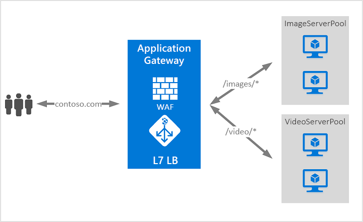

# Qu’est-ce qu’Azure Application Gateway ?

Azure Application Gateway est un équilibreur de charge du trafic web qui vous permet de gérer le trafic vers vos applications web. Les équilibreurs de charge traditionnels fonctionnent au niveau de la couche de transport (couche OSI 4 - TCP et UDP) et acheminent le trafic en fonction de l’adresse IP et du port sources, vers une adresse IP et un port de destination.

Application Gateway peut prendre des décisions de routage basées sur des attributs supplémentaires d’une requête HTTP, par exemple des en-têtes d’hôte ou le chemin d’un URI. Par exemple, vous pouvez acheminer le trafic en fonction de l’URL entrante. Par conséquent, si `/images` est dans l’URL entrante, vous pouvez acheminer le trafic vers un ensemble spécifique de serveurs (considérés comme un pool) configurés pour les images. Si `/video` est dans l’URL, ce trafic est acheminé vers un autre pool qui est optimisé pour les vidéos.

Ce type de routage est connu comme l’équilibrage de charge de la couche d’application (couche OSI 7). Azure Application Gateway permet d’effectuer un routage basé sur une URL et bien plus encore.

>[!NOTE]
> Azure offre une suite de solutions d’équilibrage de charge entièrement managées pour vos scénarios. Si vous avez besoin d’un équilibrage de charge haute performance, à faible latence et de couche 4, consultez [Qu’est-ce qu’Azure Load Balancer ?](../load-balancer/load-balancer-overview.md). Si vous recherchez un équilibrage de charge DNS global, consultez [Qu’est-ce que Traffic Manager ?](../traffic-manager/traffic-manager-overview.md). Vos scénarios de bout en bout peuvent tirer parti de la combinaison de ces solutions.
>
> Pour obtenir une comparaison des options d’équilibrage de charge Azure, consultez [Vue d’ensemble des options d’équilibrage de charge dans Azure](https://docs.microsoft.com/azure/architecture/guide/technology-choices/load-balancing-overview).

## Fonctionnalités

Pour découvrir les fonctionnalités d’Application Gateway, consultez [Fonctionnalités d’Azure Application Gateway](features.md).

## Tarifs et contrat SLA

Pour obtenir des informations sur les tarifs d’Application Gateway, consultez [Tarification Application Gateway](https://azure.microsoft.com/pricing/details/application-gateway/).

Pour obtenir des informations sur le contrat SLA Application Gateway, consultez [SLA pour Application Gateway](https://azure.microsoft.com/support/legal/sla/application-gateway/v1_2/).

## Nouveautés

Pour découvrir les nouveautés d’Azure Application Gateway, consultez [Mises à jour Azure](https://azure.microsoft.com/updates/?category=networking&query=Application%20Gateway).

## Étapes suivantes

Selon vos besoins et votre environnement, vous pouvez créer une passerelle Application Gateway test avec le portail Azure, Azure PowerShell ou Azure CLI.

- [Démarrage rapide : diriger le trafic web avec Azure Application Gateway - Portail Azure](quick-create-portal.md)
- [Démarrage rapide : Diriger le trafic web avec Azure Application Gateway - Azure PowerShell](quick-create-powershell.md)
- [Démarrage rapide : Diriger le trafic web avec Azure Application Gateway - Azure CLI](quick-create-cli.md)
