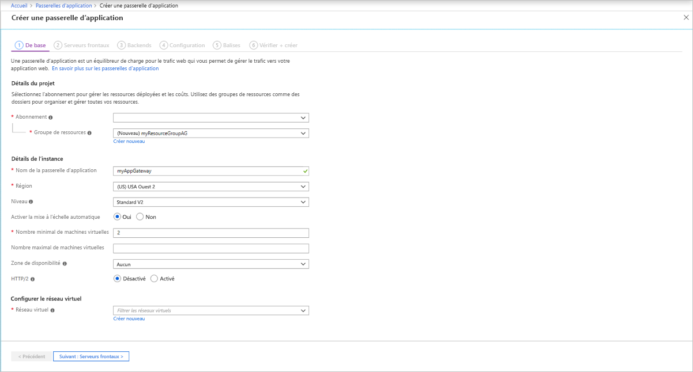
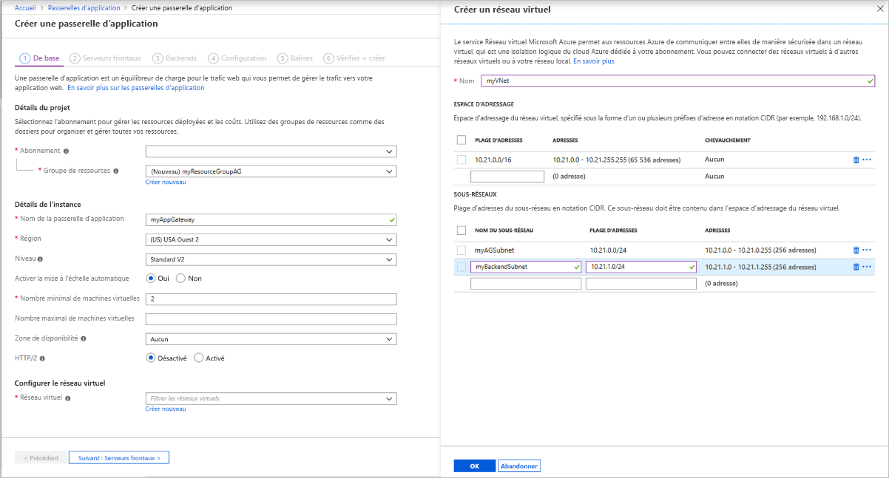
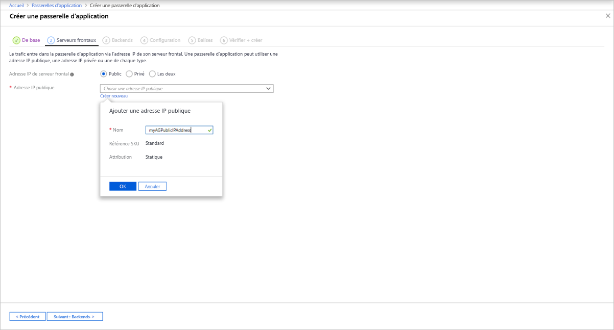
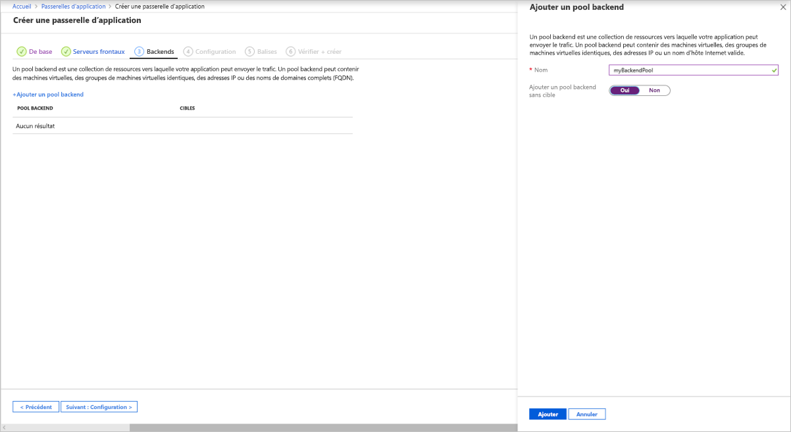
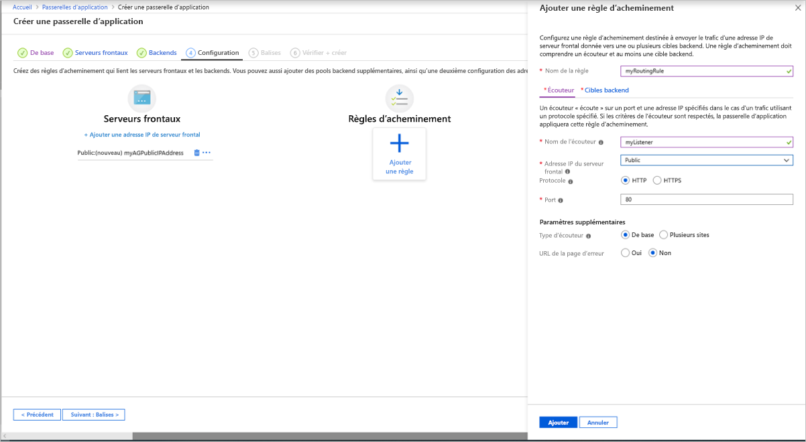
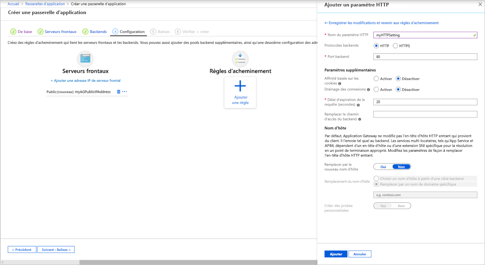
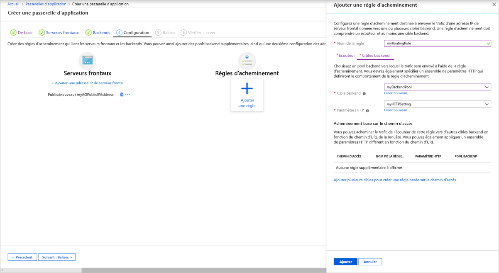
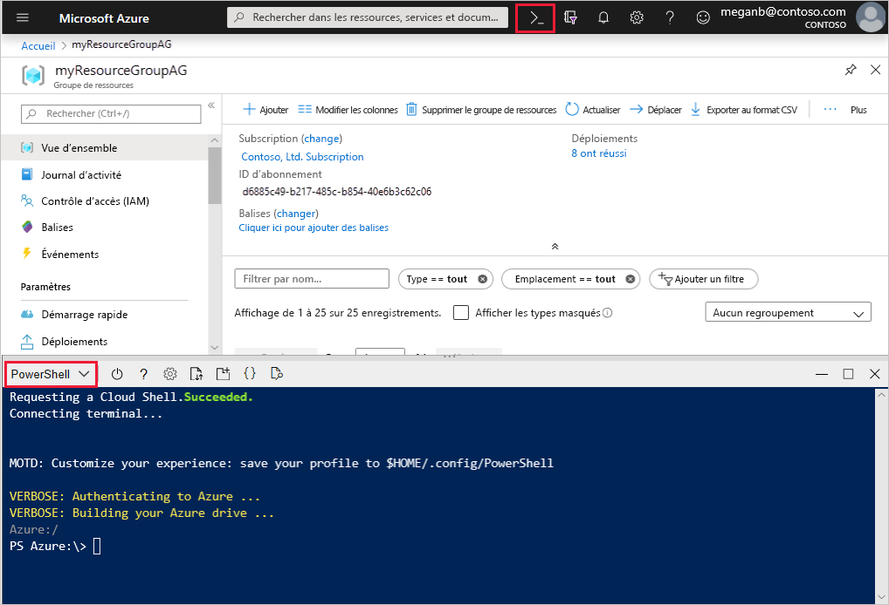
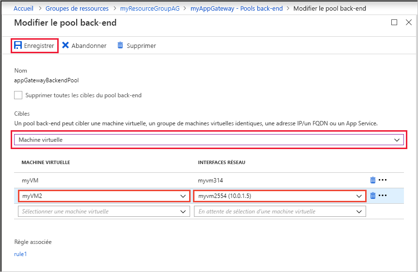
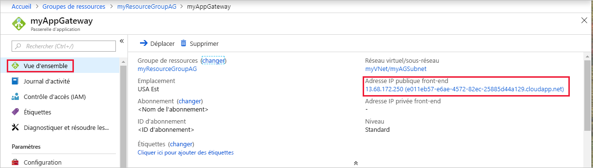

# <a name="quickstart-direct-web-traffic-with-azure-application-gateway---azure-portal"></a>Démarrage rapide : Diriger le trafic web avec Azure Application Gateway - Portail Azure

Dans ce guide de démarrage rapide, vous allez utiliser le portail Azure pour créer une passerelle d’application. Puis, vous la testerez pour vous assurer qu’elle fonctionne correctement. 

La passerelle d’application dirige le trafic web des applications vers des ressources spécifiques d’un pool de back-ends. Vous attribuez des écouteurs aux ports, créez des règles et ajoutez des ressources à un pool de back-ends. Par souci de simplicité, cet article utilise une configuration simple avec une adresse IP front-end publique, un écouteur de base pour héberger un site unique sur cette passerelle d’application, une règle de routage des requêtes simple et deux machines virtuelles dans le pool de back-ends.

Vous pouvez également suivre ce guide de démarrage rapide en utilisant [Azure PowerShell](quick-create-powershell.md) ou [Azure CLI](quick-create-cli.md).

[!INCLUDE [updated-for-az](../../includes/updated-for-az.md)]

## <a name="prerequisites"></a>Prérequis

- Compte Azure avec un abonnement actif. [Créez un compte gratuitement](https://azure.microsoft.com/free/?WT.mc_id=A261C142F).

## <a name="sign-in-to-the-azure-portal"></a>Connectez-vous au portail Azure.

Connectez-vous au [portail Azure](https://portal.azure.com) avec votre compte Azure.

## <a name="create-an-application-gateway"></a>Créer une passerelle Application Gateway

Vous allez créer la passerelle d’application à l’aide des onglets de la page **Créer une passerelle d’application**.

1. Dans le menu du Portail Azure ou dans la page **Accueil**, sélectionnez **Créer une ressource**. La fenêtre **Nouvelle** apparaît.

2. Sélectionnez **Mise en réseau**, puis sélectionnez **Application Gateway** dans la liste **Sélection**.

### <a name="basics-tab"></a>Onglet Informations de base

1. Sous l’onglet **Informations de base**, entrez ces valeurs pour les paramètres de passerelle d’application suivants :

   - **Groupe de ressources** : sélectionnez **myResourceGroupAG** comme nom de groupe de ressources. Si ce groupe n’existe pas encore, sélectionnez **Créer** pour le créer.
   - **Nom de passerelle d’application** : entrez *myAppGateway* comme nom de passerelle d’application.

     

2. Azure a besoin d’un réseau virtuel pour communiquer avec les différentes ressources que vous créez. Vous pouvez créer un réseau virtuel ou en utiliser un. Dans cet exemple, vous allez créer un réseau virtuel en même temps que la passerelle d’application. Les instances Application Gateway sont créées dans des sous-réseaux séparés. Vous créez deux sous-réseaux dans cet exemple : un pour la passerelle d’application et un autre pour les serveurs back-end.

    Sous **Configurer le réseau virtuel**, créez un réseau virtuel en sélectionnant **Créer nouveau**. Dans la fenêtre **Créer un réseau virtuel** qui s’ouvre, entrez les valeurs suivantes pour créer le réseau virtuel et deux sous-réseaux :

    - **Name** : entrez *myVNet* comme nom de réseau virtuel.

    - **Nom de sous-réseau** (sous-réseau Application Gateway) : La grille **Sous-réseaux** affiche un sous-réseau nommé *Par défaut*. Remplacez le nom de ce sous-réseau par *myAGSubnet*.<br>Le sous-réseau de passerelle d’application peut contenir uniquement des passerelles d’application. Aucune autre ressource n’est autorisée.

    - **Nom de sous-réseau** (sous-réseau de serveur principal) : Dans la deuxième ligne de la grille **Sous-réseaux**, entrez *myBackendSubnet* dans la colonne **Nom de sous-réseau**.

    - **Plage d’adresses** (sous-réseau de serveur principal) : Dans la deuxième ligne de la grille **Sous-réseaux**, entrez une plage d’adresses qui ne chevauche pas la plage d’adresses de *myAGSubnet*. Par exemple, si la plage d’adresses de *myAGSubnet* est 10.0.0.0/24, entrez *10.0.1.0/24* pour la plage d’adresses de *myBackendSubnet*.

    Sélectionnez **OK** pour fermer la fenêtre **Créer un réseau virtuel** et enregistrez les paramètres du réseau virtuel.

     
    
3. Sous l’onglet **Informations de base**, acceptez les valeurs par défaut des autres paramètres, puis sélectionnez **Suivant : Serveurs frontaux**.

### <a name="frontends-tab"></a>Onglet Front-ends

1. Sous l’onglet **Front-ends**, vérifiez que **Type d’adresse IP de front-end** est défini sur **Publique**. <br>Vous pouvez l’adresse IP frontale pour qu’elle soit publique ou privée conformément à votre cas d’utilisation. Dans cet exemple, vous allez choisir une adresse IP front-end publique.
   > [!NOTE]
   > Pour la référence SKU Application Gateway v2, il doit y avoir une configuration d’une adresse IP front-end **publique**. Vous pouvez toujours disposer d’une configuration d’adresse IP front-end publique et privée, mais la configuration d’adresse IP front-end uniquement privée (mode ILB uniquement) n’est pas activée pour la référence SKU v2. 

2. Choisissez **Créer nouveau** pour **Adresse IP publique**, puis entrez *myAGPublicIPAddress* comme nom d’adresse IP publique, puis sélectionnez **OK**. 

     

3. Sélectionnez **Suivant : Back-ends**.

### <a name="backends-tab"></a>Onglet Back-ends

Le pool de back-ends est utilisé pour router les demandes vers les serveurs back-end qui les traitent. Les pools back-end peuvent être composés de cartes d’interface réseau, de groupes de machines virtuelles identiques, d’adresses IP publiques, d’adresses IP internes, de noms de domaine complets et de serveurs back-end multi-locataires comme Azure App Service. Dans cet exemple, vous allez créer un pool de back-ends vide avec votre passerelle d’application, puis ajouter des cibles de back-end au pool.

1. Sous l’onglet **Backends**, sélectionnez **+Ajouter un pool de back-ends**.

2. Dans la fenêtre **Ajouter un pool de back-ends** qui s’ouvre, entrez les valeurs suivantes pour créer un pool de back-ends vide :

    - **Name** : Entrez *myBackendPool* comme nom du pool de back-ends.
    - **Ajouter un pool backend sans cible** : Sélectionnez **Oui** pour créer un pool de back-ends sans cible. Vous ajouterez des cibles de back-end après avoir créé la passerelle d’application.

3. Dans la fenêtre **Ajouter un pool de back-ends**, sélectionnez  **Ajouter** pour enregistrer la configuration du pool de back-ends et revenir à l’onglet **Back-ends**.

     

4. Sous l’onglet **Back-ends**, sélectionnez **Suivant : Configuration**.

### <a name="configuration-tab"></a>Onglet Configuration

Sous l’onglet **Configuration**, vous allez connecter le front-end et le pool de back-ends que vous avez créés à l’aide d’une règle de routage.

1. Sélectionnez **Ajouter une règle** dans la colonne **Règles de routage**.

2. Dans la fenêtre **Ajouter une règle de routage** qui s’ouvre, entrez *myRoutingRule* pour **Nom de la règle**.

3. Une règle de routage requiert un écouteur. Sous l’onglet **Écouteur** dans la fenêtre **Ajouter une règle de routage**, entrez les valeurs suivantes pour l’écouteur :

    - **Nom de l’écouteur** : Entrez *myListener* comme nom pour l’écouteur.
    - **Adresse IP du front-end** : Sélectionnez **Publique** pour choisir l’adresse IP publique que vous avez créée pour le front-end.
  
      Acceptez les valeurs par défaut pour les autres paramètres sous l’onglet **Écouteur**, puis sélectionnez l’onglet **Cibles de back-end** pour configurer le reste de la règle de routage.

   

4. Sous l’onglet **Cibles de back-end**, sélectionnez **myBackendPool** pour la **Cible de back-end**.

5. Pour **Paramètre HTTP**, sélectionnez **Créer nouveau** pour créer un nouveau paramètre HTTP. Le paramètre HTTP détermine le comportement de la règle de routage. Dans la fenêtre **Ajouter un paramètre HTTP** qui s’ouvre, entrez *myHTTPSetting* comme **Nom du paramètre HTTP** et *80* comme **Port principal**. Acceptez les valeurs par défaut pour les autres paramètres de la fenêtre **Ajouter un paramètre HTTP**, puis sélectionnez **Ajouter** pour revenir à la fenêtre **Ajouter une règle de routage**. 

     

6. Dans la fenêtre **Ajouter une règle de routage**, sélectionnez **Ajouter** pour enregistrer la règle de routage et revenir à l’onglet **Configuration**.

     

7. Sélectionnez **Suivant : Balises**, puis sur **Suivant : Vérifier + créer**.

### <a name="review--create-tab"></a>Onglet Vérifier + créer

Examinez les paramètres sous l’onglet **Vérifier + créer**, puis sélectionnez **Créer** pour créer le réseau virtuel, l’adresse IP publique et la passerelle d’application. La création de la passerelle d’application par Azure peut prendre plusieurs minutes. Patientez jusqu’à ce que le déploiement soit terminé avant de passer à la section suivante.

## <a name="add-backend-targets"></a>Ajouter des cibles de back-end

Dans cet exemple, vous allez utiliser des machines virtuelles comme back-end cible. Vous pouvez utiliser des machines virtuelles existantes ou en créer de nouvelles. Vous allez créer deux machines virtuelles en tant que serveurs back-end pour la passerelle d’application.

Pour ce faire, vous allez effectuer les opérations suivantes :

1. Créez deux machines virtuelles, *myVM* et *myVM2*, à utiliser comme serveurs back-end.
2. Installer IIS sur les machines virtuelles pour vérifier que la passerelle d’application a bien été créée.
3. Ajoutez les serveurs principaux au pool principal.

### <a name="create-a-virtual-machine"></a>Création d'une machine virtuelle

1. Dans le menu du Portail Azure ou dans la page **Accueil**, sélectionnez **Créer une ressource**. La fenêtre **Nouvelle** apparaît.
2. Sélectionnez **Windows Server 2016 Datacenter** dans la liste **Populaire**. La page **Créer une machine virtuelle** s’affiche.<br>Application Gateway peut acheminer le trafic vers n’importe quel type de machine virtuelle utilisée dans son pool principal. Dans cet exemple, vous utilisez un serveur Windows Server 2016 Datacenter.
3. Sous l’onglet **De base**, entrez ces valeurs pour les paramètres de machine virtuelle suivants :

    - **Groupe de ressources** : sélectionnez **myResourceGroupAG** comme nom de groupe de ressources.
    - **Nom de la machine virtuelle** : entrez *myVM* comme nom de machine virtuelle.
    - **Région** : sélectionnez la région dans laquelle vous avez créé la passerelle d’application.
    - **Nom d’utilisateur** : tapez *azureuser* comme nom d’utilisateur administrateur.
    - **Mot de passe** : Tapez un mot de passe.
4. Acceptez les autres valeurs par défaut, puis sélectionnez **Suivant : Disques**.  
5. Acceptez les valeurs par défaut sous l’onglet **Disques**, puis sélectionnez **Suivant : Mise en réseau**.
6. Sous l’onglet **Mise en réseau**, vérifiez que **myVNet** est sélectionné comme **Réseau virtuel** et que **Sous-réseau** est défini sur  **myBackendSubnet**. Acceptez les autres valeurs par défaut, puis sélectionnez **Suivant : Gestion**.<br>Application Gateway peut communiquer avec des instances en dehors du réseau virtuel dans lequel il réside, mais vous devez vérifier qu’il existe une connectivité IP.
7. Sous l’onglet **Gestion**, définissez **Diagnostics de démarrage** sur **Désactivé**. Acceptez les autres valeurs par défaut, puis sélectionnez **Vérifier + créer**.
8. Sous l’onglet **Vérifier + créer**, passez en revue les paramètres, corrigez les éventuelles erreurs de validation et sélectionnez **Créer**.
9. Attendez la fin de la création de la machine virtuelle avant de continuer.

### <a name="install-iis-for-testing"></a>Installer IIS pour les tests

Dans cet exemple, vous allez installer IIS sur les machines virtuelles uniquement pour vérifier si Azure a bien créé la passerelle d’application.

1. Ouvrez Azure PowerShell. Sélectionnez **Cloud Shell** dans la barre de navigation supérieure du portail Azure, puis sélectionnez **PowerShell** dans la liste déroulante. 

    

2. Exécutez la commande suivante pour installer IIS sur la machine virtuelle. Modifiez le paramètre *Emplacement* si nécessaire : 

    ```azurepowershell
    Set-AzVMExtension `
      -ResourceGroupName myResourceGroupAG `
      -ExtensionName IIS `
      -VMName myVM `
      -Publisher Microsoft.Compute `
      -ExtensionType CustomScriptExtension `
      -TypeHandlerVersion 1.4 `
      -SettingString '{"commandToExecute":"powershell Add-WindowsFeature Web-Server; powershell Add-Content -Path \"C:\\inetpub\\wwwroot\\Default.htm\" -Value $($env:computername)"}' `
      -Location EastUS
    ```

3. Créez une deuxième machine virtuelle et installez IIS en suivant les mêmes étapes que vous avez effectuées précédemment. Utilisez *myVM2* comme nom de machine virtuelle et comme paramètre **VMName** de l’applet de commande **Set-AzVMExtension**.

### <a name="add-backend-servers-to-backend-pool"></a>Ajouter des serveurs principaux pour le pool principal

1. Dans le menu du portail Azure, sélectionnez **Toutes les ressources** ou recherchez et sélectionnez *Toutes les ressources*. Sélectionnez ensuite **myAppGateway**.

2. Sélectionnez **Pools principaux** dans le menu de gauche.

3. Sélectionnez **MyBackendPool**.

4. Sous **Cibles de back-end**, **Type de cible**, sélectionnez **Machine virtuelle** dans la liste déroulante.

5. Sous **Cible**, sélectionnez les machines virtuelles **myVM** et **myVM2** ainsi que leurs interfaces réseau associées dans les listes déroulantes.

   > [!div class="mx-imgBorder"]
   > 

6. Sélectionnez **Enregistrer**.

7. Attendez que le déploiement se termine avant de passer à l’étape suivante.

## <a name="test-the-application-gateway"></a>Tester la passerelle d’application

IIS n’est pas obligatoire pour créer la passerelle d’application, mais vous l’avez installé dans ce guide de démarrage rapide pour vérifier si Azure avait bien créé la passerelle d’application. Utilisez IIS pour tester la passerelle d’application :

1. Trouvez l’adresse IP publique de la passerelle d’application dans la page **Vue d’ensemble** correspondante.  Vous pouvez aussi sélectionner **Toutes les ressources**, entrer *myAGPublicIPAddress* dans la zone de recherche, puis sélectionner l’adresse IP publique dans les résultats de la recherche. Azure affiche l’adresse IP publique dans la page **Vue d’ensemble**.
2. Copiez l’adresse IP publique, puis collez-la dans la barre d’adresses de votre navigateur pour y accéder.
3. Vérifiez la réponse. Une réponse valide vérifie que la passerelle d’application a bien été créée avec succès et qu’elle est capable de se connecter au back-end.

   

   Actualisez plusieurs fois le navigateur ; vous devriez voir les connexions à myVM et myVM2.

## <a name="clean-up-resources"></a>Nettoyer les ressources

Quand vous n’avez plus besoin des ressources que vous avez créées avec la passerelle d’application, supprimez le groupe de ressources. Quand vous supprimez le groupe de ressources, vous supprimez aussi la passerelle d’application et toutes les ressources associées.

Pour supprimer le groupe de ressources :

1. Dans le menu du portail Azure, sélectionnez **Groupes de ressources** ou recherchez et sélectionnez *Groupes de ressources*.
2. Dans la page **Groupes de ressources**, recherchez **myResourceGroupAG** dans la liste, puis sélectionnez ce groupe de ressources.
3. Dans la page **Groupe de ressources**, sélectionnez **Supprimer le groupe de ressources**.
4. Entrez *myResourceGroupAG* dans **TAPER LE NOM DU GROUPE DE RESSOURCES**, puis sélectionnez **Supprimer**.

## <a name="next-steps"></a>Étapes suivantes

> [!div class="nextstepaction"]
> [Tutoriel : Configurer une passerelle d’application avec un arrêt TLS à l’aide du portail Azure](create-ssl-portal.md)
