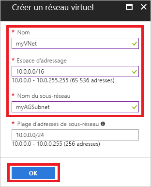
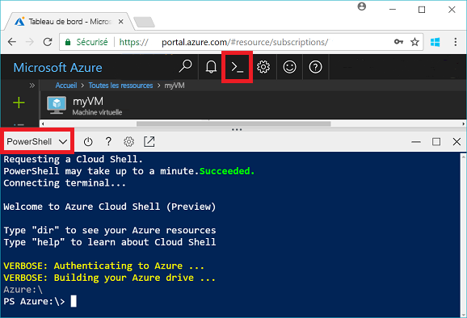
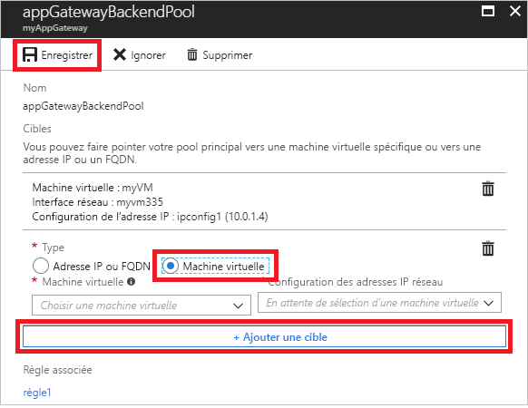
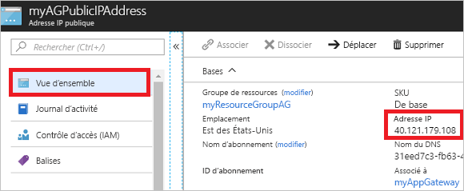

# <a name="quickstart-direct-web-traffic-with-azure-application-gateway---azure-portal"></a>Démarrage rapide : Diriger le trafic web avec Azure Application Gateway - Portail Azure

Avec Azure Application Gateway, vous pouvez diriger le trafic web de votre application vers des ressources spécifiques en affectant des écouteurs à des ports, en créant des règles et en ajoutant des ressources à un pool backend.

Ce guide de démarrage rapide vous montre comment utiliser le portail Azure pour créer rapidement la passerelle d’application avec deux machines virtuelles dans son pool backend. Vous la testez ensuite pour vérifier qu’elle fonctionne correctement.

Si vous n’avez pas d’abonnement Azure, créez un [compte gratuit](https://azure.microsoft.com/free/?WT.mc_id=A261C142F) avant de commencer.

## <a name="log-in-to-azure"></a>Connexion à Azure

Connectez-vous au portail Azure à l’adresse [http://portal.azure.com](http://portal.azure.com)

## <a name="create-an-application-gateway"></a>Créer une passerelle Application Gateway

Vous devez créer un réseau virtuel pour que la passerelle d’application puisse communiquer avec d’autres ressources. Vous pouvez créer un réseau virtuel en même temps que la passerelle d’application. Deux sous-réseaux sont créés dans cet exemple : une pour la passerelle d’application et l’autre pour les machines virtuelles. 

1. Cliquez sur  **Créer une ressource** dans le coin supérieur gauche du portail Azure.
2. Sélectionnez **Mise en réseau**, puis sélectionnez **Application Gateway** dans la liste de suggestions.
3. Entrez ces valeurs pour la passerelle d’application :

    - *myAppGateway* : pour le nom de la passerelle d’application.
    - *myResourceGroupAG* : pour le nouveau groupe de ressources.

    

4. Acceptez les valeurs par défaut pour les autres paramètres, puis cliquez sur **OK**.
5. Cliquez sur **Choisir un réseau virtuel** > **, sur Créer nouveau**, puis entrez ces valeurs pour le réseau virtuel :

    - *myVNet* : pour le nom du réseau virtuel.
    - *10.0.0.0/16* : pour l’espace d’adressage du réseau virtuel.
    - *myAGSubnet* : pour le nom du sous-réseau.
    - *10.0.0.0/24* : pour l’espace d’adressage du sous-réseau.

    

6. Cliquez sur **OK** pour créer le réseau virtuel et le sous-réseau.
6. Cliquez sur **Choisir une adresse IP publique** > **,sur Créer nouveau**, puis entrez le nom de l’adresse IP publique. Dans cet exemple, l’adresse IP publique est nommée *myAGPublicIPAddress*. Acceptez les valeurs par défaut pour les autres paramètres, puis cliquez sur **OK**.
8. Acceptez les valeurs par défaut pour la configuration de l’écouteur, laissez le pare-feu d’applications web désactivé, puis cliquez sur **OK**.
9. Passez en revue les paramètres sur la page de résumé, puis cliquez sur **OK** pour créer le réseau virtuel, l’adresse IP publique et la passerelle d’application. La création de la passerelle d’application peut prendre jusqu’à 30 minutes. Patientez jusqu’à ce que le déploiement soit terminé avant de passer à la section suivante.

### <a name="add-a-subnet"></a>Ajouter un sous-réseau

1. Cliquez sur **Toutes les ressources** dans le menu de gauche, puis cliquez sur **myVNet** dans la liste des ressources.
2. Cliquez sur **Sous-réseaux** > **Sous-réseau**.

    

3. Entrez *myBackendSubnet* pour le nom du sous-réseau, puis cliquez sur **OK**.

## <a name="create-backend-servers"></a>Créer des serveurs principaux

Dans cet exemple, vous créez deux machines virtuelles à utiliser en tant que serveurs principaux pour la passerelle d’application. 

### <a name="create-a-virtual-machine"></a>Création d'une machine virtuelle

1. Cliquez sur **Nouveau**.
2. Cliquez sur **Compute**, puis sélectionnez **Windows Server 2016 Datacenter** dans la liste de suggestions.
3. Entrez ces valeurs pour la machine virtuelle :

    - *myVM* : pour le nom de la machine virtuelle.
    - *azureuser* : pour le nom d’utilisateur administrateur.
    - *Azure123456!* pour le mot de passe.
    - Sélectionnez **Utiliser l’existant**, puis *myResourceGroupAG*.

4. Cliquez sur **OK**.
5. Sélectionnez **DS1_V2** pour la taille de la machine virtuelle, puis cliquez sur **Sélectionner**.
6. Assurez-vous que **myVNet** est sélectionné pour le réseau virtuel et que le sous-réseau est **myBackendSubnet**. 
7. Cliquez sur **Désactivé** pour désactiver les diagnostics de démarrage.
8. Cliquez sur **OK**, vérifiez les paramètres sur la page de résumé, puis cliquez sur **Créer**.

### <a name="install-iis"></a>Installer IIS

Vous installez IIS sur les machines virtuelles pour vérifier que la passerelle d’application a bien été créée.

1. Ouvrez l’interpréteur de commandes interactif et assurez-vous qu’il est défini sur **PowerShell**.

    

2. Exécutez la commande suivante pour installer IIS sur la machine virtuelle : 

    ```azurepowershell-interactive
    Set-AzureRmVMExtension `
      -ResourceGroupName myResourceGroupAG `
      -ExtensionName IIS `
      -VMName myVM `
      -Publisher Microsoft.Compute `
      -ExtensionType CustomScriptExtension `
      -TypeHandlerVersion 1.4 `
      -SettingString '{"commandToExecute":"powershell Add-WindowsFeature Web-Server; powershell Add-Content -Path \"C:\\inetpub\\wwwroot\\Default.htm\" -Value $($env:computername)"}' `
      -Location EastUS
    ```

3. Créez une deuxième machine virtuelle et installez IIS à l’aide de la procédure que vous venez de terminer. Entrez *myVM2* pour son nom et VMName dans Set-AzureRmVMExtension.

### <a name="add-backend-servers"></a>Ajouter des serveurs principaux

Après avoir créé les machines virtuelles, vous devez les ajouter au pool principal dans la passerelle d’application.

1. Cliquez sur **Toutes les ressources** > **myAppGateway**.
2. Cliquez sur **Pools principaux**. Un pool par défaut a été automatiquement créé avec la passerelle d’application. Cliquez sur **appGatewayBackendPool**.
3. Cliquez sur **Ajouter la cible** > **Machine virtuelle**, puis sélectionnez *myVM*. Sélectionnez **Ajouter la cible** > **Machine virtuelle**, puis sélectionnez *myVM2*.

    

4. Cliquez sur **Enregistrer**.

## <a name="test-the-application-gateway"></a>Tester la passerelle d’application

L’installation d’IIS n’est pas nécessaire pour créer la passerelle d’application, mais vous l’avez installé dans ce guide de démarrage rapide pour vérifier si la passerelle d’application a été créée correctement.

1. Recherchez l’adresse IP publique de la passerelle d’application sur l’écran de présentation. Cliquez sur **Toutes les ressources** > **myAGPublicIPAddress**.

    

2. Copiez l’adresse IP publique, puis collez-la dans la barre d’adresses de votre navigateur.

    

Quand vous actualisez le navigateur, vous devez voir apparaître le nom de l’autre machine virtuelle.

## <a name="clean-up-resources"></a>Supprimer des ressources

Explorez d’abord les ressources qui ont été créées avec la passerelle d’application puis, quand vous n’en avez plus besoin, vous pouvez supprimer le groupe de ressources, la passerelle d’application et toutes les ressources associées. Pour ce faire, sélectionnez le groupe de ressources qui contient la passerelle d’application, puis cliquez sur **Supprimer**.

## <a name="next-steps"></a>Étapes suivantes

> [!div class="nextstepaction"]
> [Gérer le trafic web avec une passerelle d’application en utilisant Azure CLI](./tutorial-manage-web-traffic-cli.md)
