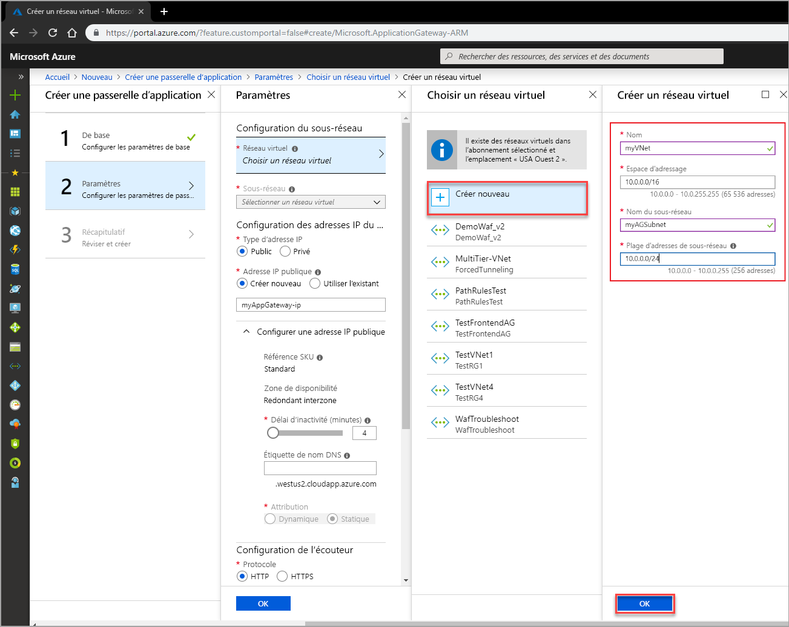

# <a name="quickstart-direct-web-traffic-with-azure-application-gateway---azure-portal"></a>Démarrage rapide : Diriger le trafic web avec Azure Application Gateway - Portail Azure

Avec Azure Application Gateway, vous pouvez diriger le trafic web de votre application vers des ressources spécifiques en affectant des écouteurs à des ports, en créant des règles et en ajoutant des ressources à un pool backend.

Ce guide de démarrage rapide vous montre comment utiliser le portail Azure pour créer rapidement la passerelle d’application avec deux machines virtuelles dans son pool backend. Vous la testez ensuite pour vérifier qu’elle fonctionne correctement.

Si vous n’avez pas d’abonnement Azure, créez un [compte gratuit](https://azure.microsoft.com/free/?WT.mc_id=A261C142F) avant de commencer.

## <a name="sign-in-to-azure"></a>Connexion à Azure

Connectez-vous au portail Azure sur [https://portal.azure.com](https://portal.azure.com).

## <a name="create-an-application-gateway"></a>Créer une passerelle Application Gateway

Un réseau virtuel est nécessaire pour la communication entre les ressources que vous créez. Deux sous-réseaux sont créés dans cet exemple : une pour la passerelle d’application et l’autre pour les serveurs principaux. Vous pouvez créer un réseau virtuel en même temps que la passerelle d’application.

1. Cliquez sur  **Créer une ressource** dans le coin supérieur gauche du portail Azure.
2. Cliquez sur **Mise en réseau**, puis sur **Application Gateway** dans la liste de suggestions.

### <a name="basics"></a>Concepts de base

1. Entrez ces valeurs pour la passerelle d’application :

    - *myAppGateway* : pour le nom de la passerelle d’application.
    - *myResourceGroupAG* : pour le nouveau groupe de ressources.

    

2. Acceptez les valeurs par défaut pour les autres paramètres, puis cliquez sur **OK**.

### <a name="settings"></a>Paramètres

1. Cliquez sur **Choisir un réseau virtuel**, cliquez sur **Créer nouveau**, puis entrez ces valeurs pour le réseau virtuel :

    - *myVNet* : pour le nom du réseau virtuel.
    - *10.0.0.0/16* : pour l’espace d’adressage du réseau virtuel.
    - *myAGSubnet* : pour le nom du sous-réseau.
    - *10.0.0.0/24* : plage d’adresses du sous-réseau.

    

6. Cliquez sur **OK** pour revenir à la page Paramètres.
7. Sous **Configuration d’adresse IP frontale**, vérifiez que **Type d’adresse IP** a la valeur **public**, puis, sous **Adresse IP publique**, vérifiez que **Créer** est sélectionné. Tapez *myAGPublicIPAddress* comme nom pour l’adresse IP publique. Acceptez les valeurs par défaut pour les autres paramètres, puis cliquez sur **OK**.

### <a name="summary"></a>Résumé

Passez en revue les paramètres sur la page de résumé, puis cliquez sur **OK** pour créer le réseau virtuel, l’adresse IP publique et la passerelle d’application. La création de la passerelle d’application peut prendre plusieurs minutes. Patientez jusqu’à ce que le déploiement soit terminé avant de passer à la section suivante.

## <a name="add-a-subnet"></a>Ajouter un sous-réseau

1. Cliquez sur **Toutes les ressources** dans le menu de gauche, puis cliquez sur **myVNet** dans la liste des ressources.
2. Cliquez sur **Sous-réseaux**, puis sur **+Sous-réseau**.

    

3. Entrez *myBackendSubnet* pour le nom du sous-réseau, puis cliquez sur **OK**.

## <a name="create-backend-servers"></a>Créer des serveurs principaux

Dans cet exemple, vous créez deux machines virtuelles à utiliser en tant que serveurs backend pour la passerelle d’application. Vous installez également IIS sur les machines virtuelles pour vérifier que la passerelle d’application a bien été créée.

### <a name="create-a-virtual-machine"></a>Création d'une machine virtuelle

1. Dans le portail Azure, cliquez sur **Créer une ressource**.
2. Cliquez sur **Compute**, puis sélectionnez **Windows Server 2016 Datacenter** dans la liste de suggestions.
3. Entrez ces valeurs pour la machine virtuelle :

    - *myResourceGroupAG* pour le groupe de ressources.
    - *myVM* : pour le nom de la machine virtuelle.
    - *azureuser* : pour le nom d’utilisateur administrateur.
    - *Azure123456!* pour le mot de passe.

   Acceptez toutes les autres valeurs par défaut et cliquez sur **Suivant : Disques**.
4. Acceptez toutes les autres valeurs par défaut et cliquez sur **Suivant : Mise en réseau**.
5. Assurez-vous que **myVNet** est sélectionné pour le réseau virtuel et que le sous-réseau est **myBackendSubnet**.
6. Acceptez toutes les autres valeurs par défaut et cliquez sur **Suivant : Gestion**.
7. Cliquez sur **Désactivé** pour désactiver les diagnostics de démarrage. Acceptez les autres valeurs par défaut et cliquez sur **Vérifier + créer**.
8. Vérifiez les paramètres sur la page de résumé, puis cliquez sur **Créer**.
9. Attendez la fin de la création de la machine virtuelle avant de continuer.

### <a name="install-iis"></a>Installer IIS

1. Ouvrez l’interpréteur de commandes interactif et assurez-vous qu’il est défini sur **PowerShell**.

    

2. Exécutez la commande suivante pour installer IIS sur la machine virtuelle : 

    ```azurepowershell-interactive
    Set-AzureRmVMExtension `
      -ResourceGroupName myResourceGroupAG `
      -ExtensionName IIS `
      -VMName myVM `
      -Publisher Microsoft.Compute `
      -ExtensionType CustomScriptExtension `
      -TypeHandlerVersion 1.4 `
      -SettingString '{"commandToExecute":"powershell Add-WindowsFeature Web-Server; powershell Add-Content -Path \"C:\\inetpub\\wwwroot\\Default.htm\" -Value $($env:computername)"}' `
      -Location EastUS
    ```

3. Créez une deuxième machine virtuelle et installez IIS à l’aide de la procédure que vous venez de terminer. Entrez *myVM2* pour son nom et VMName dans Set-AzureRmVMExtension.

### <a name="add-backend-servers"></a>Ajouter des serveurs principaux

1. Cliquez sur **Toutes les ressources**, puis sur **myAppGateway**.
4. Cliquez sur **Pools principaux**. Un pool par défaut a été automatiquement créé avec la passerelle d’application. Cliquez sur **appGatewayBackendPool**.
5. Sous **Cibles**, cliquez sur **Adresse IP ou nom de domaine complet**, puis sélectionnez **Machine virtuelle**.
6. Sous **Machine virtuelle**, ajoutez les machines virtuelles myVM et myVM2 et leurs interfaces réseau associées.

    

6. Cliquez sur **Enregistrer**.

## <a name="test-the-application-gateway"></a>Tester la passerelle d’application

1. Recherchez l’adresse IP publique de la passerelle d’application sur l’écran de présentation. Cliquez sur **Toutes les ressources**, puis sur **myAGPublicIPAddress**.

    

2. Copiez l’adresse IP publique, puis collez-la dans la barre d’adresses de votre navigateur.

    

## <a name="clean-up-resources"></a>Supprimer des ressources

Lorsque vous n’en avez plus besoin, supprimez le groupe de ressources, la passerelle Application Gateway et toutes les ressources associées. Pour ce faire, sélectionnez le groupe de ressources qui contient la passerelle d’application, puis cliquez sur **Supprimer**.

## <a name="next-steps"></a>Étapes suivantes

> [!div class="nextstepaction"]
> [Gérer le trafic web avec une passerelle d’application à l’aide d’Azure CLI](./tutorial-manage-web-traffic-cli.md)
