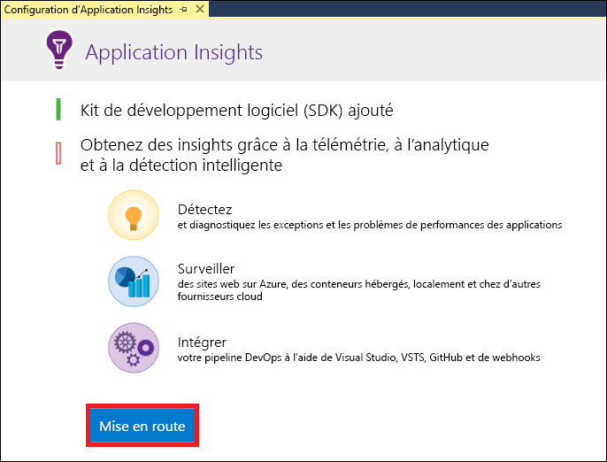
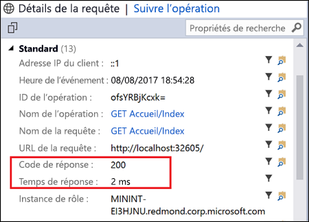
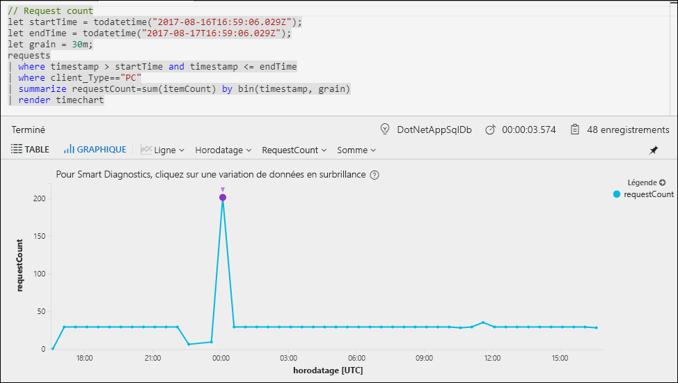
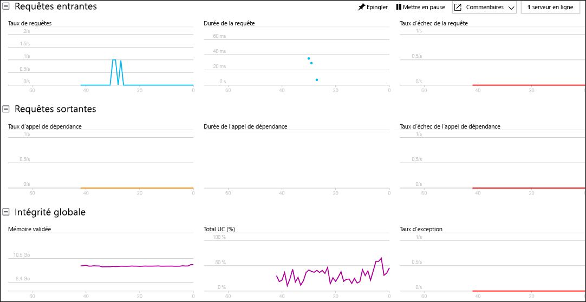

# Démarrer la surveillance de votre application web ASP.NET

Azure Application Insights vous permet de surveiller facilement la disponibilité, les performances et l’utilisation de votre application web.  Vous pouvez aussi rapidement identifier et diagnostiquer les erreurs dans votre application sans attendre qu’un utilisateur ne les signale.  Avec les informations que vous collectez à partir d’Application Insights sur les performances et l’efficacité de votre application, vous pouvez prendre des décisions avisées pour gérer et améliorer votre application.

Ce guide de démarrage rapide montre comment ajouter Application Insights à une application web ASP.NET existante et commencer à analyser les statistiques actives, ce qui représente simplement l’une des méthodes que vous pouvez utiliser pour analyser votre application. Si vous n’avez pas d’application web ASP.NET, vous pouvez en créer une en suivant le [guide de démarrage rapide Créer une application web ASP.NET](../app-service/app-service-web-get-started-dotnet-framework.md).

## Prérequis
Pour suivre ce guide de démarrage rapide :

- Installez [Visual Studio 2017](https://www.visualstudio.com/downloads/) avec les charges de travail suivantes :
    - Développement web et ASP.NET
    - Développement Azure

Si vous n’avez pas d’abonnement Azure, créez un compte [gratuit](https://azure.microsoft.com/free/) avant de commencer.

## Activer Application Insights

1. Ouvrez votre projet dans Visual Studio 2017.
2. Sélectionnez **Configurer Application Insights** dans le menu Projet. Visual Studio ajoute le SDK Application Insights à votre application.

    > [!IMPORTANT]
    > Le processus d’ajout d’Application Insights varie selon le type de modèle ASP.NET. Si vous utilisez le modèle **Vide** ou **Application mobile Azure**, sélectionnez **Projet** > **Ajouter Application Insights Telemetry**. Pour tous les autres modèles ASP.NET, consultez les instructions de l’étape précédente. 

3. Cliquez sur **Prise en main** (les versions antérieures de Visual Studio ont un bouton **Démarrer gratuitement** à la place).

    

4. Sélectionnez votre abonnement et cliquez sur **S’inscrire**.

5. Exécutez votre application en sélectionnant **Démarrer le débogage** dans le menu **Déboguer** ou en appuyant sur la touche F5.

## Confirmer la configuration de l’application

Application Insights recueille les données de télémétrie pour votre application, quel que soit l’emplacement de son exécution. Suivez les étapes ci-dessous pour lancer l’affichage de ces données.

1. Ouvrez Application Insights en cliquant sur **Afficher** -> **Autres fenêtres** -> **Recherche Application Insights**.  Vous voyez les données de télémétrie de votre session active.  

2. Cliquez sur la première demande dans la liste (GET Home/Index dans cet exemple) pour afficher les détails de la demande. Notez que le code d’état et le temps de réponse sont tous deux inclus, ainsi que d’autres informations utiles sur la demande.  

## Démarrer la surveillance dans le portail Azure

Vous pouvez maintenant ouvrir Application Insights dans le portail Azure pour afficher différents détails sur votre application en cours d’exécution.

1. Cliquez avec le bouton droit sur le dossier **Connected Services Application Insights** (Services connectés, Application Insights) dans l’Explorateur de solutions et cliquez sur **Ouvrir le portail Application Insights**.  Vous voyez des informations sur votre application et diverses options.

    

2. Cliquez sur **cartographie d’application** pour obtenir une présentation visuelle des relations de dépendance entre les composants de votre application.  Chaque composant affiche des indicateurs de performance clés comme la charge, les performances, les échecs et les alertes.

    

3. Cliquez sur l’icône **Analyse d’application**  sur l’un des composants de l’application.  Vous ouvrez ainsi **Application Insights - Analyses**, qui fournit un langage de requête enrichi pour l’analyse de toutes les données collectées par Application Insights.  Dans ce cas, une requête est générée et affiche le nombre de demandes sous forme de graphique.  Vous pouvez écrire vos propres requêtes pour analyser d’autres données.

    

4. Revenez à la page **Overview** (Vue d’ensemble), puis cliquez sur **Flux temps réel**.  Des statistiques actives sur votre application en cours d’exécution s’affichent.  Cela inclut des informations telles que le nombre de demandes entrantes, la durée de ces demandes et les erreurs qui se produisent.  Vous pouvez également examiner les métriques de performances critiques comme la mémoire et le processeur.

    

Si vous êtes prêt à héberger votre application dans Azure, vous pouvez la publier maintenant. Suivez les étapes décrites dans le [guide de démarrage rapide Créer une application web ASP.NET](../app-service/app-service-web-get-started-dotnet.md#update-the-app-and-redeploy).

## Étapes suivantes
Dans ce guide de démarrage rapide, vous avez activé votre application pour une surveillance par Azure Application Insights.  Continuez à passer en revue les didacticiels pour apprendre à l’utiliser pour surveiller les statistiques et détecter les problèmes dans votre application.

> [!div class="nextstepaction"]
> [Didacticiels Azure Application Insights](app-insights-tutorial-runtime-exceptions.md)
