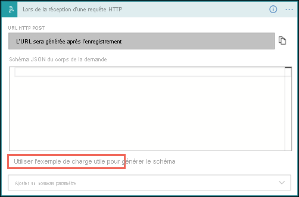
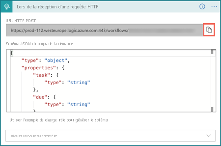
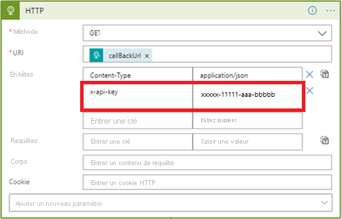
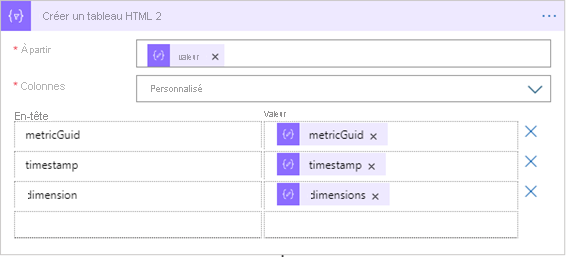
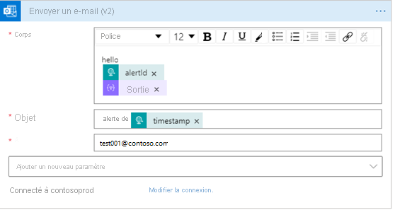
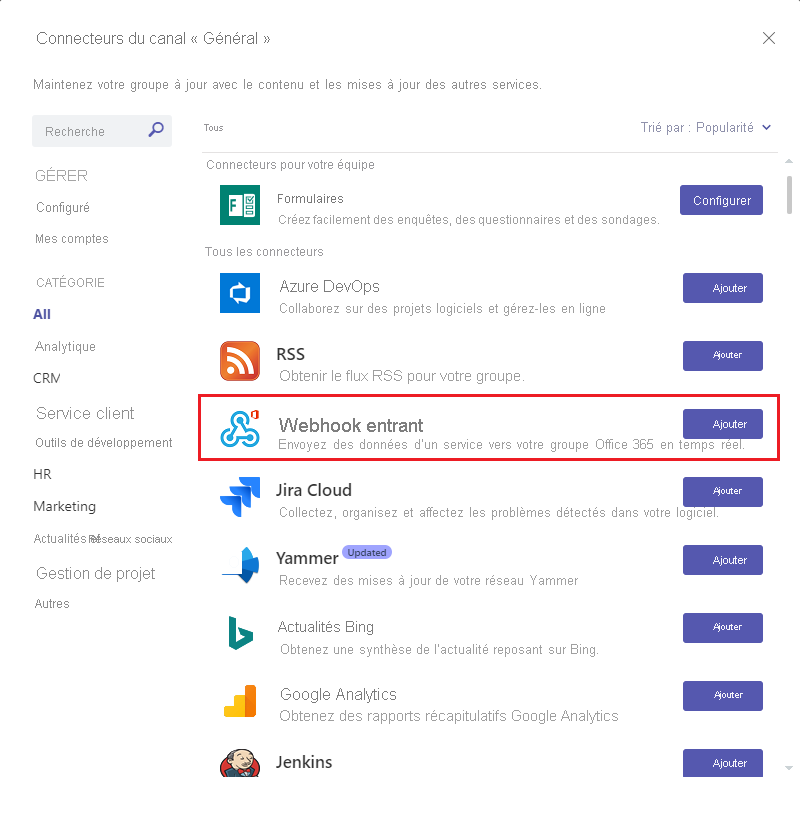
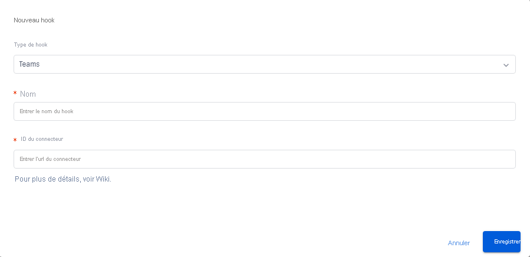
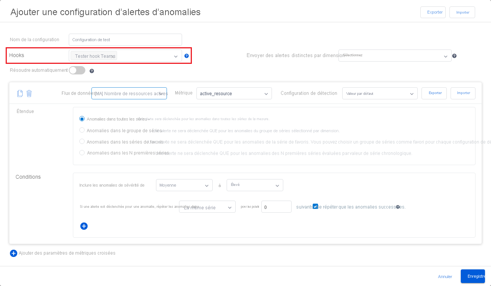
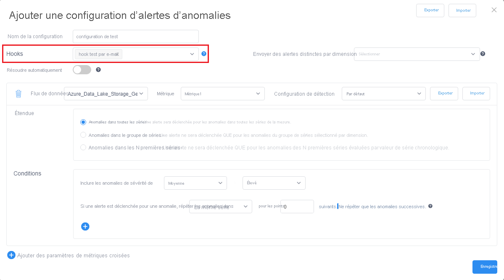

# <a name="tutorial-enable-anomaly-notification-in-metrics-advisor"></a>Didacticiel : activer la notification d’anomalies dans Metrics Advisor 

<!-- 2. Introductory paragraph 
Required. Lead with a light intro that describes, in customer-friendly language, 
what the customer will learn, or do, or accomplish. Answer the fundamental “why 
would I want to do this?” question. Keep it short.
-->


<!-- 3. Tutorial outline 
Required. Use the format provided in the list below.
-->

Dans ce tutoriel, vous allez apprendre à :

> [!div class="checklist"]
> * Créer un raccordement dans Metrics Advisor
> * Envoyer des notifications avec Azure Logic Apps
> * Envoyer des notifications à Microsoft Teams
> * Envoyer des notifications par le biais du serveur SMTP

<!-- 4. Prerequisites 
Required. First prerequisite is a link to a free trial account if one exists. If there 
are no prerequisites, state that no prerequisites are needed for this tutorial.
-->

## <a name="prerequisites"></a>Prérequis
### <a name="create-a-metrics-advisor-resource"></a>Créer une ressource Metrics Advisor

Pour explorer les fonctionnalités de Metrics Advisor, vous devrez peut-être <a href="https://go.microsoft.com/fwlink/?linkid=2142156"  title="Créer une ressource Metrics Advisor"  target="_blank">créer une ressource Metrics Advisor</a> dans le portail Azure pour déployer votre instance de Metrics Advisor.

### <a name="create-a-hook-in-metrics-advisor"></a>Créer un raccordement dans Metrics Advisor
Un raccordement dans Metrics Advisor est un pont qui permet au client de s’abonner à des anomalies de métriques et d’envoyer des notifications par le biais de différents canaux. Il existe quatre types de raccordements dans Metrics Advisor : 
    
- Hook par e-mail
- webhook
- Raccordement Teams
- Raccordement Azure DevOps

Chaque type de raccordement correspond à un canal spécifique dans lequel l’anomalie sera notifiée. 

<!-- 5. H2s
Required. Give each H2 a heading that sets expectations for the content that follows. 
Follow the H2 headings with a sentence about how the section contributes to the whole.
-->

## <a name="send-notifications-with-logic-apps-teams-and-smtp"></a>Envoyer des notifications avec Logic Apps, Teams et SMTP

#### <a name="logic-apps"></a>[Logic Apps](#tab/logic)

### <a name="send-email-notification-by-using-azure-logic-apps"></a>Envoyer une notification par e-mail en utilisant Azure Logic Apps

<!-- Introduction paragraph -->
Il existe deux options courantes pour envoyer des notifications par e-mail qui sont prises en charge dans Metrics Advisor. L’une consiste à utiliser des webhooks et Azure Logic Apps pour envoyer des alertes par e-mail, l’autre consiste à configurer un serveur SMTP et à l’utiliser pour envoyer des alertes par e-mail directement. Cette section se concentre sur la première option, qui est plus facile pour les clients qui n’ont pas de serveur SMTP disponible.

**Étape 1.** Créer un raccordement dans Metrics Advisor

Un webhook est le point d’entrée pour toutes les informations disponibles du service Metrics Advisor et appelle une API fournie par l’utilisateur lorsqu’une alerte est déclenchée. Toutes les alertes peuvent être envoyées via un webhook.

Sélectionnez l’onglet **Raccordements** dans l’espace de travail Metrics Advisor, puis cliquez sur le bouton **Créer un raccordement**. Choisissez un type de raccordement **Hook Web**. Renseignez les paramètres requis et sélectionnez **OK**. Pour obtenir des instructions détaillées, reportez-vous à [Créer un webhook](../how-tos/alerts.md#web-hook).

Il existe un paramètre supplémentaire de **point de terminaison** qui doit être rempli, à l’issue de l’étape 3 ci-dessous. 


**Étape 2.** Créer une ressource Logic Apps

Dans le [Portail Azure](https://portal.azure.com), créez une application logique vide en suivant les instructions données dans [Créer votre application logique](../../../logic-apps/quickstart-create-first-logic-app-workflow.md). Lorsque vous voyez la fenêtre **Concepteur Logic Apps** s’afficher, revenez dans ce tutoriel.


**Étape 3.** Ajoutez un déclencheur **Lors de la réception d’une demande HTTP**

- Azure Logic Apps utilise différentes actions pour déclencher des flux de travail définis. Pour ce cas d’usage, elle utilise le déclencheur de **Lorsqu’une requête HTTP est reçue**. 

- Dans la boîte de dialogue **Lors de la réception d’une demande HTTP**, sélectionnez **Utiliser l’exemple de charge utile pour générer le schéma**.

    

    Copiez l’exemple JSON suivant dans la zone de texte et sélectionnez **Terminé**.

    ```json
    {
    "properties": {
        "value": {
            "items": {
                "properties": {
                    "alertInfo": {
                        "properties": {
                            "alertId": {
                                "type": "string"
                            },
                            "anomalyAlertingConfigurationId": {
                                "type": "string"
                            },
                            "createdTime": {
                                "type": "string"
                            },
                            "modifiedTime": {
                                "type": "string"
                            },
                            "timestamp": {
                                "type": "string"
                            }
                        },
                        "type": "object"
                    },
                    "alertType": {
                        "type": "string"
                    },
                    "callBackUrl": {
                        "type": "string"
                    },
                    "hookId": {
                        "type": "string"
                    }
                },
                "required": [
                    "hookId",
                    "alertType",
                    "alertInfo",
                    "callBackUrl"
                ],
                "type": "object"
            },
            "type": "array"
        }
    },
    "type": "object"
     }
    ```

- Choisissez la méthode « POSTER », puis sélectionnez **Enregistrer**. Vous voyez maintenant l’URL de votre déclencheur de requête HTTP. Sélectionnez l’icône de copie pour la copier et la replacer dans le **point de terminaison** à l’étape 1. 

    

**Étape 4.** Ajouter une étape suivante à l’aide de l’action « HTTP »

Les signaux qui font l’objet d’un push via le webhook contiennent uniquement des informations limitées comme timestamp, alertID, configurationID, etc. Des informations détaillées doivent être interrogées à l’aide de l’URL de rappel fournie dans le signal. Cette étape consiste à interroger les informations d’alerte détaillées.  

- Choisir une méthode GET
- Sélectionnez « callBackURL » dans la liste « Contenu dynamique » dans « URI ».
- Entrer une clé de « Content-type » dans « En-têtes » et saisissez une valeur de « application/JSON »
- Entrez la clé « x-api-key » dans « En-têtes » pour l’obtenir en cliquant sur l’onglet **« Clés API »** dans votre espace de travail Metrics Advisor. Cette étape consiste à s’assurer que le flux de travail dispose des autorisations suffisantes pour les appels d’API.

    

**Étape 5.** Ajouter une étape suivante à « Analyse JSON » 

Vous devez analyser la réponse de l’API pour faciliter la mise en forme du contenu de l’e-mail. 
 
> [!NOTE] 
> Ce didacticiel ne partage qu’un simple exemple, le format d’e-mail final doit être conçu. 

- Sélectionner « Corps » dans la liste « Contenu dynamique » dans « Contenu »
- Sélectionnez **Utiliser l’exemple de charge utile pour générer le schéma**. Copiez l’exemple JSON suivant dans la zone de texte et sélectionnez **Terminé**.

```json
{
    "properties": {
        "@@nextLink": {},
        "value": {
            "items": {
                "properties": {
                    "properties": {
                        "properties": {
                            "IncidentSeverity": {
                                "type": "string"
                            },
                            "IncidentStatus": {
                                "type": "string"
                            }
                        },
                        "type": "object"
                    },
                    "rootNode": {
                        "properties": {
                            "createdTime": {
                                "type": "string"
                            },
                            "detectConfigGuid": {
                                "type": "string"
                            },
                            "dimensions": {
                                "properties": {
                                },
                                "type": "object"
                            },
                            "metricGuid": {
                                "type": "string"
                            },
                            "modifiedTime": {
                                "type": "string"
                            },
                            "properties": {
                                "properties": {
                                    "AnomalySeverity": {
                                        "type": "string"
                                    },
                                    "ExpectedValue": {}
                                },
                                "type": "object"
                            },
                            "seriesId": {
                                "type": "string"
                            },
                            "timestamp": {
                                "type": "string"
                            },
                            "value": {
                                "type": "number"
                            }
                        },
                        "type": "object"
                    }
                },
                "required": [
                    "rootNode",
                    "properties"
                ],
                "type": "object"
            },
            "type": "array"
        }
    },
    "type": "object"
}
```

**Étape 6.** Ajouter une étape suivante pour « créer une table HTML »

Une série d’informations ont été retournées par l’appel d’API, cependant, en fonction de vos scénarios, les informations ne sont pas toutes utiles. Choisissez les éléments qui vous intéressent et que vous aimeriez inclure dans l’e-mail d’alerte. 

Voici un exemple de table HTML qui choisit « timestamp », « metricGUID » et « dimension » pour les inclure dans l’e-mail d’alerte.



**Étape 7.** Ajouter l’étape finale pour envoyer un e-mail

Il existe plusieurs options pour envoyer des e-mails, à la fois hébergées par Microsoft et des offres tierces. Le client peut avoir besoin d’un locataire ou d’un compte pour l’option choisie. Par exemple, lorsque vous choisissez « Office 365 Outlook » comme serveur. Le processus de connexion sera pompé pour la création de la connexion et de l’autorisation. Une connexion d’API sera établie pour utiliser le serveur de messagerie pour envoyer une alerte. 

Renseignez le contenu que vous souhaitez inclure dans « Body », « Subject » dans l’e-mail et indiquez une adresse e-mail dans « To ». 


                                                                   
#### <a name="teams-channel"></a>[Canal Teams](#tab/teams)
                                           
### <a name="send-anomaly-notification-through-a-microsoft-teams-channel"></a>Envoyer une notification d’anomalie par le biais d’un canal Microsoft Teams                            
Cette section vous guide dans la pratique consistant à envoyer des notifications d’anomalies via un canal Microsoft Teams. Cela peut permettre d’activer des scénarios dans lesquels les membres d’une équipe collaborent pour analyser les anomalies détectées par Metrics Advisor. Le flux de travail est facile à configurer et ne dispose pas d’un grand nombre de conditions préalables. 
                                               


**Étape 1.** Ajouter un connecteur « webhook entrant » à votre canal Teams

- Accédez au canal Teams auquel vous souhaitez envoyer une notification, sélectionnez « • • • » (plus d’options). 
- Dans la liste déroulante, sélectionnez « Connecteurs ». Dans la nouvelle boîte de dialogue, recherchez « webhook entrant », puis cliquez sur « Ajouter ».

        

- Si vous n’êtes pas en mesure d’afficher l’option « Connecteurs », contactez les propriétaires de votre groupe Teams. Sélectionnez « Gérer Teams », puis sélectionnez l’onglet « Paramètres » en haut et vérifiez si le paramètre « Autoriser les membres à créer, mettre à jour et supprimer les connecteurs » est activé.

        

- Entrez un nom pour le connecteur. vous pouvez également télécharger une image pour en faire un avatar. Sélectionnez « Créer », puis le connecteur webhook entrant est ajouté avec succès à votre canal. Une URL est générée au bas de la boîte de dialogue, **Veillez à sélectionner « Copier »** , puis sélectionnez « Terminé ». 

     

**Étape 2.** Créer un « raccordement Teams » dans Metrics Advisor

- Sélectionnez l’onglet « Raccordements » dans la barre de navigation de gauche, puis sélectionnez le bouton « créer un raccordement » en haut à droite de la page. 
- Choisissez le type de raccordement « Teams », puis entrez un nom et collez l’URL que vous avez copiée à partir de l’étape ci-dessus. 
- Sélectionnez « Enregistrer ». 

     

**Étape 3.** Appliquer le raccordement Teams à une configuration d’alerte

Accédez à l’un des flux de données que vous avez intégrés et sélectionnez-en un. Sélectionnez une métrique dans le flux et ouvrez la page de détails des métriques. Vous pouvez créer une « configuration d’alerte » pour vous abonner à des anomalies détectées et notifier un canal Teams. 

Sélectionnez le bouton « + » et choisissez le raccordement que vous avez créé, renseignez les autres champs et sélectionnez « Enregistrer ». Vous êtes ensuite configuré pour appliquer un raccordement Teams à une configuration d’alerte. Toutes les nouvelles anomalies seront notifiées via le canal Teams.




#### <a name="smtp-e-mail"></a>[Courrier électronique SMTP](#tab/smtp)

### <a name="send-email-notification-by-configuring-an-smtp-server"></a>Envoyer une notification par e-mail en configurant un serveur SMTP

Cette section vous permet de partager la pratique consistant à utiliser un serveur SMTP pour envoyer des notifications par e-mail sur les anomalies détectées. Vérifiez que vous disposez d’un serveur SMTP utilisable et que vous disposez des autorisations suffisantes pour obtenir des paramètres tels que le nom et le mot de passe du compte.

**Étape 1.** Affectez votre compte en tant que rôle « Administrateur Cognitive Service Metrics Advisor »  

- Un utilisateur doté de privilèges d’administrateur d’abonnement ou d’administrateur de groupe de ressources a besoin d’accéder à la ressource Metrics Advisor créée dans le portail Azure, puis de sélectionner l’onglet Contrôle d’accès (IAM).
- Sélectionnez « Ajouter des attributions de rôle ».
- Sélectionnez un rôle « Administrateur Metrics Advisor Cognitive Services », puis sélectionnez votre compte comme dans l’image ci-dessous.
- Cliquez sur le bouton « Enregistrer », vous avez été correctement ajouté en tant qu’administrateur d’une ressource Metrics Advisor. Toutes les actions ci-dessus doivent être effectuées par un administrateur d’abonnement ou un administrateur de groupe de ressources. La propagation des autorisations peut prendre jusqu’à une minute. 


**Étape 2.** Configurer un serveur SMTP dans l’espace de travail Metrics Advisor

Une fois que vous avez effectué les étapes ci-dessus et que vous avez été correctement ajouté en tant qu’administrateur de la ressource Metrics Advisor. La propagation des autorisations peut prendre quelques minutes. Ensuite, connectez-vous à votre espace de travail Metrics Advisor. vous devriez être en mesure d’afficher un nouvel onglet nommé « Paramètres d’e-mail » dans le volet de navigation gauche. Sélectionnez-le et poursuivez la configuration. 

Paramètres à remplir : 

- Nom du serveur SMTP (**obligatoire**) : indiquez le nom de votre fournisseur de serveur SMTP, la plupart des noms de serveurs sont écrits sous la forme « smtp.domain.com » ou « mail.domain.com ». Prenons l’exemple d’Office 365. il doit être défini sur « smtp.office365.com ». 
- Port du serveur SMTP (**obligatoire**) : le port 587 est le port par défaut pour l’envoi SMTP sur un site web moderne. Bien que vous puissiez utiliser d’autres ports pour la soumission (voir plus loin pour en savoir plus), vous devez toujours commencer par le port 587 comme valeur par défaut et utiliser un autre port uniquement si les circonstances le dictent (comme votre hôte bloquant le port 587 pour une raison quelconque).
- Expéditeur(s) d’e-mail (**obligatoire**) : il s’agit du compte de messagerie réel qui prend en charge l’envoi d’e-mails. Vous devrez peut-être renseigner le nom de compte et le mot de passe de l’expéditeur. Vous pouvez définir un seuil de quota pour le nombre maximal de d’e-mails d’alerte à envoyer dans une minute pour un compte. Vous pouvez définir plusieurs expéditeurs s’il est possible d’envoyer un grand nombre d’alertes en une minute, mais qu’au moins un compte doit être défini. 
- Envoi pour le compte de (facultatif) : Si vous avez plusieurs expéditeurs configurés, mais que vous souhaitez que les e-mails d’alerte semblent être envoyés à partir d’un compte. Vous pouvez utiliser ce champ pour les aligner. Mais notez que vous devrez peut-être accorder l’autorisation aux expéditeurs pour autoriser l’envoi d’e-mails au nom de leur compte.  
- CC par défaut (facultatif) : pour définir une adresse e-mail par défaut qui sera CC dans toutes les alertes par e-mail. 

Voici un exemple de serveur SMTP configuré :


**Étape 3.** Créer un raccordement par e-mail dans Metrics Advisor

Après avoir correctement configuré un serveur SMTP, vous êtes configuré pour créer un « raccordement par e-mail » dans l’onglet « Raccordements » de Metrics Advisor. Pour plus d’informations sur la création d’un « raccordement par e-mail », reportez-vous à [l’article sur les alertes](../how-tos/alerts.md#email-hook) et suivez les étapes jusqu’à la fin.

**Étape 4.** Appliquer le raccordement par e-mail à une configuration d’alerte

 Sélectionnez l’un des flux de données que vous avez intégrés, sélectionnez une métrique dans le flux et ouvrez la page de détails des métriques. Vous pouvez créer une « configuration d’alerte » pour vous abonner aux anomalies détectées et envoyées par e-mail. 

Sélectionnez le bouton « + » et choisissez le raccordement que vous avez créé, renseignez les autres champs et sélectionnez « Enregistrer ». Vous avez maintenant correctement configuré un raccordement par e-mail avec une configuration d’alerte personnalisée et toute nouvelle anomalie sera remontée via le raccordement à l’aide du serveur SMTP. 



---

## <a name="next-steps"></a>Étapes suivantes

Passez à l’article suivant pour découvrir comment créer.
> [!div class="nextstepaction"]
> [Écrire une requête valide](write-a-valid-query.md)

<!--
Remove all the comments in this template before you sign-off or merge to the 
main branch.
-->
