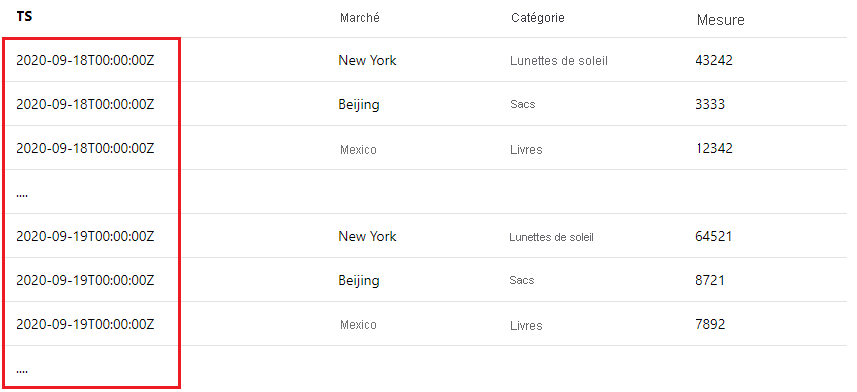
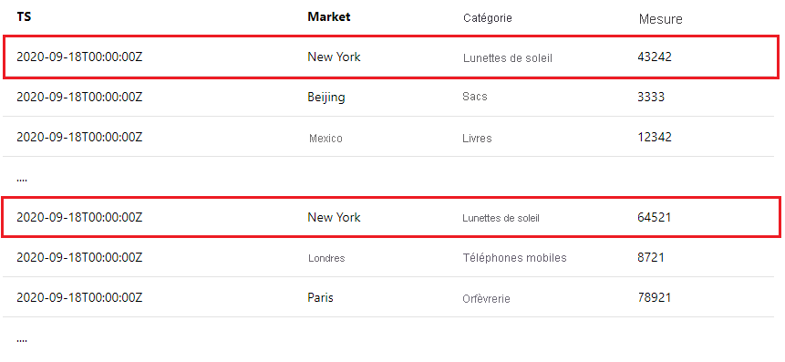

<!--
Remove all the comments in this template before you sign-off or merge to the 
main branch.
-->

<!--
This template provides the basic structure of a tutorial article.
See the [tutorial guidance](contribute-how-to-mvc-tutorial.md) in the contributor guide.

To provide feedback on this template contact 
[the templates workgroup](mailto:templateswg@microsoft.com).
-->

<!-- 1. H1 
Required. Start with "Tutorial: ". Make the first word following "Tutorial: " a 
verb.
-->

# <a name="tutorial-write-a-valid-query-to-onboard-metrics-data"></a>Tutoriel : Écrire une requête valide pour intégrer des données de métriques

<!-- 2. Introductory paragraph 
Required. Lead with a light intro that describes, in customer-friendly language, 
what the customer will learn, or do, or accomplish. Answer the fundamental “why 
would I want to do this?” question. Keep it short.
-->


<!-- 3. Tutorial outline 
Required. Use the format provided in the list below.
-->

Dans ce tutoriel, vous allez apprendre à :

> [!div class="checklist"]
> * Écrire une requête d’intégration de données valide.
> * Identifier et éviter les pièges courants.

<!-- 4. Prerequisites 
Required. First prerequisite is a link to a free trial account if one exists. If there 
are no prerequisites, state that no prerequisites are needed for this tutorial.
-->

## <a name="prerequisites"></a>Prérequis

### <a name="create-a-metrics-advisor-resource"></a>Créer une ressource Metrics Advisor

Pour explorer les fonctionnalités de Metrics Advisor, vous devrez peut-être <a href="https://go.microsoft.com/fwlink/?linkid=2142156"  title="Créer une ressource Metrics Advisor"  target="_blank">créer une ressource Metrics Advisor</a> dans le portail Azure pour déployer votre instance de Metrics Advisor.

<!-- 5. H2s
Required. Give each H2 a heading that sets expectations for the content that follows. 
Follow the H2 headings with a sentence about how the section contributes to the whole.
-->

## <a name="data-schema-requirements"></a>Exigences liées aux schémas de données
<!-- Introduction paragraph -->

[!INCLUDE [data schema requirements](../includes/data-schema-requirements.md)]


## <a name="span-idingestion-workhow-does-data-ingestion-work-in-metrics-advisorspan"></a><span id="ingestion-work">Comment fonctionne l’ingestion de données dans Metrics Advisor ?</span>

Il existe généralement deux manières d’intégrer des métriques à Metrics Advisor :
<!-- Introduction paragraph -->
- Pré-agrégez vos métriques dans le schéma attendu et stockez les données dans certains fichiers. Renseignez le modèle de chemin lors de l’intégration, et Metrics Advisor récupérera continuellement les nouveaux fichiers à partir du chemin et effectuera la détection sur les métriques. Il s’agit d’une pratique courante pour une source de données comme Azure Data Lake et Stockage Blob Azure.
- Si vous ingérez des données à partir de sources de données telles qu’Azure SQL Server, Azure Data Explorer ou d’autres sources qui prennent en charge l’utilisation d’un script de requête, vous devez veiller à construire correctement votre requête. Cet article explique comment écrire une requête valide pour intégrer des données de métriques comme prévu. 


### <a name="what-is-an-interval"></a>Qu’est-ce qu’un intervalle ?

Les métriques doivent être supervisées à un certain niveau de précision en fonction des besoins métier. Par exemple, les indicateurs de performance clés (KPI) sont supervisés avec une précision quotidienne. Toutefois, les métriques de performances de service sont souvent supervisées avec une précision par minute/heure. La fréquence de collecte des données de métriques à partir des sources est donc différente. 

Metrics Advisor récupère en continu les données de métriques à chaque intervalle de temps, **l’intervalle est égal à la précision des métriques.** Chaque fois que Metrics Advisor exécute la requête que vous avez écrite, il ingère les données à cet intervalle spécifique. En fonction de ce mécanisme d’ingestion de données, le script de requête **ne doit pas retourner toutes les données de métriques qui existent dans la base de données, mais il doit limiter le résultat à un intervalle unique.**


## <a name="how-to-write-a-valid-query"></a>Comment écrire une requête valide ?
<!-- Introduction paragraph -->
### <a name="span-iduse-parameters-use-intervalstart-and-intervalend-to-limit-query-resultsspan"></a><span id="use-parameters"> Utiliser @IntervalStart et @IntervalEnd pour limiter les résultats de requête</span>

 À cette fin, deux paramètres peuvent être utilisés dans la requête : **@IntervalStart** et **@IntervalEnd** . 

Chaque fois que la requête est exécutée, @IntervalStart et @IntervalEnd sont automatiquement mise à jour avec l’horodatage d’intervalle le plus récent, et les données de métriques correspondantes sont récupérées. @IntervalEnd est toujours assigné avec la précision @IntervalStart + 1. 

Voici un exemple d’utilisation correcte de ces deux paramètres avec Azure SQL Server : 

```SQL
SELECT [timestampColumnName] AS timestamp, [dimensionColumnName], [metricColumnName] FROM [sampleTable] WHERE [timestampColumnName] >= @IntervalStart and [timestampColumnName] < @IntervalEnd;
```

Quand vous écrivez le script de requête de cette manière, les horodatages des métriques doivent se situer dans le même intervalle pour chaque résultat de la requête. Metrics Advisor aligne automatiquement les horodatages avec la précision des métriques. 

### <a name="span-iduse-aggregation-use-aggregation-functions-to-aggregate-metricsspan"></a><span id="use-aggregation"> Utiliser les fonctions d’agrégation pour agréger des métriques</span>

Il arrive souvent qu’il y ait un grand nombre de colonnes dans les sources de données client, mais qu’il ne soit pas utile de toutes les superviser ou inclure en tant que dimension. Les clients peuvent utiliser des fonctions d’agrégation pour agréger des métriques et inclure uniquement les colonnes significatives en tant que dimensions.

Voici un exemple où il y a plus de 10 colonnes dans la source de données d’un client, mais où seules quelques-unes d’entre elles sont significatives et doivent être incluses et agrégées dans une métrique à superviser. 

| TS | Marché | Système d’exploitation de l’appareil | Category | ... | Measure1 | Measure2 | Measure3 |
| ----------|--------|-----------|----------|-----|----------|----------|----------|
| 2020-09-18T12:23:22Z | New York | iOS | Lunettes de soleil | ...| 43242 | 322 | 54546|
| 2020-09-18T12:27:34Z | Beijing | Android | Sacs | ...| 3333 | 126 | 67677 |
| ...

Si le client souhaite superviser **« Measure1 »** avec une **précision horaire** et choisir **« Market »** et **« Category »** comme dimensions, les exemples ci-dessous montrent comment utiliser correctement les fonctions d’agrégation pour y parvenir : 

- Exemple SQL : 

    ```sql
        SELECT dateadd(hour, datediff(hour, 0, TS),0) as NewTS
        ,Market
        ,Category
        ,sum(Measure1) as M1
        FROM [dbo].[SampleTable] where TS >= @IntervalStart and TS < @IntervalEnd
        group by Market, Category, dateadd(hour, datediff(hour, 0, TS),0)
    ```
- Exemple Azure Data Explorer :

    ```kusto
        SampleTable
        | where TS >= @IntervalStart and TS < @IntervalEnd
        | summarize M1 = sum(Measure1) by Market, Category, NewTS = startofhour(TS)
    ```    

> [!Note]
> Dans le cas ci-dessus, le client souhaite superviser les métriques avec une précision horaire, mais l’horodatage brut (TS) n’est pas aligné. Dans l’instruction d’agrégation, **un processus sur l’horodatage est requis** pour s’aligner à l’heure et générer une nouvelle colonne d’horodatage nommée « NewTS ». 


## <a name="common-errors-during-onboarding"></a>Erreurs courantes lors de l’intégration

- **Erreur :** Plusieurs valeurs d’horodatage figurent dans les résultats de requête

    Il s’agit d’une erreur courante si vous n’avez pas limité les résultats d’une requête dans un intervalle. Par exemple, si vous supervisez une métrique avec une précision quotidienne, vous recevez cette erreur si votre requête retourne des résultats comme suit : 

    
    
    Il y a plusieurs valeurs d’horodatage, et elles ne sont pas dans le même intervalle de métrique (une journée). Consultez [Comment fonctionne l’ingestion de données dans Metrics Advisor ?](#ingestion-work) et souvenez-vous que Metrics Advisor récupère les données de métriques à chaque intervalle de métriques. Veillez ensuite à utiliser **@IntervalStart** et **@IntervalEnd** dans votre requête afin de limiter les résultats dans un intervalle. Consultez [ Utiliser @IntervalStart et @IntervalEnd pour limiter les résultats de requête](#use-parameters) afin d’obtenir des conseils détaillés et des exemples. 


- **Erreur :** Des valeurs de métriques dupliquées figurent sur la même combinaison de dimensions au sein d’un intervalle de métrique
    
    Dans un intervalle, Metrics Advisor ne s’attend à voir qu’une seule valeur de métrique pour les mêmes combinaisons de dimensions. Par exemple, si vous supervisez une métrique avec une précision quotidienne, vous recevez cette erreur si votre requête retourne des résultats comme suit :

    

    Pour obtenir des instructions et des exemples détaillés, consultez [Utiliser des fonctions d’agrégation pour agréger des métriques](#use-aggregation). 

<!-- 7. Next steps
Required: A single link in the blue box format. Point to the next logical tutorial 
in a series, or, if there are no other tutorials, to some other cool thing the 
customer can do. 
-->

## <a name="next-steps"></a>Étapes suivantes

Passez à l’article suivant pour découvrir comment créer.
> [!div class="nextstepaction"]
> [Activer les notifications d’anomalies](enable-anomaly-notification.md)

<!--
Remove all the comments in this template before you sign-off or merge to the 
main branch.
