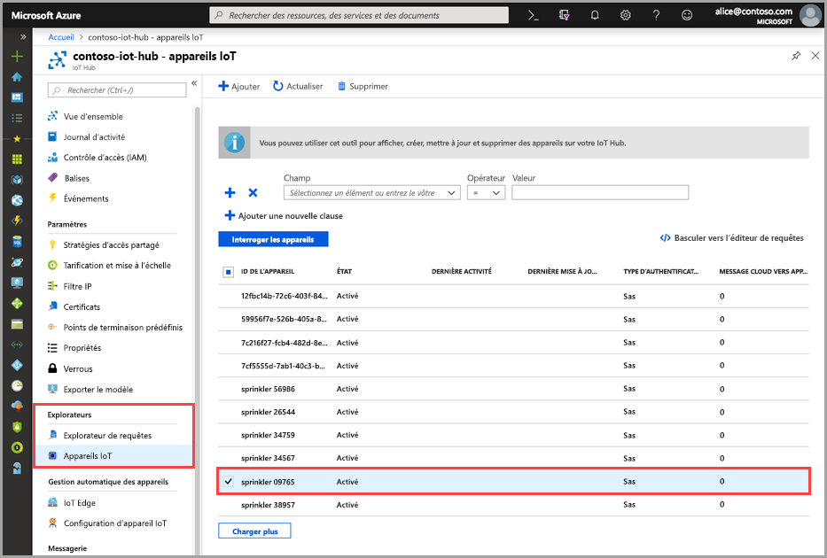
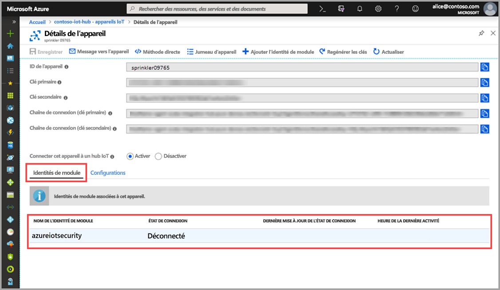

# Démarrage rapide : Créer un jumeau de module azureiotsecurity

> [!IMPORTANT]
> Azure Security Center pour IoT est disponible en préversion publique. Cette préversion est fournie sans contrat de niveau de service et n’est pas recommandée pour les charges de travail de production. Certaines fonctionnalités peuvent être limitées ou non prises en charge. Pour plus d’informations, consultez [Conditions d’Utilisation Supplémentaires relatives aux Évaluations Microsoft Azure](https://azure.microsoft.com/support/legal/preview-supplemental-terms/).

Les explications de ce guide de démarrage rapide détaillent la création de jumeaux de module _azureiotsecurity_ individuels destinés aux nouveaux appareils, ainsi que la création par lot de jumeaux de module pour tous les appareils d’un hub IoT.  

## Présentation des jumeaux de module azureiotsecurity 

Pour les solutions IoT intégrées à Azure, les jumeaux d’appareil jouent un rôle essentiel dans la gestion d’appareils et l’automatisation des processus. 

Azure Security Center (ASC) pour IoT offre une intégration complète à votre plateforme de gestion d’appareils IoT existants, ce qui vous permet de gérer l’état de sécurité de vos appareils et de tirer parti des fonctionnalités de contrôle d’appareils existants.
L’intégration ASC pour IoT est obtenue par l’utilisation du mécanisme de jumelage IoT Hub.  

Consultez [Jumeaux de module IoT Hub](https://docs.microsoft.com/azure/iot-hub/iot-hub-devguide-module-twins) pour en savoir plus sur le concept général des jumeaux de module dans Azure IoT Hub. 
 
ASC pour IoT utilise le mécanisme de jumelage de module et gère un jumeau de module de sécurité nommé _azureiotsecurity_ pour chacun de vos appareils.
Le jumeau de module de sécurité contient toutes les informations relatives à la sécurité de l’appareil pour chacun de vos appareils. 
 
Afin de tirer pleinement parti des caractéristiques ASC pour IoT, vous devez créer, configurer et utiliser ces jumeaux de module de sécurité pour chaque appareil dans le service.  

## Créer un jumeau de module azureiotsecurity 

Vous pouvez créer des jumeaux de module _azureiotsecurity_ de deux manières :
1. [Script de commandes par lot pour la création de module](https://aka.ms/iot-security-github-create-module) : crée automatiquement le jumeau de module pour les nouveaux appareils ou pour les appareils sans jumeau de module en utilisant la configuration par défaut.
2. Modifiez manuellement chaque jumeau de module individuellement avec des configurations spécifiques pour chaque appareil.

>[!NOTE] 
> L’utilisation de la méthode de traitement par lot ne remplace pas les jumeaux de module azureiotsecurity existants. L’utilisation de la méthode de traitement par lot crée UNIQUEMENT des jumeaux de module pour les appareils qui ne disposent pas encore d’un jumeau de module de sécurité. 

Consultez [Configuration des agents](how-to-agent-configuration.md) pour savoir comment modifier ou changer la configuration d’un jumeau de module existant. 

Pour créer manuellement un jumeau de module _azureiotsecurity_ destiné à un appareil, utilisez les instructions suivantes : 

1. Dans votre hub IoT, recherchez et sélectionnez l’appareil pour lequel vous souhaitez créer un jumeau de module de sécurité dans votre hub IoT.
1. Cliquez sur votre appareil, puis sur **Ajouter l’identité de module**.
1. Dans le champ **Nom de l’identité de module**, entrez **azureiotsecurity**.

1. Cliquez sur **Enregistrer**. 

## Vérifier la création d’un jumeau de module

Pour vérifier l’existence d’un jumeau de module de sécurité pour un appareil particulier :

1. Dans votre hub IoT, sélectionnez **Appareils IoT** dans le menu **Explorateurs**.    
1. Entrez l’ID de l’appareil, ou sélectionnez une option dans le **champ de recherche des appareils**, puis cliquez sur **Interroger les appareils**. 
    
1. Sélectionnez l’appareil ou double-cliquez dessus pour ouvrir la page des détails de l’appareil. 
1. Sélectionnez le menu **Identités de module** et vérifiez l’existence du module **azureiotsecurity** dans la liste des identités de module associées à l’appareil. 
    

Pour en savoir plus sur la personnalisation des propriétés des jumeaux de module ASC pour IoT, consultez [Configuration de l’agent](how-to-agent-configuration.md).

## Étapes suivantes

Passez à l’article suivant pour savoir comment configurer les alertes personnalisées...

> [!div class="nextstepaction"]
> [Configurer des alertes personnalisées](quickstart-create-custom-alerts.md)
