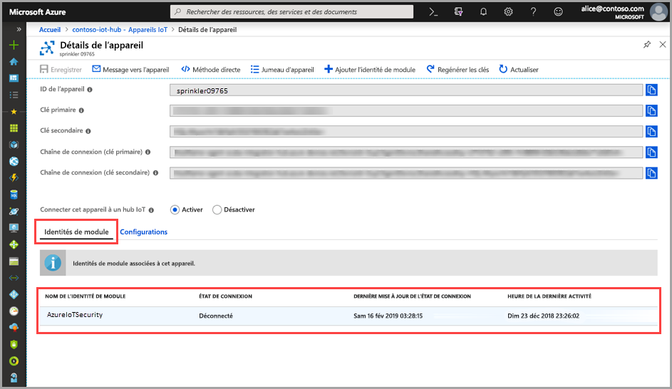

# Démarrage rapide : Créer un jumeau de module ASC pour IoT

> [!IMPORTANT]
> ASC pour IoT est actuellement disponible en préversion publique. Cette préversion est fournie sans contrat de niveau de service et n’est pas recommandée pour les charges de travail de production. Certaines fonctionnalités peuvent être limitées ou non prises en charge. Pour plus d’informations, consultez [Conditions d’Utilisation Supplémentaires relatives aux Évaluations Microsoft Azure](https://azure.microsoft.com/support/legal/preview-supplemental-terms/).

Les explications de ce guide de démarrage rapide détaillent la création de jumeaux de module ASC pour IoT individuels destinés aux nouveaux appareils, ainsi que la création par lot de jumeaux de module pour tous les appareils d’un hub IoT.  

## Présentation des jumeaux de module ASC pour IoT 

Pour les solutions IoT intégrées à Azure, les jumeaux d’appareil jouent un rôle essentiel dans la gestion d’appareils et l’automatisation des processus. 

ASC pour IoT offre une intégration complète à votre plateforme de gestion d’appareils IoT existants, ce qui vous permet de gérer l’état de sécurité de vos appareils et de tirer parti des fonctionnalités de contrôle d’appareils existants. L’intégration ASC pour IoT est obtenue par l’utilisation du mécanisme de jumelage IoT Hub.  

Consultez [Jumeaux de module IoT Hub](https://docs.microsoft.com/azure/iot-hub/iot-hub-devguide-module-twins) pour en savoir plus sur le concept général des jumeaux de module dans Azure IoT Hub. 
 
ASC pour IoT utilise le mécanisme de jumelage de module et gère le jumeau de module de sécurité pour chacun de vos appareils. Le jumeau de module de sécurité contient toutes les informations relatives à la sécurité de l’appareil pour chacun de vos appareils. 
 
Afin de tirer pleinement parti des caractéristiques ASC pour IoT, vous devez créer, configurer et utiliser ces jumeaux de module de sécurité pour chaque appareil dans le service.  

## Créer un jumeau de module ASC pour IoT 

Les jumeaux de module ASC pour IoT peuvent être créés en mode batch par le biais de la configuration par défaut, ou individuellement avec des configurations spécifiques pour chaque appareil. Pour la création par lot, destinée aux appareils nouveaux ou n’ayant pas de jumeau de module, utilisez le [script de commandes par lot de module](https://aka.ms/iot-security-github-create-module). 

>[!NOTE] 
> L’utilisation de la méthode de traitement par lot ne remplace pas les jumeaux de module existants. L’utilisation de la méthode de traitement par lot crée UNIQUEMENT des jumeaux de module pour les appareils qui ne disposent pas encore d’un jumeau de module. 

Consultez [Modifier un jumeau de module de sécurité](how-to-modify-security-module-twin.md) pour savoir comment modifier ou changer la configuration d’un jumeau de module existant. 

Pour créer un jumeau de module ASC pour IoT destiné à un appareil, utilisez les instructions suivantes : 

1. Dans votre hub IoT, recherchez et sélectionnez l’appareil pour lequel vous souhaitez créer un jumeau de module de sécurité dans votre hub IoT. 
1. Dans le champ **Nom de l’identité Microsoft**, entrez **ascforiotsecurity**.
1. Cliquez sur **Enregistrer**. 

## Vérifier la création d’un jumeau de module

Pour vérifier l’existence d’un jumeau de module de sécurité pour un appareil particulier :

1. Dans votre hub IoT, sélectionnez **Appareils IoT** dans le menu **Explorateurs**.    
1. Entrez l’ID de l’appareil, ou sélectionnez une option dans le **champ de recherche des appareils**, puis cliquez sur **Interroger les appareils**. 
    
1. Sélectionnez l’appareil ou double-cliquez dessus pour ouvrir la page des détails de l’appareil. 
1. Sélectionnez le menu **Identités de module** et vérifiez l’existence du module **ascforiotsecurity** et d’un **État de connexion** défini sur **Connecté**dans la liste des identités de module associées à l’appareil. 
    

Pour en savoir plus sur la personnalisation des propriétés des jumeaux de module ASC pour IoT, consultez [Configuration de l’agent](concept-agent-configuration.md).

## Étapes suivantes

Passez à l’article suivant pour savoir comment configurer les alertes personnalisées...

> [!div class="nextstepaction"]
> [Configurer les alertes personnalisées](quickstart-create-custom-alerts.md)
