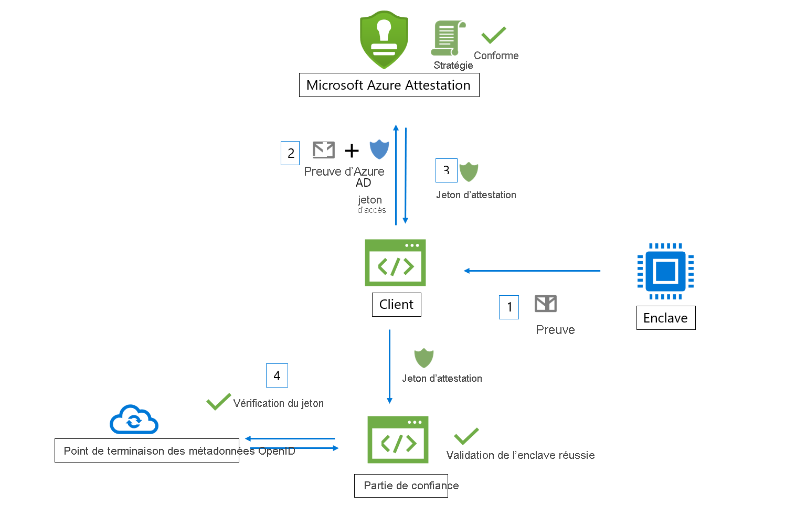
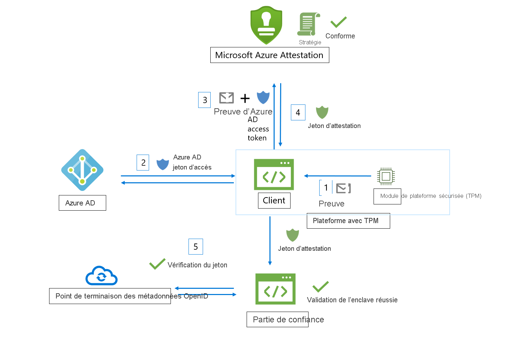

# Workflow

Microsoft Azure Attestation reçoit une preuve d’enclaves qu’elle évalue par rapport à la base de référence de la sécurité Azure et aux stratégies configurables. Si la vérification est concluante, Azure Attestation génère un jeton d’attestation pour vérifier la fiabilité des enclaves.

Voici les acteurs impliqués dans un workflow Azure Attestation :

- **Partie de confiance** : composant qui s’appuie sur Azure Attestation pour vérifier la validité de l’enclave. 
- **Client** : composant qui collecte des informations à partir d’une enclave et envoie des demandes à Azure Attestation. 
- **Azure Attestation** : composant qui accepte la preuve de l’enclave du client, la valide et retourne le jeton d’attestation au client.

## Workflow de validation d’enclave Intel® SGX (Software Guard Extensions)

Voici les étapes générales d’un workflow d’attestation d’enclave SGX type (en utilisant Azure Attestation) :

1. Le client collecte la preuve auprès d’une enclave. La preuve est constituée d’informations sur l’environnement de l’enclave et la bibliothèque de client qui s’exécute dans l’enclave.
1. Le client a un URI qui fait référence à une instance d’Azure Attestation. Le client envoie la preuve à Azure Attestation. Les informations envoyées au fournisseur dépendent du type d’enclave.
1. Azure Attestation valide les informations soumises et les évalue par rapport à une stratégie configurée. Si la vérification est réussie, Azure Attestation émet un jeton d’attestation et le retourne au client. Si cette étape échoue, Azure Attestation signale une erreur au client. 
1. Le client envoie le jeton d’attestation à la partie de confiance. La partie de confiance appelle le point de terminaison de métadonnées de clé publique d’Azure Attestation pour récupérer les certificats de signature. La partie de confiance vérifie ensuite la signature du jeton d’attestation et garantit la fiabilité de l’enclave. 

> [!Note]
> Quand vous envoyez des demandes d’attestation dans la version d’API [2018-09-01-preview](https://github.com/Azure/azure-rest-api-specs/tree/master/specification/attestation/data-plane/Microsoft.Attestation/stable/2018-09-01-preview), le client doit envoyer la preuve à Azure Attestation avec le jeton d’accès Azure AD.

## Workflow de validation de l’enclave TPM (Module de plateforme sécurisée)

Voici les étapes générales d’un workflow d’attestation d’enclave TPM type (en utilisant Azure Attestation) :

1.  Au démarrage de l’appareil ou de la plateforme, divers chargeurs de démarrage et services de démarrage mesurent les événements qui sont sauvegardés par le TPM et sont stockés de manière sécurisée (journal TCG).
2.  Le client collecte les journaux TCG de l’appareil et la déclaration TPM, qui sert de preuve d’attestation.
3.  Le client a un URI qui fait référence à une instance d’Azure Attestation. Le client envoie la preuve à Azure Attestation. Les informations exactes envoyées au fournisseur varient selon le type d’enclave.
4.  Azure Attestation valide les informations soumises et les évalue par rapport à une stratégie configurée. Si la vérification est réussie, Azure Attestation émet un jeton d’attestation et le retourne au client. Si cette étape échoue, Azure Attestation signale une erreur au client. La communication entre le client et le service d’attestation est dictée par le protocole TPM d’attestation Azure.
5.  Le client envoie ensuite le jeton d’attestation à la partie de confiance. La partie de confiance appelle le point de terminaison de métadonnées de clé publique d’Azure Attestation pour récupérer les certificats de signature. La partie de confiance vérifie ensuite la signature du jeton d’attestation et garantit la fiabilité des plateformes.

## Étapes suivantes
- [Guide pratique pour créer et signer une stratégie d’attestation](author-sign-policy.md)
- [Configurer Azure Attestation à l’aide de PowerShell](quickstart-powershell.md)
