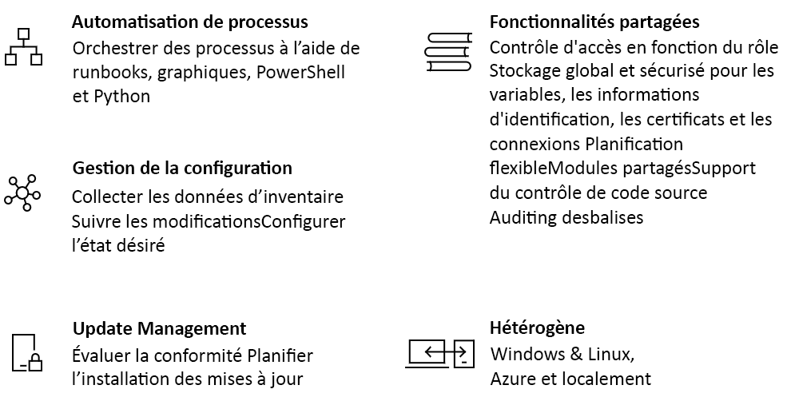

# Présentation d’Azure Automation

Cet article propose une brève présentation d’Azure Automation et apporte des réponses à certaines questions courantes. Pour plus d’informations sur les différentes fonctionnalités, consultez les liens que vous trouverez au fil de cette présentation.

## À propos d’Azure Automation

Azure Automation offre un service d’automatisation et de configuration cloud prenant en charge une gestion cohérente de vos environnements Azure et non-Azure. Il comprend l’automatisation des processus, la gestion de la configuration, la gestion des mises à jour, les fonctionnalités partagées et les fonctionnalités hétérogènes. Azure Automation vous offre un contrôle complet lors du déploiement, des opérations et de la désaffectation des charges de travail et des ressources.

## Automatisation de processus

L’automatisation des processus dans Azure Automation vous permet d’automatiser les tâches de gestion de cloud fréquentes, longues et sujettes aux erreurs. Ce service permet de vous concentrer sur des activités porteuses de valeur ajoutée. En diminuant le nombre d’erreurs et en augmentant l’efficacité, ce service vous permet également de réduire vos coûts d’exploitation. L’environnement d’exploitation d’automatisation des processus est détaillé dans [Exécution d’un runbook dans Azure Automation](automation-runbook-execution.md).

L’automatisation des processus prend en charge l’intégration des services Azure et d’autres systèmes publics requis pour le déploiement, la configuration et la gestion de vos processus de bout en bout. Le service vous permet de créer des [runbooks](automation-runbook-types.md) sous forme graphique dans PowerShell ou avec Python. L’utilisation d’un [runbook worker hybride](automation-hybrid-runbook-worker.md) permet d’unifier la gestion en assurant la coordination sur les environnements locaux. Les [webhooks](automation-webhooks.md) vous permettent de répondre aux demandes et de garantir la continuité de la livraison et des opérations en déclenchant l’automatisation à partir des systèmes de gestion ITSM, DevOps et de supervision. 

## Gestion des configurations

La [configuration de l’état](automation-dsc-overview.md) Azure Automation est une solution cloud pour la configuration DSC (Desired State Configuration) PowerShell qui fournit les services requis aux environnements d’entreprise. Avec cette fonctionnalité, vous pouvez gérer vos ressources DSC dans Azure Automation et appliquer des configurations aux machines virtuelles ou physiques à partir d’un serveur Pull DSC dans le cloud Azure. Vous pouvez superviser et mettre à jour automatiquement les configurations d’ordinateurs sur des machines virtuelles et physiques, sur Windows ou Linux, dans le cloud ou localement. La prise en charge de l’inventaire vous permet d’interroger les ressources intégrées pour voir les applications installées et d’autres éléments de configuration.
 
Le service de configuration d’état Azure Automation fournit des fonctionnalités de création de rapports et de recherche enrichies. Vous pouvez utiliser ces fonctionnalités pour trouver des informations détaillées sur les éléments configurés dans un système d’exploitation. Le service prend en charge le suivi des modifications sur les services, les démons, les logiciels, le Registre et les fichiers de votre environnement pour vous aider à diagnostiquer les changements indésirables et à déclencher des alertes. Une fonctionnalité associée importante est la création de rapports d’événements majeurs, par exemple des événements émis quand des nœuds s’écartent de leurs configurations attribuées. 

## Gestion des mises à jour

Azure Automation comprend la solution de [gestion des mises à jour](automation-update-management.md) pour les systèmes Windows et Linux dans des environnements hybrides. Avec cette solution, vous pouvez voir la conformité des mises à jour sur Azure et d’autres clouds, et en local. La gestion des mises à jour vous permet de créer des déploiements planifiés qui coordonnent l’installation de mises à jour dans une fenêtre de maintenance définie. Si une mise à jour ne doit pas être installée sur un ordinateur, vous pouvez utiliser les fonctionnalités de gestion des mises à jour pour l’exclure d’un déploiement.

## Fonctionnalités partagées

Azure Automation propose un certain nombre de fonctionnalités partagées, notamment des ressources partagées, le contrôle d’accès en fonction du rôle, la planification flexible, l’intégration du contrôle de code source, l’audit et le balisage.

### Ressources partagées

Azure Automation se compose d’un ensemble de ressources partagées qui facilitent l’automatisation et la configuration de vos environnements à grande échelle.

* **[Planifications](automation-schedules.md)** - Déclenchez des opérations Automation à des heures prédéfinies.
* **[Modules](automation-integration-modules.md)** - Gérez Azure et d’autres systèmes. Vous pouvez importer les modules dans le compte Automation pour Microsoft, un tiers ou une communauté, et des ressources DSC et des applets de commande définies personnalisées.
* **[Galerie de modules](automation-runbook-gallery.md)** - Prend en charge l’intégration native à PowerShell Gallery pour que vous puissiez afficher des runbooks et les importer dans le compte Automation. La galerie vous permet de commencer rapidement à intégrer et à créer vos processus à partir de PowerShell Gallery et du Centre de scripts Microsoft.
* **[Packages Python 2](python-packages.md)** - Prennent en charge les runbooks Python 2 pour votre compte Automation.
* **[Informations d’identification](automation-credentials.md)** - Permettent de stocker en toute sécurité des informations sensibles que les runbooks et configurations peuvent utiliser lors de l’exécution.
* **[Connexions](automation-connections.md)** - Stockent des paires nom-valeur d’informations communes pour les connexions aux systèmes. L’auteur du module définit les connexions dans des runbooks et configurations pour les utiliser lors de l’exécution.
* **[Certificats](automation-certificates.md)** - Définissent des informations à utiliser pour l’authentification et la sécurisation des ressources déployées quand les runbooks ou les configurations DSC y accèdent au moment de l’exécution. 
* **[Variables](automation-variables.md)** - Stockent du contenu pouvant être utilisé dans des runbooks et des configurations. Vous pouvez changer les valeurs des variables sans avoir à modifier les runbooks ou configurations qui y font référence.

### Contrôle d’accès en fonction du rôle

Azure Automation prend en charge le contrôle d’accès en fonction du rôle (RBAC) pour réguler l’accès au compte Automation et à ses ressources. Pour en savoir plus sur la configuration du contrôle d’accès en fonction du rôle sur votre compte Automation, les runbooks et les travaux, consultez [Contrôle d’accès en fonction du rôle dans Azure Automation](automation-role-based-access-control.md).

### Intégration du contrôle de code source

Azure Automation autorise l’[intégration du contrôle de code source](source-control-integration.md). Cette fonctionnalité promeut la configuration en tant que code où les runbooks ou les configurations peuvent être archivés dans un système de contrôle de code source.

## Prise en charge hétérogène (Windows et Linux)

Azure Automation est conçu pour fonctionner dans votre environnement cloud hybride et aussi vos systèmes Windows et Linux. Il offre un moyen cohérent d’automatiser et de configurer les charges de travail déployées et les systèmes d’exploitation qui les exécutent.

## Scénarios courants pour Automation

Azure Automation prend en charge la gestion tout au long du cycle de vie de votre infrastructure et des applications. Scénarios courants :

* **Écrire des runbooks** - Créez des runbooks graphiques, PowerShell, PowerShell Workflow, Python 2 et DSC dans des langages courants. 
* **Générer et déployer des ressources** - Déployez des machines virtuelles dans un environnement hybride à l’aide de runbooks et de modèles Azure Resource Manager. Intégrez des outils de développement, comme Jenkins et Azure DevOps.
* **Configurer des machines virtuelles** - Évaluez et configurez des machines Windows et Linux avec des configurations pour l’infrastructure et l’application.
* **Partager les connaissances** - Transférez au système les connaissances relatives à la manière dont l’organisation fournit et gère les charges de travail. 
* **Récupérer l’inventaire** - Obtenez un inventaire complet des ressources déployées à des fins de ciblage, de création de rapports et de conformité. 
* **Rechercher les modifications** - Identifiez les modifications pouvant entraîner une configuration incorrecte et améliorez la conformité opérationnelle.
* **Superviser** - Isolez les modifications apportées aux machines à l’origine des problèmes et corrigez-les ou faites-les remonter aux systèmes de gestion.
* **Protéger** - Mettez les machines en quarantaine si des alertes de sécurité sont déclenchées. Définition d’exigences intégrées.
* **Régir** - Configurez le contrôle d’accès en fonction du rôle pour les équipes. Récupération de ressources qui ne sont pas utilisées.

[!INCLUDE [azure-lighthouse-supported-service](../../includes/azure-lighthouse-supported-service.md)]

## Tarif d’Automation

Vous pouvez consulter les prix associés à Azure Automation dans la page relative aux [tarifs](https://azure.microsoft.com/pricing/details/automation/).

## Étapes suivantes

> [!div class="nextstepaction"]
> [Créer un compte Automation](automation-quickstart-create-account.md)

