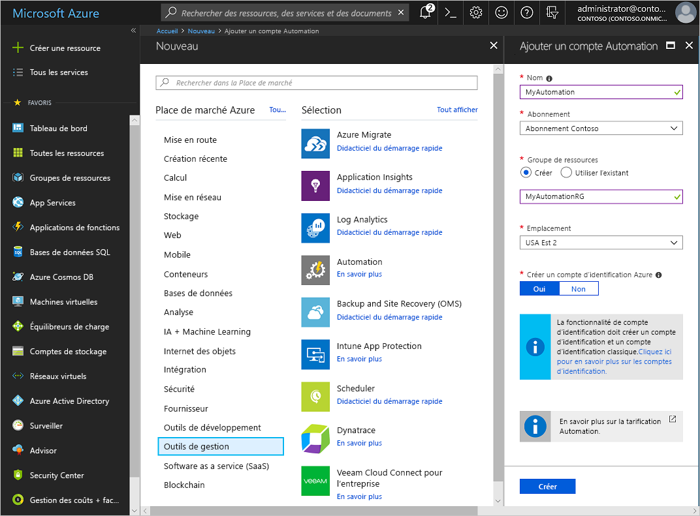
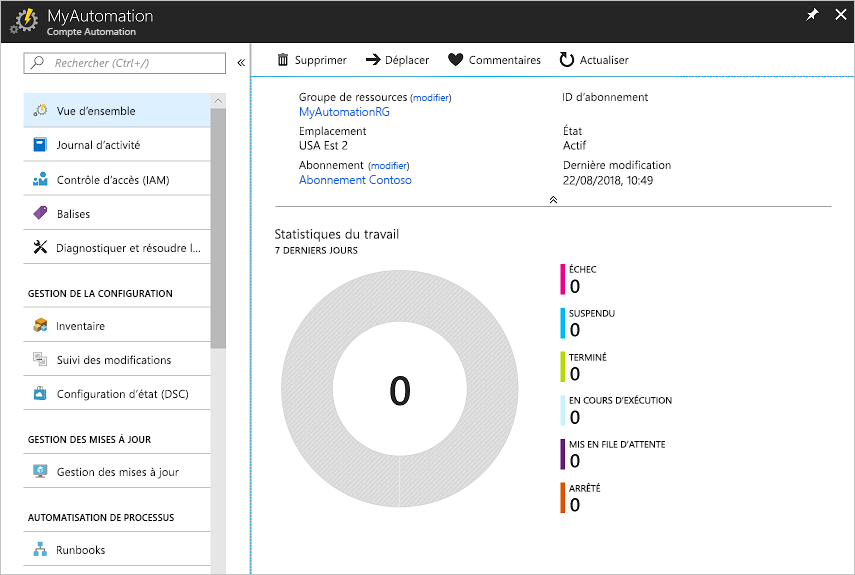
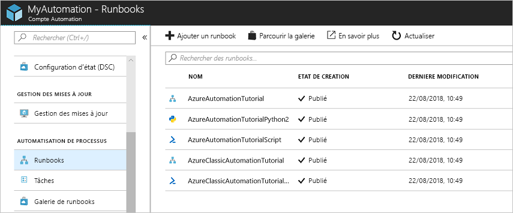
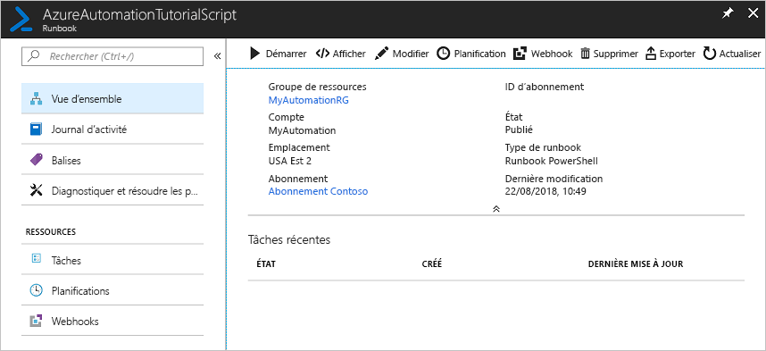
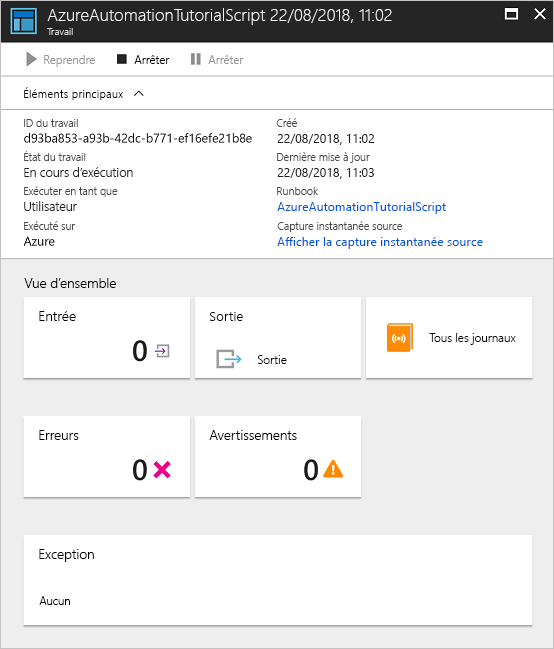

# Créer un compte Azure Automation

Vous pouvez créer un compte Azure Automation via Azure, à l’aide du portail Azure, une interface utilisateur basée sur un navigateur permettant d’accéder à un certain nombre de ressources. Un compte Automation peut gérer les ressources sur l’ensemble des régions et abonnements pour un locataire donné. 

Ce démarrage rapide vous guide tout au long de la création d’un compte Automation et l’exécution d’un runbook dans le compte. Si vous n’avez pas d’abonnement Azure, créez un [compte Azure gratuit](https://azure.microsoft.com/free/?WT.mc_id=A261C142F) avant de commencer.

## Connexion à Azure

[Connectez-vous à Azure](https://portal.azure.com).

## Créer un compte Automation

1. Choisissez un nom pour votre compte Azure. Les noms de compte Automation sont spécifiques à une région et à un groupe de ressources. Il est possible que les noms de comptes Automation qui ont été supprimés ne soient pas immédiatement disponibles.

    > [!NOTE]
    > Vous ne pouvez pas changer le nom du compte une fois qu’il a été entré dans l’interface utilisateur. 

2. Cliquez sur le bouton **Créer une ressource** en haut à gauche du portail Azure.

3. Sélectionnez **Informatique et outils de gestion**, puis sélectionnez **Automation**.

4. Entrez les informations sur le compte, dont le nom du compte sélectionné. Pour **Créer un compte d’identification Azure**, choisissez **Oui** afin que les artefacts simplifiant l’authentification à Azure soient automatiquement activés. Quand les informations sont complètes, cliquez sur **Créer** pour démarrer le déploiement du compte Automation.

      

    > [!NOTE]
    > Pour obtenir une liste mise à jour des emplacements sur lesquels vous pouvez déployer un compte Automation, consultez [Disponibilité des produits par région](https://azure.microsoft.com/global-infrastructure/services/?products=automation&regions=all).

5. Une fois le déploiement terminé, cliquez sur **Tous les services**.

6. Sélectionnez **Comptes Automation**, puis choisissez le compte Automation que vous avez créé.

    

## Exécuter un runbook

Exécutez l’un des runbooks de didacticiel.

1. Cliquez sur **Runbooks** sous **Automatisation de processus**. La liste des runbooks s’affiche. Par défaut, plusieurs runbooks de tutoriel sont activés dans le compte.

    

1. Sélectionnez le runbook **AzureAutomationTutorialScript**. Cette action ouvre la page de vue d’ensemble du runbook.

    

1. Cliquez sur **Démarrer** puis, dans la page Démarrer le runbook, cliquez sur **OK** pour démarrer le runbook.

    

1. Lorsque l’état du travail devient `Running`, cliquez sur **Sortie** ou **Tous les journaux** pour afficher la sortie du travail de runbook. Pour ce runbook de didacticiel, la sortie est une liste de vos ressources Azure.

## Étapes suivantes

Dans ce démarrage rapide, vous avez déployé un compte Automation, démarré un travail de runbook et affiché les résultats du travail. Pour en savoir plus sur Azure Automation, continuez en faisant le démarrage rapide pour créer votre premier runbook.

> [!div class="nextstepaction"]
> [Démarrage rapide Automation - Créer un runbook Azure Automation](./automation-quickstart-create-runbook.md)

