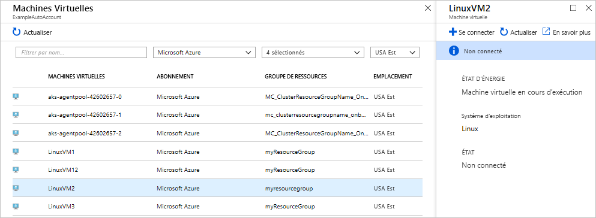
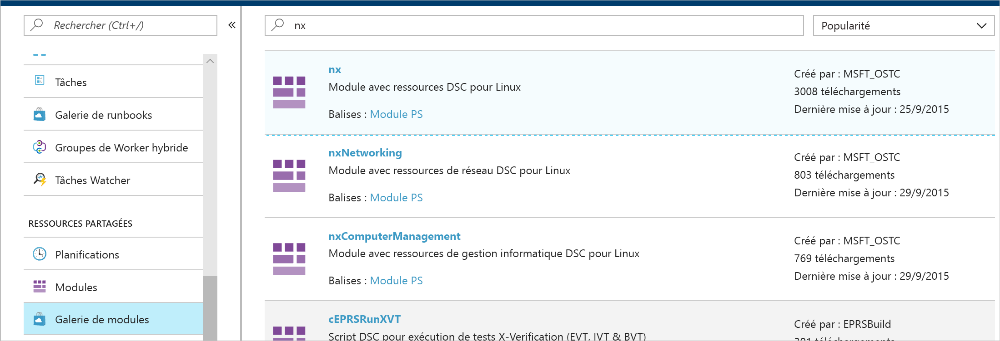
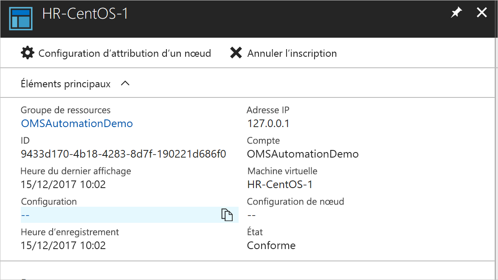
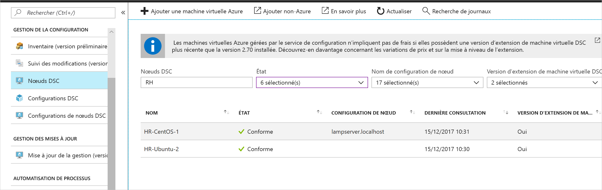

# <a name="configure-a-vm-with-desired-state-configuration"></a>Configurer une machine virtuelle avec DSC (Desired State Configuration)

En activant Azure Automation State Configuration, vous pouvez gérer et superviser les configurations de vos serveurs Windows et Linux avec la configuration DSC (Desired State Configuration). Les configurations dérivant d’une configuration souhaitée peuvent être identifiées ou corrigées automatiquement. Ce guide de démarrage rapide vous guide dans l’activation d’une machine virtuelle Linux et le déploiement d’une pile LAMP à l’aide d’Azure Automation - State Configuration.

## <a name="prerequisites"></a>Prérequis

Pour effectuer ce démarrage rapide, les éléments suivants sont requis :

* Un abonnement Azure. Si vous n’avez pas d’abonnement Azure, [créez un compte gratuit](https://azure.microsoft.com/free/).
* Un compte Azure Automation. Pour obtenir des instructions sur la création d’un compte d’identification Azure Automation, consultez [Authentifier des Runbooks avec un compte d’identification Azure](./manage-runas-account.md).
* Une machine virtuelle Azure Resource Manager (autre que classique) exécutant Red Hat Enterprise Linux, CentOS ou Oracle Linux. Pour obtenir des instructions sur la création d’une machine virtuelle, consultez [Créer votre première machine virtuelle Linux dans le portail Azure](../virtual-machines/linux/quick-create-portal.md).

## <a name="sign-in-to-azure"></a>Connexion à Azure
Connectez-vous à Azure sur https://portal.azure.com.

## <a name="enable-a-virtual-machine"></a>Activer une machine virtuelle

Il existe plusieurs méthodes pour activer une machine et la fonctionnalité State Configuration. Ce guide de démarrage rapide indique comment activer la fonctionnalité pour une machine virtuelle à l’aide d’un compte Automation. Pour plus d’informations sur les différentes méthodes d’activation de vos machines pour State Configuration, consultez [Activer la gestion des machines par Azure Automation - State Configuration](./automation-dsc-onboarding.md).

1. Dans le volet de gauche du portail Azure, sélectionnez **Comptes Automation**. Si cette option n’est pas visible dans le volet de gauche, cliquez sur **Tous les services**, puis recherchez-la dans la vue obtenue.
1. Dans la liste, sélectionnez un compte Automation.
1. Dans le volet de gauche du compte Automation, sélectionnez **Configuration d’état (DSC)** .
2. Cliquez sur **Ajouter** pour ouvrir la page Sélection de machine virtuelle.
3. Recherchez la machine virtuelle pour laquelle activer DSC. Vous pouvez utiliser le champ de recherche et les options de filtre pour rechercher une machine virtuelle en particulier.
4. Cliquez sur la machine virtuelle, puis sur **Connexion**
5. Sélectionnez les paramètres DSC adaptés à la machine virtuelle. Si vous avez déjà préparé une configuration, vous pouvez la spécifier en tant que `Node Configuration Name`. Vous pouvez définir le [mode de configuration](/powershell/scripting/dsc/managing-nodes/metaConfig) pour contrôler le comportement de la configuration de la machine.
6. Cliquez sur **OK**. Lors du déploiement de l’extension DSC sur la machine virtuelle, l’état indique `Connecting`.



## <a name="import-modules"></a>Modules d’importation

Ces modules contiennent des ressources DSC et nombreux se trouvent dans [PowerShell Gallery](https://www.powershellgallery.com). Toutes les ressources utilisées dans vos configurations doivent être importées dans le compte Automation avant la compilation. Pour ce didacticiel, le module nommé **nx** est requis.

1. Dans le volet de gauche du compte Automation, sélectionnez **Galerie de modules** sous **Ressources partagées**.
1. Recherchez le module à importer en tapant une partie de son nom : `nx`.
1. Cliquez sur le module à importer.
1. Cliquez sur **Importer**.



## <a name="import-the-configuration"></a>Importer la configuration

Ce démarrage rapide utilise une configuration DSC qui configure Apache HTTP Server, MySQL et PHP sur l’ordinateur. Consultez [Configurations DSC](/powershell/scripting/dsc/configurations/configurations).

Dans un éditeur de texte, tapez la commande suivante et enregistrez-la localement sous le nom **AMPServer.ps1**.

```powershell-interactive
configuration 'LAMPServer' {
   Import-DSCResource -module "nx"

   Node localhost {

        $requiredPackages = @("httpd","mod_ssl","php","php-mysql","mariadb","mariadb-server")
        $enabledServices = @("httpd","mariadb")

        #Ensure packages are installed
        ForEach ($package in $requiredPackages){
            nxPackage $Package{
                Ensure = "Present"
                Name = $Package
                PackageManager = "yum"
            }
        }

        #Ensure daemons are enabled
        ForEach ($service in $enabledServices){
            nxService $service{
                Enabled = $true
                Name = $service
                Controller = "SystemD"
                State = "running"
            }
        }
   }
}
```

Pour importer la configuration :

1. Dans le volet de gauche du compte Automation, sélectionnez **Configuration d’état (DSC)** puis cliquez sur l’onglet **Configurations**.
2. Cliquez sur **+ Ajouter**.
3. Sélectionnez le fichier de configuration que vous avez enregistré à l’étape précédente.
4. Cliquez sur **OK**.

## <a name="compile-a-configuration"></a>Compiler une configuration

Vous devez compiler une configuration DSC dans une configuration de nœuds (document MOF) avant de pouvoir l’affecter à un nœud. La compilation valide la configuration et permet la saisie des valeurs de paramètre. Pour en savoir plus sur la compilation d’une configuration, consultez [Compilation de configurations dans State Configuration](automation-dsc-compile.md).

1. Dans le volet de gauche du compte Automation, sélectionnez **Configuration d’état (DSC)** puis cliquez sur l’onglet **Configurations**.
1. Sélectionnez la configuration `LAMPServer`.
1. Parmi les options de menu, sélectionnez **Compiler**, puis cliquez sur **Oui**.
1. Dans la vue Configuration,une nouvelle tâche de compilation apparaît en file d’attente. Lorsque cette tâche est terminée, vous êtes prêt à passer à l’étape suivante. En cas de problème, vous pouvez cliquer sur cette tâche de compilation pour plus d’informations.

## <a name="assign-a-node-configuration"></a>Affecter une configuration de nœud

Vous pouvez affecter une configuration de nœuds compilée à un nœud DSC. L’affectation applique la configuration à l’ordinateur et supervise ou corrige automatiquement tout écart.

1. Dans le volet de gauche du compte Automation, sélectionnez **State Configuration (DSC)** , puis cliquez sur l’onglet **Nœuds**.
1. Sélectionnez le nœud auquel vous souhaitez affecter une configuration.
1. Cliquez sur **Assign Node Configuration** (Affecter une configuration de nœud).
1. Sélectionnez la configuration de nœuds `LAMPServer.localhost` et cliquez sur **OK**. State Configuration affecte désormais la configuration compilée au nœud, et l’état du nœud devient `Pending`. Au cours de la prochaine vérification périodique, le nœud récupère la configuration, l’applique et signale son état. Jusqu’à 30 minutes peuvent être nécessaires pour que le nœud récupère la configuration, selon ses paramètres. 
1. Pour forcer une vérification immédiate, vous pouvez exécuter la commande suivante en local sur la machine virtuelle Linux :`sudo /opt/microsoft/dsc/Scripts/PerformRequiredConfigurationChecks.py`



## <a name="view-node-status"></a>Afficher l’état du nœud

Vous pouvez voir l’état de tous les nœuds gérés par State Configuration dans votre compte Automation. Pour voir ces informations, choisissez **State Configuration (DSC)** , puis cliquez sur l’onglet **Nœuds**. Vous pouvez filtrer cette vue par état et configuration de nœud ou recherchez son nom.



## <a name="next-steps"></a>Étapes suivantes

Dans ce guide de démarrage rapide, vous avez activé une machine virtuelle Linux pour State Configuration, créé une configuration pour une pile LAMP et déployé la configuration sur la machine virtuelle. Pour savoir comment utiliser Azure Automation State Configuration afin d’activer un déploiement continu, lisez l’article suivant :

> [!div class="nextstepaction"]
> [Configurer un déploiement continu avec Chocolatey](./automation-dsc-cd-chocolatey.md)
