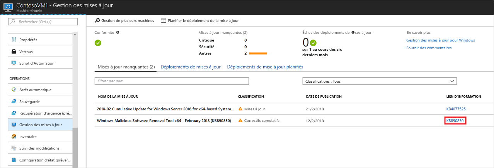
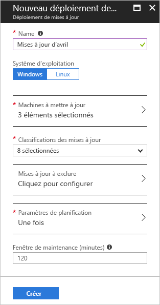
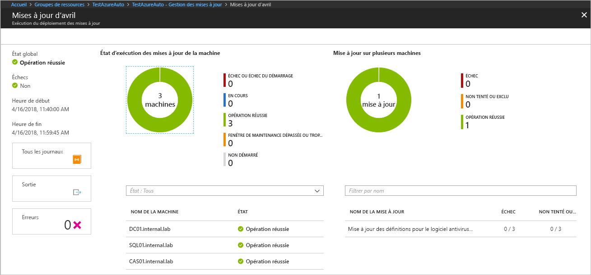

# Gérer les mises à jour et les correctifs pour vos machines virtuelles Azure

Vous pouvez utiliser la solution de gestion des mises à jour pour gérer les mises à jour et les correctifs pour vos machines virtuelles. Dans ce tutoriel, vous allez découvrir comment évaluer rapidement l’état des mises à jour disponibles, planifier l’installation des mises à jour nécessaires, passer en revue les résultats des déploiements et créer une alerte pour vérifier que les mises à jour sont appliquées correctement.

Pour plus d’informations sur les prix, consultez [Tarification d’Automation pour la gestion des mises à jour](https://azure.microsoft.com/pricing/details/automation/)

Dans ce tutoriel, vous allez apprendre à :

> [!div class="checklist"]
> * Afficher une évaluation des mises à jour
> * Configurer les alertes
> * Planifier un déploiement de mises à jour
> * Afficher les résultats d’un déploiement

## Prérequis

Pour suivre ce didacticiel, vous avez besoin des éléments suivants :

* La solution [Update Management](automation-update-management.md), activée pour une ou plusieurs de vos machines virtuelles.
* Une [machine virtuelle](../virtual-machines/windows/quick-create-portal.md) à intégrer.

## Connexion à Azure

Connectez-vous au portail Azure sur https://portal.azure.com.

## Afficher l’évaluation des mises à jour

Une fois que vous avez activé Gestion des mises à jour, la page Gestion des mises à jour s’ouvre. Si des mises à jour sont identifiées comme manquantes, une liste des mises à jour manquantes s’affiche sous l’onglet **Mises à jour manquantes**.

Sous **Lien d’informations**, sélectionnez le lien de mise à jour pour ouvrir l’article du support de la mise à jour. Vous y trouverez des informations importantes sur la mise à jour.

Cliquez n’importe où ailleurs sur la mise à jour afin d’ouvrir le volet Recherche dans les journaux pour la mise à jour sélectionnée. La requête pour la recherche dans les journaux est prédéfinie pour cette mise à jour spécifique. Vous pouvez modifier cette requête ou créer votre propre requête afin d’afficher des informations détaillées sur les mises à jour déployées ou manquantes dans votre environnement.

## Configurer des alertes

Lors de cette étape, vous allez configurer une alerte afin d’être informé de l’état d’un déploiement de mise à jour.

### Conditions d’alerte

Dans votre compte Automation, accédez à **Alertes** sous **Supervision**, puis cliquez sur **Nouvelle règle d’alerte**.

Votre compte Automation est déjà sélectionné en tant que ressource. Si vous souhaitez le changer, cliquez sur **Sélectionner**. Dans la page Sélectionner une ressource, choisissez **Comptes Automation** dans le menu déroulant **Filtrer par type de ressource**. Sélectionnez votre compte Automation, puis cliquez sur **Terminé**.

Cliquez sur **Ajouter une condition** pour sélectionner le signal qui convient à votre déploiement de mises à jour. Le tableau suivant présente les détails des deux signaux disponibles.

|Nom du signal|Dimensions|Description|
|---|---|---|
|`Total Update Deployment Runs`|- Nom du déploiement de mises à jour - Statut|Ce signal génère des alertes concernant le statut global d’un déploiement de mises à jour.|
|`Total Update Deployment Machine Runs`|- Nom du déploiement de mises à jour - Statut - Ordinateur cible - ID d’exécution du déploiement des mises à jour|Ce signal génère des alertes concernant le statut d’un déploiement de mises à jour ciblant des machines spécifiques.|

Pour une dimension, sélectionnez une valeur valide dans la liste. Si la valeur souhaitée ne figure pas dans la liste, cliquez sur le signe **\+** à côté de la dimension et tapez le nom personnalisé. Sélectionnez ensuite la valeur à rechercher. Si vous voulez sélectionner toutes les valeurs d’une dimension, cliquez sur le bouton **Sélectionner \*** . Si vous ne choisissez aucune valeur de dimension, Update Management ignore cette dimension.

Sous **Logique d’alerte**, pour **Seuil**, entrez **1**. Quand vous avez terminé, cliquez sur **Terminé**.

### Détails de l’alerte

Sous **2. Définissez les détails de l’alerte**, entrez un nom et une description pour l’alerte. Définissez **Gravité** sur **Informations (gravité 2)** pour une exécution réussie, ou sur **Informations (gravité 1)** pour une exécution ayant échoué.

Sous **Groupes d’action**, sélectionnez **Créer**. Un groupe d’actions est un groupe que vous pouvez utiliser dans plusieurs alertes. Les actions peuvent inclure les notifications par e-mail, les runbooks, les webhooks et bien plus encore. Pour en savoir plus sur les groupes d’actions, consultez [Créer et gérer des groupes d’actions](../azure-monitor/platform/action-groups.md).

Dans le champ **Nom du groupe d’actions**, entrez un nom pour l’alerte et un nom court. Update Management utilise le nom abrégé à la place d’un nom complet de groupe d’actions lors de l’envoi de notifications pour le groupe spécifié.

Sous **Actions**, entrez un nom pour l’action, par exemple **Notification par e-mail**. Comme **Type d’action**, sélectionnez **E-mail/SMS/Push/Voix**. Pour **Détails**, sélectionnez **Modifier les détails**.

Dans le volet E-mail/SMS/Push/Voix, entrez un nom. Cochez la case **E-mail**, puis entrez une adresse e-mail valide.

Dans le volet E-mail/SMS/Push/Voix, cliquez sur **OK**. Dans le volet Ajouter un groupe d’actions, cliquez sur **OK**.

Pour personnaliser l’objet de l’e-mail d’alerte, sous **Créer une règle**, sous **Personnaliser les actions**, sélectionnez **Objet de l’e-mail**. Lorsque vous avez terminé, cliquez sur **Créer une règle d’alerte**. L’alerte vous avertit quand un déploiement de mises à jour s’est correctement déroulé et précise quelles machines en ont bénéficié.

## Planifier un déploiement de mises à jour

Ensuite, planifiez un déploiement qui suit votre fenêtre de planification et de maintenance des versions pour installer les mises à jour. Vous pouvez choisir les types de mises à jour à inclure dans le déploiement. Par exemple, vous pouvez inclure des mises à jour critiques ou de sécurité et exclure des correctifs cumulatifs.

>[!NOTE]
>La planification d’un déploiement de mises à jour entraîne la création d’une ressource de [planification](shared-resources/schedules.md) liée au runbook **Patch-MicrosoftOMSComputers**, qui gère le déploiement des mises à jour sur les machines cibles. Si vous supprimez la ressource de planification dans le Portail Azure ou si vous utilisez PowerShell après la création du déploiement, l’opération de suppression arrête le déploiement de mises à jour planifié. De plus, une erreur est générée quand vous essayez de reconfigurer la ressource de planification à partir du Portail. Vous ne pouvez supprimer la ressource de planification qu’en supprimant la planification de déploiement correspondante.  

Pour planifier un nouveau déploiement de mises à jour pour la machine virtuelle, accédez à **Gestion des mises à jour**, puis cliquez sur **Planifier le déploiement de la mise à jour**.

Sous **Nouveau déploiement de mises à jour**, spécifiez les informations suivantes :

* **Name** : entrez un nom unique pour le déploiement de mises à jour.

* **Système d’exploitation** : sélectionnez le système d’exploitation à cibler pour le déploiement de mises à jour.

* **Groupes à mettre à jour (préversion)**  : Définissez une requête qui combine un abonnement, des groupes de ressources, des emplacements et des étiquettes pour créer un groupe dynamique de machines virtuelles Azure à inclure dans votre déploiement. Pour plus d’informations, consultez [Groupes dynamiques](automation-update-management-groups.md).

* **Machines à mettre à jour** : Sélectionnez une recherche enregistrée, un groupe importé ou choisissez **Machines** dans la liste déroulante et sélectionnez des machines individuelles. Si vous choisissez **Machines**, l’état de préparation de chaque machine est indiqué dans la colonne **Préparation de la mise à jour de l’agent**. Pour en savoir plus sur les différentes méthodes de création de groupes d’ordinateurs dans les journaux Azure Monitor, consultez [Groupes d’ordinateurs dans les journaux Azure Monitor](../azure-monitor/platform/computer-groups.md).

* **Classification des mises à jour** : Pour chaque produit, désélectionnez toutes les classifications de mises à jour prises en charge, à l’exception de celles que vous souhaitez inclure dans votre déploiement de mises à jour. Pour ce tutoriel, laissez tous les types sélectionnés pour tous les produits.

  Les types de classification sont les suivants :

   |Système d''exploitation  |Type  |
   |---------|---------|
   |Windows     | Mises à jour critiques Mises à jour de sécurité Correctifs cumulatifs Packs de fonctionnalités Service Packs Mises à jour de définitions Outils Mises à jour Pilote        |
   |Linux     | Mises à jour critiques et de sécurité Autres mises à jour       |

   Pour les descriptions des types de classifications, consultez [Classifications des mises à jour](automation-view-update-assessments.md#update-classifications).

* **Mises à jour à inclure/exclure** : ouvre la page Inclure/Exclure. Les mises à jour à inclure ou à exclure sont présentées dans des onglets séparés en fonction des numéros d’identification des articles de la Base de connaissances que vous spécifiez. Quand vous indiquez un ou plusieurs numéros d’identification, vous devez supprimer ou décocher toutes les classifications pour le déploiement de mises à jour. Cela garantit qu’aucune autre mise à jour n’est incluse dans votre package de mises à jour lors de la spécification des ID de mises à jour.

> [!NOTE]
> Il est important de se souvenir que les exclusions sont prioritaires sur les inclusions. Par exemple, si vous définissez une règle d’exclusion de `*`, Update Management n’installe aucuns correctifs ou packages puisque cette règle les exclut tous. Les correctifs exclus sont toujours affichés comme étant manquants sur l’ordinateur. Sur les machines Linux, si vous incluez un package qui a un package dépendant ayant été exclu, Update Management n’installe pas le package principal.

> [!NOTE]
> Vous ne pouvez pas spécifier des mises à jour qui ont été remplacées pour être incluses dans le déploiement des mises à jour.
>

* **Paramètres de planification** : le volet Paramètres de planification s’affiche. L’heure de début par défaut est dans 30 minutes. Vous pouvez définir l’heure de début à tout moment à partir de 10 minutes à l’avenir.

   Vous pouvez également spécifier si le déploiement se produit une seule fois ou configurer une planification périodique. Sous **Récurrence**, sélectionnez **Une fois**. Conservez la valeur par défaut de 1 jour et cliquez sur **OK**. Ces entrées configurent une planification périodique.

* **Préscripts + postscripts** : sélectionnez les scripts à exécuter avant et après votre déploiement. Pour plus d’informations, consultez [Gérer les pré-scripts et les post-scripts](pre-post-scripts.md).

* **Fenêtre de maintenance (minutes)**  : Conservez la valeur par défaut. Les fenêtres de maintenance contrôlent la période pendant laquelle les mises à jour doivent être installées. Tenez compte des détails suivants au moment de spécifier une fenêtre de maintenance :

  * Les fenêtres de maintenance contrôlent le nombre de mises à jour installées.
  * Update Management n’arrête pas l’installation de nouvelles mises à jour si la fin d’une fenêtre de maintenance est proche.
  * Update Management ne met pas fin aux mises à jour en cours si la fenêtre de maintenance est dépassée.
  * Le dépassement de la fenêtre de maintenance sur Windows est souvent le signe que l’installation d’une mise à jour de Service Pack prend beaucoup de temps.

  > [!NOTE]
  > Pour éviter que les mises à jour soient appliquées en dehors d’une fenêtre de maintenance sur Ubuntu, reconfigurez le package Unattended-Upgrade pour désactiver les mises à jour automatiques. Pour plus d’informations sur la configuration du package, consultez la rubrique [Mises à jour automatiques du Guide du serveur Ubuntu](https://help.ubuntu.com/lts/serverguide/automatic-updates.html).

* **Options de redémarrage** : permettent de spécifier les options de gestion des redémarrages. Les options suivantes sont disponibles :
  * Redémarrer si nécessaire (option par défaut)
  * Toujours redémarrer
  * Ne jamais redémarrer
  * Redémarrer uniquement : n’installe pas les mises à jour

> [!NOTE]
> Les clés de Registre listées sous [Clés de Registre utilisées pour gérer le redémarrage](/windows/deployment/update/waas-restart#registry-keys-used-to-manage-restart) peuvent provoquer un événement de redémarrage même si **Options de redémarrage** est défini sur **Ne jamais redémarrer**.

Quand vous avez terminé de configurer la planification, cliquez sur **Créer**.

Vous revenez au tableau de bord d’état. Sélectionnez **Déploiements des mises à jour planifiés** pour afficher la planification de déploiement que vous venez de créer.

> [!NOTE]
> Update Management prend en charge le déploiement des mises à jour internes et le pré-téléchargement des correctifs. Cette prise en charge nécessite la modification de certains paramètres sur les systèmes corrigés. Pour savoir comment configurer ces paramètres sur vos systèmes, consultez les [informations de support sur les mises à jour internes et les pré-téléchargements](automation-configure-windows-update.md).

Vous pouvez également créer des déploiements de mises à jour par programmation. Pour savoir comment créer un déploiement de mises à jour avec l’API REST, consultez [Configurations des mises à jour logicielles - Créer](/rest/api/automation/softwareupdateconfigurations/create). Vous pouvez également utiliser un exemple de runbook fourni pour créer un déploiement de mises à jour hebdomadaires. Pour en savoir plus sur ce runbook, consultez [Créer un déploiement de mises à jour hebdomadaires pour une ou plusieurs machines virtuelles dans un groupe de ressources](https://gallery.technet.microsoft.com/scriptcenter/Create-a-weekly-update-2ad359a1).

## Afficher les résultats d’un déploiement de mises à jour

Une fois que le déploiement planifié démarre, vous pouvez voir l’état de ce déploiement sous l’onglet **Déploiements des mises à jour** sous **Gestion des mises à jour**. Si le déploiement est en cours d’exécution, son état est **En cours**. Quand le déploiement s’est déroulé correctement, son état passe à **Réussi**. Si une ou plusieurs mises à jour ont échoué pendant le déploiement, l’état passe à **Échec partiel**.

Sélectionnez le déploiement de mises à jour terminé pour voir le tableau de bord associé.

Sous **Résultats des mises à jour**, un récapitulatif indique le nombre total de mises à jour et de résultats du déploiement sur la machine virtuelle. Le tableau de droite montre une répartition détaillée de chaque mise à jour et les résultats de l’installation.

Les valeurs disponibles sont :

* **Aucune tentative effectuée** : la mise à jour n’a pas été installée, car le temps disponible était insuffisant d’après la durée définie pour la fenêtre de maintenance.
* **Opération réussie** : la mise à jour a réussi.
* **Échec** : la mise à jour a échoué.

Pour voir toutes les entrées de journal d’activité créées par le déploiement, sélectionnez **Tous les journaux d’activité**.

Cliquez sur **Sortie** pour voir le flux des tâches du runbook chargé de gérer le déploiement des mises à jour sur la machine virtuelle cible.

Pour afficher les informations détaillées sur les erreurs du déploiement, sélectionnez **Erreurs**.

Une fois que vous avez effectué le déploiement des mises à jour, vous recevez un e-mail de confirmation similaire à ceci :

## Étapes suivantes

Dans ce didacticiel, vous avez appris à :

> [!div class="checklist"]
> * Intégrer une machine virtuelle pour la gestion des mises à jour
> * Afficher une évaluation des mises à jour
> * Configurer les alertes
> * Planifier un déploiement de mises à jour
> * Afficher les résultats d’un déploiement

Passez à la vue d’ensemble de la solution de gestion des mises à jour.

> [!div class="nextstepaction"]
> [Solution de gestion des mises à jour](automation-update-management.md)