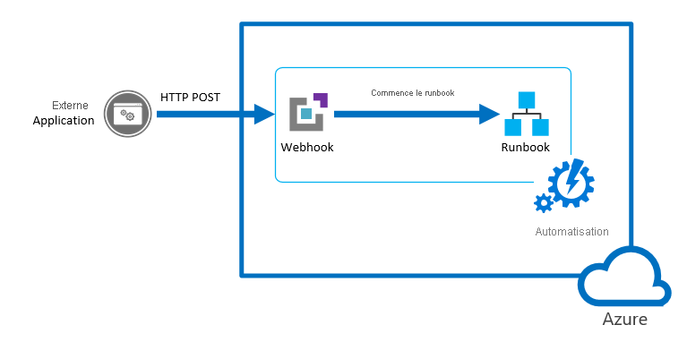

# <a name="start-a-runbook-from-a-webhook"></a>Démarrer un runbook depuis un Webhook

Un webhook permet à un service externe de démarrer un runbook particulier dans Azure Automation via une simple requête HTTP. Ces services externes incluent Azure DevOps Services, GitHub, les journaux Azure Monitor et les applications personnalisées. De tels services peuvent utiliser un Webhook pour démarrer un runbook sans implémenter toute l’API Azure Automation. Pour comparer les webhooks aux autres méthodes de démarrage d’un runbook, consultez [Démarrage d’un runbook dans Azure Automation](./start-runbooks.md).

> [!NOTE]
> L’utilisation d’un webhook pour démarrer un runbook Python n’est pas prise en charge.



Pour comprendre la configuration requise du client pour le protocole TLS 1.2 avec les webhooks, consultez [Application de TLS 1.2 pour Azure Automation](automation-managing-data.md#tls-12-enforcement-for-azure-automation).

## <a name="webhook-properties"></a>Propriétés des webhooks

Le tableau suivant décrit les propriétés que vous devez configurer pour un webhook.

| Propriété | Description |
|:--- |:--- |
| Nom |Nom du webhook. Vous pouvez attribuer le nom de votre choix, puisque celui-ci n’est pas visible par le client. Il sert seulement à identifier le runbook dans Azure Automation. À titre de meilleure pratique, nommez le webhook d’après le client qui l’utilise. |
| URL |URL du webhook. Il s’agit de l’adresse unique qu’un client appelle avec une méthode HTTP POST pour démarrer le runbook lié au webhook. Elle est générée automatiquement lorsque vous créez le webhook. Vous ne pouvez pas spécifier d’URL personnalisée. <br> <br> L’URL contient un jeton de sécurité qui permet à un système tiers d’appeler le runbook sans authentification supplémentaire. Pour cette raison, vous devez traiter l’URL comme un mot de passe. Pour des raisons de sécurité, vous pouvez uniquement afficher l’URL dans le portail Azure au moment de la création du webhook. Notez l'URL dans un emplacement sécurisé en vue d'une utilisation ultérieure. |
| Date d'expiration | Date d’expiration du webhook, après laquelle il ne peut plus être utilisé. Vous pouvez modifier la date d’expiration du webhook après sa création, tant que celui-ci n’a pas encore expiré. |
| activé | Paramètre indiquant si le webhook doit être activé par défaut lors de sa création. Si vous affectez la valeur Disabled à cette propriété, aucun client ne pourra utiliser le webhook. Vous pouvez définir cette propriété pendant ou après la création du webhook. |

## <a name="parameters-used-when-the-webhook-starts-a-runbook"></a>Paramètres utilisés lorsque le webhook démarre un runbook

Un webhook peut définir les valeurs des paramètres du runbook qui sont utilisées au démarrage de celui-ci. Le webhook doit inclure les valeurs de tous les paramètres obligatoires du runbook, et peut inclure les valeurs des paramètres facultatifs. Une valeur de paramètre configurée pour un webhook peut être modifiée même après la création de celui-ci. Plusieurs webhooks liés à un même runbook peuvent utiliser des valeurs différentes pour les paramètres du runbook. Lorsqu’un client démarre un runbook à l’aide d’un webhook, il ne peut pas remplacer les valeurs de paramètres définies dans le webhook.

Pour recevoir des données du client, le runbook accepte un paramètre unique appelé `WebhookData`. Ce paramètre définit un objet contenant les données que le client inclut dans une requête POST.


Le paramètre `WebhookData` possède les propriétés suivantes :

| Propriété | Description |
|:--- |:--- |
| `WebhookName` | Nom du webhook. |
| `RequestHeader` | Table de hachage contenant les en-têtes de la requête POST entrante. |
| `RequestBody` | Corps de la requête POST entrante. Le corps conserve les mises en forme de données (chaînes, JSON, XML ou données encodées dans un formulaire). Le Runbook doit être écrit pour fonctionner avec le format de données qui est attendu. |

Aucune configuration du webhook n’est nécessaire pour prendre en charge le paramètre `WebhookData`. En outre, le runbook n’est pas obligé de l’accepter. Si le runbook ne définit pas le paramètre, tous les détails de la requête envoyée à partir du client sont ignorés.

> [!NOTE]
> Lors de l’appel d’un webhook, le client doit toujours stocker toutes les valeurs de paramètre en cas d’échec de l’appel. En cas de panne réseau ou de problème de connexion, l’application ne pourra pas récupérer les appels de webhook qui ont échoué.

Si vous spécifiez une valeur pour `WebhookData` lors de la création du webhook, celle-ci sera remplacée lorsque le webhook démarrera le runbook avec les données de la requête POST du client. Cela se produit même s’il n’existe aucune donnée dans le corps de la requête de l’application. 

Si vous démarrez un runbook qui définit `WebhookData` à l’aide d’un mécanisme autre qu’un webhook, vous pouvez fournir une valeur pour `WebhookData` que le runbook reconnaîtra. Cette valeur doit correspondre à un objet ayant les mêmes [propriétés](#webhook-properties) que le paramètre `WebhookData`, afin que le runbook puisse l’utiliser de la même manière qu’il utilise les objets `WebhookData` qui sont passés par un webhook.

Par exemple, si vous démarrez le runbook suivant à partir du portail Azure et souhaitez passer des exemples de données de webhook à des fins de test, vous devez passer ces données au format JSON dans l’interface utilisateur.


Dans l’exemple de runbook suivant, nous allons définir les propriétés suivantes pour `WebhookData` :

* **WebhookName** : MyWebhook
* **RequestBody** : `*[{'ResourceGroup': 'myResourceGroup','Name': 'vm01'},{'ResourceGroup': 'myResourceGroup','Name': 'vm02'}]*`

Nous passons maintenant l’objet JSON suivant dans l’interface utilisateur pour le paramètre `WebhookData`. Cet exemple, avec les retours chariot et les caractères de nouvelle ligne, correspond au format qui est passé à partir d’un webhook.

```json
{"WebhookName":"mywebhook","RequestBody":"[\r\n {\r\n \"ResourceGroup\": \"vm01\",\r\n \"Name\": \"vm01\"\r\n },\r\n {\r\n \"ResourceGroup\": \"vm02\",\r\n \"Name\": \"vm02\"\r\n }\r\n]"}
```


> [!NOTE]
> Azure Automation journalise les valeurs de tous les paramètres d’entrée associés au travail de runbook. Par conséquent, toutes les entrées fournies par le client dans la requête webhook seront journalisées et accessibles à toute personne ayant accès au travail Automation. Pour cette raison, soyez prudent lorsque vous incluez des informations sensibles dans les appels du webhook.

## <a name="webhook-security"></a>Sécurité des webhooks

La sécurité d’un webhook dépend de la confidentialité de son URL, laquelle contient un jeton de sécurité permettant au webhook d’être appelé. Azure Automation n’effectue pas d’authentification de la requête tant que celle-ci est adressée à la bonne URL. Pour cette raison, vos clients ne doivent pas utiliser les webhooks pour les runbooks qui exécutent des opérations hautement sensibles, sans recourir à un autre moyen de validation de la requête.

Tenez compte des stratégies suivantes :

* Vous pouvez inclure une logique dans un runbook pour déterminer si celui-ci est appelé par un webhook. Indiquez au runbook de vérifier la propriété `WebhookName` du paramètre `WebhookData`. Le runbook peut effectuer une validation supplémentaire en recherchant des informations spécifiques dans les propriétés `RequestHeader` et `RequestBody`.

* Faites en sorte que le runbook valide une condition externe quand il reçoit une demande de webhook. Par exemple, imaginez un runbook qui soit appelé par GitHub à chaque nouvelle validation effectuée dans un dépôt GitHub. Avant de poursuivre, le runbook peut se connecter à GitHub pour vérifier qu’une nouvelle validation s’est produite.

* Azure Automation prend en charge les étiquettes de service de réseau virtuel Azure, plus précisément [GuestAndHybridManagement](../virtual-network/service-tags-overview.md). Vous pouvez utiliser des étiquettes de service pour définir des contrôles d’accès réseau sur des [groupes de sécurité réseau](../virtual-network/network-security-groups-overview.md#security-rules) ou sur le [pare-feu Azure](../firewall/service-tags.md) et déclencher des webhooks à partir de votre réseau virtuel. Les étiquettes de service peuvent être utilisées à la place d’adresses IP spécifiques pendant la création de règles de sécurité. En spécifiant le nom d’étiquette de service **GuestAndHybridManagement** dans le champ source ou de destination approprié d’une règle, vous pouvez autoriser ou refuser le trafic pour le service Automation. Cette étiquette de service ne permet pas d’autoriser un contrôle plus granulaire en limitant les plages d’adresses IP à une région spécifique.

## <a name="create-a-webhook"></a>Créer un webhook

Utilisez la procédure suivante pour créer un webhook lié à un Runbook dans le portail Azure.

1. Dans la page Runbooks du portail Azure, cliquez sur le runbook que le webhook démarre afin d’afficher les informations relatives au runbook. Vérifiez que le champ **État** du runbook est défini sur **Publié**.
2. Cliquez sur **Webhook** en haut de la page pour ouvrir la page Ajouter un webhook.
3. Cliquez sur **Créer un webhook** pour ouvrir la page Créer un webhook.
4. Renseignez les champs **Nom** et **Date d’expiration** pour le webhook, et spécifiez si celui-ci doit être activé. Pour plus d’informations sur ces propriétés, consultez [Propriétés des webhooks](#webhook-properties).
5. Cliquez sur l'icône de copie et appuyez sur Ctrl + C pour copier l'URL du webhook. Puis enregistrez-la dans un endroit sûr. 

    > [!NOTE]
    > Une fois que vous avez créé le webhook,vous ne pouvez plus récupérer l’URL.

   

1. Cliquez sur **Paramètres** pour fournir les valeurs des paramètres du Runbook. Si le runbook a des paramètres obligatoires, vous ne pouvez pas créer le webhook sans fournir de valeurs.

2. Cliquez sur **Créer** pour créer le webhook.

## <a name="use-a-webhook"></a>Utiliser un webhook

Pour utiliser un webhook après sa création, votre client doit émettre une requête HTTP `POST` avec l’URL du webhook. La syntaxe est :

```http
http://<Webhook Server>/token?=<Token Value>
```

Le client reçoit de la requête `POST` l’un des codes de retour suivants.

| Code | Texte | Description |
|:--- |:--- |:--- |
| 202 |Acceptée |La requête a été acceptée et le Runbook a été mis en file d'attente avec succès. |
| 400 |Demande incorrecte |La requête a été refusée pour l'une des raisons suivantes : <ul> <li>Le webhook a expiré.</li> <li>Le webhook est désactivé.</li> <li>Le jeton de l’URL n’est pas valide.</li>  </ul> |
| 404 |Introuvable |La requête a été refusée pour l'une des raisons suivantes : <ul> <li>Le webhook est introuvable.</li> <li>Le Runbook est introuvable.</li> <li>Le compte est introuvable.</li>  </ul> |
| 500 |Erreur interne du serveur |L'URL est valide, mais une erreur s'est produite. Soumettez à nouveau la demande. |

Si la requête aboutit, la réponse webhook contiendra l’ID de travail au format JSON, comme illustré ci-dessous. Elle contiendra un seul ID de travail. Toutefois, le format JSON permettra des améliorations ultérieures potentielles.

```json
{"JobIds":["<JobId>"]}
```

Le client ne peut pas déterminer l’issue du travail du runbook ou de son état d’achèvement à partir du webhook. Il peut trouver ces informations à l’aide de l’ID du travail et d’un autre mécanisme tel que [Windows PowerShell](/powershell/module/servicemanagement/azure.service/get-azureautomationjob) ou l’[API Azure Automation](/rest/api/automation/job).

## <a name="renew-a-webhook"></a>Renouveler un webhook

Lorsqu’un webhook est créé, il reste valide pendant dix ans, puis expire automatiquement. Une fois que le webhook a expiré, vous ne pouvez pas le réactiver. Vous pouvez uniquement le supprimer, puis le recréer. 

Vous pouvez prolonger la durée de validité d’un webhook qui n’a pas encore expiré. Pour prolonger la durée de validité d’un webhook :

1. Accédez au runbook qui contient le webhook. 
2. Sélectionnez **Webhooks** sous **Ressources**. 
3. Cliquez sur le webhook dont vous voulez prolonger la durée de validité. 
4. Dans la page Webhook, choisissez une nouvelle date et une nouvelle heure d’expiration, puis cliquez sur **Enregistrer**.

## <a name="sample-runbook"></a>Exemple de runbook

L’exemple de runbook suivant accepte les données du webhook et démarre les machines virtuelles spécifiées dans le corps de la demande. Pour tester ce runbook, dans votre compte Automation sous **Runbooks**, cliquez sur **Créer un runbook**. Si vous ne savez pas comment créer un runbook, consultez [Création d’un runbook](automation-quickstart-create-runbook.md).

> [!NOTE]
> Pour les runbooks PowerShell non graphiques, `Add-AzAccount` et `Add-AzureRMAccount` sont des alias de [Connect-AzAccount](/powershell/module/az.accounts/connect-azaccount). Vous pouvez utiliser ces cmdlets ou [mettre à jour vos modules](automation-update-azure-modules.md) dans votre compte Automation vers les dernières versions. Il est possible que vous deviez mettre à jour vos modules, même si vous venez de créer un compte Automation.

```powershell
param
(
    [Parameter (Mandatory = $false)]
    [object] $WebhookData
)

# If runbook was called from Webhook, WebhookData will not be null.
if ($WebhookData) {

    # Check header for message to validate request
    if ($WebhookData.RequestHeader.message -eq 'StartedbyContoso')
    {
        Write-Output "Header has required information"}
    else
    {
        Write-Output "Header missing required information";
        exit;
    }

    # Retrieve VMs from Webhook request body
    $vms = (ConvertFrom-Json -InputObject $WebhookData.RequestBody)

    # Authenticate to Azure by using the service principal and certificate. Then, set the subscription.

    Write-Output "Authenticating to Azure with service principal and certificate"
    $ConnectionAssetName = "AzureRunAsConnection"
    Write-Output "Get connection asset: $ConnectionAssetName"

    $Conn = Get-AutomationConnection -Name $ConnectionAssetName
            if ($Conn -eq $null)
            {
                throw "Could not retrieve connection asset: $ConnectionAssetName. Check that this asset exists in the Automation account."
            }
            Write-Output "Authenticating to Azure with service principal."
            Add-AzAccount -ServicePrincipal -Tenant $Conn.TenantID -ApplicationId $Conn.ApplicationID -CertificateThumbprint $Conn.CertificateThumbprint | Write-Output

        # Start each virtual machine
        foreach ($vm in $vms)
        {
            $vmName = $vm.Name
            Write-Output "Starting $vmName"
            Start-AzVM -Name $vm.Name -ResourceGroup $vm.ResourceGroup
        }
}
else {
    # Error
    write-Error "This runbook is meant to be started from an Azure alert webhook only."
}
```

## <a name="test-the-sample"></a>Tester l’exemple

L'exemple suivant utilise Windows PowerShell pour démarrer un Runbook avec un webhook. Tous les langages qui peuvent envoyer une requête HTTP peuvent utiliser un webhook. Windows PowerShell est utilisé ici à titre d’exemple.

Le Runbook s'attend à une liste de machines virtuelles au format JSON dans le corps de la requête. Le runbook vérifie également que les en-têtes contiennent un message défini afin de vérifier que l’appelant webhook est valide.

```azurepowershell-interactive
$uri = "<webHook Uri>"

$vms  = @(
            @{ Name="vm01";ResourceGroup="vm01"},
            @{ Name="vm02";ResourceGroup="vm02"}
        )
$body = ConvertTo-Json -InputObject $vms
$header = @{ message="StartedbyContoso"}
$response = Invoke-WebRequest -Method Post -Uri $uri -Body $body -Headers $header
$jobid = (ConvertFrom-Json ($response.Content)).jobids[0]
```

L’exemple suivant montre le corps de la requête qui est disponible pour le runbook dans la propriété `RequestBody` de `WebhookData`. Cette valeur est au format JSON afin d’être compatible avec le format inclus dans le corps de la requête.

```json
[
    {
        "Name":  "vm01",
        "ResourceGroup":  "myResourceGroup"
    },
    {
        "Name":  "vm02",
        "ResourceGroup":  "myResourceGroup"
    }
]
```

L'illustration suivante montre la requête envoyée à partir de Windows PowerShell et sa réponse. L’ID de travail est extrait de la réponse et converti en une chaîne.


## <a name="next-steps"></a>Étapes suivantes

* Pour déclencher un runbook à partir d’une alerte, consultez [Utiliser une alerte pour déclencher un runbook Azure Automation](automation-create-alert-triggered-runbook.md).