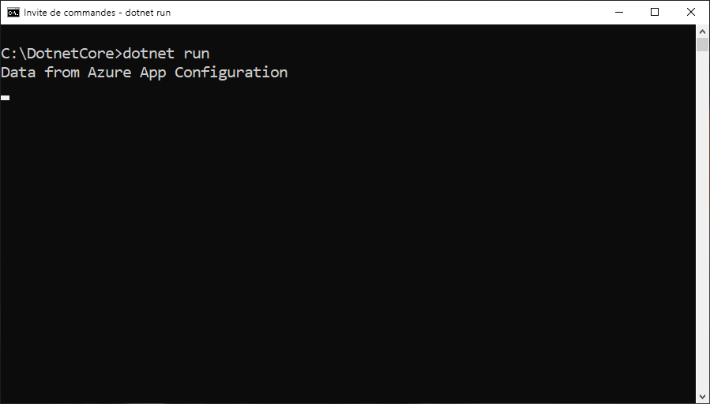

# <a name="tutorial-use-dynamic-configuration-in-a-net-core-app"></a>Tutoriel : Utiliser la configuration dynamique dans une application .NET Core

La bibliothèque de client .NET Core App Configuration prend en charge la mise à jour de la configuration à la demande, sans entraîner le redémarrage de l’application. Vous pouvez implémenter cette configuration en obtenant d’abord une instance de `IConfigurationRefresher` parmi les options du fournisseur de configuration, puis en appelant `TryRefreshAsync` sur cette instance, à n’importe quel endroit de votre code.

Pour maintenir les paramètres à jour et éviter trop d’appels au magasin de configuration, un cache est utilisé pour chaque paramètre. Tant que la valeur mise en cache d’un paramètre n’a pas expiré, l’opération d’actualisation ne met pas à jour la valeur, même si celle-ci a été modifiée dans le magasin de configuration. Pour chaque requête, le délai d’expiration par défaut est de 30 secondes. Toutefois, vous pouvez le modifier selon vos besoins.

Ce tutoriel montre comment vous pouvez implémenter des mises à jour de la configuration dynamique dans votre code. Il s’appuie sur l’application mentionnée dans les guides de démarrage rapide. Avant de continuer, terminez d’abord l’étape [Créer une application .NET Core avec App Configuration](./quickstart-dotnet-core-app.md).

Vous pouvez utiliser l’éditeur de code de votre choix pour exécuter les étapes de ce tutoriel. [Visual Studio Code](https://code.visualstudio.com/) est une excellente option qui est disponible sur les plateformes Windows, macOS et Linux.

Dans ce tutoriel, vous allez apprendre à :

> [!div class="checklist"]
> * Configurer votre application .NET Core pour mettre à jour sa configuration en réponse aux changements survenant dans un magasin App Configuration.
> * Utiliser la configuration la plus récente dans votre application.

## <a name="prerequisites"></a>Prérequis

Pour effectuer ce tutoriel, installez le [kit SDK .NET Core](https://dotnet.microsoft.com/download).

[!INCLUDE [quickstarts-free-trial-note](../../includes/quickstarts-free-trial-note.md)]

## <a name="reload-data-from-app-configuration"></a>Recharger des données à partir d’Azure App Configuration

Ouvrez le fichier *Program.cs* et mettez-le à jour pour ajouter une référence à l’espace de noms `System.Threading.Tasks`, ceci afin de spécifier la configuration de l’actualisation dans la méthode `AddAzureAppConfiguration` et de déclencher l’actualisation manuelle à l’aide de la méthode `TryRefreshAsync`.

```csharp
using System;
using System.Threading.Tasks;

namespace TestConsole
{
class Program
{
    private static IConfiguration _configuration = null;
    private static IConfigurationRefresher _refresher = null;

    static void Main(string[] args)
    {
        var builder = new ConfigurationBuilder();
        builder.AddAzureAppConfiguration(options =>
        {
            options.Connect(Environment.GetEnvironmentVariable("ConnectionString"))
                    .ConfigureRefresh(refresh =>
                    {
                        refresh.Register("TestApp:Settings:Message")
                               .SetCacheExpiration(TimeSpan.FromSeconds(10));
                    });
                    
                    _refresher = options.GetRefresher();
        });

        _configuration = builder.Build();
        PrintMessage().Wait();
    }

    private static async Task PrintMessage()
    {
        Console.WriteLine(_configuration["TestApp:Settings:Message"] ?? "Hello world!");

        // Wait for the user to press Enter
        Console.ReadLine();

        await _refresher.TryRefreshAsync();
        Console.WriteLine(_configuration["TestApp:Settings:Message"] ?? "Hello world!");
    }
}
}
```

La méthode `ConfigureRefresh` permet de spécifier les paramètres utilisés pour mettre à jour les données de configuration à l’aide du magasin App Configuration quand une opération d’actualisation est déclenchée. Vous pouvez récupérer une instance de `IConfigurationRefresher` en appelant la méthode `GetRefresher` dans les options fournies à la méthode `AddAzureAppConfiguration`. Vous pouvez aussi utiliser la méthode `TryRefreshAsync` de cette instance pour déclencher une opération d’actualisation n’importe où dans votre code.
    
> [!NOTE]
> Pour un paramètre de configuration, le délai d’expiration du cache par défaut est de 30 secondes. Toutefois, vous pouvez le modifier en appelant la méthode `SetCacheExpiration` de l’initialiseur d’options qui est passé en tant qu’argument à la méthode `ConfigureRefresh`.

## <a name="build-and-run-the-app-locally"></a>Générer et exécuter l’application localement

1. Définissez une variable d’environnement nommée **ConnectionString** et affectez-lui la valeur de la clé d’accès à votre magasin App Configuration. Si vous utilisez l’invite de commandes Windows, exécutez la commande suivante et redémarrez l’invite pour que la modification soit prise en compte :

    ```console
     setx ConnectionString "connection-string-of-your-app-configuration-store"
    ```

    Si vous utilisez Windows PowerShell, exécutez la commande suivante :

    ```powershell
     $Env:ConnectionString = "connection-string-of-your-app-configuration-store"
    ```

    Si vous utilisez macOS ou Linux, exécutez la commande suivante :

    ```console
     export ConnectionString='connection-string-of-your-app-configuration-store'
    ```

1. Exécutez la commande suivante pour générer l’application console :

    ```console
     dotnet build
    ```

1. La génération terminée correctement, lancez la commande suivante pour exécuter l’application localement :

    ```console
     dotnet run
    ```

    

1. Connectez-vous au [portail Azure](https://portal.azure.com). Sélectionnez **Toutes les ressources**, puis sélectionnez l’instance du magasin App Configuration que vous avez créée dans le guide de démarrage rapide.

1. Sélectionnez **Explorateur de configuration**, puis mettez à jour les valeurs des clés suivantes :

    | Clé | Valeur |
    |---|---|
    | TestApp:Settings:Message | Données issues d’Azure App Configuration - Mise à jour |

1. Appuyez sur la touche Entrée pour déclencher une actualisation et afficher la valeur mise à jour dans l’invite de commandes ou dans la fenêtre PowerShell.

    
    
    > [!NOTE]
    > Étant donné que le délai d’expiration du cache a été défini sur 10 secondes à l’aide de la méthode `SetCacheExpiration` lors de la spécification de la configuration de l’opération d’actualisation, la valeur du paramètre de configuration ne sera actualisée que si 10 secondes se sont écoulées depuis la dernière actualisation de ce paramètre.

## <a name="clean-up-resources"></a>Nettoyer les ressources

[!INCLUDE [azure-app-configuration-cleanup](../../includes/azure-app-configuration-cleanup.md)]

## <a name="next-steps"></a>Étapes suivantes

Dans ce tutoriel, vous avez permis à votre application .NET Core d’actualiser dynamiquement les paramètres de configuration à partir d’App Configuration. Pour savoir comment utiliser une identité managée Azure afin de simplifier l’accès à App Configuration, passez au tutoriel suivant.

> [!div class="nextstepaction"]
> [Intégration des identités managées](./howto-integrate-azure-managed-service-identity.md)
