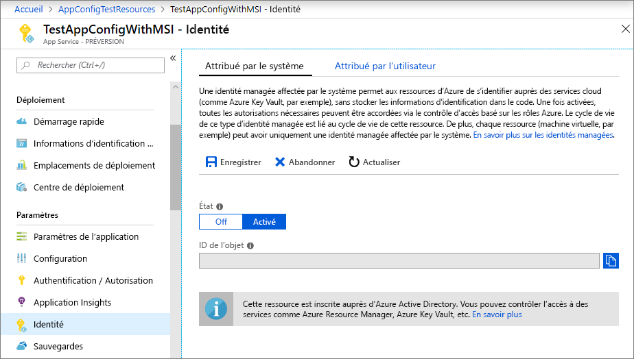
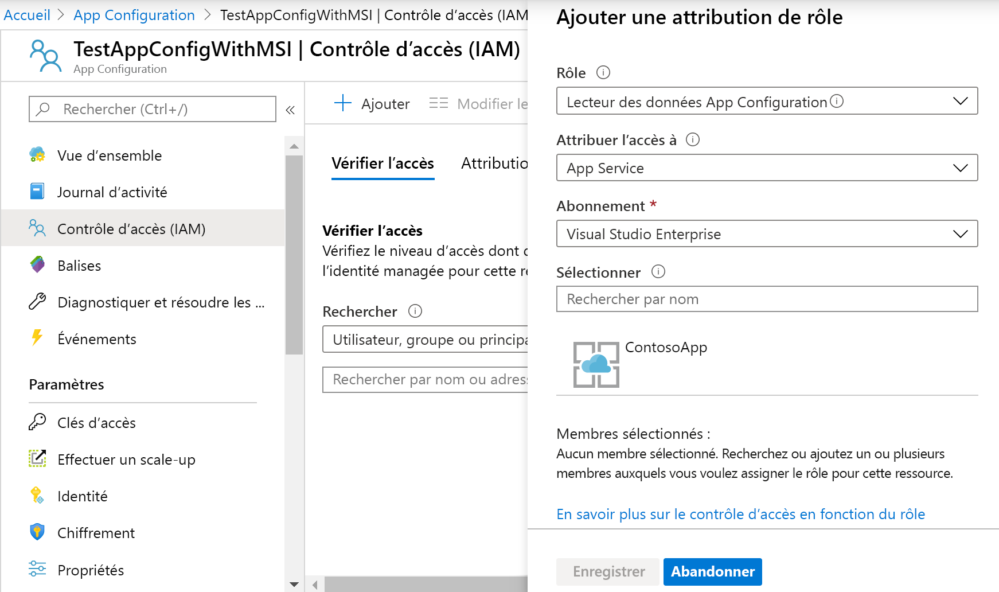

# <a name="integrate-with-azure-managed-identities"></a>Intégrer avec des identités managées Azure

Les [identités managées](../active-directory/managed-identities-azure-resources/overview.md) Azure Active Directory simplifient la gestion des secrets pour votre application cloud. Avec une identité managée, votre code peut utiliser le principal de service qui a été créé pour le service Azure sur lequel il s’exécute. Vous utilisez une identité managée à la place d’une information d’identification distincte stockée dans Azure Key Vault ou une chaîne de connexion locale. 

Azure App Configuration et ses bibliothèques clientes .NET Core, .NET Framework et Java Spring sont fournis avec la prise en charge de l’identité managée qui leur est intégrée. Bien que vous ne soyez pas obligé de l’utiliser, l’identité managée élimine le besoin d’un jeton d’accès contenant des secrets. Votre code peut accéder au magasin App Configuration à l’aide du point de terminaison de service uniquement. Vous pouvez incorporer cette URL directement dans votre code sans exposer les secrets.

Cet article montre comment tirer parti de l’identité managée pour accéder à App Configuration. Il s’appuie sur l’application web introduite dans les guides de démarrage rapide. Avant de continuer, [créez une application ASP.NET Core avec App Configuration](./quickstart-aspnet-core-app.md).

Cet article montre également comment utiliser l’identité managée avec les références Key Vault d’App Configuration. Avec une seule identité managée, vous pouvez accéder en toute transparence aux secrets de Key Vault et aux valeurs de configuration à partir de l’App Configuration. Si vous voulez explorer cette fonctionnalité, commencez par terminer [Utiliser des références Key Vault avec ASP.NET Core](./use-key-vault-references-dotnet-core.md).

Vous pouvez utiliser l’éditeur de code de votre choix pour exécuter les étapes de ce tutoriel. [Visual Studio Code](https://code.visualstudio.com/) est une excellente option disponible sur les plateformes Windows, macOS et Linux.

Dans cet article, vous apprendrez comment :

> [!div class="checklist"]
> * Accorder à une identité managée l’accès à App Configuration.
> * Configurer votre application pour utiliser une identité managée lors de la connexion à App Configuration.
> * Configurez éventuellement votre application pour utiliser une identité gérée quand vous vous connectez à Key Vault par le biais d’une référence Key Vault d’App Configuration.

## <a name="prerequisites"></a>Prérequis

Pour suivre ce didacticiel, vous avez besoin de :

* [SDK .NET Core](https://www.microsoft.com/net/download/windows).
* [Azure Cloud Shell configuré](https://docs.microsoft.com/azure/cloud-shell/quickstart).

[!INCLUDE [quickstarts-free-trial-note](../../includes/quickstarts-free-trial-note.md)]

## <a name="add-a-managed-identity"></a>Ajouter une identité managée

Pour configurer une identité managée dans le portail, créez d’abord une application, puis activez la fonctionnalité.

1. Créez une instance App Services dans le [portail Azure](https://portal.azure.com) comme vous le faites normalement. Accédez-y dans le portail.

1. Faites défiler l’écran jusqu’au groupe **Paramètres** dans le volet de gauche, puis sélectionnez **Identité**.

1. Sous l’onglet **Affecté(e) par le système**, définissez **État** sur **Activé**, puis sélectionnez **Enregistrer**.

1. Répondez **Oui** lorsque vous êtes invité à activer l’identité managée affectée par le système.

    

## <a name="grant-access-to-app-configuration"></a>Accorder l’accès à App Configuration

1. Dans le [Portail Azure](https://portal.azure.com), sélectionnez **Toutes les ressources**, puis sélectionnez le magasin App Configuration que vous avez créé dans le guide de démarrage rapide.

1. Sélectionnez **Contrôle d’accès (IAM)** .

1. Sous l’onglet **Vérifier l’accès**, sélectionnez **Ajouter** dans l’interface utilisateur de carte **Ajouter une attribution de rôle**.

1. Sous **Rôle**, sélectionnez **Lecteur de données de l’App Configuration**. Sous **Attribuer l’accès à**, sélectionnez **App Service** sous **Identité managée affectée par le système**.

1. Sous **Abonnement**, sélectionnez votre abonnement Azure. Sélectionnez la ressource App Service de votre application.

1. Sélectionnez **Enregistrer**.

    

1. Facultatif : Si vous souhaitez accorder l’accès à Key Vault également, suivez les instructions données dans [Fournir une authentification Key Vault avec une identité managée](https://docs.microsoft.com/azure/key-vault/managed-identity).

## <a name="use-a-managed-identity"></a>Utiliser une identité managée

1. Ajoutez une référence au package *Azure.Identity* :

    ```cli
    dotnet add package Azure.Identity
    ```

1. Recherchez le point de terminaison de votre magasin App Configuration. Cette URL est indiquée sous l’onglet **Clés d’accès** pour le magasin du portail Azure.

1. Ouvrez *appsettings.json*, puis ajoutez le script suivant. Remplacez *\<service_endpoint>* , crochets compris, par l’URL de votre magasin App Configuration. 

    ```json
    "AppConfig": {
        "Endpoint": "<service_endpoint>"
    }
    ```

1. Ouvrez *Program.cs* et ajoutez une référence aux espaces de noms `Azure.Identity` et `Microsoft.Azure.Services.AppAuthentication` :

    ```csharp-interactive
    using Azure.Identity;
    ```

1. Si vous souhaitez accéder uniquement aux valeurs stockées directement dans App Configuration, mettez à jour la méthode `CreateWebHostBuilder` en remplaçant la méthode `config.AddAzureAppConfiguration()`.

    > [!IMPORTANT]
    > `CreateHostBuilder` remplace `CreateWebHostBuilder` dans .NET Core 3.0.  Sélectionnez la syntaxe appropriée en fonction de votre environnement.

    ### <a name="net-core-2x"></a>[.NET Core 2.x](#tab/core2x)

    ```csharp
        public static IWebHostBuilder CreateWebHostBuilder(string[] args) =>
            WebHost.CreateDefaultBuilder(args)
                .ConfigureAppConfiguration((hostingContext, config) =>
                {
                    var settings = config.Build();
                    config.AddAzureAppConfiguration(options =>
                        options.Connect(new Uri(settings["AppConfig:Endpoint"]), new ManagedIdentityCredential()));
                })
                .UseStartup<Startup>();
    ```

    ### <a name="net-core-3x"></a>[.NET Core 3.x](#tab/core3x)

    ```csharp
        public static IHostBuilder CreateHostBuilder(string[] args) =>
            Host.CreateDefaultBuilder(args)
            .ConfigureWebHostDefaults(webBuilder =>
            webBuilder.ConfigureAppConfiguration((hostingContext, config) =>
            {
                var settings = config.Build();
                    config.AddAzureAppConfiguration(options =>
                        options.Connect(new Uri(settings["AppConfig:Endpoint"]), new ManagedIdentityCredential()));
                })
                .UseStartup<Startup>());
    ```
    ---

1. Pour utiliser à la fois les valeurs de App Configuration et les références de Key Vault, mettez à jour *Program.cs* comme indiqué ci-dessous. Ce code permet de créer `KeyVaultClient` à l’aide d’un `AzureServiceTokenProvider` et de passer cette référence à un appel à la méthode `UseAzureKeyVault`.

    ### <a name="net-core-2x"></a>[.NET Core 2.x](#tab/core2x)

    ```csharp
            public static IWebHostBuilder CreateWebHostBuilder(string[] args) =>
                WebHost.CreateDefaultBuilder(args)
                    .ConfigureAppConfiguration((hostingContext, config) =>
                    {
                        var settings = config.Build();
                        var credentials = new ManagedIdentityCredential();

                        config.AddAzureAppConfiguration(options =>
                        {
                            options.Connect(new Uri(settings["AppConfig:Endpoint"]), credentials)
                                    .ConfigureKeyVault(kv =>
                                    {
                                        kv.SetCredential(credentials);
                                    });
                        });
                    })
                    .UseStartup<Startup>();
    ```

    ### <a name="net-core-3x"></a>[.NET Core 3.x](#tab/core3x)

    ```csharp
        public static IHostBuilder CreateHostBuilder(string[] args) =>
            Host.CreateDefaultBuilder(args)
            .ConfigureWebHostDefaults(webBuilder =>
            webBuilder.ConfigureAppConfiguration((hostingContext, config) =>
                    {
                        var settings = config.Build();
                        var credentials = new ManagedIdentityCredential();

                        config.AddAzureAppConfiguration(options =>
                        {
                            options.Connect(new Uri(settings["AppConfig:Endpoint"]), credentials)
                                    .ConfigureKeyVault(kv =>
                                    {
                                        kv.SetCredential(credentials);
                                    });
                        });
                    })
                    .UseStartup<Startup>());
    ```
    ---

    Vous pouvez maintenant accéder aux références Key Vault comme n’importe quelle autre clé App Configuration. Le fournisseur de configuration utilise le `KeyVaultClient` que vous avez configuré pour l’authentification auprès de Key Vault et la récupération de la valeur.

[!INCLUDE [Prepare repository](../../includes/app-service-deploy-prepare-repo.md)]

## <a name="deploy-from-local-git"></a>Déployer à partir de Git local

Pour permettre un déploiement Git local pour votre application avec le serveur de builds Kudu, le plus simple consiste à utiliser [Azure Cloud Shell](https://shell.azure.com).

### <a name="configure-a-deployment-user"></a>Configuration d’un utilisateur de déploiement

[!INCLUDE [Configure a deployment user](../../includes/configure-deployment-user-no-h.md)]

### <a name="enable-local-git-with-kudu"></a>Activer Git local avec Kudu
Si vous n’avez pas de dépôt Git local pour votre application, vous devez en initialiser un. Pour initialiser un référentiel Git local, exécutez les commandes suivantes à partir du répertoire de projet de votre application :

```cmd
git init
git add .
git commit -m "Initial version"
```

Pour permettre un déploiement Git local pour votre application avec le serveur de build Kudu, exécutez [`az webapp deployment source config-local-git`](/cli/azure/webapp/deployment/source?view=azure-cli-latest#az-webapp-deployment-source-config-local-git) dans Cloud Shell.

```azurecli-interactive
az webapp deployment source config-local-git --name <app_name> --resource-group <group_name>
```

La sortie de la commande ressemble à ceci :

```json
{
  "url": "https://<username>@<app_name>.scm.azurewebsites.net/<app_name>.git"
}
```

### <a name="deploy-your-project"></a>Déployez votre projet

Dans la _fenêtre du terminal local_, ajoutez un référentiel distant Azure dans votre référentiel Git local. Remplacez _\<url>_ par l’URL du Git distant de la section [Activer le Git local avec Kudu](#enable-local-git-with-kudu).

```bash
git remote add azure <url>
```

Effectuez une transmission de type push vers le référentiel distant Azure pour déployer votre application à l’aide de la commande suivante. Quand vous êtes invité à entrer un mot de passe, entrez celui que vous avez créé dans la section [Configuration d’un utilisateur de déploiement](#configure-a-deployment-user). N’utilisez pas le mot de passe que vous utilisez pour vous connecter au portail Azure.

```bash
git push azure master
```

Vous pouvez voir une automation spécifique au runtime dans la sortie, comme MSBuild pour ASP.NET, `npm install` pour Node.js et `pip install` pour Python.

### <a name="browse-to-the-azure-web-app"></a>Rechercher l’application web Azure

Accédez à votre application web à l’aide d’un navigateur pour vérifier que le contenu est déployé.

```bash
http://<app_name>.azurewebsites.net
```


## <a name="use-managed-identity-in-other-languages"></a>Utiliser des identités managées dans d’autres langages

Les fournisseurs App Configuration pour .NET Framework et Java Spring disposent également d’une prise en charge intégrée de l’identité managée. Vous pouvez utiliser le point de terminaison de l’URL de votre magasin au lieu de sa chaîne de connexion complète quand vous configurez l’un de ses fournisseurs. 

Par exemple, vous pouvez mettre à jour l’application console .NET Framework créée dans le démarrage rapide pour indiquer les paramètres suivants dans le fichier *App.config* :

```xml
    <configSections>
        <section name="configBuilders" type="System.Configuration.ConfigurationBuildersSection, System.Configuration, Version=4.0.0.0, Culture=neutral, PublicKeyToken=b03f5f7f11d50a3a" restartOnExternalChanges="false" requirePermission="false" />
    </configSections>

    <configBuilders>
        <builders>
            <add name="MyConfigStore" mode="Greedy" endpoint="${Endpoint}" type="Microsoft.Configuration.ConfigurationBuilders.AzureAppConfigurationBuilder, Microsoft.Configuration.ConfigurationBuilders.AzureAppConfiguration" />
            <add name="Environment" mode="Greedy" type="Microsoft.Configuration.ConfigurationBuilders.EnvironmentConfigBuilder, Microsoft.Configuration.ConfigurationBuilders.Environment" />
        </builders>
    </configBuilders>

    <appSettings configBuilders="Environment,MyConfigStore">
        <add key="AppName" value="Console App Demo" />
        <add key="Endpoint" value ="Set via an environment variable - for example, dev, test, staging, or production endpoint." />
    </appSettings>
```

## <a name="clean-up-resources"></a>Nettoyer les ressources

[!INCLUDE [azure-app-configuration-cleanup](../../includes/azure-app-configuration-cleanup.md)]

## <a name="next-steps"></a>Étapes suivantes
Dans ce tutoriel, vous avez ajouté une identité managée Azure pour simplifier l’accès à App Configuration et améliorer la gestion des informations d’identification pour votre application. Pour en savoir plus sur l’utilisation d’App Configuration, passez aux exemples Azure CLI.

> [!div class="nextstepaction"]
> [Exemples d’interface de ligne de commande](./cli-samples.md)
