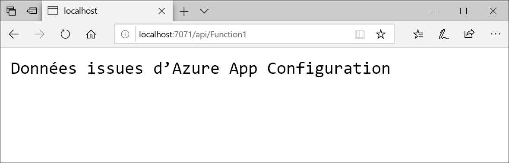

# <a name="quickstart-create-an-azure-functions-app-with-azure-app-configuration"></a>Démarrage rapide : Créer une application Azure Functions avec Azure App Configuration

Dans ce guide de démarrage rapide, vous allez intégrer le service Azure App Configuration dans une application Azure Functions afin de centraliser le stockage et la gestion de tous vos paramètres d’application en dehors de votre code.

## <a name="prerequisites"></a>Prérequis

- Abonnement Azure : [créez-en un gratuitement](https://azure.microsoft.com/free/dotnet)
- [Visual Studio 2019](https://visualstudio.microsoft.com/vs) avec la charge de travail **Développement Azure**
- [Outils Azure Functions](../azure-functions/functions-develop-vs.md#check-your-tools-version)

## <a name="create-an-app-configuration-store"></a>Créer un magasin App Configuration

[!INCLUDE [azure-app-configuration-create](../../includes/azure-app-configuration-create.md)]

6. Sélectionnez **Explorateur de configurations** >  **+ Créer** > **Clé-valeur** pour ajouter les paires clé-valeur suivantes :

    | Clé | Valeur |
    |---|---|
    | TestApp:Settings:Message | Data from Azure App Configuration |

    Laissez **Étiquette** et **Type de contenu** vides pour l’instant.

7. Sélectionnez **Appliquer**.

## <a name="create-a-functions-app"></a>Créer une application Functions

[!INCLUDE [Create a project using the Azure Functions template](../../includes/functions-vstools-create.md)]

## <a name="connect-to-an-app-configuration-store"></a>Se connecter à un magasin App Configuration

1. Cliquez avec le bouton droit sur votre projet, puis sélectionnez **Gérer les packages NuGet**. Sous l’onglet **Parcourir**, recherchez le package NuGet `Microsoft.Extensions.Configuration.AzureAppConfiguration` et ajoutez-le à votre projet. Si vous ne le trouvez pas, cochez la case **Inclure la préversion**.

2. Ouvrez *Function1.cs* et ajoutez les espaces de noms de la configuration de .NET Core et du fournisseur de configuration App Configuration.

    ```csharp
    using Microsoft.Extensions.Configuration;
    using Microsoft.Extensions.Configuration.AzureAppConfiguration;
    ```

3. Ajoutez une propriété `static` nommée `Configuration` pour créer une instance singleton de `IConfiguration`. Ajoutez ensuite un constructeur `static` pour vous connecter à App Configuration en appelant `AddAzureAppConfiguration()`. Cela chargera la configuration une fois au démarrage de l’application. La même instance de configuration sera utilisée ultérieurement pour tous les appels de fonctions.

    ```csharp
    private static IConfiguration Configuration { set; get; }

    static Function1()
    {
        var builder = new ConfigurationBuilder();
        builder.AddAzureAppConfiguration(Environment.GetEnvironmentVariable("ConnectionString"));
        Configuration = builder.Build();
    }
    ```

4. Mettez à jour la méthode `Run` pour lire les valeurs de la configuration.

    ```csharp
    public static async Task<IActionResult> Run(
        [HttpTrigger(AuthorizationLevel.Anonymous, "get", "post", Route = null)] HttpRequest req, ILogger log)
    {
        log.LogInformation("C# HTTP trigger function processed a request.");

        string keyName = "TestApp:Settings:Message";
        string message = Configuration[keyName];

        return message != null
            ? (ActionResult)new OkObjectResult(message)
            : new BadRequestObjectResult($"Please create a key-value with the key '{keyName}' in App Configuration.");
    }
    ```

## <a name="test-the-function-locally"></a>Tester la fonction en local

1. Définissez une variable d’environnement nommée **ConnectionString** et affectez-lui la valeur de la clé d’accès à votre magasin App Configuration. Si vous utilisez l’invite de commandes Windows, exécutez la commande suivante et redémarrez l’invite pour que la modification soit prise en compte :

    ```cmd
        setx ConnectionString "connection-string-of-your-app-configuration-store"
    ```

    Si vous utilisez Windows PowerShell, exécutez la commande suivante :

    ```azurepowershell
        $Env:ConnectionString = "connection-string-of-your-app-configuration-store"
    ```

    Si vous utilisez macOS ou Linux, exécutez la commande suivante :

    ```bash
        export ConnectionString='connection-string-of-your-app-configuration-store'
    ```

2. Appuyez sur F5 pour tester votre fonction. Si vous y êtes invité, acceptez la requête dans Visual Studio pour télécharger et installer **Azure Functions Core (CLI) Tools**. Vous devrez peut-être aussi activer une exception de pare-feu afin de permettre aux outils de prendre en charge les requêtes HTTP.

3. Copiez l’URL de votre fonction à partir de la sortie runtime Azure Functions.

    

4. Collez l’URL de la demande HTTP dans la barre d’adresses de votre navigateur. La capture d’écran suivante du navigateur montre la réponse retournée par la fonction, suite à la requête GET locale.

    

## <a name="clean-up-resources"></a>Nettoyer les ressources

[!INCLUDE [azure-app-configuration-cleanup](../../includes/azure-app-configuration-cleanup.md)]

## <a name="next-steps"></a>Étapes suivantes

En suivant ce guide de démarrage rapide, vous avez créé un magasin App Configuration et l’avez utilisé avec une application Azure Functions par l’intermédiaire du [fournisseur App Configuration](https://go.microsoft.com/fwlink/?linkid=2074664). Pour savoir comment configurer votre application Azure Functions afin d’actualiser dynamiquement les paramètres de configuration, passez au tutoriel suivant.

> [!div class="nextstepaction"]
> [Activer la configuration dynamique](./enable-dynamic-configuration-azure-functions-csharp.md)
