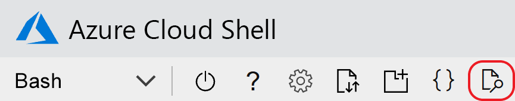
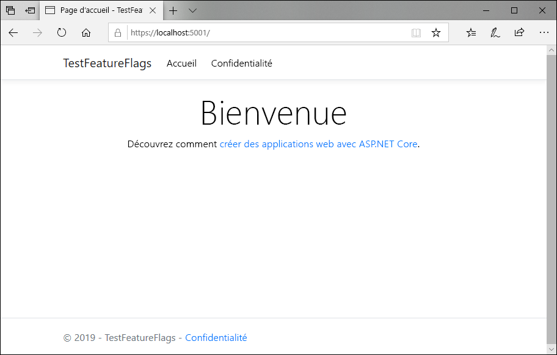
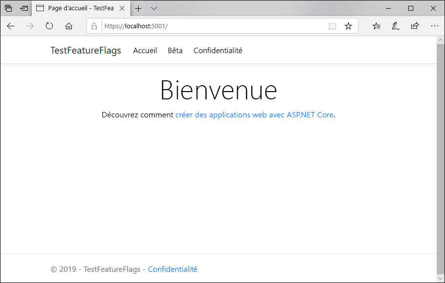

# <a name="quickstart-add-feature-flags-to-an-aspnet-core-app"></a>Démarrage rapide : Ajouter des indicateurs de fonctionnalités dans une application ASP.NET Core

Dans ce guide de démarrage rapide, vous créez une implémentation de bout en bout de la gestion des fonctionnalités dans une application ASP.NET Core en utilisant Azure App Configuration. Vous allez utiliser le service App Configuration pour stocker de façon centralisée tous vos indicateurs de fonctionnalité et contrôler leur état. 

Les bibliothèques de gestion des fonctionnalités .NET Core étendent le framework avec une prise en charge complète des indicateurs de fonctionnalités. Ces bibliothèques sont basées sur le système de configuration .NET Core. Elles s’intègrent de manière fluide à App Configuration par le biais de son fournisseur de configuration .NET Core.

## <a name="prerequisites"></a>Prérequis

- Abonnement Azure : [créez-en un gratuitement](https://azure.microsoft.com/free/)
- [SDK .NET Core](https://dotnet.microsoft.com/download).

## <a name="create-an-app-configuration-store"></a>Créer un magasin App Configuration

[!INCLUDE [azure-app-configuration-create](../../includes/azure-app-configuration-create.md)]

6. Sélectionnez **Gestionnaire de fonctionnalités** >  **+Ajouter** pour ajouter un indicateur de fonctionnalité appelé `Beta`.

    > [!div class="mx-imgBorder"]
    > 

    Laissez `label` non défini pour le moment. Sélectionnez **Appliquer** pour enregistrer le nouvel indicateur de fonctionnalité.

## <a name="create-an-aspnet-core-web-app"></a>Créez une application web ASP.NET Core

Utilisez l’[interface de ligne de commande (CLI) .NET Core](https://docs.microsoft.com/dotnet/core/tools/) pour créer un projet d’application web MVC ASP.NET Core. Par rapport à Visual Studio, l’interface CLI .NET Core offre l’avantage d’être disponible sur les plateformes Windows, macOS et Linux.

1. Créez un nouveau dossier pour votre projet. Pour les besoins de ce guide de démarrage rapide, nommez-le *TestFeatureFlags*.

1. Dans le nouveau dossier, exécutez la commande suivante pour créer un projet d’application web MVC ASP.NET Core :

   ```    
   dotnet new mvc --no-https
   ```

## <a name="add-secret-manager"></a>Ajouter Secret Manager

Pour utiliser Secret Manager, ajoutez un élément `UserSecretsId` à votre fichier  *.csproj*.

1. Ouvrez le fichier  *.csproj*.

1.  Ajoutez un élément `UserSecretsId` comme indiqué ici. Vous pouvez utiliser le même GUID ou remplacer cette valeur par votre propre valeur.

    > [!IMPORTANT]
    > `CreateHostBuilder` remplace `CreateWebHostBuilder` dans .NET Core 3.0.  Sélectionnez la syntaxe appropriée en fonction de votre environnement.

    #### <a name="net-core-2x"></a>[.NET Core 2.x](#tab/core2x)

    ```xml
    <Project Sdk="Microsoft.NET.Sdk.Web">

        <PropertyGroup>
            <TargetFramework>netcoreapp2.1</TargetFramework>
            <UserSecretsId>79a3edd0-2092-40a2-a04d-dcb46d5ca9ed</UserSecretsId>
        </PropertyGroup>

        <ItemGroup>
            <PackageReference Include="Microsoft.AspNetCore.App" />
            <PackageReference Include="Microsoft.AspNetCore.Razor.Design" Version="2.1.2" PrivateAssets="All" />
        </ItemGroup>

    </Project>
    ```

    #### <a name="net-core-3x"></a>[.NET Core 3.x](#tab/core3x)

    ```xml
    <Project Sdk="Microsoft.NET.Sdk.Web">

        <PropertyGroup>
            <TargetFramework>netcoreapp3.1</TargetFramework>
            <UserSecretsId>79a3edd0-2092-40a2-a04d-dcb46d5ca9ed</UserSecretsId>
        </PropertyGroup>

    </Project>
    ```
    ---

1. Enregistrez le fichier  *.csproj*.

L’outil Secret Manager stocke les données sensibles pour les travaux de développement à l’extérieur de l’arborescence de votre projet. Cette approche empêche le partage accidentel des secrets d’une application au sein du code source.

> [!TIP]
> Pour en savoir plus sur Secret Manager, consultez [Stockage sécurisé des secrets d’application en développement dans ASP.NET Core](https://docs.microsoft.com/aspnet/core/security/app-secrets).

## <a name="connect-to-an-app-configuration-store"></a>Se connecter à un magasin App Configuration

1. Ajoutez une référence aux packages NuGet `Microsoft.Azure.AppConfiguration.AspNetCore` et `Microsoft.FeatureManagement.AspNetCore` en exécutant les commandes suivantes :

    ```dotnetcli
    dotnet add package Microsoft.Azure.AppConfiguration.AspNetCore
    dotnet add package Microsoft.FeatureManagement.AspNetCore
    ```

1. Exécutez la commande suivante pour restaurer les packages de votre projet :

    ```dotnetcli
    dotnet restore
    ```

1. Ajoutez un secret nommé **ConnectionStrings:AppConfig** à Secret Manager.

    Ce secret contient la chaîne de connexion permettant d’accéder à votre magasin App Configuration. Dans la commande suivante, remplacez la valeur de `<your_connection_string>` par la chaîne de connexion de votre magasin App Configuration. La chaîne de connexion se trouve sous **Clés d’accès** dans le portail Azure.

    Cette commande doit être exécutée dans le même répertoire que le fichier *.csproj*.

    ```dotnetcli
    dotnet user-secrets set ConnectionStrings:AppConfig <your_connection_string>
    ```

    Vous utilisez Secret Manager seulement pour tester l’application web localement. Par exemple, quand vous déployez l’application sur [Azure App Service](https://azure.microsoft.com/services/app-service), vous utilisez un paramètre d’application nommé **Chaînes de connexion** dans App Service au lieu de Secret Manager pour stocker la chaîne de connexion.

    Vous pouvez accéder à ce secret avec l’API App Configuration. Avec l’API App Configuration, un signe deux-points (:) fonctionne dans le nom de configuration sur toutes les plateformes prises en charge. Consultez [Configuration par environnement](https://docs.microsoft.com/aspnet/core/fundamentals/configuration).

1. Dans *Program.cs*, mettez à jour la méthode `CreateWebHostBuilder` pour utiliser App Configuration en appelant la méthode `config.AddAzureAppConfiguration()`.

    > [!IMPORTANT]
    > `CreateHostBuilder` remplace `CreateWebHostBuilder` dans .NET Core 3.0.  Sélectionnez la syntaxe appropriée en fonction de votre environnement.

    #### <a name="net-core-2x"></a>[.NET Core 2.x](#tab/core2x)

    ```csharp
    public static IWebHostBuilder CreateWebHostBuilder(string[] args) =>
        WebHost.CreateDefaultBuilder(args)
            .ConfigureAppConfiguration((hostingContext, config) =>
            {
                var settings = config.Build();
                config.AddAzureAppConfiguration(options => {
                    options.Connect(settings["ConnectionStrings:AppConfig"])
                        .UseFeatureFlags();
                });
            })
            .UseStartup<Startup>();
    ```

    #### <a name="net-core-3x"></a>[.NET Core 3.x](#tab/core3x)

    ```csharp
    public static IHostBuilder CreateHostBuilder(string[] args) =>
        Host.CreateDefaultBuilder(args)
        .ConfigureWebHostDefaults(webBuilder =>
        webBuilder.ConfigureAppConfiguration((hostingContext, config) =>
        {
            var settings = config.Build();
            config.AddAzureAppConfiguration(options => {
                options.Connect(settings["ConnectionStrings:AppConfig"])
                    .UseFeatureFlags();
            });
        })
        .UseStartup<Startup>());
    ```
    ---

1. Ouvrez *Startup.cs*, puis ajoutez des références au gestionnaire de fonctionnalités .NET Core :

    ```csharp
    using Microsoft.FeatureManagement;
    ```

1. Mettez à jour la méthode `ConfigureServices` pour ajouter la prise en charge de l’indicateur de fonctionnalité en appelant la méthode `services.AddFeatureManagement()`. Si vous le souhaitez, vous pouvez inclure un filtre à utiliser avec les indicateurs de fonctionnalité en appelant `services.AddFeatureFilter<FilterType>()` :

    #### <a name="net-core-2x"></a>[.NET Core 2.x](#tab/core2x)
    ```csharp
    public void ConfigureServices(IServiceCollection services)
    {
        services.AddMvc().SetCompatibilityVersion(CompatibilityVersion.Version_2_2);        
        services.AddFeatureManagement();
    }
    ```
    #### <a name="net-core-3x"></a>[.NET Core 3.x](#tab/core3x)
    ```csharp    
    public void ConfigureServices(IServiceCollection services)
    {
        services.AddControllersWithViews();
        services.AddSingleton(Configuration).AddFeatureManagement();
    }

    ---

1. Update the `Configure` method to add a middleware to allow the feature flag values to be refreshed at a recurring interval while the ASP.NET Core web app continues to receive requests.

    #### [.NET Core 2.x](#tab/core2x)
    ```csharp
    public void Configure(IApplicationBuilder app, IHostingEnvironment env)
    {
            if (env.IsDevelopment())
            {
                app.UseDeveloperExceptionPage();
            }
            else
            {
                app.UseExceptionHandler("/Home/Error");
            }

            app.UseStaticFiles();
            app.UseCookiePolicy();
            app.UseAzureAppConfiguration();
            app.UseMvc(routes =>
            {
                routes.MapRoute(
                    name: "default",
                    template: "{controller=Home}/{action=Index}/{id?}");
            });
    }
    ```
    #### <a name="net-core-3x"></a>[.NET Core 3.x](#tab/core3x)
    ```csharp
    public void Configure(IApplicationBuilder app, IHostingEnvironment env)
    {
            if (env.IsDevelopment())
            {
                app.UseDeveloperExceptionPage();
            }
            else
            {
                app.UseExceptionHandler("/Home/Error");
            }
            app.UseStaticFiles();
            app.UseRouting();
            app.UseAuthorization();
            app.UseEndpoints(endpoints =>
            {
                endpoints.MapControllerRoute(
                    name: "default",
                    pattern: "{controller=Home}/{action=Index}/{id?}");
            });
            app.UseAzureAppConfiguration();
    }
    ```
    ---

1. Ajoutez un fichier *MyFeatureFlags.cs* :

    ```csharp
    namespace TestFeatureFlags
    {
        public enum MyFeatureFlags
        {
            Beta
        }
    }
    ```

1. Ajoutez *BetaController.cs* au répertoire *Controllers* :

    ```csharp
    using Microsoft.AspNetCore.Mvc;
    using Microsoft.FeatureManagement;
    using Microsoft.FeatureManagement.Mvc;

    namespace TestFeatureFlags.Controllers
    {
        public class BetaController: Controller
        {
            private readonly IFeatureManager _featureManager;

            public BetaController(IFeatureManagerSnapshot featureManager)
            {
                _featureManager = featureManager;
            }

            [FeatureGate(MyFeatureFlags.Beta)]
            public IActionResult Index()
            {
                return View();
            }
        }
    }
    ```

1. Ouvrez *_ViewImports.cshtml* dans le répertoire *Views*, puis ajoutez le tag helper du gestionnaire de fonctionnalités :

    ```html
    @addTagHelper *, Microsoft.FeatureManagement.AspNetCore
    ```

1. Ouvrez *_Layout.cshtml* dans le répertoire *Views*\\*Shared*, puis remplacez le code de la barre `<nav>` sous `<body>` > `<header>` par le code suivant :

    ```html
    <nav class="navbar navbar-expand-sm navbar-toggleable-sm navbar-light bg-white border-bottom box-shadow mb-3">
        <div class="container">
            <a class="navbar-brand" asp-area="" asp-controller="Home" asp-action="Index">TestFeatureFlags</a>
            <button class="navbar-toggler" type="button" data-toggle="collapse" data-target=".navbar-collapse" aria-controls="navbarSupportedContent"
            aria-expanded="false" aria-label="Toggle navigation">
            <span class="navbar-toggler-icon"></span>
            </button>
            <div class="navbar-collapse collapse d-sm-inline-flex flex-sm-row-reverse">
                <ul class="navbar-nav flex-grow-1">
                    <li class="nav-item">
                        <a class="nav-link text-dark" asp-area="" asp-controller="Home" asp-action="Index">Home</a>
                    </li>
                    <feature name="Beta">
                    <li class="nav-item">
                        <a class="nav-link text-dark" asp-area="" asp-controller="Beta" asp-action="Index">Beta</a>
                    </li>
                    </feature>
                    <li class="nav-item">
                        <a class="nav-link text-dark" asp-area="" asp-controller="Home" asp-action="Privacy">Privacy</a>
                    </li>
                </ul>
            </div>
        </div>
    </nav>
    ```

1. Créez un répertoire *Beta* sous *Views*, puis ajoutez-y *Index.cshtml* :

    ```html
    @{
        ViewData["Title"] = "Beta Home Page";
    }

    <h1>
        This is the beta website.
    </h1>
    ```

## <a name="build-and-run-the-app-locally"></a>Générer et exécuter l’application localement

1. Pour générer l’application à l’aide de l’interface CLI .NET Core, exécutez la commande suivante dans l’interpréteur de commandes :

    ```
    dotnet build
    ```

1. Une fois la génération correctement terminée, exécutez la commande suivante pour exécuter l’application web localement :

    ```
    dotnet run
    ```

1. Ouvrez une fenêtre de navigateur, puis accédez à `https://localhost:5000`, qui est l’URL par défaut de l’application web hébergée localement.
    Si vous travaillez dans Azure Cloud Shell, sélectionnez le bouton *Aperçu web*, puis *Configurer*.  Quand vous y êtes invité, sélectionnez le port 5000.

    

    Votre navigateur doit afficher une page similaire à l’image ci-dessous.
    

1. Connectez-vous au [portail Azure](https://portal.azure.com). Sélectionnez **Toutes les ressources**, puis sélectionnez l’instance du magasin App Configuration que vous avez créée dans le guide de démarrage rapide.

1. Sélectionnez **Gestionnaire de fonctionnalités**, puis changez la valeur de la clé **Beta** en **Activé**.

1. Revenez à l’invite de commandes et annulez le processus `dotnet` en cours d’exécution en appuyant sur `Ctrl-C`.  Redémarrez votre application avec `dotnet run`.

1. Actualisez la page de navigateur pour afficher les nouveaux paramètres de configuration.

    

## <a name="clean-up-resources"></a>Nettoyer les ressources

[!INCLUDE [azure-app-configuration-cleanup](../../includes/azure-app-configuration-cleanup.md)]

## <a name="next-steps"></a>Étapes suivantes

Dans ce guide de démarrage rapide, vous avez créé un magasin App Configuration et vous l’avez utilisé pour gérer les fonctionnalités dans une application web ASP.NET Core via les [bibliothèques de gestion des fonctionnalités](https://go.microsoft.com/fwlink/?linkid=2074664).

- Découvrez plus d’informations sur la [gestion des fonctionnalités](./concept-feature-management.md).
- [Gérer les indicateurs de fonctionnalité](./manage-feature-flags.md).
- [Utiliser des indicateurs de fonctionnalités dans une application ASP.NET Core](./use-feature-flags-dotnet-core.md).
- [Utiliser la configuration dynamique dans une application ASP.NET Core](./enable-dynamic-configuration-aspnet-core.md)
