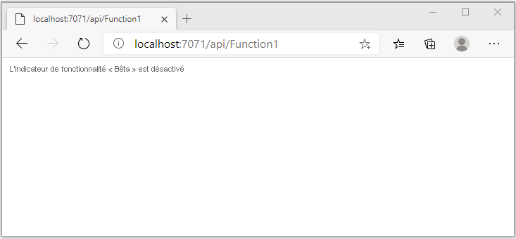
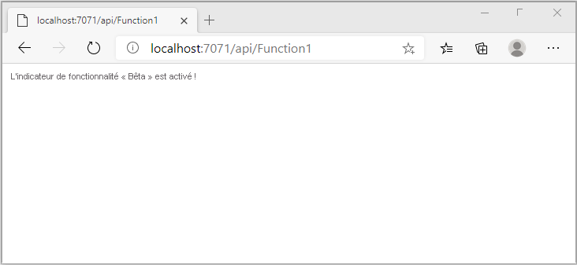

# <a name="quickstart-add-feature-flags-to-an-azure-functions-app"></a>Démarrage rapide : Ajouter des indicateurs de fonctionnalités à une application Azure Functions

Dans ce guide de démarrage rapide, vous créez une implémentation de la gestion des fonctionnalités dans une application Azure Functions en utilisant Azure App Configuration. Vous allez utiliser le service App Configuration pour stocker de façon centralisée tous vos indicateurs de fonctionnalité et contrôler leur état. 

Les bibliothèques de gestion des fonctionnalités .NET étendent le framework avec une prise en charge des indicateurs de fonctionnalités. Ces bibliothèques sont basées sur le système de configuration de .NET. Elles s’intègrent à App Configuration par le biais de son fournisseur de configuration .NET.

## <a name="prerequisites"></a>Prérequis

- Abonnement Azure : [créez-en un gratuitement](https://azure.microsoft.com/free/)
- [Visual Studio 2019](https://visualstudio.microsoft.com/vs) avec la charge de travail **Développement Azure**
- [Outils Azure Functions](../azure-functions/functions-develop-vs.md#check-your-tools-version)

## <a name="create-an-app-configuration-store"></a>Créer un magasin App Configuration

[!INCLUDE [azure-app-configuration-create](../../includes/azure-app-configuration-create.md)]

7. Sélectionnez **Gestionnaire de fonctionnalités** >  **+Ajouter** pour ajouter un indicateur de fonctionnalité appelé `Beta`.

    > [!div class="mx-imgBorder"]
    > 

    Laissez `label` et `Description` non définis pour le moment.

8. Sélectionnez **Appliquer** pour enregistrer le nouvel indicateur de fonctionnalité.

## <a name="create-a-functions-app"></a>Créer une application Functions

[!INCLUDE [Create a project using the Azure Functions template](../../includes/functions-vstools-create.md)]

## <a name="connect-to-an-app-configuration-store"></a>Se connecter à un magasin App Configuration

1. Cliquez avec le bouton droit sur votre projet, puis sélectionnez **Gérer les packages NuGet**. Sous l’onglet **Parcourir**, recherchez et ajoutez les packages NuGet suivants à votre projet. Pour `Microsoft.Extensions.DependencyInjection`, vérifiez que vous utilisez la build stable la plus récente. 

    ```
    Microsoft.Extensions.DependencyInjection
    Microsoft.Extensions.Configuration
    Microsoft.FeatureManagement
    ```


1. Ouvrez *Function1.cs* et ajoutez les espaces de noms de ces packages.

    ```csharp
    using Microsoft.Extensions.Configuration;
    using Microsoft.FeatureManagement;
    using Microsoft.Extensions.DependencyInjection;
    ```

1. Ajoutez le constructeur statique `Function1` ci-dessous pour démarrer le fournisseur Azure App Configuration. Ensuite, ajoutez deux membres `static`, un champ nommé `ServiceProvider` pour créer une instance singleton de `ServiceProvider`, et une propriété sous `Function1` nommée `FeatureManager` pour créer une instance singleton de `IFeatureManager`. Connectez-vous ensuite à App Configuration dans `Function1` en appelant `AddAzureAppConfiguration()`. Ce processus chargera la configuration au démarrage de l’application. La même instance de configuration sera utilisée ultérieurement pour tous les appels de fonctions. 

    ```csharp
        // Implements IDisposable, cached for life time of function
        private static ServiceProvider ServiceProvider; 

        static Function1()
        {
            IConfigurationRoot configuration = new ConfigurationBuilder()
                .AddAzureAppConfiguration(options =>
                {
                    options.Connect(Environment.GetEnvironmentVariable("ConnectionString"))
                           .UseFeatureFlags();
                }).Build();

            var services = new ServiceCollection();                                                                             
            services.AddSingleton<IConfiguration>(configuration).AddFeatureManagement();

            ServiceProvider = services.BuildServiceProvider(); 
        }

        private static IFeatureManager FeatureManager => ServiceProvider.GetRequiredService<IFeatureManager>();
    ```

1. Mettez à jour la méthode `Run` afin de changer la valeur du message affiché en fonction de l’état de l’indicateur de fonctionnalité.

    ```csharp
        [FunctionName("Function1")]
        public static async Task<IActionResult> Run(
                [HttpTrigger(AuthorizationLevel.Anonymous, "get", "post", Route = null)] HttpRequest req,
                ILogger log)
            {
                string message = await FeatureManager.IsEnabledAsync("Beta")
                     ? "The Feature Flag 'Beta' is turned ON"
                     : "The Feature Flag 'Beta' is turned OFF";
                
                return (ActionResult)new OkObjectResult(message); 
            }
    ```

## <a name="test-the-function-locally"></a>Tester la fonction en local

1. Définissez une variable d’environnement nommée **ConnectionString**, où la valeur est la clé d’accès que vous avez récupérée précédemment dans votre magasin App Configuration sous **Clés d’accès**. Si vous utilisez l’invite de commandes Windows, exécutez la commande suivante et redémarrez l’invite pour que la modification soit prise en compte :

    ```cmd
        setx ConnectionString "connection-string-of-your-app-configuration-store"
    ```

    Si vous utilisez Windows PowerShell, exécutez la commande suivante :

    ```azurepowershell
        $Env:ConnectionString = "connection-string-of-your-app-configuration-store"
    ```

    Si vous utilisez macOS ou Linux, exécutez la commande suivante :

    ```bash
        export ConnectionString='connection-string-of-your-app-configuration-store'
    ```

1. Appuyez sur F5 pour tester votre fonction. Si vous y êtes invité, acceptez la requête dans Visual Studio pour télécharger et installer **Azure Functions Core (CLI) Tools**. Vous devrez peut-être aussi activer une exception de pare-feu afin de permettre aux outils de prendre en charge les requêtes HTTP.

1. Copiez l’URL de votre fonction à partir de la sortie runtime Azure Functions.

    

1. Collez l’URL de la demande HTTP dans la barre d’adresses de votre navigateur. L’illustration suivante montre la réponse signalant que l’indicateur de fonctionnalité `Beta` est désactivé. 

    

1. Connectez-vous au [portail Azure](https://portal.azure.com). Sélectionnez **Toutes les ressources**, puis sélectionnez l’instance du magasin App Configuration que vous avez créée.

1. Sélectionnez **Gestionnaire de fonctionnalités**, puis changez la valeur de la clé **Beta** en **Activé**.

1. Revenez à l’invite de commandes et annulez le processus en cours d’exécution en appuyant sur `Ctrl-C`.  Redémarrez votre application en appuyant sur F5. 

1. Copiez l’URL de votre fonction à partir de la sortie du runtime d’Azure Functions en suivant le même processus qu’à l’étape 3. Collez l’URL de la demande HTTP dans la barre d’adresses de votre navigateur. La réponse du navigateur doit avoir changé pour signaler que l’indicateur de fonctionnalité `Beta` est activé, comme dans l’image ci-dessous.
 
    

## <a name="clean-up-resources"></a>Nettoyer les ressources

[!INCLUDE [azure-app-configuration-cleanup](../../includes/azure-app-configuration-cleanup.md)]

## <a name="next-steps"></a>Étapes suivantes

En suivant ce guide de démarrage rapide, vous avez créé un indicateur de fonctionnalité et l’avez utilisé dans une application Azure Functions par l’intermédiaire du [fournisseur App Configuration](/dotnet/api/Microsoft.Extensions.Configuration.AzureAppConfiguration).

- Découvrez plus d’informations sur la [gestion des fonctionnalités](./concept-feature-management.md).
- [Gérer les indicateurs de fonctionnalité](./manage-feature-flags.md).
- [Utiliser la configuration dynamique dans une application Azure Functions](./enable-dynamic-configuration-azure-functions-csharp.md)