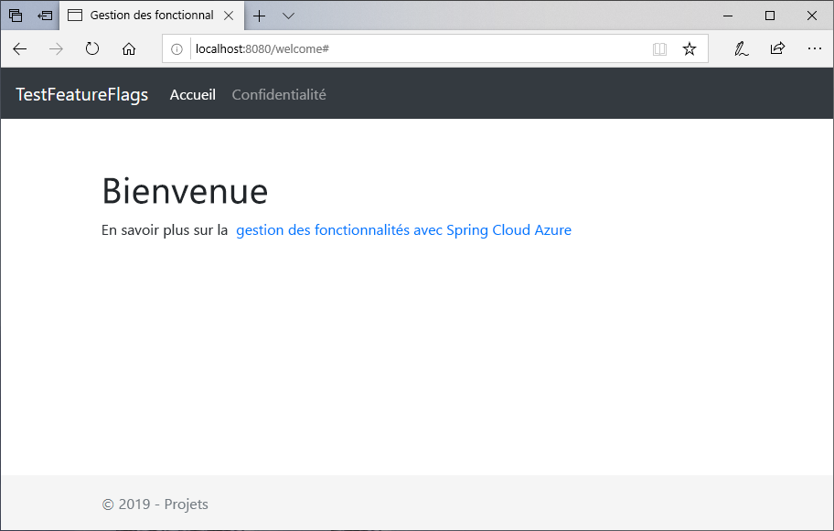
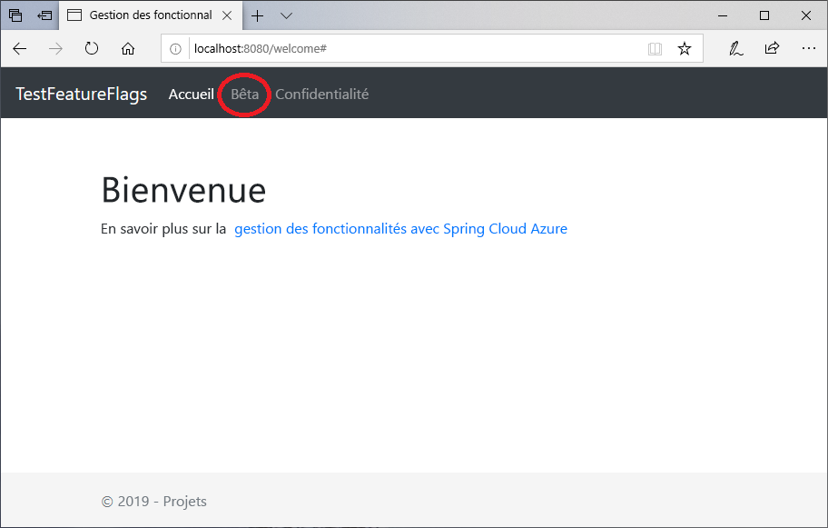

# <a name="quickstart-add-feature-flags-to-a-spring-boot-app"></a>Démarrage rapide : Ajouter des indicateurs de fonctionnalité à une application Spring Boot

Dans ce guide de démarrage rapide, vous incorporez Azure App Configuration à une application web Spring Boot pour créer une implémentation de bout en bout de la gestion des fonctionnalités. Vous pouvez utiliser le service App Configuration pour stocker de manière centralisée tous vos indicateurs de fonctionnalités et contrôler leur état.

Les bibliothèques de gestion des fonctionnalités Spring Boot étendent le framework avec une prise en charge complète des indicateurs de fonctionnalités. Ces bibliothèques **n’ont pas** de dépendance envers les bibliothèques Azure. Elles s’intègrent de manière fluide à App Configuration par le biais de son fournisseur de configuration Spring Boot.

## <a name="prerequisites"></a>Prérequis

* Abonnement Azure : [créez-en un gratuitement](https://azure.microsoft.com/free/)
* Un [kit SDK de développement Java](https://docs.microsoft.com/java/azure/jdk) pris en charge avec version 8
* [Apache Maven](https://maven.apache.org/download.cgi) version 3.0 ou ultérieure

## <a name="create-an-app-configuration-instance"></a>Créer une instance d’App Configuration

[!INCLUDE [azure-app-configuration-create](../../includes/azure-app-configuration-create.md)]

6. Sélectionnez **Gestionnaire de fonctionnalités** >  **+Ajouter** pour ajouter un indicateur de fonctionnalité appelé `Beta`.

    > [!div class="mx-imgBorder"]
    > 

    Laissez `label` non défini pour le moment.

## <a name="create-a-spring-boot-app"></a>Créer une application Spring Boot

Utilisez [Spring Initializr](https://start.spring.io/) pour créer un projet Spring Boot.

1. Accédez à <https://start.spring.io/>.

1. Spécifiez les options suivantes :

   * Générez un projet **Maven** avec **Java**.
   * Spécifiez une version de **Spring Boot** égale ou supérieure à 2.0.
   * Indiquez les noms du **Groupe** et de l’**Artefact** de votre application.  Cet article utilise `com.example` et `demo`.
   * Ajoutez la dépendance **Spring Web**.

1. Une fois les options précédentes spécifiées, sélectionnez **Générer le projet**. Quand vous y êtes invité, téléchargez le projet sur votre ordinateur local.

## <a name="add-feature-management"></a>Ajouter la gestion des fonctionnalités

1. Une fois que vous avez extrait les fichiers sur votre système local, votre application Spring Boot est prête à être modifiée. Localisez *pom.xml* dans le répertoire racine de votre application.

1. Ouvrez le fichier *pom.xml* dans un éditeur de texte, puis ajoutez ce qui suit à la liste de `<dependencies>` :

    **Spring Cloud 1.1.x**

    ```xml
    <dependency>
        <groupId>com.microsoft.azure</groupId>
        <artifactId>spring-cloud-azure-appconfiguration-config-web</artifactId>
        <version>1.1.2</version>
    </dependency>
    <dependency>
        <groupId>com.microsoft.azure</groupId>
        <artifactId>spring-cloud-azure-feature-management-web</artifactId>
        <version>1.1.2</version>
    </dependency>
    <dependency>
        <groupId>org.springframework.boot</groupId>
        <artifactId>spring-boot-starter-thymeleaf</artifactId>
    </dependency>
    ```

    **Spring Cloud 1.2.x**

    ```xml
    <dependency>
        <groupId>com.microsoft.azure</groupId>
        <artifactId>spring-cloud-azure-appconfiguration-config-web</artifactId>
        <version>1.2.2</version>
    </dependency>
    <dependency>
        <groupId>com.microsoft.azure</groupId>
        <artifactId>spring-cloud-azure-feature-management-web</artifactId>
        <version>1.2.2</version>
    </dependency>
    <dependency>
        <groupId>org.springframework.boot</groupId>
        <artifactId>spring-boot-starter-thymeleaf</artifactId>
    </dependency>
    ```

> [!Note]
> Il existe une bibliothèque de gestion des fonctionnalités non web qui n’a pas de dépendance envers spring-web. Consultez la [documentation](https://github.com/microsoft/spring-cloud-azure/tree/master/spring-cloud-azure-feature-management) de GitHub pour connaître les différences.

## <a name="connect-to-an-app-configuration-store"></a>Se connecter à un magasin App Configuration

1. Accédez au répertoire `resources` de votre application, puis ouvrez `bootstrap.properties`.  Si le fichier n’existe pas, créez-le. Ajoutez la ligne suivante au fichier.

    ```properties
    spring.cloud.azure.appconfiguration.stores[0].connection-string= ${APP_CONFIGURATION_CONNECTION_STRING}
    ```

1. Dans le portail App Configuration de votre magasin de configuration, sélectionnez `Access keys` dans la barre latérale. Sélectionnez l’onglet Clés en lecture seule. Copiez la valeur de la chaîne de connexion principale.

1. Ajoutez la chaîne de connexion principale en tant que variable d’environnement à l’aide du nom de variable `APP_CONFIGURATION_CONNECTION_STRING`.

1. Ouvrez le fichier Java de l’application principale et ajoutez `@EnableConfigurationProperties` pour activer cette fonctionnalité.

    ```java
    package com.example.demo;

    import org.springframework.boot.SpringApplication;
    import org.springframework.boot.context.properties.ConfigurationProperties;
    import org.springframework.boot.context.properties.EnableConfigurationProperties;
    import org.springframework.boot.autoconfigure.SpringBootApplication;

    @SpringBootApplication
    @EnableConfigurationProperties(MessageProperties.class)
    public class DemoApplication {

        public static void main(String[] args) {
            SpringApplication.run(DemoApplication.class, args);
        }
    }
    ```

1. Créez un fichier Java nommé *MessageProperties.java* dans le répertoire du package de votre application.

    ```java
    package com.example.demo;

    import org.springframework.boot.context.properties.ConfigurationProperties;
    import org.springframework.context.annotation.Configuration;

    @Configuration
    @ConfigurationProperties(prefix = "config")
    public class MessageProperties {
        private String message;

        public String getMessage() {
            return message;
        }

        public void setMessage(String message) {
            this.message = message;
        }
    }
    ```

1. Créez un fichier Java nommé *HelloController.java* dans le répertoire du package de votre application.

    ```java
    package com.example.demo;

    import org.springframework.boot.context.properties.ConfigurationProperties;
    import org.springframework.stereotype.Controller;
    import org.springframework.ui.Model;

    import com.microsoft.azure.spring.cloud.feature.manager.FeatureManager;
    import org.springframework.web.bind.annotation.GetMapping;


    @Controller
    @ConfigurationProperties("controller")
    public class HelloController {

        private FeatureManager featureManager;

        public HelloController(FeatureManager featureManager) {
            this.featureManager = featureManager;
        }

        @GetMapping("/welcome")
        public String mainWithParam(Model model) {
            model.addAttribute("Beta", featureManager.isEnabledAsync("Beta").block());
            return "welcome";
        }
    }
    ```

1. Créez un fichier HTML nommé *welcome.html* dans le répertoire de modèles de votre application.

    ```html
    <!DOCTYPE html>
    <html lang="en" xmlns:th="http://www.thymeleaf.org">
    <head>
        <meta charset="utf-8">
        <meta name="viewport" content="width=device-width, initial-scale=1, shrink-to-fit=no">
        <title>Feature Management with Spring Cloud Azure</title>

        <link rel="stylesheet" href="/css/main.css">
        <link rel="stylesheet" href="https://stackpath.bootstrapcdn.com/bootstrap/4.3.1/css/bootstrap.min.css" integrity="sha384-ggOyR0iXCbMQv3Xipma34MD+dH/1fQ784/j6cY/iJTQUOhcWr7x9JvoRxT2MZw1T" crossorigin="anonymous">

        <script src="https://code.jquery.com/jquery-3.3.1.slim.min.js" integrity="sha384-q8i/X+965DzO0rT7abK41JStQIAqVgRVzpbzo5smXKp4YfRvH+8abtTE1Pi6jizo" crossorigin="anonymous"></script>
        <script src="https://cdnjs.cloudflare.com/ajax/libs/popper.js/1.14.7/umd/popper.min.js" integrity="sha384-UO2eT0CpHqdSJQ6hJty5KVphtPhzWj9WO1clHTMGa3JDZwrnQq4sF86dIHNDz0W1" crossorigin="anonymous"></script>
        <script src="https://stackpath.bootstrapcdn.com/bootstrap/4.3.1/js/bootstrap.min.js" integrity="sha384-JjSmVgyd0p3pXB1rRibZUAYoIIy6OrQ6VrjIEaFf/nJGzIxFDsf4x0xIM+B07jRM" crossorigin="anonymous"></script>

    </head>
    <body>
        <header>
        <!-- Fixed navbar -->
        <nav class="navbar navbar-expand-md navbar-dark fixed-top bg-dark">
            <a class="navbar-brand" href="#">TestFeatureFlags</a>
            <button class="navbar-toggler" aria-expanded="false" aria-controls="navbarCollapse" aria-label="Toggle navigation" type="button" data-target="#navbarCollapse" data-toggle="collapse">
            <span class="navbar-toggler-icon"></span>
            </button>
            <div class="collapse navbar-collapse" id="navbarCollapse">
            <ul class="navbar-nav mr-auto">
                <li class="nav-item active">
                <a class="nav-link" href="#">Home <span class="sr-only">(current)</span></a>
                </li>
                <li class="nav-item" th:if="${Beta}">
                <a class="nav-link" href="#">Beta</a>
                </li>
                <li class="nav-item">
                <a class="nav-link" href="#">Privacy</a>
                </li>
            </ul>
            </div>
        </nav>
        </header>
        <div class="container body-content">
            <h1 class="mt-5">Welcome</h1>
            <p>Learn more about <a href="https://github.com/microsoft/spring-cloud-azure/blob/master/spring-cloud-azure-feature-management/README.md">Feature Management with Spring Cloud Azure</a></p>

        </div>
        <footer class="footer">
            <div class="container">
            <span class="text-muted">&copy; 2019 - Projects</span>
        </div>

        </footer>
    </body>
    </html>

    ```

1. Créez un dossier nommé CSS sous `static`, puis à l’intérieur de celui-ci, créez un fichier CSS nommé *main.css*.

    ```css
    html {
     position: relative;
     min-height: 100%;
    }
    body {
     margin-bottom: 60px;
    }
    .footer {
     position: absolute;
     bottom: 0;
     width: 100%;
     height: 60px;
     line-height: 60px;
     background-color: #f5f5f5;
    }

    body > .container {
     padding: 60px 15px 0;
    }

    .footer > .container {
     padding-right: 15px;
     padding-left: 15px;
    }

    code {
     font-size: 80%;
    }
    ```

## <a name="build-and-run-the-app-locally"></a>Générer et exécuter l’application localement

1. Générez votre application Spring Boot avec Maven, puis exécutez-la.

    ```shell
    mvn clean package
    mvn spring-boot:run
    ```

1. Ouvrez une fenêtre de navigateur, puis accédez à l’URL : `http://localhost:8080/welcome`.

    

1. Dans le portail App Configuration, sélectionnez **Gestionnaire de fonctionnalités**, puis changez la valeur de la clé **Bêta** en **On** :

    | Clé | State |
    |---|---|
    | Bêta | Il en va |

1. Actualisez la page de navigateur pour afficher les nouveaux paramètres de configuration.

    

## <a name="clean-up-resources"></a>Nettoyer les ressources

[!INCLUDE [azure-app-configuration-cleanup](../../includes/azure-app-configuration-cleanup.md)]

## <a name="next-steps"></a>Étapes suivantes

Dans ce guide de démarrage rapide, vous avez créé un magasin App Configuration et vous l’avez utilisé pour gérer les fonctionnalités dans une application web Spring Boot via les [bibliothèques de gestion des fonctionnalités](https://go.microsoft.com/fwlink/?linkid=2074664).

* Découvrez plus d’informations sur la [gestion des fonctionnalités](./concept-feature-management.md).
* [Gérer les indicateurs de fonctionnalité](./manage-feature-flags.md).
* [Utiliser des indicateurs de fonctionnalité dans une application Spring Boot](./use-feature-flags-spring-boot.md).
