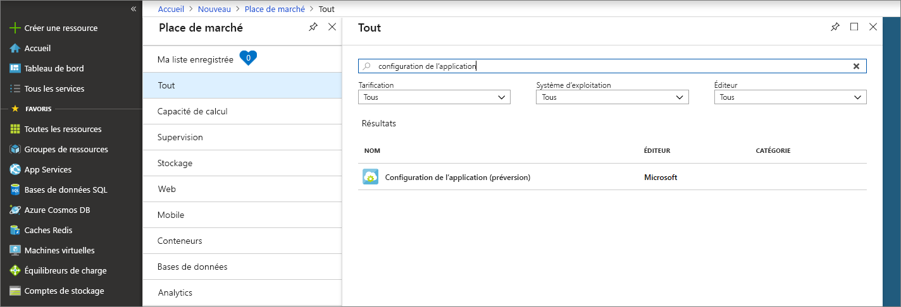
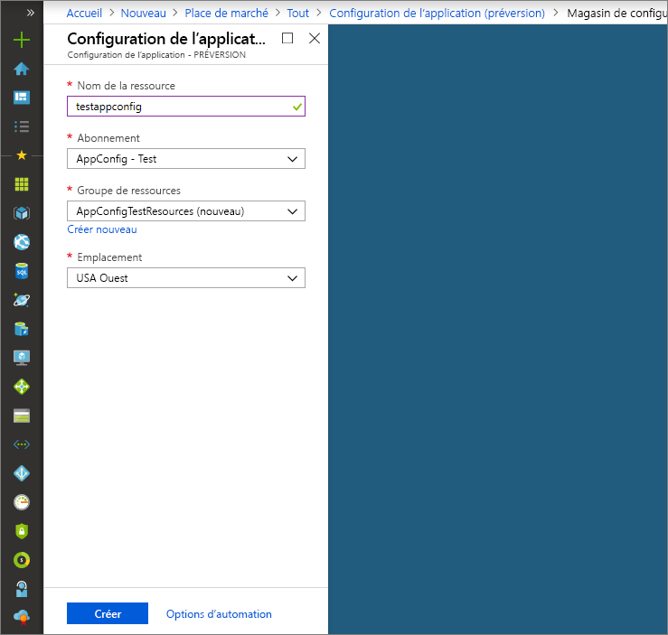

# <a name="quickstart-create-a-java-spring-app-with-app-configuration"></a>Démarrage rapide : Créer une application Java Spring avec App Configuration

Azure App Configuration est un service de configuration managée dans Azure. Vous pouvez vous en servir pour stocker et gérer facilement tous les paramètres de votre application dans un seul endroit, indépendamment de votre code. Ce guide de démarrage rapide vous montre comment intégrer le service à une application Java Spring.

Vous pouvez utiliser l’éditeur de code de votre choix pour exécuter les étapes de ce guide de démarrage rapide. [Visual Studio Code](https://code.visualstudio.com/) est une excellente option disponible sur les plateformes Windows, macOS et Linux.

## <a name="prerequisites"></a>Prérequis

Pour suivre ce guide de démarrage rapide, installez [Java Development Kit (JDK)](https://aka.ms/azure-jdks) version 8 et [Apache Maven](https://maven.apache.org/) version 3.0 ou ultérieure.

[!INCLUDE [quickstarts-free-trial-note](../../includes/quickstarts-free-trial-note.md)]

## <a name="create-an-app-configuration-store"></a>Créer un magasin de configuration d’application

1. Pour créer un magasin de configuration d’application, connectez-vous au [portail Azure](https://aka.ms/azconfig/portal). En haut à gauche de la page, sélectionnez **+ Créer une ressource**. Dans la zone **Rechercher dans la Place de marché**, entrez **App Configuration** et appuyez sur Entrée.

    

2. Sélectionnez **Configuration d’application** dans les résultats de la recherche, puis **Créer**.

3. Dans la page **Configuration d’application** > **Créer**, entrez les paramètres suivants.

    | Paramètre | Valeur suggérée | Description |
    |---|---|---|
    | **Nom de la ressource** | Nom globalement unique | Entrez un nom de ressource unique à utiliser pour la ressource du magasin de configuration d’application. Le nom doit être une chaîne de 1 à 63 caractères et contenir uniquement des chiffres, des lettres et le caractère `-`. Le nom ne peut ni commencer ni se terminer par le caractère `-`, et n’accepte pas les caractères `-` consécutifs.  |
    | **Abonnement** | Votre abonnement | Sélectionnez l’abonnement Azure à utiliser pour tester App Configuration. Si votre compte a un seul abonnement, il est automatiquement sélectionné et la liste déroulante **Abonnement** ne s’affiche pas. |
    | **Groupe de ressources** | *AppConfigTestResources* | Sélectionnez ou créez un groupe de ressources pour votre ressource du magasin de configuration d’application. Ce groupe est utile pour organiser plusieurs ressources que vous souhaitez supprimer en même temps que vous supprimez ce groupe de ressources. Pour plus d’informations, consultez [Utilisation des groupes de ressources pour gérer vos ressources Azure](https://docs.microsoft.com/azure/azure-resource-manager/resource-group-overview). |
    | **Lieu** | *USA Centre* | Utilisez **Emplacement** pour indiquer l’emplacement géographique de l’hébergement de votre ressource SignalR. Pour des performances optimales, créez la ressource dans la même région que les autres composants de votre application. |

    

4. Sélectionnez **Créer**. Le déploiement peut prendre quelques minutes.

5. À la fin du déploiement, sélectionnez **Paramètres** > **Clés d’accès**. Prenez note de la chaîne de connexion de la clé primaire, en lecture seule ou en lecture-écriture. Vous utilisez cette chaîne de connexion plus tard pour configurer votre application, afin qu’elle communique avec le magasin de configuration d’application que vous avez créé. La chaîne de connexion prend la forme suivante :

        Endpoint=<your_endpoint>;Id=<your_id>;Secret=<your_secret>

    Utilisez la chaîne entière dans votre application.

6. Sélectionnez **Explorateur de paires clé/valeur** > **+ Créer** pour ajouter les paires clé/valeur suivantes :

    | Clé | Valeur |
    |---|---|
    | /application/config.message | Hello |

    Laissez **Étiquette** et **Type de contenu** vides pour l’instant.

## <a name="create-a-spring-boot-app"></a>Créer une application Spring Boot

Vous utilisez [Spring Initializr](https://start.spring.io/) pour créer un projet Spring Boot.

1. Accédez à <https://start.spring.io/>.

2. Spécifiez les options suivantes :

   * Générez un projet **Maven** avec **Java**.
   * Spécifiez une version de **Spring Boot** égale ou supérieure à 2.0.
   * Indiquez les noms du **Groupe** et de l’**Artefact** de votre application.
   * Ajoutez la dépendance **Web**.

3. Une fois les options précédentes spécifiées, sélectionnez **Générer le projet**. Lorsque vous y êtes invité, téléchargez le projet dans un emplacement défini par un chemin d’accès sur votre ordinateur local.

## <a name="connect-to-an-app-configuration-store"></a>Se connecter à un magasin de configuration d’application

1. Après avoir extrait les fichiers sur votre système local, votre application Spring Boot simple est prête à être modifiée. Localisez le fichier *pom.xml* dans le répertoire racine de votre application.

2. Ouvrez le fichier *pom.xml* dans un éditeur de texte, puis ajoutez le démarrage de Spring Cloud Azure Config à la liste de `<dependencies>` :

    ```xml
    <dependency>
        <groupId>com.microsoft.azure</groupId>
        <artifactId>spring-cloud-starter-azure-appconfiguration-config</artifactId>
        <version>1.1.0.M3</version>
    </dependency>
    ```

3. Créez un fichier Java nommé *MessageProperties.java* dans le répertoire du package de votre application. Ajoutez les lignes suivantes :

    ```java
    @ConfigurationProperties(prefix = "config")
    public class MessageProperties {
        private String message;

        public String getMessage() {
            return message;
        }

        public void setMessage(String message) {
            this.message = message;
        }
    }
    ```

4. Créez un fichier Java nommé *HelloController.java* dans le répertoire du package de votre application. Ajoutez les lignes suivantes :

    ```java
    @RestController
    public class HelloController {
        private final MessageProperties properties;

        public HelloController(MessageProperties properties) {
            this.properties = properties;
        }

        @GetMapping
        public String getMessage() {
            return "Message: " + properties.getMessage();
        }
    }
    ```

5. Ouvrez le fichier Java de l’application principale et ajoutez `@EnableConfigurationProperties` pour activer cette fonctionnalité.

    ```java
    @SpringBootApplication
    @EnableConfigurationProperties(MessageProperties.class)
    public class AzureConfigApplication {
        public static void main(String[] args) {
            SpringApplication.run(AzureConfigApplication.class, args);
        }
    }
    ```

6. Créez un fichier nommé `bootstrap.properties` sous le répertoire des ressources de votre application, puis ajoutez les lignes suivantes au fichier. Remplacez les exemples de valeurs par les propriétés appropriées pour votre magasin de configuration d’application.

    ```properties
    spring.cloud.azure.appconfiguration.stores[0].connection-string=[your-connection-string]
    ```

## <a name="build-and-run-the-app-locally"></a>Générer et exécuter l’application localement

1. Générez votre application Spring Boot avec Maven, puis exécutez-la. Par exemple :

    ```shell
    mvn clean package
    mvn spring-boot:run
    ```
2. Lorsque votre application s’exécute, utilisez *curl* pour la tester. Par exemple :

      ```shell
      curl -X GET http://localhost:8080/
      ```
    Vous voyez le message que vous avez entré dans le magasin de configuration d’application.

## <a name="clean-up-resources"></a>Supprimer des ressources

[!INCLUDE [azure-app-configuration-cleanup](../../includes/azure-app-configuration-cleanup.md)]

## <a name="next-steps"></a>Étapes suivantes

En suivant ce guide de démarrage rapide, vous avez créé un magasin de configuration d’application et vous l’avez utilisé avec une application Java Spring. Pour plus d’informations, consultez [Spring sur Azure](https://docs.microsoft.com/java/azure/spring-framework/).

Pour en savoir plus sur la façon d’utiliser App Configuration, passez au tutoriel suivant et découvrez l’authentification.

> [!div class="nextstepaction"]
> [Identités managées pour l’intégration des ressources Azure](./integrate-azure-managed-service-identity.md)
