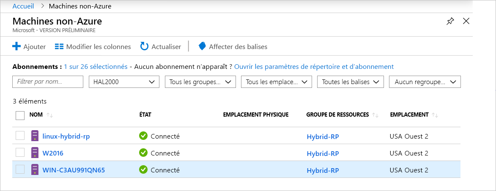

# <a name="what-is-azure-arc-for-servers"></a>Qu’est-ce qu’Azure Arc pour les serveurs ?

Azure Arc pour les serveurs permet de gérer les ordinateurs qui se trouvent en dehors d’Azure.
Lorsqu’un ordinateur extérieur à Azure est connecté à Azure, il devient un **ordinateur connecté** et est traité comme une ressource dans Azure. Chaque **ordinateur connecté** possède un ID de ressource, est géré dans le cadre d’un groupe de ressources au sein d’un abonnement et tire parti des constructions Azure standard, comme Azure Policy et le marquage.

Il est nécessaire d’installer un package d’agent sur chaque ordinateur à connecter à Azure. Le reste de ce document explique le processus plus en détail.

L’état des ordinateurs sera **Connecté** ou **Déconnecté** en fonction de la date du dernier check-in de l’agent. Chaque check-in est appelé « pulsation ». Si un ordinateur n’a pas eu de check-in au cours des cinq dernières minutes, il apparaît hors connexion jusqu’à ce que la connectivité soit restaurée.  <!-- For more information on troubleshooting agent connectivity, see [Troubleshooting Azure Arc for servers](troubleshoot/arc-for-servers.md). -->



## <a name="clients"></a>Clients

### <a name="supported-operating-systems"></a>Systèmes d'exploitation pris en charge

Dans la préversion publique, nous prenons en charge les systèmes suivants :

- Windows Server 2012 R2 et ultérieur
- Ubuntu 16.04 et 18.04

La préversion publique est conçue à des fins d’évaluation et ne doit pas être utilisée pour gérer des ressources de production critiques.

## <a name="azure-subscription-and-service-limits"></a>Limites du service et de l’abonnement Azure

Veillez à lire les limites d’Azure Resource Manager et à prévoir le nombre de machines à connecter conformément aux recommandations indiquées pour [l’abonnement](../../azure-subscription-service-limits.md#subscription-limits---azure-resource-manager) et les [groupes de ressources](../../azure-subscription-service-limits.md#resource-group-limits). En particulier, il existe par défaut une limite de 800 serveurs par groupe de ressources.

## <a name="networking-configuration"></a>Configuration de la mise en réseau

Pendant l’installation et l’exécution, l’agent a besoin d’une connectivité vers les **points de terminaison de service Azure Arc**. Si la connectivité sortante est bloquée par des pare-feu, vérifiez que les URL suivantes ne sont pas bloquées par défaut. Toutes les connexions sont sortantes de l’agent vers Azure et sécurisées par le protocole **SSL**. Tout le trafic peut être acheminé via un proxy **HTTPS**. Si vous autorisez les plages d’adresses IP ou les noms de domaine auxquels les serveurs sont autorisés à se connecter, vous devez autoriser le port 443 à accéder aux balises de service et aux noms DNS suivants.

Balises de service :

* AzureActiveDirectory
* AzureTrafficManager

Pour obtenir la liste d’adresses IP de chaque balise de service/région, consultez le fichier JSON - [Plages d’adresses IP Azure et balises de service – Cloud Public](https://www.microsoft.com/download/details.aspx?id=56519). Microsoft publie chaque semaine une mise à jour contenant chacun des services Azure et les plages d’adresses IP qu’il utilise. Pour plus d’informations, voir [Balises de service](https://docs.microsoft.com/azure/virtual-network/security-overview#service-tags).

Ces noms DNS sont fournis en plus des informations relatives à la plage d’adresses IP des balises de service, car la plupart des services n’ont pas actuellement d’inscription de balise de service et, par conséquent, les adresses IP sont sujettes à modification. Si des plages d’adresses IP sont requises par la configuration de votre pare-feu, utilisez la balise de service **AzureCloud** pour autoriser l’accès à tous les services Azure. Ne désactivez pas la surveillance ou l'inspection de la sécurité de ces URL, mais autorisez-les comme vous le feriez pour tout autre trafic Internet.

| Environnement de domaine | Points de terminaison de service Azure nécessaires |
|---------|---------|
|management.azure.com|Azure Resource Manager|
|login.windows.net|Azure Active Directory|
|dc.services.visualstudio.com|Application Insights|
|agentserviceapi.azure-automation.net|Guest Configuration|
|*-agentservice-prod-1.azure-automation.net|Guest Configuration|
|*.his.hybridcompute.azure-automation.net|Service d’identité hybride|

### <a name="installation-network-requirements"></a>Configuration requise du réseau d’installation

Téléchargez le [package de l’agent de l’ordinateur connecté à Azure](https://aka.ms/AzureConnectedMachineAgent) sur nos serveurs de distribution officiels. Les sites ci-dessous doivent être accessibles à partir de votre environnement. Vous pouvez choisir de télécharger le package sur un partage de fichiers et d’installer l’agent à partir de cet emplacement. Dans ce cas, le script d’intégration généré à partir du Portail Azure devra peut-être être modifié.

Windows :

* `aka.ms`
* `download.microsoft.com`

Linux :

* `aka.ms`
* `packages.microsoft.com`

Pour plus d’informations sur la configuration de l’agent nécessaire pour utiliser un proxy, voir la section [Configuration du serveur proxy](quickstart-onboard-powershell.md#proxy-server-configuration).

## <a name="register-the-required-resource-providers"></a>Inscrire les fournisseurs de ressources requis

Pour pouvoir utiliser Azure Arc pour les serveurs, vous devez inscrire les fournisseurs de ressources nécessaires.

* **Microsoft.HybridCompute**
* **Microsoft.GuestConfiguration**

Pour inscrire les fournisseurs de ressources, utilisez les commandes suivantes :

Azure PowerShell :

```azurepowershell-interactive
Login-AzAccount
Set-AzContext -SubscriptionId [subscription you want to onboard]
Register-AzResourceProvider -ProviderNamespace Microsoft.HybridCompute
Register-AzResourceProvider -ProviderNamespace Microsoft.GuestConfiguration
```

Interface de ligne de commande Azure :

```azurecli-interactive
az account set --subscription "{Your Subscription Name}"
az provider register --namespace 'Microsoft.HybridCompute'
az provider register --namespace 'Microsoft.GuestConfiguration'
```

Vous pouvez également inscrire les fournisseurs de ressources à l’aide du portail en suivant les étapes décrites sous [Portail Azure](../../azure-resource-manager/resource-manager-supported-services.md#azure-portal).

## <a name="machine-changes-after-installing-the-agent"></a>Modifications de la machine après l’installation de l’agent

Si vous avez déployé une solution de suivi des modifications dans votre environnement, vous pouvez utiliser la liste ci-dessous pour suivre, identifier et autoriser les modifications apportées par le package d’installation **Azure Connected Machine Agent (AzCMAgent)** .

Après avoir installé l’agent, vous voyez les modifications suivantes apportées à vos serveurs.

### <a name="windows"></a>Windows

Services installés :

* `Himds` : Service **Azure Connected Machine Agent**.
* `Dscservice` ou `gcd` : Service **Guest Configuration**.

Fichiers ajoutés au serveur :

* `%ProgramFiles%\AzureConnectedMachineAgent\*.*` : Emplacement des fichiers **Azure Connected Machine Agent**.
* `%ProgramData%\GuestConfig\*.*` -  Journaux **Guest Configuration**.

Emplacements des clés de Registre :

* `HKEY_LOCAL_MACHINE\SOFTWARE\Microsoft\Azure Connected Machine Agent` : Clés de Registre pour **Azure Connected Machine Agent**.

### <a name="linux"></a>Linux

Services installés :

* `Himdsd` : Service **Azure Connected Machine Agent**.
* `dscd` ou `gcd` : Service **Guest Configuration**.

Fichiers ajoutés au serveur :

* `/var/opt/azcmagent/**` : Emplacement des fichiers **Azure Connected Machine Agent**.
* `/var/lib/GuestConfig/**` -  Journaux **Guest Configuration**.

## <a name="supported-scenarios"></a>Scénarios pris en charge

Vous pouvez gérer les nœuds que vous avez inscrits à l’aide d’autres services Azure.

Dans la préversion publique, les scénarios suivants sont pris en charge pour les **ordinateurs connectés**.

## <a name="guest-configuration"></a>Guest Configuration

Une fois que vous avez connecté l’ordinateur à Azure, vous pouvez affecter des stratégies Azure aux **ordinateurs connectés** suivant la même expérience qu’avec des machines virtuelles Azure.

Pour plus d’informations, voir [Comprendre la configuration invitée d’Azure Policy](../../governance/policy/concepts/guest-configuration.md).

Les journaux de l’agent de configuration invité d’un **ordinateur connecté** se trouvent aux emplacements suivants :

* Windows - `%ProgramFiles%\AzureConnectedMachineAgent\logs\dsc.log`
* Linux : `/opt/logs/dsc.log`

## <a name="log-analytics"></a>Log Analytics

Les données de journalisation collectées par [Microsoft Monitoring Agent (MMA)](https://docs.microsoft.com/azure/azure-monitor/log-query/log-query-overview) et stockées dans l’espace de travail Log Analytics contiennent désormais des propriétés propres à l’ordinateur (par exemple, **ResourceId**) qui peuvent être utilisées pour l’accès aux journaux axé sur les ressources.

- Les ordinateurs sur lesquels l’agent MMA est déjà installé disposent de la fonctionnalité **Azure Arc** par le biais de packs d’administration mis à jour.
- La [version 10.20.18011 (ou une version supérieure) de l’agent MMA](https://docs.microsoft.com/azure/virtual-machines/extensions/oms-windows#agent-and-vm-extension-version) est requise pour l’intégration d’Azure Arc pour les serveurs.
- En cas d’interrogation des données de journal dans [Azure Monitor](https://docs.microsoft.com/azure/azure-monitor/log-query/log-query-overview), le schéma de données retourné contient le **ResourceId** hybride sous la forme `/subscriptions/<SubscriptionId/resourceGroups/<ResourceGroup>/providers/Microsoft.HybridCompute/machines/<MachineName>`.

Pour plus d’informations, voir [Bien démarrer avec Log Analytics dans Azure Monitor](https://docs.microsoft.com/azure/azure-monitor/log-query/get-started-portal).

<!-- MMA agent version 10.20.18011 and later -->

## <a name="next-steps"></a>Étapes suivantes

Il existe deux moyens de connecter des ordinateurs avec Azure Arc pour les serveurs.

* **Interactif** : suivez le [Démarrage rapide du portail](quickstart-onboard-portal.md) pour générer un script à partir du portail et l’exécuter sur l’ordinateur. C’est la meilleure option si vous connectez un ordinateur à la fois.
* **À grande échelle** : suivez le [Démarrage rapide PowerShell](quickstart-onboard-powershell.md) pour créer un principal de service permettant de connecter des ordinateurs de manière non interactive.
