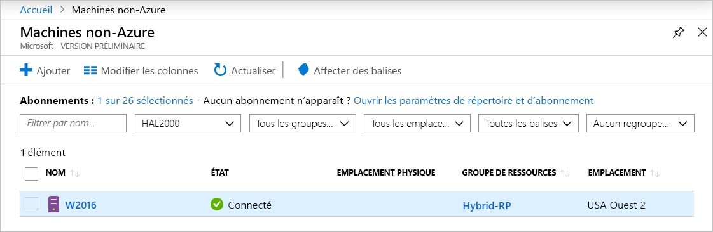

# <a name="connect-hybrid-machines-to-azure-from-the-azure-portal"></a>Connecter des machines hybrides à Azure à partir du portail Azure

Vous pouvez activer Azure Arc pour serveurs (préversion) pour une seule machine ou un petit nombre de machines Windows ou Linux dans votre environnement en effectuant un ensemble d’étapes manuellement. Vous pouvez également utiliser une méthode automatisée en exécutant un script de modèle que nous fournissons. Ce script automatise le téléchargement et l’installation des deux agents.

Cette méthode nécessite que vous disposiez d’autorisations d’administrateur sur la machine pour installer et configurer l’agent. Sur Linux, vous utilisez le compte root et, sur Windows, vous êtes membre du groupe Administrateurs local.

Avant de commencer, veillez à consulter les [conditions préalables](overview.md#prerequisites) et vérifiez que votre abonnement et vos ressources répondent aux exigences.

Si vous n’avez pas d’abonnement Azure, créez un [compte gratuit](https://azure.microsoft.com/free/?WT.mc_id=A261C142F) avant de commencer.

## <a name="generate-the-installation-script-from-the-azure-portal"></a>Générer le script d’installation à partir du portail Azure

Le script permettant d’automatiser le téléchargement et l’installation, et d’établir la connexion avec Azure Arc, est disponible sur le portail Azure. Pour effectuer le processus, procédez comme suit :

1. À partir de votre navigateur, accédez au [portail Azure](https://aka.ms/hybridmachineportal).

1. Dans la page **Machines - Azure Arc**, sélectionnez **Ajouter**, en haut à gauche, ou l’option **Créer une machine - Azure Arc** en bas du volet central. 

1. Dans la page **Sélectionner une méthode**, sélectionnez la vignette **Ajouter des machines à l’aide d’un script interactif**, puis sélectionnez **Générer un script**.

1. Dans la page **Générer un script**, sélectionnez l’abonnement et le groupe de ressources où vous souhaitez que la machine soit gérée dans Azure. Sélectionnez une localisation Azure destinée au stockage des métadonnées de la machine.

    >[!NOTE]
    >Azure Arc pour serveurs (préversion) prend uniquement en charge les régions suivantes :
    >- WestUS2
    >- WestEurope
    >- WestAsia
    >

1. Dans la page **Générer un script**, dans la liste déroulante **Système d’exploitation**, sélectionnez le système d’exploitation sur lequel le script s’exécutera.

1. Si la machine communique via un serveur proxy pour se connecter à Internet, sélectionnez **Suivant : Server proxy**. 
1. Sous l’onglet **Serveur proxy**, spécifiez l’adresse IP du serveur proxy ou le nom et le numéro de port que la machine doit utiliser pour communiquer avec le serveur proxy. Saisissez la valeur au format `http://<proxyURL>:<proxyport>`. 
1. Sélectionnez **Vérifier + générer**.

1. Sous l’onglet **Vérifier + générer**, passez en revue les informations de résumé, puis sélectionnez **Télécharger**. Si vous avez encore besoin d’apporter des modifications, sélectionnez **Précédent**.

## <a name="install-and-validate-the-agent-on-windows"></a>Installer et valider l’agent sur Windows

### <a name="install-manually"></a>Installer manuellement
Vous pouvez installer l’agent Connected Machine manuellement en exécutant le package Windows Installer *AzureConnectedMachineAgent.msi*. 

> [!NOTE]
> * Pour installer ou désinstaller l’agent, vous devez disposer d’autorisations d’*administrateur*.
> * Vous devez tout d’abord télécharger et copier le package Installer dans un dossier sur le serveur cible, ou à partir d’un dossier réseau partagé. Si vous exécutez le package Installer sans aucune option, il démarre un assistant de configuration que vous pouvez suivre pour une installation interactive de l’agent.

Si la machine doit communiquer avec le service via un serveur proxy, après avoir installé l’agent, vous devez exécuter une commande qui est décrite plus loin dans cet article. Cette dernière définit la variable d’environnement système du serveur proxy `https_proxy`.

Le tableau suivant répertorie les paramètres pris en charge par le programme de configuration pour l’agent à partir de la ligne de commande.

| Paramètre | Description |
|:--|:--|
| /? | Retourne la liste des options de ligne de commande. |
| /S | Effectue une installation silencieuse sans interaction utilisateur. |

Par exemple, pour exécuter le programme d’installation avec le paramètre `/?`, entrez `msiexec.exe /i AzureConnectedMachineAgent.msi /?`.

Les fichiers de l’agent Connected Machine sont installés dans *C:\Program Files\AzureConnectedMachineAgent* par défaut. Si le démarrage de l’agent échoue une fois l’installation terminée, recherchez des informations détaillées sur l’erreur dans les journaux. Le répertoire des journaux est *%Programfiles%\AzureConnectedMachineAgentAgent\logs*.

### <a name="install-with-the-scripted-method"></a>Effectuer l’installation à l’aide de la méthode de script

1. Connectez-vous au serveur.

1. Ouvrez une invite de commandes PowerShell avec élévation de privilèges.

1. Accédez au dossier ou au partage sur lequel vous avez copié le script et exécutez-le sur le serveur en exécutant le script `./OnboardingScript.ps1`.

### <a name="configure-the-agent-proxy-setting"></a>Configurer le paramètre de l’agent proxy

Pour définir la variable d’environnement du serveur proxy, exécutez la commande suivante :

```powershell
# If a proxy server is needed, execute these commands with the proxy URL and port.
[Environment]::SetEnvironmentVariable("https_proxy", "http://{proxy-url}:{proxy-port}", "Machine")
$env:https_proxy = [System.Environment]::GetEnvironmentVariable("https_proxy","Machine")
# For the changes to take effect, the agent service needs to be restarted after the proxy environment variable is set.
Restart-Service -Name himds
```

>[!NOTE]
>L’agent ne prend pas en charge la configuration de l’authentification proxy dans cette préversion.
>

### <a name="configure-agent-communication"></a>Configurer la communication de l’agent

Après avoir installé l’agent, vous devez exécuter la commande suivante pour configurer l’agent afin qu’il communique avec le service Azure Arc :

`%ProgramFiles%\AzureConnectedMachineAgent\azcmagent.exe" connect --resource-group "<resourceGroupName>" --tenant-id "<tenantID>" --location "<regionName>" --subscription-id "<subscriptionID>"`

## <a name="install-and-validate-the-agent-on-linux"></a>Installer et valider l’agent sur Linux

L’agent Connected Machine pour Linux est fourni dans le format de package par défaut pour la distribution (. RPM ou. DEB) qui est hébergée dans le [dépôt de packages](https://packages.microsoft.com/) de Microsoft. Le [bundle de script shell `Install_linux_azcmagent.sh`](https://aka.ms/azcmagent) effectue les opérations suivantes :

- Configure la machine hôte pour télécharger le package de l’agent à partir de packages.microsoft.com.
- Installe le package du fournisseur de ressources hybrides.

Si vous le souhaitez, vous pouvez configurer l’agent avec vos informations de proxy en incluant le paramètre `--proxy "{proxy-url}:{proxy-port}"`.

En outre, le script contient une logique permettant d’identifier les distributions prises en charge et non prises en charge et il vérifie les autorisations nécessaires pour effectuer l’installation. 

L’exemple suivant télécharge l’agent et l’installe :

```bash
# Download the installation package.
wget https://aka.ms/azcmagent -O ~/Install_linux_azcmagent.sh

# Install the connected machine agent. 
bash ~/Install_linux_azcmagent.sh
```

Pour télécharger et installer l’agent, y compris le paramètre `--proxy` permettant de configurer l’agent afin qu’il communique par le biais de votre serveur proxy, exécutez les commandes suivantes :

```bash
# Download the installation package.
wget https://aka.ms/azcmagent -O ~/Install_linux_azcmagent.sh

# Install the connected machine agent. 
bash ~/Install_linux_azcmagent.sh --proxy "{proxy-url}:{proxy-port}"
```

### <a name="configure-the-agent-communication"></a>Configurer la communication de l’agent

Après avoir installé l’agent, exécutez la commande suivante pour le configurer afin qu’il communique avec le service Azure Arc :

`/opt/azcmagent/bin/azcmagent.exe" connect --resource-group "<resourceGroupName>" --tenant-id "<tenantID>" --location "<regionName>" --subscription-id "<subscriptionID>"`

## <a name="verify-the-connection-with-azure-arc"></a>Vérifier la connexion avec Azure Arc

Une fois que vous avez installé l’agent et que vous l’avez configuré pour qu’il se connecte à Azure Arc pour serveurs (préversion), accédez au portail Azure pour vérifier que le serveur a été correctement connecté. Affichez vos machines dans le [portail Azure](https://aka.ms/hybridmachineportal).



## <a name="clean-up"></a>Nettoyer

Pour déconnecter une machine d’Azure Arc pour serveurs (préversion), procédez comme suit :

1. Ouvrez Azure Arc pour serveurs (préversion) en accédant au [portail Azure](https://aka.ms/hybridmachineportal).

1. Sélectionnez la machine dans la liste, sélectionnez les points de suspension ( **...** ), puis sélectionnez **Supprimer**.

1. Pour désinstaller l’agent Windows de la machine, procédez comme suit :

    a. Connectez-vous à la machine avec un compte disposant des autorisations d’administration.  
    b. Dans **Panneau de configuration**, sélectionnez **Programmes et fonctionnalités**.  
    c. Dans **Programmes et fonctionnalités**, sélectionnez **Agent Azure Connected Machine Agent**, **Désinstaller**, puis **Oui**.  

    >[!NOTE]
    > Vous pouvez également exécuter l’Assistant Installation de l’agent en double-cliquant sur le package d’installation **AzureConnectedMachineAgent.msi**.

    Si vous souhaitez générer un script pour la désinstallation, vous pouvez utiliser l’exemple suivant, qui récupère le code du produit et désinstalle l’agent à l’aide de la ligne de commande Msiexec.exe : `msiexec /x {Product Code}`. Pour ce faire :  
    
    a. Ouvrez l’Éditeur du Registre.  
    b. Sous la clé de Registre `HKEY_LOCAL_MACHINE\Software\Microsoft\Windows\CurrentVersion\Uninstall`, recherchez et copiez le GUID du code du produit.  
    c. Vous pouvez alors désinstaller l’agent à l’aide de Msiexec.

    L’exemple suivant montre comment désinstaller l’agent :

    ```powershell
    Get-ChildItem -Path HKLM:\Software\Microsoft\Windows\CurrentVersion\Uninstall | `
    Get-ItemProperty | `
    Where-Object {$_.DisplayName -eq "Azure Connected Machine Agent"} | `
    ForEach-Object {MsiExec.exe /x "$($_.PsChildName)" /qn}
    ```

1. Pour désinstaller l’agent Linux, exécutez la commande suivante :

      ```bash
      sudo apt purge hybridagent
      ```

## <a name="next-steps"></a>Étapes suivantes

> [!div class="nextstepaction"]
> [Attribuer une stratégie à des machines connectées](../../governance/policy/assign-policy-portal.md)
