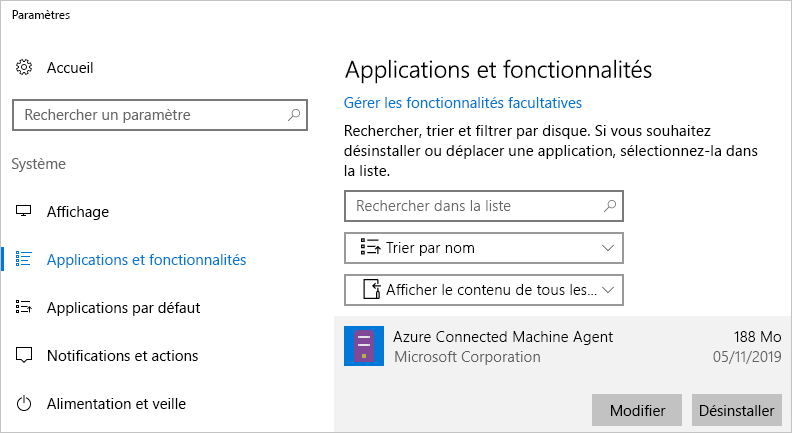

# <a name="quickstart-connect-machines-to-azure-using-azure-arc-for-servers---powershell"></a>Démarrage rapide : Connecter des machines à Azure avec Azure Arc pour les serveurs - PowerShell

Si vous n’avez pas d’abonnement Azure, créez un [compte gratuit](https://azure.microsoft.com/free/?WT.mc_id=A261C142F) avant de commencer.

## <a name="prerequisites"></a>Conditions préalables requises

Passez en revue les clients pris en charge et la configuration réseau requise dans la [Vue d’ensemble d’Azure Arc pour les serveurs](overview.md).

## <a name="create-a-service-principal-for-onboarding-at-scale"></a>Créer un principal du service pour une intégration à l’échelle

Un principal du service est une identité de gestion limitée spéciale qui ne dispose que de l’autorisation minimale nécessaire pour connecter des machines à Azure. Ceci est plus sûr que d’utiliser un compte plus puissant comme un administrateur de locataire. Le principal du service est utilisé uniquement lors de l’intégration. Vous pouvez supprimer en toute sécurité le principal du service après avoir connecté les serveurs de votre choix.

> [!NOTE]
> Cette étape est recommandée, mais pas obligatoire.

### <a name="steps-to-create-the-service-principal"></a>Étapes de création du principal du service

Dans cet exemple, nous allons utiliser [Azure PowerShell](/powershell/azure/install-az-ps) pour créer un nom de principal du service (SPN). Vous pouvez également suivre les étapes indiquées sous [Créer un principal du service à l’aide du portail Azure](../../active-directory/develop/howto-create-service-principal-portal.md) pour cette tâche.

> [!NOTE]
> Quand vous créez le principal de service, vous devez être Propriétaire ou Administrateur de l’accès utilisateur sur l’abonnement à utiliser pour l’intégration. Si vous n’avez pas les autorisations appropriées pour créer les attributions de rôles, le principal de service sera créé, mais il ne pourra pas intégrer de machines.

Le rôle `Azure Connected Machine Onboarding` contient uniquement les autorisations requises pour l’intégration. Vous pouvez définir l’autorisation d’un SPN pour permettre à son étendue de couvrir un groupe de ressources ou un abonnement.

Vous devez stocker la sortie de la cmdlet [`New-AzADServicePrincipal`](/powershell/module/az.resources/new-azadserviceprincipal), sinon vous ne pourrez pas récupérer le mot de passe à utiliser dans une étape ultérieure.

```azurepowershell-interactive
$sp = New-AzADServicePrincipal -DisplayName "Arc-for-servers" -Role "Azure Connected Machine Onboarding"
$sp
```

```output
Secret                : System.Security.SecureString
ServicePrincipalNames : {ad9bcd79-be9c-45ab-abd8-80ca1654a7d1, https://Arc-for-servers}
ApplicationId         : ad9bcd79-be9c-45ab-abd8-80ca1654a7d1
ObjectType            : ServicePrincipal
DisplayName           : Hybrid-RP
Id                    : 5be92c87-01c4-42f5-bade-c1c10af87758
Type                  :
```

> [!NOTE] 
> Il peut prendre un certain temps de renseigner correctement vos autorisations SPN. Exécutez l’attribution de rôle suivante pour définir les autorisations beaucoup plus rapidement.
> ``` PowerShell
> New-AzRoleAssignment -RoleDefinitionName "Azure Connected Machine Onboarding" -ServicePrincipalName $sp.ApplicationId
> ```

Récupérez maintenant le mot de passe en utilisant PowerShell.

```azurepowershell-interactive
$credential = New-Object pscredential -ArgumentList "temp", $sp.Secret
$credential.GetNetworkCredential().password
```

À partir de la sortie, copiez le **mot de passe** et l’**ApplicationId** (de l’étape précédente) et stockez-les pour plus tard dans un endroit sûr, comme le magasin des secrets de votre outil de configuration de serveur. Si vous oubliez ou perdez votre mot de passe SPN, vous pouvez le réinitialiser à l’aide de la cmdlet [`New-AzADSpCredential`](/powershell/module/azurerm.resources/new-azurermadspcredential).

Dans le script d’intégration de l’agent d’installation :

* La propriété **ApplicationId** est utilisée pour le paramètre `--service-principal-id` utilisé pour connecter l’agent.
* La propriété **password** est utilisée pour le paramètre `--service-principal-secret` utilisé pour connecter l’agent.

> [!NOTE]
> Veillez à utiliser la **propriété ApplicationId** du principal de service, et non la propriété **Id**. La propriété **Id** ne fonctionnera pas.

## <a name="manually-install-the-agent-and-connect-to-azure"></a>Installer manuellement l’agent et se connecter à Azure

Le guide suivant vous permet de connecter un ordinateur à Azure en vous connectant à l’ordinateur et en effectuant les étapes. Vous pouvez également connecter des ordinateurs à Azure [à partir du portail](quickstart-onboard-portal.md).

### <a name="download-and-install-the-agent"></a>Téléchargement et installation de l’agent

L’installation du package de l’agent nécessite un accès administrateur local ou racine sur le serveur cible, mais aucun accès Azure.

#### <a name="linux"></a>Linux

Pour les serveurs **Linux**, l’agent est distribué via le [référentiel de packages de Microsoft](https://packages.microsoft.com) à l’aide du format de package préféré pour la distribution (.RPM ou .DEB).

> [!NOTE]
> Pendant la préversion préliminaire, un seul package a été publié, qui convient pour Ubuntu 16.04 ou 18.04.

L’option la plus simple consiste à inscrire le référentiel de packages, puis à installer le package à l’aide du gestionnaire de package de la distribution.
Le script bash situé dans [https://aka.ms/azcmagent](https://aka.ms/azcmagent) effectue les actions suivantes :

1. Configure l’ordinateur hôte pour le téléchargement à partir de `packages.microsoft.com`.
2. Installe le package du fournisseur de ressources hybrides.
3. Configure éventuellement l’agent pour le fonctionnement du proxy, si vous spécifiez `--proxy`.

Le script contient également des vérifications des distributions prises en charge et non prises en charge, ainsi que la détection des autorisations requises pour l’installation.

L’exemple ci-dessous télécharge l’agent et l’installe, sans aucune vérification conditionnelle.

```bash
# Download the installation package
wget https://aka.ms/azcmagent -O ~/Install_linux_azcmagent.sh

# Install the connected machine agent. Omit the '--proxy "{proxy-url}"' parameters if proxy is not needed
bash ~/Install_linux_azcmagent.sh--proxy "{proxy-url}"
```

> [!NOTE]
> Si vous préférez ne pas référencer le référentiel de packages de Microsoft, vous pouvez copier le fichier de package à partir de celui-ci dans votre référentiel interne.

#### <a name="windows"></a>Windows

Pour **Windows**, l’agent est empaqueté dans un fichier Windows Installer (`.MSI`) et peut être téléchargé à partir de [https://aka.ms/AzureConnectedMachineAgent](https://aka.ms/AzureConnectedMachineAgent), qui est hébergé sur [https://download.microsoft.com](https://download.microsoft.com).

```powershell
# Download the package
Invoke-WebRequest -Uri https://aka.ms/AzureConnectedMachineAgent -OutFile AzureConnectedMachineAgent.msi

# Install the package
msiexec /i AzureConnectedMachineAgent.msi /l*v installationlog.txt /qn | Out-String
```

> [!NOTE]
> Sur Linux, la prochaine exécution du script d’installation sera automatiquement mise à niveau vers la dernière version. Sur Windows, vous devez désinstaller l’« agent de l’ordinateur connecté à Azure » avant d’exécuter à nouveau le programme d’installation pour effectuer la mise à niveau.

### <a name="connecting-to-azure"></a>Connexion à Azure

Une fois l’installation terminée, vous pouvez gérer et configurer l’agent à l’aide d’un outil de ligne de commande appelé `azcmagent.exe`. L’agent se trouve sous `/opt/azcmagent/bin` sur Linux et `$env:programfiles\AzureConnectedMachineAgent` sur Windows.

Sur Windows, ouvrez PowerShell en tant qu’administrateur sur un nœud cible et exécutez :

```powershell
& "$env:ProgramFiles\AzureConnectedMachineAgent\azcmagent.exe" connect `
  --service-principal-id "{your-spn-appid}" `
  --service-principal-secret "{your-spn-password}" `
  --resource-group "{your-resource-group-name}" `
  --tenant-id "{your-tenant-id}" `
  --location "{desired-location}" `
  --subscription-id "{your-subscription-id}"
```

Sur Linux, ouvrez un interpréteur de commandes et exécutez

<!-- Same command for linux?-->
```bash
azcmagent connect \
  --service-principal-id "{your-spn-appid}" \
  --service-principal-secret "{your-spn-password}" \
  --resource-group "{your-resource-group-name}" \
  --tenant-id "{your-tenant-id}" \
  --location "{location-of-your-resource-group}" \
  --subscription-id "{your-subscription-id}"
```

Paramètres :

* `tenant-id` : GUID du locataire. Vous pouvez le trouver dans le portail Azure en sélectionnant **Azure Active Directory** -> **Propriétés** -> **ID de répertoire**.
* `subscription-id` : GUID de l’abonnement, dans Azure, où vous souhaitez connecter votre ordinateur.
* `resource-group` : Groupe de ressources auquel vous souhaitez connecter votre ordinateur.
* `location` : Consultez [Régions Azure et emplacements](https://azure.microsoft.com/global-infrastructure/regions/). Cet emplacement peut être identique ou différent de l’emplacement du groupe de ressources. Pour la préversion publique, le service est pris en charge dans les régions **USA Ouest 2**, **Asie Sud-Est** et **Europe Ouest**.
* `resource-name` :  (*Facultatif*) Utilisé pour la représentation de ressource Azure de votre ordinateur local. Si vous ne spécifiez pas cette valeur, le nom d’hôte de l’ordinateur sera utilisé.

Vous trouverez plus d’informations sur l’outil « azcmagent » dans [Informations de référence Azcmagent](azcmagent-reference.md).
<!-- Isn't this still needed to view machines? -->

Une fois l’opération terminée, votre ordinateur est connecté à Azure. Vous pouvez afficher votre ordinateur dans le portail Azure en visitant [https://aka.ms/hybridmachineportal](https://aka.ms/hybridmachineportal).


### <a name="proxy-server-configuration"></a>Configuration du serveur proxy

#### <a name="linux"></a>Linux

<!-- New proxy name? -->

Pour **Linux**, si le serveur requiert un serveur proxy, vous pouvez :

* Exécuter le script `install_linux_hybrid_agent.sh` à partir de la section [Installer l’agent](#download-and-install-the-agent) ci-dessus, avec `--proxy`.
* Si vous avez déjà installé l’agent, exécutez la commande `/opt/azcmagent/bin/hybridrp_proxy add http://{proxy-url}:{proxy-port}`, qui configure le proxy et redémarre l’agent.

#### <a name="windows"></a>Windows

Pour **Windows**, si le serveur requiert un serveur proxy pour accéder aux ressources Internet, vous devez exécuter la commande ci-dessous pour définir la variable d’environnement du serveur proxy. Cela permet à l’agent d’utiliser le serveur proxy pour l’accès Internet.

```powershell
# If a proxy server is needed, execute these commands with actual proxy URL
[Environment]::SetEnvironmentVariable("https_proxy", "http://{proxy-url}:{proxy-port}", "Machine")
$env:https_proxy = [System.Environment]::GetEnvironmentVariable("https_proxy","Machine")
# The agent service needs to be restarted after the proxy environment variable is set in order for the changes to take effect.
Restart-Service -Name himds
```

> [!NOTE]
> Les proxys authentifiés ne sont pas pris en charge pour la préversion publique.

## <a name="clean-up"></a>Nettoyer

Pour déconnecter un ordinateur d’Azure Arc pour les serveurs, vous devez effectuer deux étapes.

1. Sélectionnez l’ordinateur dans le [Portail](https://aka.ms/hybridmachineportal), cliquez sur les points de suspension (`...`) et sélectionnez **Supprimer**.
1. Désinstallez l’agent de l’ordinateur.

   Sur Windows, vous pouvez utiliser le Panneau de configuration « Applications et fonctionnalités » pour désinstaller l’agent.
  
  

   Si vous voulez créer un script pour la désinstallation, vous pouvez utiliser l’exemple suivant, qui récupère le **PackageId** et désinstalle l’agent avec `msiexec /X`.

   Regardez sous la clé de Registre `HKEY_LOCAL_MACHINE\Software\Microsoft\Windows\CurrentVersion\Uninstall` et recherchez le **PackageId**. Vous pouvez alors désinstaller l’agent avec `msiexec`.

   L’exemple ci-dessous montre la désinstallation de l’agent.

   ```powershell
   Get-ChildItem -Path HKLM:\Software\Microsoft\Windows\CurrentVersion\Uninstall | `
   Get-ItemProperty | `
   Where-Object {$_.DisplayName -eq "Azure Connected Machine Agent"} | `
   ForEach-Object {MsiExec.exe /Quiet /X "$($_.PsChildName)"}
   ```

   Sur Linux, exécutez la commande suivante pour désinstaller l’agent.

   ```bash
   sudo apt purge hybridagent
   ```

## <a name="next-steps"></a>Étapes suivantes

> [!div class="nextstepaction"]
> [Attribuer une stratégie à des ordinateurs connectés](../../governance/policy/assign-policy-portal.md)
