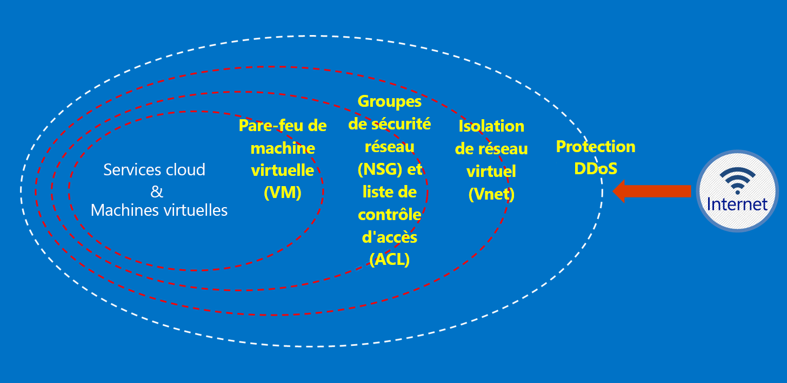

# Qu’est-ce qu’Azure Australie ?

En 2014, Azure a été lancé en Australie, avec deux régions : Australie Est (Sydney) et Australie Sud-Est (Melbourne). En avril 2018, deux nouvelles régions Azure situées à Canberra ont été lancées : Australie Centre et Australie Centre 2. Les régions Australie Centre et Australie Centre 2 sont spécialement conçues pour répondre aux besoins des infrastructures gouvernementales et nationales vitales. Elles offrent une connectivité et une flexibilité spécialisées vous permettant de placer vos systèmes à côté du cloud, avec des niveaux de sécurité et de résilience attendus uniquement de réseaux classifiés secrets. Azure Australie est une plateforme pour la transformation numérique des infrastructures gouvernementale et nationales vitales, et le seul cloud stratégique disponible en Australie, spécifiquement conçu pour répondre à ces besoins.

Le gouvernement australien a des exigences spécifiques pour ses données et systèmes en matière de connexion, de consommation et d’exploitation au sein de [Microsoft Azure Australie](https://azure.microsoft.com/global-infrastructure/australia/). Les ressources de cette page fournissent également des conseils généraux applicables à tous les clients, avec un accent particulier sur la configuration et l’exploitation sécurisées.

Reportez-vous à la page Australie du [portail d’approbation de services Microsoft](https://aka.ms/au-irap) pour obtenir des informations actuelles sur les évaluations de l’IRAP pour Azure Australie, sa certification et son inclusion dans la liste des services cloud certifiés (CCSL). Sur la page Australie, vous trouverez également d’autres conseils Microsoft spécifiquement à destination des fournisseurs d’infrastructures gouvernementales et critiques.

## Principes de sécurisation des données client dans Azure Australie

Azure Australie fournit une gamme de fonctionnalités et de services que vous pouvez utiliser pour créer des solutions cloud répondant à vos besoins en matière de données réglementées ou contrôlées. Une solution client conforme n’est rien d’autre que l’implémentation efficace des capacités d’Azure Australie prêtes à l’emploi, associée à une solide pratique de la sécurité des données.

Lorsque vous hébergez une solution dans Azure Australie, Microsoft gère un grand nombre de ces exigences au niveau de l’infrastructure cloud.

Le diagramme suivant illustre le modèle de défense approfondie d’Azure. Par exemple, Microsoft fournit une protection de base contre les attaques par déni de service (DDoS) dirigées contre l’infrastructure cloud, ainsi que des fonctionnalités client telles que des appliances de sécurité ou des service DDoD premium pour répondre à des besoins d’applications spécifiques des clients.

Ces articles décrivent les principes fondamentaux de la sécurisation de vos services et applications, et fournissent des conseils et meilleures pratiques concernant la manière d’appliquer ces principes. En d'autres termes, il explique comment les clients doivent utiliser Azure Australie intelligemment pour assumer les obligations et responsabilités qu’impose une solution gérant des informations de gouvernement sensibles et classifiées.

Il existe deux catégories de documentation fournies aux agences gouvernementales australiennes migrant vers Azure.

## Sécurité dans Azure Australie

L’identité, le contrôle d’accès en fonction du rôle Azure, la protection des données par le chiffrement et la gestion des droits, ainsi que l’efficacité de la supervision et du contrôle de configuration sont des éléments clés à implémenter. Cette section contient une série d’articles expliquant les fonctionnalités intégrées d’Azure et leurs relations avec le manuel de sécurité des informations (ISM) et les stratégies ASD Essential 8.

Ces articles sont accessibles via le menu sous *Concepts -> Sécurité dans Azure Australie*.

## Passerelles dans Azure Australie

L’établissement de fonctionnalités de sécurité de périmètre est une autre étape clé pour les agences gouvernementales. Ces fonctionnalités sont appelées passerelles Internet sécurisées (SIG) et, lorsque vous utilisez Azure, vous êtes responsable de veiller à ce que ces protections soient en place. Microsoft n’utilise pas de SIG. Toutefois, en combinant nos services de réseau périphérique qui protègent tous les clients et des services spécifiques déployés dans votre environnement Azure, vous pouvez bénéficier d’une fonctionnalité équivalente.

Ces articles sont accessibles via le menu sous *Concepts -> Passerelles dans Azure Australie*.

## Étapes suivantes

* Si votre objectif principal est de sécuriser vos données dans Azure, commencez par la [sécurité des données](secure-your-data.md).
* Si votre objectif principal est de créer une passerelle dans Azure, commencez par [l’audit, la journalisation et la visibilité de la passerelle](gateway-log-audit-visibility.md).
