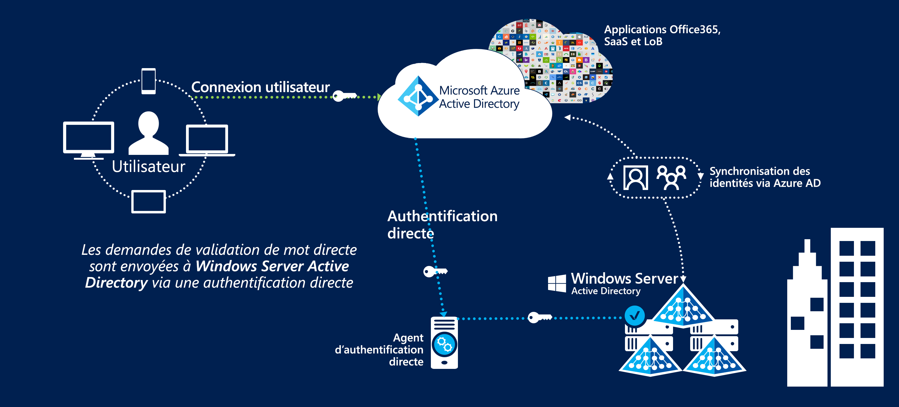
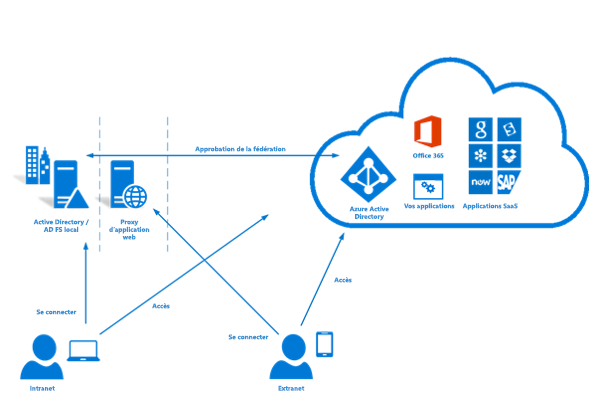

# Fédération des identités dans les régions Azure Australie

La gestion et la fédération des identités avec les offres de cloud public sont l’une des premières étapes les plus importantes pour l’utilisation du cloud. Le service Azure Active Directory de Microsoft stocke les informations utilisateur pour permettre l’accès aux services cloud, et est une condition préalable à l’utilisation d’autres services Azure.

Cet article aborde les principaux aspects de la conception pour l’implémentation d’Azure Active Directory, la synchronisation d’utilisateurs à partir d’un domaine Active Directory Domain Services et la mise en œuvre d’une authentification sécurisée. Une attention particulière est accordée aux recommandations du manuel de sécurité des informations du centre de cybersécurité de australien et aux rapports de certification Azure.

La classification des informations stockées dans Azure Active Directory doit informer les décisions sur la façon dont elles sont conçues. L’extrait suivant provient du [Rapport de certification ACSC – Microsoft Azure](https://aka.ms/au-irap) :

>**Rapport de certification ACSC – Microsoft Azure** Azure Active Directory (Azure AD) doit être configuré avec les services ADFS (Active Directory Federation Services) lorsque des entités du Commonwealth classifient l’utilisation et le contenu de données de leur Active Directory dans la catégorie PROTECTED. Bien que les données Active Directory dans la catégorie UNCLASSIFIED de la classification des marquages de limitation de diffusion ne nécessitent pas de fédération, les entités du Commonwealth peuvent toujours implémenter une fédération pour atténuer les risques associés au service fourni à partir de l’extérieur de l’Australie.

Par conséquent, les deux principaux aspects abordés ici sont les informations synchronisées et le mécanisme par lequel les utilisateurs sont authentifiés.

## Considérations clés en matière de conception

### Synchronisation d’utilisateur

Lors du déploiement d’Azure AD Connect vous devez prendre plusieurs décisions concernant les données qui seront synchronisées. Azure AD Connect est basé sur Microsoft Identity Manager, et fournit un ensemble de fonctionnalités robuste pour la [transformation](../active-directory/hybrid/how-to-connect-sync-best-practices-changing-default-configuration.md) de données entre annuaires.

Vous pouvez faire appel aux services de conseil Microsoft pour effectuer une évaluation ADRAP (Active Directory Risk Assessment Program) de votre Windows Server Active Directory existant. L’ADRAP aide à épingler des problèmes susceptibles de nécessiter une correction avant d’opérer la synchronisation avec Azure Active Directory. Les contrats Support Premier Microsoft Azure incluent généralement ce service.

L' [outil IDFix](/office365/enterprise/install-and-run-idfix) analyse votre domaine Active Directory local afin de détecter d’éventuels problèmes avant la synchronisation avec Azure AD. IDFix est une première étape essentielle avant d’implémenter Azure AD Connect. Bien qu'une analyse IDFix puisse identifier un grand nombre de problèmes, la plupart de ceux-ci peuvent être résolus rapidement avec des scripts, ou contournés à l'aide de transformations de données dans Azure AD Connect.

Azure AD exige que les utilisateurs disposent d’un domaine de premier niveau routable en externe pour permettre l’authentification. Si votre domaine a un suffixe UPN non routable en externe, vous devez définir l'[ID de connexion alternatif](../active-directory/hybrid/plan-connect-userprincipalname.md) dans AD Connect sur l’attribut de messagerie de l’utilisateur. Les utilisateurs se connectent ensuite aux services Azure avec leur adresse e-mail plutôt que via leur connexion au domaine.

Il est également possible de modifier le suffixe UPN sur les comptes d’utilisateur à l’aide d’outils tels que PowerShell, mais cela peut avoir des conséquences imprévues pour d’autres systèmes connectés et n’est plus considéré comme une meilleure pratique.

Lors de la détermination des attributs à synchroniser sur Azure Active Directory, il est plus sûr de supposer que tous les attributs sont requis. S’il est rare qu’un répertoire contienne des données de la catégorie PROTECTED, il est cependant recommandé d’effectuer un audit. Si des données de la catégorie PROTECTED sont trouvées dans le répertoire, évaluez l’impact de l’omission ou de la transformation de l’attribut. En guise de guide pratique, il existe une liste des attributs [requis](../active-directory/hybrid/reference-connect-sync-attributes-synchronized.md) par Azure Cloud Services.

### Authentication

Il est important de comprendre les options disponibles et la façon de les utiliser pour assurer la sécurité des utilisateurs finaux.
Microsoft propose [trois solutions natives](../active-directory/hybrid/plan-connect-user-signin.md) pour authentifier les utilisateurs auprès d’Azure Active Directory :

* Synchronisation de hachage du mot de passe : Azure AD Connect synchronise les mots de passe hachés d’Active Directory Domain Services dans Azure Active Directory.
* [Authentification directe](../active-directory/hybrid/how-to-connect-pta.md) : les mots de passe restent dans Active Directory Domain Services. Les utilisateurs sont authentifiés auprès d’Active Directory Domain Services via un agent. Aucun mot de passe n’est stocké dans Azure AD.
* [Authentification unique (SSO) fédérée](../active-directory/hybrid/how-to-connect-fed-whatis.md) : Azure Active Directory est fédéré avec les services de fédération Active Directory (AD FS) et, lors de la connexion, Azure dirige les utilisateurs vers AD FS pour l’authentification. Aucun mot de passe n’est stocké dans Azure AD.

La synchronisation de hachage du mot de passe peut être utilisée quand les données de la catégorie OFFICIAL:Sensitive et des catégories inférieures sont stockées dans le répertoire. Les scénarios dans lesquels des données de la catégorie PROTECTED sont stockées nécessitent l’une des deux options restantes.

Ces trois options prennent en charge la [Réécriture du mot de passe](../active-directory/authentication/concept-sspr-writeback.md) que le [Guide du consommateur ACSC](https://aka.ms/au-irap) recommande de désactiver. Toutefois, les organisations doivent évaluer le risque associé à la désactivation de la réécriture du mot de passe par rapport aux gains de productivité et à l’effort de support réduit résultant des réinitialisations de mot de passe en libre-service.

#### Authentification directe (PTA)

L’authentification directe ayant été introduite après l’évaluation de l’IRAP, elle doit être évaluée individuellement pour déterminer comment la solution correspond au profil de risque de votre organisation. L’authentification directe est préférable à la fédération par Microsoft, car elle améliore la posture de sécurité.

Plusieurs facteurs de conception de l’authentification directe doivent être pris en compte :

* L’agent d’authentification directe doit être en mesure d’établir des connexions sortantes aux Azure Cloud Services.
* Installation de plusieurs agents pour garantir une haute disponibilité du service. Une meilleure pratique consiste à déployer au moins trois agents, jusqu’à un maximum de 12.
* Une meilleure pratique consiste à éviter d’installer l’agent directement sur un Contrôleur de domaine Active Directory. Par défaut, lors du déploiement d’Azure AD Connect avec l’authentification directe, l’agent est installé sur le serveur AD Connect.
* L’authentification directe est une option nécessitant moins de maintenance que les services de fédération Active Directory (AD FS), car elle ne nécessite pas d’infrastructure de serveur dédiée, de gestion des certificats ou de règles de pare-feu pour le trafic entrant.

#### Services de fédération Active Directory (AD FS)

Les services de fédération Active Directory (AD FS) étaient inclus dans l’évaluation de l’IRAP et ont été approuvés pour une utilisation dans des environnements de la catégorie PROTECTED.

Plusieurs facteurs des services de fédération Active Directory (AD FS) doivent être pris en compte :

* Les services de fédération nécessitent une entrée réseau pour le trafic HTTPS en provenance d’Internet ou, au minimum, des points de terminaison de service de Microsoft.
* Les services de fédération utilisent une infrastructure à clé publique et des certificats qui nécessitent une gestion et un renouvellement continus.
* Les services de fédération doivent être déployés sur des serveurs dédiés et nécessitent une infrastructure réseau appropriée pour qu’ils soient accessibles en externe en toute sécurité.

### L’authentification multifacteur (MFA)

La section du manuel de sécurité des informations (ISM) sur l’authentification multifacteur recommande d’implémenter celle-ci dans les scénarios suivants, en fonction de votre profil de risque :

* Authentification d’utilisateurs standard
* Authentification de comptes privilégiés
* Authentification de l’accès à distance des utilisateurs
* Utilisateurs exécutant des actions privilégiées

Azure Active Directory fournit une authentification multifacteur qui peut être activée pour tous les utilisateurs ou pour un sous-ensemble d’entre eux (par exemple, uniquement les comptes privilégiés). Microsoft fournit également une solution appelée accès conditionnel qui permet un contrôle plus précis de l’application de l’authentification multifacteur (par exemple, uniquement lorsque les utilisateurs se connectent à partir de plages d’adresses IP distantes).

Le service Microsoft Azure AD Multi-Factor Authentication prend en charge les formes de validation acceptables du manuel de sécurité des informations (ISM) suivantes :

* appel téléphonique
* Message SMS
* Application Microsoft Authenticator
* Modules de sécurité matériels pris en charge

La technologie Privileged Identity Management, une composante d’Azure Active Directory, permet d’imposer l’utilisation de l’authentification multifacteur quand des utilisateurs élèvent leurs autorisations en réponse à la quatrième recommandation.

## Étapes suivantes

Consultez l’article sur les [contrôles d’accès en fonction du rôle Azure (RBAC) et Privileged Identity Management](role-privileged.md).