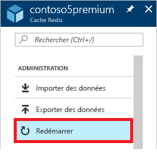
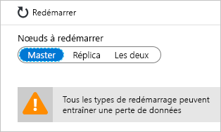
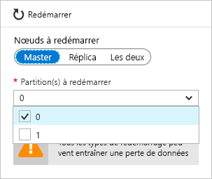

# Guide pratique pour administrer le Cache Azure pour Redis
Cette rubrique explique comment effectuer des tâches d’administration comme le [redémarrage](#reboot) et la [planification des mises à jour](#schedule-updates) de vos instances du Cache Azure pour Redis.

[!INCLUDE [updated-for-az](../../includes/updated-for-az.md)]

## Reboot
Le panneau **Redémarrer** vous permet de redémarrer un ou plusieurs nœuds de votre cache. Cette fonctionnalité de redémarrage vous permet de tester votre application pour garantir la résilience en cas de panne d’un nœud de cache.

Sélectionnez les nœuds à redémarrer, puis cliquez sur **Redémarrage**.

Si vous avez un cache premium avec activation du clustering, vous pouvez sélectionner les partitions du cache à redémarrer.

Pour redémarrer un ou plusieurs nœuds de votre cache, sélectionnez les nœuds souhaités, puis cliquez sur **Reboot**. Si vous avez un cache Premium avec activation du clustering, sélectionnez les partitions à redémarrer, puis cliquez sur **Redémarrer**. Après quelques minutes, les nœuds sélectionnés sont redémarrés et sont de nouveau en ligne.

L’impact sur les applications clientes varie selon les nœuds que vous redémarrez.

* **Maître** - lorsque le nœud principal est redémarré, Azure Cache pour Redis bascule sur le nœud réplica et le promeut au niveau principal. Pendant ce basculement, il peut y avoir un court intervalle pendant lequel les connexions au cache peuvent échouer.
* **Réplica** – lorsque le nœud réplica est redémarré, il n’y a généralement aucun impact sur les clients du cache.
* **Principal et réplica** - lorsque les nœuds du cache sont redémarrés, toutes les données sont perdues dans le cache et les connexions au cache échouent jusqu’à ce que le nœud principal soit de nouveau disponible. Si vous avez configuré la [persistance des données](cache-how-to-premium-persistence.md), la sauvegarde la plus récente est restaurée au moment où le cache est de nouveau en ligne. Toutefois, toute écriture de cache intervenue après cette sauvegarde est perdue.
* **Nœuds d’un cache Premium avec activation du clustering** : lorsque vous redémarrez le ou les nœuds d’un cache Premium et que le clustering est activé, le comportement des nœuds sélectionnés est le même que lorsque vous redémarrez un ou plusieurs nœuds correspondants d’un cache non cluster.

## Forum aux questions sur le redémarrage
* [Quel nœud dois-je redémarrer pour tester mon application ?](#which-node-should-i-reboot-to-test-my-application)
* [Est-il possible de redémarrer le cache pour effacer les connexions client ?](#can-i-reboot-the-cache-to-clear-client-connections)
* [Vais-je perdre les données dans mon cache si je redémarre ?](#will-i-lose-data-from-my-cache-if-i-do-a-reboot)
* [Est-il possible de redémarrer mon cache à l’aide de PowerShell, de l’interface de ligne de commande ou d’autres outils de gestion ?](#can-i-reboot-my-cache-using-powershell-cli-or-other-management-tools)

### Quel nœud dois-je redémarrer pour tester mon application ?
Pour tester la résilience de votre application en cas de défaillance du nœud principal de votre cache, redémarrez le nœud **Master** . Pour tester la résilience de votre application en cas de défaillance du nœud réplica, redémarrez le nœud **réplica**. Pour tester la résilience de votre application en cas de défaillance totale de votre cache, redémarrez les **deux** nœuds.

### Est-il possible de redémarrer le cache pour effacer les connexions client ?
Oui, toutes les connexions client sont effacées si vous réinitialisez le cache. Le redémarrage est utile lorsque toutes les connexions client sont utilisées, par exemple en raison d’une erreur logique ou d’un bogue dans l’application cliente. Chaque niveau tarifaire a différentes [limites de connexion client](cache-configure.md#default-redis-server-configuration) pour les différentes tailles. Une fois ces limites sont atteintes, aucune autre connexion client supplémentaire n’est acceptée. Redémarrer le cache permet d’effacer toutes les connexions client.

> [!IMPORTANT]
> Si vous réinitialisez votre cache pour effacer les connexions client, StackExchange.Redis se reconnecte automatiquement une fois le nœud Redis en ligne. Si le problème sous-jacent n’est pas résolu, les connexions client peuvent continuer à être utilisées.
> 
> 

### Vais-je perdre les données dans mon cache si je redémarre ?
Si vous redémarrez les nœuds **Master** et **Réplica**, toutes les données du cache (ou dans cette partition, si vous utilisez un cache Premium avec activation du clustering) peuvent être perdues, mais cela n’est pas systématique. Si vous avez configuré la [persistance des données](cache-how-to-premium-persistence.md), la sauvegarde la plus récente est restaurée au moment où le cache est de nouveau en ligne. Toutefois, toute écriture de cache intervenue après cette sauvegarde est perdue.

Si vous redémarrez simplement l’un des nœuds, les données ne sont généralement pas perdues, mais elles peuvent toujours l’être. Par exemple, si le nœud principal est redémarré et qu’une opération d’écriture dans le cache est en cours, les données écrites dans le cache sont perdues. Vous êtes également susceptible de perdre des données lorsque vous redémarrez un nœud et que l’autre nœud se met hors service en même temps en raison d’une défaillance. Pour plus d’informations sur les causes possibles d’une perte de données, voir [Qu’est-il arrivé à mes données dans Redis ?](https://gist.github.com/JonCole/b6354d92a2d51c141490f10142884ea4#file-whathappenedtomydatainredis-md)

### Est-il possible de redémarrer mon cache à l’aide de PowerShell, de l’interface de ligne de commande ou d’autres outils de gestion ?
Oui. Pour connaître les instructions PowerShell, voir [Redémarrer un Cache Azure pour Redis](cache-how-to-manage-redis-cache-powershell.md#to-reboot-an-azure-cache-for-redis).

## Planifier les mises à jour
Le panneau **Planification de mises à jour** vous permet de désigner une fenêtre de maintenance pour votre instance de cache. Une fenêtre de maintenance vous permet de contrôler le ou les jours et l’heure ou les heures d’une semaine où la ou les machines virtuelles hébergeant votre cache peuvent être mises à jour. Le cache Azure Cache pour Redis s’efforce de démarrer et de terminer la mise à jour du logiciel serveur Redis dans la fenêtre de temps que vous avez définie.

> [!NOTE] 
> La fenêtre de maintenance s’applique aux mises à jour du serveur Redis, ainsi qu’aux mises à jour du système d’exploitation des machines virtuelles qui hébergent le cache. La fenêtre de maintenance ne s’applique pas aux mises à jour du système d’exploitation hôte pour les hôtes qui hébergent des machines virtuelles de cache ou d’autres composants Azure Networking. Dans de rares cas, lorsque des caches sont hébergés sur des modèles plus anciens (si votre cache se trouve sur un modèle plus ancien, le nom DNS du cache correspondra au suffixe « cloudapp.net », « chinacloudapp.cn », « usgovcloudapi.net » ou « cloudapi.de »), la fenêtre de maintenance ne s’appliquera pas non plus aux mises à jour du système d’exploitation invité.
>

Pour spécifier une fenêtre de maintenance, vérifiez les jours choisis et spécifiez l’heure de début de la fenêtre de maintenance pour chaque jour, puis cliquez sur **OK**. Notez que l’heure de la maintenance est au format UTC. 

La fenêtre de maintenance minimale et par défaut pour les mises à jour est de cinq heures. Cette valeur n’est pas configurable à partir du portail Azure, mais vous pouvez la configure dans PowerShell à l’aide du paramètre `MaintenanceWindow` de la cmdlet [New-AzRedisCacheScheduleEntry](/powershell/module/az.rediscache/new-azrediscachescheduleentry) . Pour plus d'informations, consultez Puis-je gérer les mises à jour planifiées à l'aide de PowerShell, de l'interface CLI ou de tout autre outil de gestion ?

## Forum aux questions de la planification des mises à jour
* [Quand les mises à jour sont-elles effectuées si je n’utilise pas la fonctionnalité de planification des mises à jour ?](#when-do-updates-occur-if-i-dont-use-the-schedule-updates-feature)
* [Quels types de mises à jour sont exécutés au cours de la fenêtre de maintenance planifiée ?](#what-type-of-updates-are-made-during-the-scheduled-maintenance-window)
* [Puis-je gérer les mises à jour planifiées à l’aide de PowerShell, de l’interface de ligne de commande ou de tout autre outil de gestion ?](#can-i-managed-scheduled-updates-using-powershell-cli-or-other-management-tools)

### Quand les mises à jour sont-elles effectuées si je n’utilise pas la fonctionnalité de planification des mises à jour ?
Si vous ne spécifiez pas une fenêtre de maintenance, les mises à jour peuvent être effectuées à tout moment.

### Quels types de mises à jour sont exécutés au cours de la fenêtre de maintenance planifiée ?
Seules les mises à jour du serveur Redis sont exécutées au cours de la fenêtre de maintenance planifiée. La fenêtre de maintenance ne s’applique pas aux mises à jour d’Azure ou du système d’exploitation de la machine virtuelle.

### Puis-je gérer les mises à jour planifiées à l’aide de PowerShell, de l’interface de ligne de commande ou de tout autre outil de gestion ?
Oui. Vous pouvez gérer vos mises à jour planifiées à l’aide des cmdlets de commande PowerShell suivantes :

* [Get-AzRedisCachePatchSchedule](/powershell/module/az.rediscache/get-azrediscachepatchschedule)
* [New-AzRedisCachePatchSchedule](/powershell/module/az.rediscache/new-azrediscachepatchschedule)
* [New-AzRedisCacheScheduleEntry](/powershell/module/az.rediscache/new-azrediscachescheduleentry)
* [Remove-AzRedisCachePatchSchedule](/powershell/module/az.rediscache/remove-azrediscachepatchschedule)

## Étapes suivantes
En savoir plus sur les fonctionnalités d’Azure Cache pour Redis.

* [Niveaux de service Azure Cache pour Redis](cache-overview.md#service-tiers)

