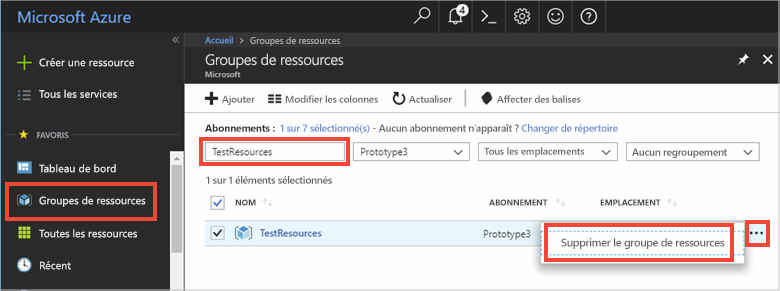

# <a name="quickstart-use-azure-cache-for-redis-with-a-net-framework-application"></a>Démarrage rapide : Utiliser le cache Azure pour Redis avec une application .NET Framework

Dans ce guide de démarrage rapide, vous allez incorporer le cache Azure pour Redis dans une application .NET Framework pour avoir accès à un cache sécurisé et dédié accessible à partir de n’importe quelle application dans Azure. Vous utiliserez spécifiquement le client [StackExchange.Redis](https://github.com/StackExchange/StackExchange.Redis) avec du code C# dans une application console .NET.

## <a name="prerequisites"></a>Prérequis

- Abonnement Azure : [créez-en un gratuitement](https://azure.microsoft.com/free/)
- [Visual Studio 2019](https://www.visualstudio.com/downloads/)
- [.NET Framework 4 ou ultérieur](https://www.microsoft.com/net/download/dotnet-framework-runtime), qui est requis par le client StackExchange.Redis.

## <a name="create-a-cache"></a>Création d'un cache
[!INCLUDE [redis-cache-create](../../includes/redis-cache-create.md)]

[!INCLUDE [redis-cache-access-keys](../../includes/redis-cache-access-keys.md)]

Créez un fichier nommé *CacheSecrets.config* sur votre ordinateur, à un emplacement qui ne sera pas archivé avec le code source de votre exemple d’application. Pour ce guide de démarrage rapide, le fichier *CacheSecrets.config* se trouve à l’emplacement suivant : *C:\AppSecrets\CacheSecrets.config*.

Modifiez le fichier *CacheSecrets.config* et ajoutez le contenu suivant :

```xml
<appSettings>
    <add key="CacheConnection" value="<cache-name>.redis.cache.windows.net,abortConnect=false,ssl=true,allowAdmin=true,password=<access-key>"/>
</appSettings>
```

Remplacez `<cache-name>` par le nom d’hôte de votre cache.

Remplacez `<access-key>` par la clé primaire de votre cache.


## <a name="create-a-console-app"></a>Créer une application console

Dans Visual Studio, cliquez sur **Fichier** > **Nouveau** > **Projet**.

Sélectionnez **Application console (.NET Framework)** et **Suivant** pour configurer votre application. Tapez un **Nom de projet**, puis cliquez sur **Créer** pour créer une application console.

<a name="configure-the-cache-clients"></a>

## <a name="configure-the-cache-client"></a>Configuration du client de cache

Dans cette section, vous allez configurer l’application console pour utiliser le client [StackExchange.Redis](https://github.com/StackExchange/StackExchange.Redis) pour .NET.

Dans Visual Studio, cliquez sur **Outils** > **Gestionnaire de package NuGet** > **Console du Gestionnaire de package**, et exécutez la commande suivante à partir de la fenêtre de la Console du Gestionnaire de package.

```powershell
Install-Package StackExchange.Redis
```

Une fois l’installation terminée, le client de cache *StackExchange.Redis* est disponible pour être utilisé avec votre projet.


## <a name="connect-to-the-cache"></a>Connexion au cache

Dans Visual Studio, ouvrez votre fichier *App.config* et mettez-le à jour pour inclure un attribut `appSettings` `file` référençant le fichier *CacheSecrets.config*.

```xml
<?xml version="1.0" encoding="utf-8" ?>
<configuration>
    <startup> 
        <supportedRuntime version="v4.0" sku=".NETFramework,Version=v4.7.1" />
    </startup>

    <appSettings file="C:\AppSecrets\CacheSecrets.config"></appSettings>
</configuration>
```

Dans l’Explorateur de solutions, cliquez avec le bouton droit sur **Références** et cliquez sur **Ajouter une référence**. Ajoutez une référence à l’assembly **System.Configuration**.

Ajoutez les instructions `using` ci-après à *Program.cs* :

```csharp
using StackExchange.Redis;
using System.Configuration;
```

La connexion au cache Azure pour Redis est gérée par la classe `ConnectionMultiplexer`. Cette classe doit être partagée et réutilisée dans votre application cliente. Ne créez pas une nouvelle connexion pour chaque opération. 

Ne stockez jamais d’informations d’identification dans du code source. Pour garder cet exemple simple, j’utilise uniquement un fichier de configuration externe des secrets. Une meilleure approche serait d’utiliser [Azure Key Vault avec des certificats](https://docs.microsoft.com/rest/api/keyvault/certificate-scenarios).

Dans *Program.cs*, ajoutez les membres suivants à la classe `Program` de votre application console :

```csharp
private static Lazy<ConnectionMultiplexer> lazyConnection = new Lazy<ConnectionMultiplexer>(() =>
{
    string cacheConnection = ConfigurationManager.AppSettings["CacheConnection"].ToString();
    return ConnectionMultiplexer.Connect(cacheConnection);
});

public static ConnectionMultiplexer Connection
{
    get
    {
        return lazyConnection.Value;
    }
}
```


Cette approche pour partager une instance `ConnectionMultiplexer` dans votre application utilise une propriété statique qui renvoie une instance connectée. Ce code fournit une méthode thread-safe permettant d’initialiser une seule instance `ConnectionMultiplexer` connectée. `abortConnect` a la valeur false, ce qui signifie que l’appel réussit même si aucune connexion au cache Azure pour Redis n’est établie. Une fonctionnalité clé de `ConnectionMultiplexer` est qu’il restaure automatiquement la connectivité au cache une fois que le problème réseau ou d’autres causes sont résolus.

La valeur du appSetting *CacheConnection* est utilisé pour faire référence à la chaîne de connexion de cache à partir du portail Azure en tant que paramètre de mot de passe.

## <a name="executing-cache-commands"></a>Exécution des commandes de cache

Ajoutez le code suivant pour la procédure `Main` de la classe `Program` pour votre application console :

```csharp
static void Main(string[] args)
{
    // Connection refers to a property that returns a ConnectionMultiplexer
    // as shown in the previous example.
    IDatabase cache = Connection.GetDatabase();

    // Perform cache operations using the cache object...

    // Simple PING command
    string cacheCommand = "PING";
    Console.WriteLine("\nCache command  : " + cacheCommand);
    Console.WriteLine("Cache response : " + cache.Execute(cacheCommand).ToString());

    // Simple get and put of integral data types into the cache
    cacheCommand = "GET Message";
    Console.WriteLine("\nCache command  : " + cacheCommand + " or StringGet()");
    Console.WriteLine("Cache response : " + cache.StringGet("Message").ToString());

    cacheCommand = "SET Message \"Hello! The cache is working from a .NET console app!\"";
    Console.WriteLine("\nCache command  : " + cacheCommand + " or StringSet()");
    Console.WriteLine("Cache response : " + cache.StringSet("Message", "Hello! The cache is working from a .NET console app!").ToString());

    // Demonstrate "SET Message" executed as expected...
    cacheCommand = "GET Message";
    Console.WriteLine("\nCache command  : " + cacheCommand + " or StringGet()");
    Console.WriteLine("Cache response : " + cache.StringGet("Message").ToString());

    // Get the client list, useful to see if connection list is growing...
    // Note that this requires the allowAdmin=true
    cacheCommand = "CLIENT LIST";
    Console.WriteLine("\nCache command  : " + cacheCommand);
    var endpoint = (System.Net.DnsEndPoint) Connection.GetEndPoints()[0];
    var server = Connection.GetServer(endpoint.Host, endpoint.Port);

    var clients = server.ClientList(); 
    Console.WriteLine("Cache response :");
    foreach (var client in clients)
    {
        Console.WriteLine(client.Raw);
    }

    lazyConnection.Value.Dispose();
}
```

Le cache Azure pour Redis dispose d’un nombre configurable de bases de données (16 par défaut) pouvant être utilisées pour séparer de manière logique les données dans un cache Azure pour Redis. Le code se connecte à la base de données par défaut, DB 0. Pour plus d’informations, consultez les sections [What are Redis databases?](cache-development-faq.md#what-are-redis-databases) (Que sont les bases de données Redis ?) et [Configuration du serveur Redis par défaut](cache-configure.md#default-redis-server-configuration).

Les éléments de cache peuvent être stockés et extraits en utilisant les méthodes `StringSet` et `StringGet`.

Redis stocke la plupart des données sous la forme de chaînes Redis, mais ces chaînes peuvent contenir de nombreux types de données, notamment des données binaires sérialisées, qui peuvent être utilisées lors du stockage d'objets .NET dans le cache.

Appuyez sur **Ctrl+F5** pour générer et exécuter l’application console.

Dans l’exemple ci-dessous, vous pouvez voir que la clé `Message` présentait auparavant une valeur mise en cache, qui avait été définie à l’aide de la console Redis du portail Azure. L’application a mis à jour cette valeur mise en cache. Elle a également exécuté les commandes `PING` et `CLIENT LIST`.


## <a name="work-with-net-objects-in-the-cache"></a>Utilisation des objets .NET dans le cache

Le cache Azure pour Redis peut mettre en cache des objets .NET et des types de données primitifs, mais avant qu’un objet .NET puisse être mis en cache, il doit être sérialisé. La sérialisation d’objet .NET échoit au développeur d’applications, qui a toute latitude pour choisir le sérialiseur.

Une méthode simple pour sérialiser des objets consiste à utiliser les méthodes de sérialisation `JsonConvert` dans [Newtonsoft.Json](https://www.nuget.org/packages/Newtonsoft.Json/) et à sérialiser vers et à partir de JSON. Dans cette section, vous allez ajouter un objet .NET dans le cache.

Dans Visual Studio, cliquez sur **Outils** > **Gestionnaire de package NuGet** > **Console du Gestionnaire de package**, et exécutez la commande suivante à partir de la fenêtre de la Console du Gestionnaire de package.

```powershell
Install-Package Newtonsoft.Json
```

Ajoutez l’instruction `using` suivante au début de *Program.cs* :

```csharp
using Newtonsoft.Json;
```

Ajoutez la définition de classe `Employee` suivante à *Program.cs* :

```csharp
class Employee
{
    public string Id { get; set; }
    public string Name { get; set; }
    public int Age { get; set; }

    public Employee(string EmployeeId, string Name, int Age)
    {
        this.Id = EmployeeId;
        this.Name = Name;
        this.Age = Age;
    }
}
```

Au bas de la procédure `Main()` dans *Program.cs*et avant l’appel à `Dispose()`, ajoutez les lignes de code suivantes à mettre en cache et récupérez un objet .NET sérialisé :

```csharp
    // Store .NET object to cache
    Employee e007 = new Employee("007", "Davide Columbo", 100);
    Console.WriteLine("Cache response from storing Employee .NET object : " + 
    cache.StringSet("e007", JsonConvert.SerializeObject(e007)));

    // Retrieve .NET object from cache
    Employee e007FromCache = JsonConvert.DeserializeObject<Employee>(cache.StringGet("e007"));
    Console.WriteLine("Deserialized Employee .NET object :\n");
    Console.WriteLine("\tEmployee.Name : " + e007FromCache.Name);
    Console.WriteLine("\tEmployee.Id   : " + e007FromCache.Id);
    Console.WriteLine("\tEmployee.Age  : " + e007FromCache.Age + "\n");
```

Appuyez sur **Ctrl + F5** pour générer et exécuter l’application console pour tester la sérialisation des objets .NET. 


## <a name="clean-up-resources"></a>Nettoyer les ressources

Si vous envisagez d’exécuter le didacticiel suivant, vous pouvez conserver les ressources créées dans le cadre de ce guide de démarrage rapide afin de les réutiliser.

Sinon, si l’exemple d’application de démarrage rapide était votre dernière opération, vous pouvez supprimer les ressources Azure créées dans ce démarrage rapide afin d’éviter tout frais. 

> [!IMPORTANT]
> La suppression d’un groupe de ressources est définitive ; le groupe de ressources et l’ensemble des ressources qu’il contient sont supprimés de manière permanente. Veillez à ne pas supprimer accidentellement des ressources ou un groupe de ressources incorrects. Si vous avez créé les ressources pour l’hébergement de cet exemple dans un groupe de ressources existant contenant des ressources que vous souhaitez conserver, vous pouvez supprimer chaque ressource individuellement à partir de son panneau respectif, au lieu de supprimer l’intégralité du groupe de ressources.
>

Connectez-vous au [Portail Azure](https://portal.azure.com) et cliquez sur **Groupes de ressources**.

Dans la zone de texte **Filtrer par nom.** , saisissez le nom de votre groupe de ressources. Les instructions de cet article ont utilisé un groupe de ressources nommé *TestResources*. Sur votre groupe de ressources dans la liste des résultats, cliquez sur **...** , puis sur **Supprimer le groupe de ressources**.



Il vous sera demandé de confirmer la suppression du groupe de ressources. Saisissez le nom de votre groupe de ressources pour confirmer, puis cliquez sur **Supprimer**.

Après quelques instants, le groupe de ressources et toutes les ressources qu’il contient sont supprimés.


<a name="next-steps"></a>

## <a name="next-steps"></a>Étapes suivantes

Dans ce guide de démarrage rapide, vous avez appris à utiliser le cache Azure pour Redis à partir d’une application .NET. Passez au guide de démarrage rapide suivant pour utiliser le cache Azure pour Redis avec une application web ASP.NET.

> [!div class="nextstepaction"]
> [Créer une application web ASP.NET qui utilise un cache Azure pour Redis.](./cache-web-app-howto.md)

Vous souhaitez optimiser et réduire vos coûts de cloud ?

> [!div class="nextstepaction"]
> [Démarrer l’analyse des coûts avec Cost Management](https://docs.microsoft.com/azure/cost-management-billing/costs/quick-acm-cost-analysis?WT.mc_id=costmanagementcontent_docsacmhorizontal_-inproduct-learn)