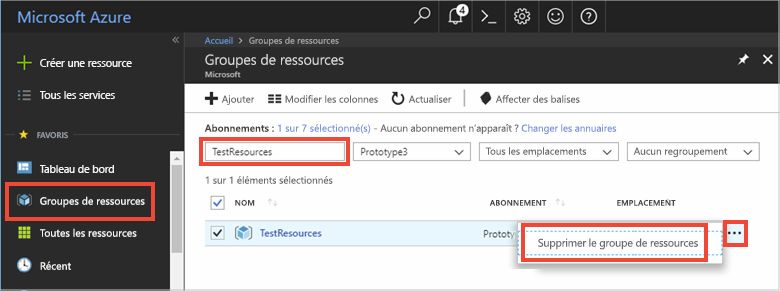

# <a name="quickstart-use-azure-cache-for-redis-with-java"></a>Démarrage rapide : Utiliser le cache Azure pour Redis avec Java

Dans ce guide de démarrage rapide, vous allez incorporer le cache Azure pour Redis dans une application Java à l’aide du client Redis [Jedis](https://github.com/xetorthio/jedis) pour avoir accès à un cache sécurisé et dédié accessible à partir de n’importe quelle application dans Azure.

## <a name="prerequisites"></a>Prérequis

- Abonnement Azure : [créez-en un gratuitement](https://azure.microsoft.com/free/)
- [Apache Maven](https://maven.apache.org/download.cgi)

## <a name="create-an-azure-cache-for-redis"></a>Créer un Cache Azure pour Redis

[!INCLUDE [redis-cache-create](../../includes/redis-cache-create.md)]

[!INCLUDE [redis-cache-access-keys](../../includes/redis-cache-access-keys.md)]

Ajoutez des variables d’environnement pour votre **NOM D’HÔTE** et la clé d’accès **Principale**. Vous allez utiliser ces variables à partir de votre code au lieu d’inclure les informations sensibles directement dedans.

```CMD 
set REDISCACHEHOSTNAME=contosoCache.redis.cache.windows.net
set REDISCACHEKEY=XXXXXXXXXXXXXXXXXXXXXXXXXXXXXXXXXXXXXXXXXXXX
```

## <a name="create-a-new-java-app"></a>Créer une nouvelle application Java

À l’aide de Maven, générez une nouvelle application de démarrage rapide :

```CMD
mvn archetype:generate -DarchetypeGroupId=org.apache.maven.archetypes -DarchetypeArtifactId=maven-archetype-quickstart -DarchetypeVersion=1.3 -DgroupId=example.demo -DartifactId=redistest -Dversion=1.0
```

Remplacez par le nouveau répertoire de projet *redistest*.

Ouvrez le fichier *pom.xml* et ajoutez une dépendance pour [Jedis](https://github.com/xetorthio/jedis) :

```xml
    <dependency>
        <groupId>redis.clients</groupId>
        <artifactId>jedis</artifactId>
        <version>3.2.0</version>
        <type>jar</type>
        <scope>compile</scope>
    </dependency>
```

Enregistrez le fichier *pom.xml* .

Ouvrez *App.java* et remplacez le code par le code suivant :

```java
package example.demo;

import redis.clients.jedis.Jedis;
import redis.clients.jedis.JedisShardInfo;

/**
 * Redis test
 *
 */
public class App 
{
    public static void main( String[] args )
    {

        boolean useSsl = true;
        String cacheHostname = System.getenv("REDISCACHEHOSTNAME");
        String cachekey = System.getenv("REDISCACHEKEY");

        // Connect to the Azure Cache for Redis over the TLS/SSL port using the key.
        JedisShardInfo shardInfo = new JedisShardInfo(cacheHostname, 6380, useSsl);
        shardInfo.setPassword(cachekey); /* Use your access key. */
        Jedis jedis = new Jedis(shardInfo);      

        // Perform cache operations using the cache connection object...

        // Simple PING command        
        System.out.println( "\nCache Command  : Ping" );
        System.out.println( "Cache Response : " + jedis.ping());

        // Simple get and put of integral data types into the cache
        System.out.println( "\nCache Command  : GET Message" );
        System.out.println( "Cache Response : " + jedis.get("Message"));

        System.out.println( "\nCache Command  : SET Message" );
        System.out.println( "Cache Response : " + jedis.set("Message", "Hello! The cache is working from Java!"));

        // Demonstrate "SET Message" executed as expected...
        System.out.println( "\nCache Command  : GET Message" );
        System.out.println( "Cache Response : " + jedis.get("Message"));

        // Get the client list, useful to see if connection list is growing...
        System.out.println( "\nCache Command  : CLIENT LIST" );
        System.out.println( "Cache Response : " + jedis.clientList());

        jedis.close();
    }
}
```

Ce code vous montre comment se connecter à une instance de cache Azure pour Redis à l’aide du nom d’hôte de cache et des variables d’environnement de la clé. Le code stocke et récupère également une valeur de chaîne dans le cache. Les commandes `PING` et `CLIENT LIST` sont également exécutées. 

Enregistrez *App.java*.

## <a name="build-and-run-the-app"></a>Générer et exécuter l’application

Exécutez la commande Maven suivante pour générer et exécuter l’application :

```CMD
mvn compile
mvn exec:java -D exec.mainClass=example.demo.App
```

Dans l’exemple ci-dessous, vous pouvez voir que la clé `Message` présentait auparavant une valeur mise en cache, qui avait été définie à l’aide de la console Redis du portail Azure. L’application a mis à jour cette valeur mise en cache. Elle a également exécuté les commandes `PING` et `CLIENT LIST`.


## <a name="clean-up-resources"></a>Nettoyer les ressources

Si vous envisagez d’exécuter le didacticiel suivant, vous pouvez conserver les ressources créées dans le cadre de ce guide de démarrage rapide afin de les réutiliser.

Sinon, si l’exemple d’application de démarrage rapide était votre dernière opération, vous pouvez supprimer les ressources Azure créées dans ce démarrage rapide afin d’éviter tout frais. 

> [!IMPORTANT]
> La suppression d’un groupe de ressources est définitive ; le groupe de ressources et l’ensemble des ressources qu’il contient sont supprimés de manière permanente. Veillez à ne pas supprimer accidentellement des ressources ou un groupe de ressources incorrects. Si vous avez créé les ressources pour l’hébergement de cet exemple dans un groupe de ressources existant contenant des ressources que vous souhaitez conserver, vous pouvez supprimer chaque ressource individuellement à partir de son panneau respectif, au lieu de supprimer l’intégralité du groupe de ressources.
>

1. Connectez-vous au [portail Azure](https://portal.azure.com), puis sélectionnez **Groupes de ressources**.

1. Dans la zone de texte **Filtrer par nom**, saisissez le nom de votre groupe de ressources. Les instructions de cet article ont utilisé un groupe de ressources nommé *TestResources*. Sur votre groupe de ressources dans la liste des résultats, cliquez sur **...** , puis sur **Supprimer le groupe de ressources**.

   

1. Il vous sera demandé de confirmer la suppression du groupe de ressources. Saisissez le nom de votre groupe de ressources à confirmer, puis sélectionnez **Supprimer**.

Après quelques instants, le groupe de ressources et toutes les ressources qu’il contient sont supprimés.

## <a name="next-steps"></a>Étapes suivantes

Dans ce guide de démarrage rapide, vous avez appris à utiliser le cache Azure pour Redis à partir d’une application Java. Passez au guide de démarrage rapide suivant pour utiliser le cache Azure pour Redis avec une application web ASP.NET.

> [!div class="nextstepaction"]
> [Créer une application web ASP.NET qui utilise un cache Azure pour Redis.](./cache-web-app-howto.md)
