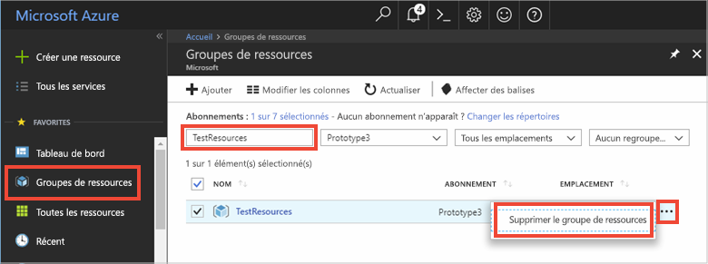

# <a name="quickstart-use-azure-cache-for-redis-with-nodejs"></a>Démarrage rapide : Utiliser le cache Azure pour Redis avec Node.js

Dans ce guide de démarrage rapide, vous allez incorporer le cache Azure pour Redis dans une application Node.js pour avoir accès à un cache sécurisé et dédié accessible à partir de n’importe quelle application dans Azure.

## <a name="prerequisites"></a>Prérequis

- Abonnement Azure : [créez-en un gratuitement](https://azure.microsoft.com/free/)
- [node_redis](https://github.com/mranney/node_redis), que vous pouvez installer à l’aide de la commande `npm install redis`. 

Pour obtenir des exemples d’utilisation des autres clients Node.js, consultez la documentation individuelle pour les [clients Redis Node.js](https://redis.io/clients#nodejs)répertoriés.

## <a name="create-a-cache"></a>Création d'un cache
[!INCLUDE [redis-cache-create](../../includes/redis-cache-create.md)]

[!INCLUDE [redis-cache-access-keys](../../includes/redis-cache-access-keys.md)]


Ajoutez des variables d’environnement pour votre **NOM D’HÔTE** et la clé d’accès **Principale**. Vous allez utiliser ces variables à partir de votre code au lieu d’inclure les informations sensibles directement dedans.

```
set REDISCACHEHOSTNAME=contosoCache.redis.cache.windows.net
set REDISCACHEKEY=XXXXXXXXXXXXXXXXXXXXXXXXXXXXXXXXXXXXXXXXXXXX
```

## <a name="connect-to-the-cache"></a>Connexion au cache

Les dernières versions de [node_redis](https://github.com/mranney/node_redis) prennent en charge la connexion au cache Azure pour Redis avec SSL. L’exemple suivant montre comment se connecter au cache Azure pour Redis à l’aide du point de terminaison SSL 6380. 

```js
var redis = require("redis");

// Add your cache name and access key.
var client = redis.createClient(6380, process.env.REDISCACHEHOSTNAME,
    {auth_pass: process.env.REDISCACHEKEY, tls: {servername: process.env.REDISCACHEHOSTNAME}});
```

Ne créez pas de connexion pour chaque opération dans votre code. Réutilisez plutôt les connexions disponibles autant que possible. 

## <a name="create-a-new-nodejs-app"></a>Créer une application Node.js

Créez un fichier de script nommé *redistest.js*. Utilisez la commande `npm install redis bluebird` pour installer les packages nécessaires.

Ajoutez l’exemple JavaScript suivant au fichier. Ce code vous montre comment se connecter à une instance de cache Azure pour Redis à l’aide du nom d’hôte de cache et des variables d’environnement de la clé. Le code stocke et récupère également une valeur de chaîne dans le cache. Les commandes `PING` et `CLIENT LIST` sont également exécutées. Pour plus d’exemples d’utilisation de Redis avec le client [node_redis](https://github.com/mranney/node_redis), consultez [https://redis.js.org/](https://redis.js.org/).

```js
var redis = require("redis");
var bluebird = require("bluebird");

// Convert Redis client API to use promises, to make it usable with async/await syntax
bluebird.promisifyAll(redis.RedisClient.prototype);
bluebird.promisifyAll(redis.Multi.prototype);

async function testCache() {

    // Connect to the Azure Cache for Redis over the SSL port using the key.
    var cacheConnection = redis.createClient(6380, process.env.REDISCACHEHOSTNAME, 
        {auth_pass: process.env.REDISCACHEKEY, tls: {servername: process.env.REDISCACHEHOSTNAME}});
        
    // Perform cache operations using the cache connection object...

    // Simple PING command
    console.log("\nCache command: PING");
    console.log("Cache response : " + await cacheConnection.pingAsync());

    // Simple get and put of integral data types into the cache
    console.log("\nCache command: GET Message");
    console.log("Cache response : " + await cacheConnection.getAsync("Message"));    

    console.log("\nCache command: SET Message");
    console.log("Cache response : " + await cacheConnection.setAsync("Message",
        "Hello! The cache is working from Node.js!"));    

    // Demonstrate "SET Message" executed as expected...
    console.log("\nCache command: GET Message");
    console.log("Cache response : " + await cacheConnection.getAsync("Message"));    

    // Get the client list, useful to see if connection list is growing...
    console.log("\nCache command: CLIENT LIST");
    console.log("Cache response : " + await cacheConnection.clientAsync("LIST"));    
}

testCache();
```

Exécutez le script avec Node.js.

```
node redistest.js
```

Dans l’exemple ci-dessous, vous pouvez voir que la clé `Message` présentait auparavant une valeur mise en cache, qui avait été définie à l’aide de la console Redis du portail Azure. L’application a mis à jour cette valeur mise en cache. Elle a également exécuté les commandes `PING` et `CLIENT LIST`.


## <a name="clean-up-resources"></a>Nettoyer les ressources

Si vous envisagez d’exécuter le didacticiel suivant, vous pouvez conserver les ressources créées dans le cadre de ce guide de démarrage rapide afin de les réutiliser.

Sinon, si l’exemple d’application de démarrage rapide était votre dernière opération, vous pouvez supprimer les ressources Azure créées dans ce démarrage rapide afin d’éviter tout frais. 

> [!IMPORTANT]
> La suppression d’un groupe de ressources est définitive ; le groupe de ressources et l’ensemble des ressources qu’il contient sont supprimés de manière permanente. Veillez à ne pas supprimer accidentellement des ressources ou un groupe de ressources incorrects. Si vous avez créé les ressources pour l’hébergement de cet exemple dans un groupe de ressources existant contenant des ressources que vous souhaitez conserver, vous pouvez supprimer chaque ressource individuellement à partir de son panneau respectif, au lieu de supprimer l’intégralité du groupe de ressources.
>

Connectez-vous au [portail Azure](https://portal.azure.com), puis sélectionnez **Groupes de ressources**.

Dans la zone de texte **Filtrer par nom**, entrez le nom de votre groupe de ressources. Les instructions de cet article ont utilisé un groupe de ressources nommé *TestResources*. Sur votre groupe de ressources dans la liste des résultats, cliquez sur **...** , puis sur **Supprimer le groupe de ressources**.



Il vous sera demandé de confirmer la suppression du groupe de ressources. Entrez le nom de votre groupe de ressources à confirmer, puis sélectionnez **Supprimer**.

Après quelques instants, le groupe de ressources et toutes les ressources qu’il contient sont supprimés.

## <a name="next-steps"></a>Étapes suivantes

Dans ce guide de démarrage rapide, vous avez appris à utiliser le cache Azure pour Redis à partir d’une application Node.js. Passez au guide de démarrage rapide suivant pour utiliser le cache Azure pour Redis avec une application web ASP.NET.

> [!div class="nextstepaction"]
> [Créer une application web ASP.NET qui utilise un cache Azure pour Redis.](./cache-web-app-howto.md)
