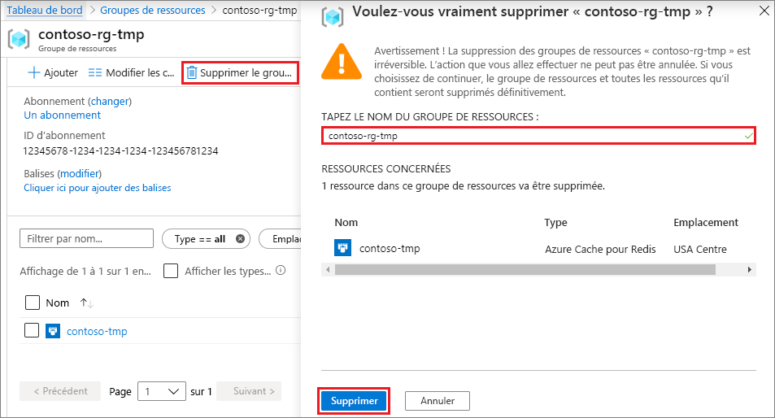

# <a name="quickstart-create-a-python-app-that-uses-azure-cache-for-redis"></a>Démarrage rapide : Créer une application Python qui utilise le Cache Azure pour Redis

Dans cet article, vous allez incorporer le cache Azure pour Redis dans une application Python afin d’avoir accès à un cache sécurisé et dédié accessible à partir de n’importe quelle application dans Azure.

## <a name="prerequisites"></a>Prérequis

- Abonnement Azure : [créez-en un gratuitement](https://azure.microsoft.com/free/)
- [Python 2 ou 3](https://www.python.org/downloads/)

## <a name="create-an-azure-cache-for-redis-instance"></a>Créer une instance Cache Redis Azure
[!INCLUDE [redis-cache-create](../../includes/redis-cache-create.md)]

[!INCLUDE [redis-cache-create](../../includes/redis-cache-access-keys.md)]

## <a name="install-redis-py"></a>Installe redis-py

[Redis-py](https://github.com/andymccurdy/redis-py) est une interface Python avec le cache Azure pour Redis. Utilisez l’outil des packages Python *pip* pour installer le package *redis-py* à partir d’une invite de commandes. 

L’exemple suivant utilise *pip3* pour Python 3 pour installer *redims-py* sur Windows 10 à partir d’une invite de commandes administrateur.


## <a name="read-and-write-to-the-cache"></a>Lire et écrire dans le cache

Exécutez Python à partir de la ligne de commande et testez votre cache en utilisant le code suivant. Remplacez `<Your Host Name>` et `<Your Access Key>` par les valeurs de votre instance Azure Cache pour Redis. Votre nom d’hôte prend la forme *\<Nom DNS>.redis.cache.windows.net*.

```python
>>> import redis
>>> r = redis.StrictRedis(host='<Your Host Name>',
        port=6380, db=0, password='<Your Access Key>', ssl=True)
>>> r.set('foo', 'bar')
True
>>> r.get('foo')
b'bar'
```

> [!IMPORTANT]
> Pour Azure Cache pour Redis version 3.0 ou ultérieure, la vérification du certificat SSL s’applique. Les certificats ssl_ca_certs doivent être explicitement définis lors de la connexion à Azure Cache pour Redis. Pour RedHat Linux RH, les certificats ssl_ca_certs se trouvent dans le module de certificat */etc/pki/tls/certs/ca-bundle.crt*.

## <a name="create-a-python-sample-app"></a>Créer un exemple d’application Python

Créez un fichier texte, ajoutez le script suivant, puis enregistrez le fichier sous *PythonApplication1.py*. Remplacez `<Your Host Name>` et `<Your Access Key>` par les valeurs de votre instance Azure Cache pour Redis. Votre nom d’hôte prend la forme *\<Nom DNS>.redis.cache.windows.net*.

```python
import redis

myHostname = "<Your Host Name>"
myPassword = "<Your Access Key>"

r = redis.StrictRedis(host=myHostname, port=6380,
                      password=myPassword, ssl=True)

result = r.ping()
print("Ping returned : " + str(result))

result = r.set("Message", "Hello!, The cache is working with Python!")
print("SET Message returned : " + str(result))

result = r.get("Message")
print("GET Message returned : " + result.decode("utf-8"))

result = r.client_list()
print("CLIENT LIST returned : ")
for c in result:
    print("id : " + c['id'] + ", addr : " + c['addr'])
```

Exécutez *PythonApplication1.py* avec Python. Vous devez obtenir des résultats tels que l’exemple suivant :


## <a name="clean-up-resources"></a>Nettoyer les ressources

Si vous en avez terminé avec le groupe de ressources et les ressources Azure que vous avez créés dans ce démarrage rapide, vous pouvez les supprimer pour éviter des frais.

> [!IMPORTANT]
> La suppression d’un groupe de ressources est irréversible. Le groupe de ressources et l’ensemble des ressources qu’il contient sont supprimés définitivement. Si vous avez créé votre instance Azure Cache pour Redis dans un groupe de ressources existant que vous souhaitez conserver, vous pouvez supprimer uniquement le cache en sélectionnant **Supprimer** dans la page **Vue d’ensemble** du cache. 

Pour supprimer le groupe de ressources et son instance Azure Cache pour Redis :

1. Dans le **portail Azure**, recherchez et sélectionnez [Groupes de ressources](https://portal.azure.com).
1. Dans la zone de texte **Filtrer par nom**, entrez le nom du groupe de ressources contenant votre instance de cache, puis sélectionnez-le dans les résultats de la recherche. 
1. Dans la page de votre groupe de ressources, sélectionnez **Supprimer le groupe de ressources**.
1. Tapez le nom du groupe de ressources, puis sélectionnez **Supprimer**.
   
   

## <a name="next-steps"></a>Étapes suivantes

> [!div class="nextstepaction"]
> [Créer une application web ASP.NET simple qui utilise un cache Azure pour Redis.](./cache-web-app-howto.md)

