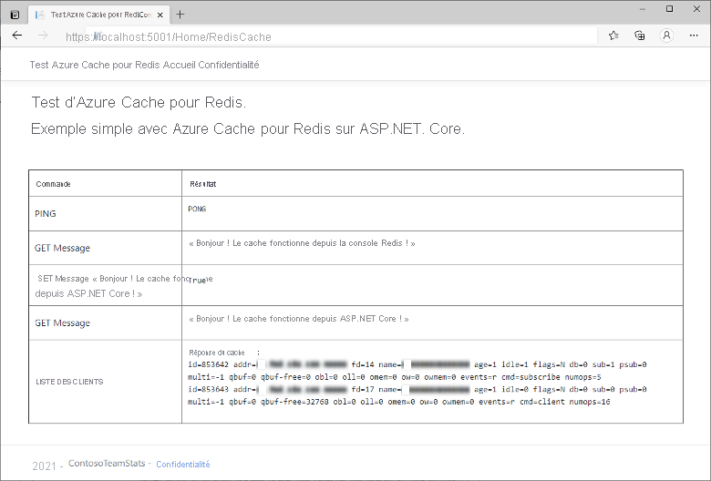
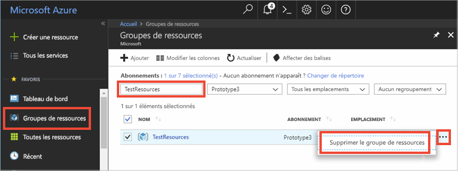

# <a name="quickstart-use-azure-cache-for-redis-with-an-aspnet-core-web-app"></a>Démarrage rapide : Utiliser Azure Cache pour Redis avec une application web ASP.NET Core 

Dans ce guide de démarrage rapide, vous incorporez Azure Cache pour Redis à une application web ASP.NET Core qui se connecte à Azure Cache pour Redis afin de stocker et récupérer des données du cache.

## <a name="skip-to-the-code-on-github"></a>Passer au code sur GitHub

Si vous souhaitez passer directement au code, consultez le guide de [démarrage rapide ASP.NET Core](https://github.com/Azure-Samples/azure-cache-redis-samples/tree/main/quickstart/aspnet-core) sur GitHub.

## <a name="prerequisites"></a>Prérequis

- Abonnement Azure : [créez-en un gratuitement](https://azure.microsoft.com/free/)
- [Kit de développement logiciel (SDK) .NET Core](https://dotnet.microsoft.com/download)

## <a name="create-a-cache"></a>Création d'un cache

[!INCLUDE [redis-cache-create](../../includes/redis-cache-create.md)]

[!INCLUDE [redis-cache-access-keys](../../includes/redis-cache-access-keys.md)]

Prenez note du **NOM D’HÔTE** et de la clé d’accès **PRINCIPALE**. Vous utiliserez ces valeurs ultérieurement pour construire le secret *CacheConnection*.

## <a name="create-an-aspnet-core-web-app"></a>Créez une application web ASP.NET Core

Ouvrez une nouvelle fenêtre de commande et exécutez la commande suivante pour créer une application web ASP.NET Core (modèle-vue-contrôleur) :

```dotnetcli
dotnet new mvc -o ContosoTeamStats
```

Dans votre fenêtre de commande, remplacez par le nouveau répertoire de projet *ContosoTeamStats*.

[!INCLUDE[Add Secret Manager support to an ASP.NET Core project](../../includes/azure-app-configuration-add-secret-manager.md)]

Exécutez la commande suivante pour ajouter le package *Microsoft.Extensions.Configuration.UserSecrets* au projet :

```dotnetcli
dotnet add package Microsoft.Extensions.Configuration.UserSecrets
```

Exécutez la commande suivante pour restaurer vos packages :

```dotnetcli
dotnet restore
```

Dans la fenêtre de commande, exécutez la commande suivante pour stocker un nouveau secret nommé *CacheConnection*, après avoir remplacé les espaces réservés (y compris les crochets pointus) pour le nom de cache et la clé d’accès principale :

```dotnetcli
dotnet user-secrets set CacheConnection "<cache name>.redis.cache.windows.net,abortConnect=false,ssl=true,allowAdmin=true,password=<primary-access-key>"
```

## <a name="configure-the-cache-client"></a>Configuration du client de cache

Dans cette section, vous allez configurer l’application pour utiliser le client [StackExchange.Redis](https://github.com/StackExchange/StackExchange.Redis) pour .NET.

Dans la fenêtre de commande, exécutez la commande suivante dans le répertoire du projet *ContosoTeamStats* :

```dotnetcli
dotnet add package StackExchange.Redis
```

Une fois l’installation terminée, le client de cache *StackExchange.Redis* est disponible pour être utilisé avec votre projet.

## <a name="update-the-homecontroller-and-layout"></a>Mettre à jour les fichiers HomeController et Layout

Ajoutez les instructions `using` suivantes à *Controllers\HomeController.cs* :

```csharp
using System.Net.Sockets;
using System.Text;
using System.Threading;

using Microsoft.Extensions.Configuration;

using StackExchange.Redis;
```

Remplacez :

```csharp
private readonly ILogger<HomeController> _logger;

public HomeController(ILogger<HomeController> logger)
{
    _logger = logger;
}
```

par :

```csharp
private readonly ILogger<HomeController> _logger;
private static IConfiguration Configuration { get; set; }

public HomeController(ILogger<HomeController> logger, IConfiguration configuration)
{
    _logger = logger;
    if (Configuration == null)
        Configuration = configuration;
}
```

Ajoutez les membres suivants à la classe `HomeController` pour prendre en charge une nouvelle action `RedisCache` qui exécute certaines commandes sur le nouveau cache.

```csharp
public ActionResult RedisCache()
{
    ViewBag.Message = "A simple example with Azure Cache for Redis on ASP.NET Core.";

    IDatabase cache = GetDatabase();

    // Perform cache operations using the cache object...

    // Simple PING command
    ViewBag.command1 = "PING";
    ViewBag.command1Result = cache.Execute(ViewBag.command1).ToString();

    // Simple get and put of integral data types into the cache
    ViewBag.command2 = "GET Message";
    ViewBag.command2Result = cache.StringGet("Message").ToString();

    ViewBag.command3 = "SET Message \"Hello! The cache is working from ASP.NET Core!\"";
    ViewBag.command3Result = cache.StringSet("Message", "Hello! The cache is working from ASP.NET Core!").ToString();

    // Demonstrate "SET Message" executed as expected...
    ViewBag.command4 = "GET Message";
    ViewBag.command4Result = cache.StringGet("Message").ToString();

    // Get the client list, useful to see if connection list is growing...
    // Note that this requires allowAdmin=true in the connection string
    ViewBag.command5 = "CLIENT LIST";
    StringBuilder sb = new StringBuilder();
    var endpoint = (System.Net.DnsEndPoint)GetEndPoints()[0];
    IServer server = GetServer(endpoint.Host, endpoint.Port);
    ClientInfo[] clients = server.ClientList();

    sb.AppendLine("Cache response :");
    foreach (ClientInfo client in clients)
    {
        sb.AppendLine(client.Raw);
    }

    ViewBag.command5Result = sb.ToString();

    return View();
}

private const string SecretName = "CacheConnection";

private static long lastReconnectTicks = DateTimeOffset.MinValue.UtcTicks;
private static DateTimeOffset firstErrorTime = DateTimeOffset.MinValue;
private static DateTimeOffset previousErrorTime = DateTimeOffset.MinValue;

private static readonly object reconnectLock = new object();

// In general, let StackExchange.Redis handle most reconnects,
// so limit the frequency of how often ForceReconnect() will
// actually reconnect.
public static TimeSpan ReconnectMinFrequency => TimeSpan.FromSeconds(60);

// If errors continue for longer than the below threshold, then the
// multiplexer seems to not be reconnecting, so ForceReconnect() will
// re-create the multiplexer.
public static TimeSpan ReconnectErrorThreshold => TimeSpan.FromSeconds(30);

public static int RetryMaxAttempts => 5;

private static Lazy<ConnectionMultiplexer> lazyConnection = CreateConnection();

public static ConnectionMultiplexer Connection
{
    get
    {
        return lazyConnection.Value;
    }
}

private static Lazy<ConnectionMultiplexer> CreateConnection()
{
    return new Lazy<ConnectionMultiplexer>(() =>
    {
        string cacheConnection = Configuration[SecretName];
        return ConnectionMultiplexer.Connect(cacheConnection);
    });
}

private static void CloseConnection(Lazy<ConnectionMultiplexer> oldConnection)
{
    if (oldConnection == null)
        return;

    try
    {
        oldConnection.Value.Close();
    }
    catch (Exception)
    {
        // Example error condition: if accessing oldConnection.Value causes a connection attempt and that fails.
    }
}

/// <summary>
/// Force a new ConnectionMultiplexer to be created.
/// NOTES:
///     1. Users of the ConnectionMultiplexer MUST handle ObjectDisposedExceptions, which can now happen as a result of calling ForceReconnect().
///     2. Don't call ForceReconnect for Timeouts, just for RedisConnectionExceptions or SocketExceptions.
///     3. Call this method every time you see a connection exception. The code will:
///         a. wait to reconnect for at least the "ReconnectErrorThreshold" time of repeated errors before actually reconnecting
///         b. not reconnect more frequently than configured in "ReconnectMinFrequency"
/// </summary>
public static void ForceReconnect()
{
    var utcNow = DateTimeOffset.UtcNow;
    long previousTicks = Interlocked.Read(ref lastReconnectTicks);
    var previousReconnectTime = new DateTimeOffset(previousTicks, TimeSpan.Zero);
    TimeSpan elapsedSinceLastReconnect = utcNow - previousReconnectTime;

    // If multiple threads call ForceReconnect at the same time, we only want to honor one of them.
    if (elapsedSinceLastReconnect < ReconnectMinFrequency)
        return;

    lock (reconnectLock)
    {
        utcNow = DateTimeOffset.UtcNow;
        elapsedSinceLastReconnect = utcNow - previousReconnectTime;

        if (firstErrorTime == DateTimeOffset.MinValue)
        {
            // We haven't seen an error since last reconnect, so set initial values.
            firstErrorTime = utcNow;
            previousErrorTime = utcNow;
            return;
        }

        if (elapsedSinceLastReconnect < ReconnectMinFrequency)
            return; // Some other thread made it through the check and the lock, so nothing to do.

        TimeSpan elapsedSinceFirstError = utcNow - firstErrorTime;
        TimeSpan elapsedSinceMostRecentError = utcNow - previousErrorTime;

        bool shouldReconnect =
            elapsedSinceFirstError >= ReconnectErrorThreshold // Make sure we gave the multiplexer enough time to reconnect on its own if it could.
            && elapsedSinceMostRecentError <= ReconnectErrorThreshold; // Make sure we aren't working on stale data (e.g. if there was a gap in errors, don't reconnect yet).

        // Update the previousErrorTime timestamp to be now (e.g. this reconnect request).
        previousErrorTime = utcNow;

        if (!shouldReconnect)
            return;

        firstErrorTime = DateTimeOffset.MinValue;
        previousErrorTime = DateTimeOffset.MinValue;

        Lazy<ConnectionMultiplexer> oldConnection = lazyConnection;
        CloseConnection(oldConnection);
        lazyConnection = CreateConnection();
        Interlocked.Exchange(ref lastReconnectTicks, utcNow.UtcTicks);
    }
}

// In real applications, consider using a framework such as
// Polly to make it easier to customize the retry approach.
private static T BasicRetry<T>(Func<T> func)
{
    int reconnectRetry = 0;
    int disposedRetry = 0;

    while (true)
    {
        try
        {
            return func();
        }
        catch (Exception ex) when (ex is RedisConnectionException || ex is SocketException)
        {
            reconnectRetry++;
            if (reconnectRetry > RetryMaxAttempts)
                throw;
            ForceReconnect();
        }
        catch (ObjectDisposedException)
        {
            disposedRetry++;
            if (disposedRetry > RetryMaxAttempts)
                throw;
        }
    }
}

public static IDatabase GetDatabase()
{
    return BasicRetry(() => Connection.GetDatabase());
}

public static System.Net.EndPoint[] GetEndPoints()
{
    return BasicRetry(() => Connection.GetEndPoints());
}

public static IServer GetServer(string host, int port)
{
    return BasicRetry(() => Connection.GetServer(host, port));
}
```

Ouvrez *Views\Shared\\_Layout.cshtml*.

Remplacez :

```cshtml
<a class="navbar-brand" asp-area="" asp-controller="Home" asp-action="Index">ContosoTeamStats</a>
```

par :

```cshtml
<a class="navbar-brand" asp-area="" asp-controller="Home" asp-action="RedisCache">Azure Cache for Redis Test</a>
```

## <a name="add-a-new-rediscache-view-and-update-the-styles"></a>Ajouter une nouvelle vue RedisCache et mettre à jour les styles

Créez un fichier *Views\Home\RedisCache.cshtml* avec le contenu suivant :

```cshtml
@{
    ViewBag.Title = "Azure Cache for Redis Test";
}

<h2>@ViewBag.Title.</h2>
<h3>@ViewBag.Message</h3>
<br /><br />
<table border="1" cellpadding="10" class="redis-results">
    <tr>
        <th>Command</th>
        <th>Result</th>
    </tr>
    <tr>
        <td>@ViewBag.command1</td>
        <td><pre>@ViewBag.command1Result</pre></td>
    </tr>
    <tr>
        <td>@ViewBag.command2</td>
        <td><pre>@ViewBag.command2Result</pre></td>
    </tr>
    <tr>
        <td>@ViewBag.command3</td>
        <td><pre>@ViewBag.command3Result</pre></td>
    </tr>
    <tr>
        <td>@ViewBag.command4</td>
        <td><pre>@ViewBag.command4Result</pre></td>
    </tr>
    <tr>
        <td>@ViewBag.command5</td>
        <td><pre>@ViewBag.command5Result</pre></td>
    </tr>
</table>
```

Ajoutez les lignes suivantes à *wwwroot\css\site.css* :

```css
.redis-results pre {
  white-space: pre-wrap;
}
```

## <a name="run-the-app-locally"></a>Exécutez l’application localement.

Exécutez la commande suivante dans la fenêtre de commande pour générer l’application :

```dotnetcli
dotnet build
```

Exécutez ensuite l’application avec la commande suivante :

```dotnetcli
dotnet run
```

Accédez à `https://localhost:5001` dans votre navigateur web.

Dans la barre de navigation de la page web, sélectionnez **Test Azure Cache pour Redis** afin de tester l’accès au cache.

Dans l’exemple ci-dessous, vous pouvez voir que la clé `Message` présentait auparavant une valeur mise en cache, qui avait été définie à l’aide de la console Redis du portail Azure. L’application a mis à jour cette valeur mise en cache. Elle a également exécuté les commandes `PING` et `CLIENT LIST`.



## <a name="clean-up-resources"></a>Nettoyer les ressources

Si vous envisagez d’exécuter le didacticiel suivant, vous pouvez conserver les ressources créées dans le cadre de ce démarrage rapide afin de les réutiliser.

Sinon, dans le cas où l’exemple d’application de démarrage rapide était votre dernière opération, vous pouvez supprimer les ressources Azure que vous avez créées dans ce démarrage rapide afin d’éviter tout frais.

> [!IMPORTANT]
> La suppression d’un groupe de ressources est irréversible. Quand vous supprimez un groupe de ressources, toutes les ressources qu’il contient sont supprimées définitivement. Veillez à ne pas supprimer accidentellement des ressources ou un groupe de ressources incorrects. Si vous avez créé les ressources pour l’hébergement de cet exemple dans un groupe de ressources existant contenant des ressources que vous souhaitez conserver, vous pouvez supprimer chaque ressource individuellement à partir de son panneau respectif, au lieu de supprimer l’intégralité du groupe de ressources.

### <a name="to-delete-a-resource-group"></a>Pour supprimer un groupe de ressources

1. Connectez-vous au [Portail Azure](https://portal.azure.com), puis sélectionnez **Groupes de ressources**.

2. Dans la zone **Filtrer par nom...**, saisissez le nom de votre groupe de ressources. Les instructions de cet article ont utilisé un groupe de ressources nommé *TestResources*. Sur votre groupe de ressources, dans la liste des résultats, sélectionnez **...**, puis **Supprimer le groupe de ressources**.

    

Vous êtes invité à confirmer la suppression du groupe de ressources. Saisissez le nom de votre groupe de ressources pour confirmer, puis sélectionnez **Supprimer**.

Après quelques instants, le groupe de ressources et toutes ses ressources sont supprimés.

## <a name="next-steps"></a>Étapes suivantes

Pour plus d’informations concernant le déploiement sur Azure, consultez :

> [!div class="nextstepaction"]
> [Tutoriel : Créer une application ASP.NET Core et SQL Database dans Azure App Service](/azure/app-service/tutorial-dotnetcore-sqldb-app)

Pour plus d’informations sur le stockage du secret de la connexion au cache dans Azure Key Vault, consultez :

> [!div class="nextstepaction"]
> [Fournisseur de configuration Azure Key Vault dans ASP.NET Core](/aspnet/core/security/key-vault-configuration)

Vous souhaitez mettre à l’échelle votre cache en passant d’un niveau inférieur à un niveau supérieur ?

> [!div class="nextstepaction"]
> [Mise à l’échelle de Cache Azure pour Redis](./cache-how-to-scale.md)

Vous souhaitez optimiser et réduire vos coûts de cloud ?

> [!div class="nextstepaction"]
> [Démarrer l’analyse des coûts avec Cost Management](../cost-management-billing/costs/quick-acm-cost-analysis.md?WT.mc_id=costmanagementcontent_docsacmhorizontal_-inproduct-learn)
