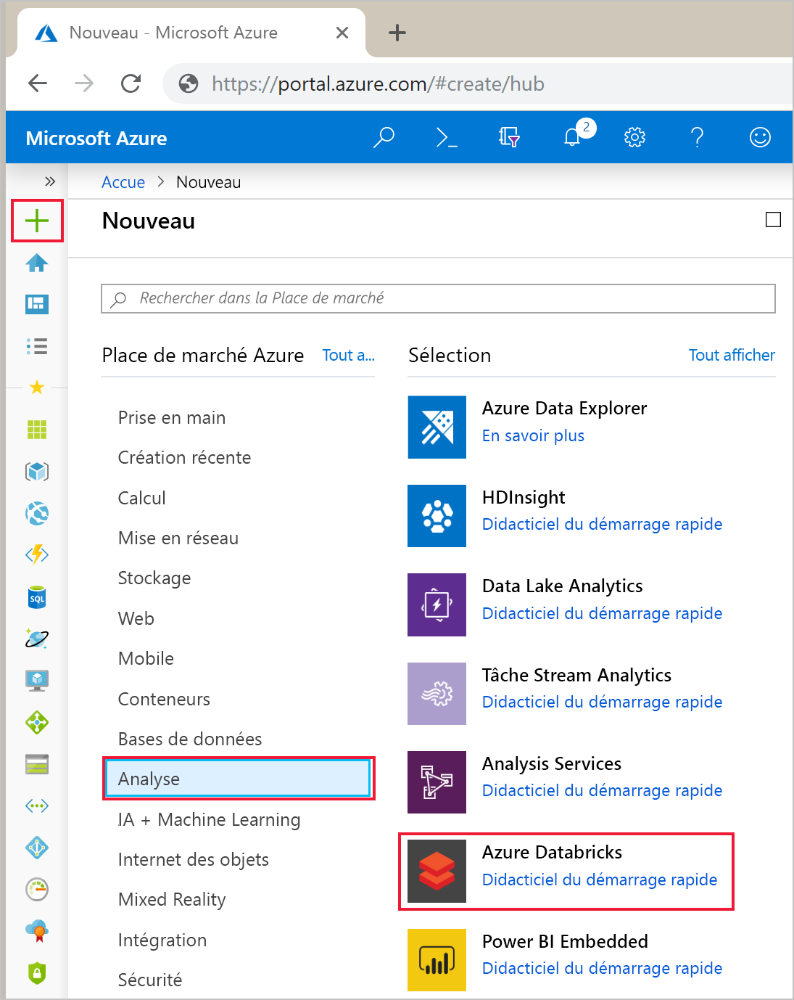
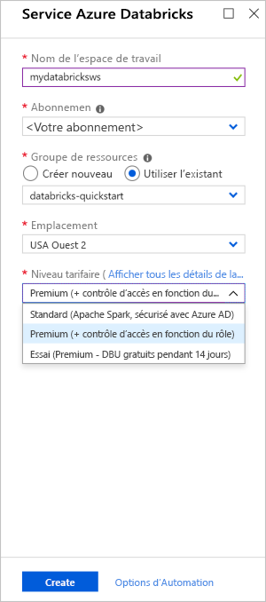
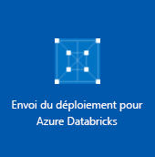
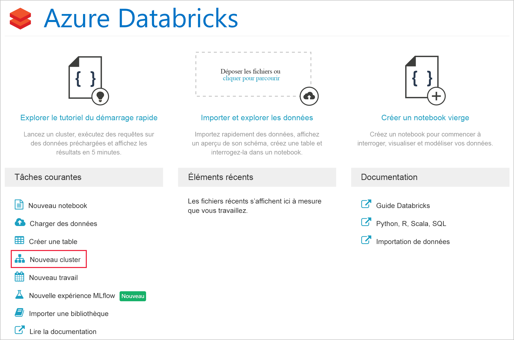
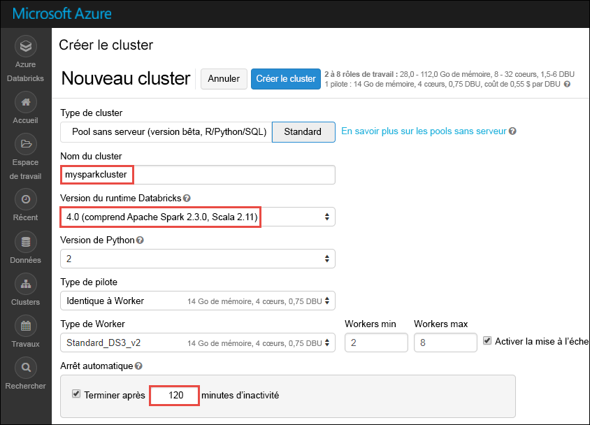
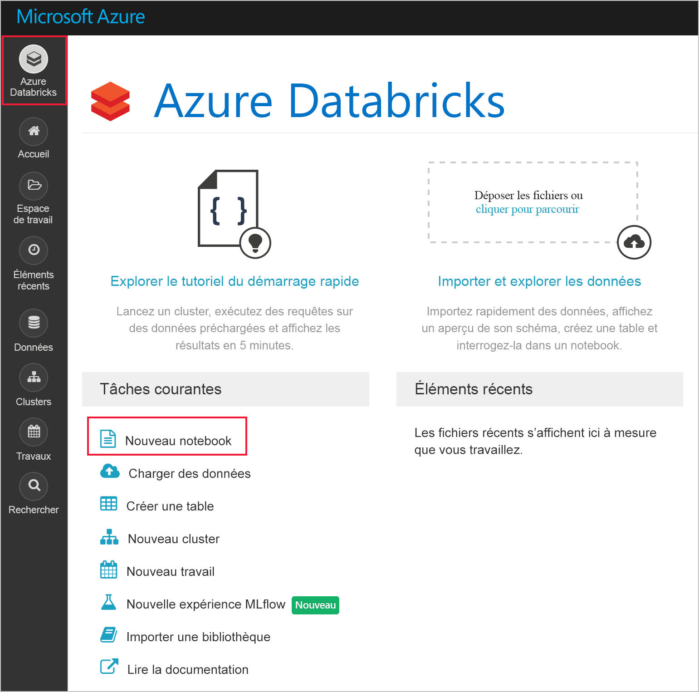
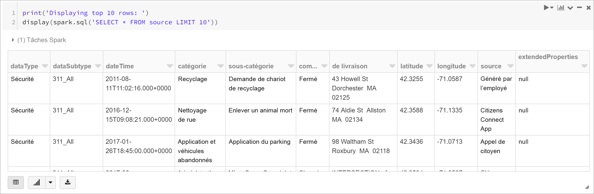
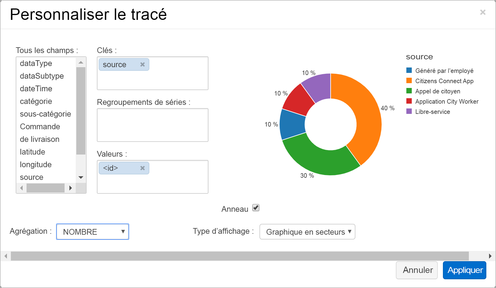
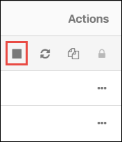

# <a name="quickstart-run-a-spark-job-on-azure-databricks-using-the-azure-portal"></a>Démarrage rapide : Exécuter une tâche Spark sur Azure Databricks avec le portail Azure

Dans ce guide de démarrage rapide, vous allez utiliser le portail Azure pour créer un espace de travail Azure Databricks avec un cluster Apache Spark. Vous exécutez un travail sur le cluster et utilisez des graphiques personnalisés pour produire des rapports en temps réel à partir de données de sécurité Boston.

## <a name="prerequisites"></a>Conditions préalables requises

- Abonnement Azure : [créez-en un gratuitement](https://azure.microsoft.com/free/)

## <a name="sign-in-to-the-azure-portal"></a>Connectez-vous au portail Azure.

Connectez-vous au [portail Azure](https://portal.azure.com).

> [!Note]
> Ce didacticiel ne peut pas être suivi avec un **abonnement d’essai gratuit Azure**.
> Si vous avez un compte gratuit, accédez à votre profil et modifiez votre abonnement sur **Paiement à l’utilisation**. Pour plus d’informations, consultez la page [Compte Azure gratuit](https://azure.microsoft.com/free/). Ensuite, [supprimez la limite de dépense](https://docs.microsoft.com/azure/billing/billing-spending-limit#why-you-might-want-to-remove-the-spending-limit), et [demandez une augmentation du quota](https://docs.microsoft.com/azure/azure-portal/supportability/resource-manager-core-quotas-request) pour les processeurs virtuels dans votre région. Lorsque vous créez votre espace de travail Azure Databricks, vous pouvez sélectionner le tarif **Version d’évaluation (Premium - 14 jours de DBU offerts)** pour donner à l’accès de l’espace de travail un accès gratuit aux DBU d’Azure Databricks pendant 14 jours.

## <a name="create-an-azure-databricks-workspace"></a>Créer un espace de travail Azure Databricks

Dans cette section, vous créez un espace de travail Azure Databricks en utilisant le portail Azure.

1. Dans le portail Azure, sélectionnez **Créer une ressource** >  **Analytique** > **Azure Databricks**.

    

2. Sous **Service Azure Databricks**, renseignez les valeurs pour créer un espace de travail Databricks.

    

    Renseignez les valeurs suivantes :
    
    |Propriété  |Description  |
    |---------|---------|
    |**Nom de l’espace de travail**     | Renseignez un nom pour votre espace de travail Databricks.        |
    |**Abonnement**     | Sélectionnez votre abonnement Azure dans la liste déroulante.        |
    |**Groupe de ressources**     | Indiquez si vous souhaitez créer un groupe de ressources Azure ou utiliser un groupe existant. Un groupe de ressources est un conteneur réunissant les ressources associées d’une solution Azure. Pour plus d’informations, consultez [Présentation des groupes de ressources Azure](../azure-resource-manager/management/overview.md). |
    |**Lieu**     | Sélectionnez **USA Ouest 2**. Pour les autres régions disponibles, consultez [Disponibilité des services Azure par région](https://azure.microsoft.com/regions/services/).        |
    |**Niveau tarifaire**     |  Choisissez **Standard**, **Premium** ou **Essai**. Pour plus d’informations sur ces niveaux, consultez la [page de tarification Databricks](https://azure.microsoft.com/pricing/details/databricks/).       |

4. Sélectionnez **Vérifier + créer**, puis **Créer**. La création de l’espace de travail dure quelques minutes. Pendant la création de l'espace de travail, vous pouvez consulter l'état du déploiement dans **Notifications**.

    

## <a name="create-a-spark-cluster-in-databricks"></a>Créer un cluster Spark dans Databricks

> [!NOTE]
> Pour utiliser un compte gratuit pour créer le cluster Azure Databricks, avant de créer le cluster, accédez à votre profil et définissez votre abonnement sur **paiement à l’utilisation**. Pour plus d’informations, consultez la page [Compte Azure gratuit](https://azure.microsoft.com/free/).

1. Dans le portail Azure, accédez à l’espace de travail Databricks que vous avez créé, puis cliquez sur **Initialiser l’espace de travail**.

2. Vous êtes redirigé vers le portail Azure Databricks. Sur le portail, cliquez sur **Nouveau cluster**.

    

3. Dans la page **Nouveau cluster**, renseignez les valeurs pour créer un cluster.

    

    Acceptez toutes les valeurs par défaut autres que les suivantes :

   * Entrez un nom pour le cluster.
   * Pour cet article, créez un cluster avec le runtime **5.3**.
   * Veillez à cocher la case **Arrêter après \_\_ minutes d’inactivité**. Spécifiez une durée (en minutes) pour arrêter le cluster, si le cluster n’est pas utilisé.
    
     Sélectionnez **Créer un cluster**. Une fois que le cluster est en cours d’exécution, vous pouvez y attacher des notebooks et exécuter des travaux Spark.

Pour plus d’informations sur la création de clusters, consultez [Créer un cluster Spark dans Azure Databricks](/azure/databricks/clusters/create).

## <a name="run-a-spark-sql-job"></a>Exécuter un travail Spark SQL

Procédez comme suit pour créer un notebook dans Databricks, le configurer pour lire les données d'une instance d'Azure Open Datasets, puis exécuter un travail Spark SQL sur les données.

1. Dans le volet gauche, sélectionnez **Azure Databricks**. Dans **Tâches courantes**, sélectionnez **Nouveau notebook**.

    

2. Dans la boîte de dialogue **Créer un notebook**, entrez un nom, sélectionnez **Python** comme langage, puis sélectionnez le cluster Spark que vous avez créé précédemment.

    

    Sélectionnez **Create** (Créer).

3. Au cours de cette étape, créez un DataFrame Spark avec les données de sécurité Boston d'[Azure Open Datasets](https://azure.microsoft.com/services/open-datasets/catalog/boston-safety-data/#AzureDatabricks), et utilisez SQL pour interroger les données.

   La commande suivante définit les informations d'accès au stockage Azure. Collez ce code PySpark dans la première cellule et appuyez sur **Maj+Entrée** pour exécuter le code.

   ```python
   blob_account_name = "azureopendatastorage"
   blob_container_name = "citydatacontainer"
   blob_relative_path = "Safety/Release/city=Boston"
   blob_sas_token = r"?st=2019-02-26T02%3A34%3A32Z&se=2119-02-27T02%3A34%3A00Z&sp=rl&sv=2018-03-28&sr=c&sig=XlJVWA7fMXCSxCKqJm8psMOh0W4h7cSYO28coRqF2fs%3D"
   ```

   La commande suivante permet à Spark de lire à distance le stockage d'objets Blob. Collez ce code PySpark dans la cellule suivante et appuyez sur **Maj+Entrée** pour exécuter le code.

   ```python
   wasbs_path = 'wasbs://%s@%s.blob.core.windows.net/%s' % (blob_container_name, blob_account_name, blob_relative_path)
   spark.conf.set('fs.azure.sas.%s.%s.blob.core.windows.net' % (blob_container_name, blob_account_name), blob_sas_token)
   print('Remote blob path: ' + wasbs_path)
   ```

   La commande suivante crée un DataFrame. Collez ce code PySpark dans la cellule suivante et appuyez sur **Maj+Entrée** pour exécuter le code.

   ```python
   df = spark.read.parquet(wasbs_path)
   print('Register the DataFrame as a SQL temporary view: source')
   df.createOrReplaceTempView('source')
   ```

4. Exécutez une instruction SQL pour renvoyer les 10 premières lignes de données de la vue temporaire appelée **source**. Collez ce code PySpark dans la cellule suivante et appuyez sur **Maj+Entrée** pour exécuter le code.

   ```python
   print('Displaying top 10 rows: ')
   display(spark.sql('SELECT * FROM source LIMIT 10'))
   ```

5. Vous voyez une sortie tabulaire, comme celle qui est montrée dans la capture d’écran suivante (seules certaines colonnes apparaissent) :

    

6. Vous allez maintenant créer une représentation visuelle de ces données pour indiquer le nombre d'événements de sécurité signalés à l'aide de l'application Citizens Connect et de l'application City Worker au lieu d'autres sources. Dans le bas de la sortie tabulaire, sélectionnez l'icône **Graphique à barres**, puis cliquez sur **Options de traçage**.

    

8. Dans **Personnaliser le traçage**, faites un glisser-déplacer des valeurs comme indiqué dans la capture d’écran.

    

   * Définissez **Clés** sur **source**.
   * Définissez **Valeurs** sur **<\id>** .
   * Définissez **Agrégation** sur **COUNT**.
   * Définissez **Type d'affichage** sur **Graphique en secteurs**.

     Cliquez sur **Appliquer**.

## <a name="clean-up-resources"></a>Nettoyer les ressources

Une fois l’article terminé, vous pouvez arrêter le cluster. Pour cela, dans l’espace de travail Azure Databricks, dans le volet gauche, sélectionnez **Clusters**. Pour le cluster que vous voulez arrêter, déplacez le curseur sur les points de suspension dans la colonne **Actions**, puis sélectionnez l’icône **Arrêter**.



Si vous n’arrêtez pas le cluster manuellement, il s’arrête automatiquement, à condition d’avoir coché la case **Arrêter après \_\_ minutes d’inactivité** durant la création du cluster. Dans ce cas, le cluster s’arrête automatiquement s’il a été inactif pendant la période renseignée.

## <a name="next-steps"></a>Étapes suivantes

Dans cet article, vous avez créé un cluster Spark dans Azure Databricks et exécuté un travail Spark avec des données d'Azure Open Datasets. Vous pouvez également consulter [Sources de données Spark](/azure/databricks/data/data-sources/index) pour découvrir comment importer des données à partir d’autres sources de données dans Azure Databricks. Passez à l’article suivant pour savoir comment effectuer une opération ETL (extraction, transformation et chargement de données) à l’aide d’Azure Databricks.

> [!div class="nextstepaction"]
>[Extraire, transformer et charger des données à l’aide d’Azure Databricks](databricks-extract-load-sql-data-warehouse.md)
