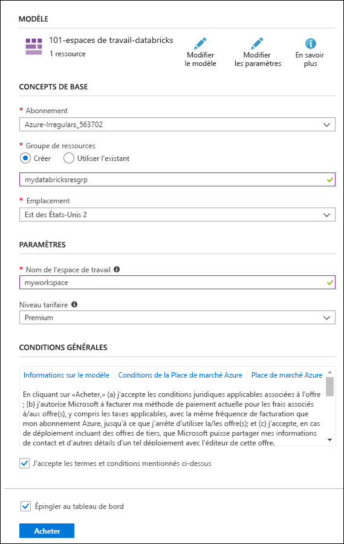

# <a name="quickstart-create-an-azure-databricks-workspace-by-using-the-azure-resource-manager-template"></a>Démarrage rapide : Créer un espace de travail Azure Databricks avec un modèle Azure Resource Manager

Dans ce guide de démarrage rapide, vous utilisez un modèle Azure Resource Manager pour créer un espace de travail Azure Databricks. Une fois l’espace de travail créé, vous validez le déploiement.

[!INCLUDE [About Azure Resource Manager](../../includes/resource-manager-quickstart-introduction.md)]

## <a name="prerequisites"></a>Prérequis

Pour effectuer les étapes de cet article, vous avez besoin de ce qui suit :

* Un abonnement Azure - [En créer un gratuitement](https://azure.microsoft.com/free/)

## <a name="create-an-azure-databricks-workspace"></a>Créer un espace de travail Azure Databricks

### <a name="review-the-template"></a>Vérifier le modèle

Le modèle utilisé dans ce démarrage rapide est tiré des [modèles de démarrage rapide Azure](https://azure.microsoft.com/resources/templates/101-databricks-workspace/).

:::code language="json" source="~/quickstart-templates/101-databricks-workspace/azuredeploy.json" range="1-53" highlight="33-46":::

La ressource Azure définie dans le modèle est [Microsoft.Databricks/workspaces](/azure/templates/microsoft.databricks/workspaces) : créer un espace de travail Azure Databricks.

### <a name="deploy-the-template"></a>Déployer le modèle

Dans cette section, vous créez un espace de travail Azure Databricks en utilisant le modèle Resource Manager.

1. Cliquez sur l’image ci-après pour vous connecter à Azure et ouvrir un modèle. Le modèle crée un espace de travail Azure Databricks.

   [](https://portal.azure.com/#create/Microsoft.Template/uri/https%3A%2F%2Fraw.githubusercontent.com%2FAzure%2Fazure-quickstart-templates%2Fmaster%2F101-databricks-workspace%2Fazuredeploy.json)

2. Fournir les valeurs requises pour créer votre espace de travail Azure Databricks

   

   Renseignez les valeurs suivantes :

   |Propriété  |Description  |
   |---------|---------|
   |**Abonnement**     | Sélectionnez votre abonnement Azure dans la liste déroulante.        |
   |**Groupe de ressources**     | Indiquez si vous souhaitez créer un groupe de ressources Azure ou utiliser un groupe existant. Un groupe de ressources est un conteneur réunissant les ressources associées d’une solution Azure. Pour plus d’informations, consultez [Présentation des groupes de ressources Azure](../azure-resource-manager/management/overview.md). |
   |**Lieu**     | Sélectionnez **USA Est**. Pour les autres régions disponibles, consultez [Disponibilité des services Azure par région](https://azure.microsoft.com/regions/services/).        |
   |**Nom de l’espace de travail**     | Renseignez un nom pour votre espace de travail Databricks.        |
   |**Niveau tarifaire**     |  Choisissez entre **Standard** ou **Premium**. Pour plus d’informations sur ces niveaux, consultez la [page de tarification Databricks](https://azure.microsoft.com/pricing/details/databricks/).       |

3. Sélectionnez **Vérifier + créer**, puis **Créer**.

4. La création de l’espace de travail dure quelques minutes. Lorsque le déploiement d’un espace de travail échoue, l’espace de travail est malgré tout créé en état d’échec. Supprimez l’espace de travail défaillant et créez un espace de travail qui résout les erreurs de déploiement. Lorsque vous supprimez l’espace de travail défaillant, le groupe de ressources managé et toutes les ressources déployées correctement sont également supprimés.

## <a name="review-deployed-resources"></a>Vérifier les ressources déployées

Vous pouvez utiliser le portail Azure pour vérifier l’espace de travail Azure Databricks, ou le script Azure PowerShell ou Azure CLI suivant pour lister la ressource.

### <a name="azure-cli"></a>Azure CLI

```azurecli-interactive
echo "Enter your Azure Databricks workspace name:" &&
read databricksWorkspaceName &&
echo "Enter the resource group where the Azure Databricks workspace exists:" &&
read resourcegroupName &&
az databricks workspace show -g $resourcegroupName -n $databricksWorkspaceName
```

### <a name="azure-powershell"></a>Azure PowerShell

```azurepowershell-interactive
$resourceGroupName = Read-Host -Prompt "Enter the resource group name where your Azure Databricks workspace exists"
(Get-AzResource -ResourceType "Microsoft.Databricks/workspaces" -ResourceGroupName $resourceGroupName).Name
 Write-Host "Press [ENTER] to continue..."
```

## <a name="clean-up-resources"></a>Nettoyer les ressources

Si vous prévoyez d’effectuer les tutoriels suivants, vous pouvez conserver ces ressources. Si vous n’en avez plus besoin, supprimez le groupe de ressources, ce qui supprime l’espace de travail Azure Databricks et les ressources managées associées. Pour supprimer le groupe de ressources avec Azure CLI ou Azure PowerShell :

### <a name="azure-cli"></a>Azure CLI

```azurecli-interactive
echo "Enter the Resource Group name:" &&
read resourceGroupName &&
az group delete --name $resourceGroupName &&
echo "Press [ENTER] to continue ..."
```

### <a name="azure-powershell"></a>Azure PowerShell

```azurepowershell-interactive
$resourceGroupName = Read-Host -Prompt "Enter the Resource Group name"
Remove-AzResourceGroup -Name $resourceGroupName
Write-Host "Press [ENTER] to continue..."
```

## <a name="next-steps"></a>Étapes suivantes

Dans ce guide de démarrage rapide, vous avez créé un espace de travail Azure Databricks en utilisant un modèle Azure Resource Manager et avez validé le déploiement. Passez à l’article suivant pour savoir comment effectuer une opération ETL (extraction, transformation et chargement de données) à l’aide d’Azure Databricks.

> [!div class="nextstepaction"]
> [Extraire, transformer et charger des données à l’aide d’Azure Databricks](databricks-extract-load-sql-data-warehouse.md)
